# UI 交互流程

> **文档定位**：本文是「2D / 3D 界面加载、交互、切换」的总索引与流程图集合。
> 当你需要排查「界面为什么没加载」「2D 切 3D 发生了什么」「用户点一下按钮走哪条链路」时，
> 先翻到最后一节【问题 → 看哪张图】，再到对应章节比对流程图。
>
> **核心约定（贯穿全文）**：所有 UI 入口（菜单 / 工具栏 / 右键 / 快捷键 / Gizmo / 面板）最终都汇合到
> `CommandCatalog / CommandCatalog3D → OperationBus::run(OperationId)`，UI 层只负责「入口、交互、状态同步」，不承载业务真相。
>
> 相关细节文档：`菜单架构.md`、`UI定制.md`、`命令与状态流.md`、`顶部工具栏架构定义.md`、`左侧工具栏架构定义.md`、`状态栏架构定义.md`、`属性面板架构定义.md`、`场景树架构定义.md`。

---

## 0. 一图总览（先建立心智模型）

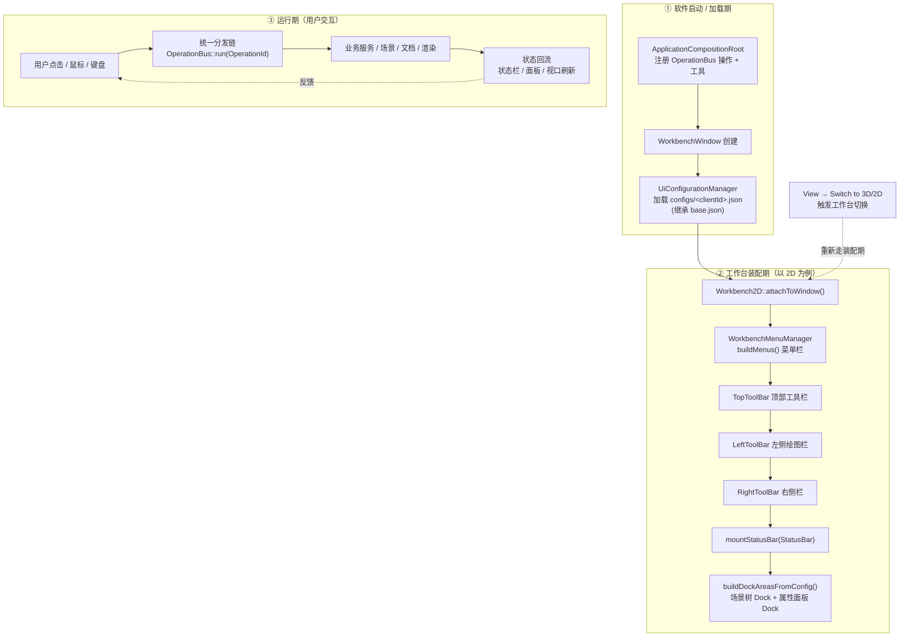

**如何使用本文**：
- 想看「启动时菜单/工具栏怎么来的」→ 第 1、2、3、4 节
- 想看「用户点一下走哪条路」→ 第 2.2、3.2、3.3、5.2 节
- 想看「2D 切 3D 发生什么」→ 第 6 节
- 想看「所有入口最终怎么汇合」→ 第 7 节

---

## 1. 软件启动 → 界面加载总流程

> 描述从进程启动到主界面（菜单栏 / 工具栏 / 状态栏 / 面板）全部就绪的完整链路。

```mermaid
sequenceDiagram
    participant Main as main()
    participant Root as ApplicationCompositionRoot
    participant Win as WorkbenchWindow
    participant Cfg as UiConfigurationManager
    participant WB2D as Workbench2D
    participant Mgr as WorkbenchMenuManager
    participant Lay as WorkbenchLayoutManager
    participant SV as 各业务服务

    Main->>Root: 构造组合根
    Root->>Root: OperationBus 注册所有 OperationId<br/>(Core/File/Pending 注册表)
    Root->>Root: ToolInitializer::registerAllTools()
    Root->>Win: 创建主窗口
    Win->>Cfg: applyConfiguration(/configs/&lt;clientId&gt;.json)
    Cfg->>Cfg: 解析 + 继承合并（extends base）
    Cfg-->>Win: UiConfigData（menus/toolBars/docks/shortcuts）
    Win->>WB2D: attachToWindow()（默认 2D 工作台）
    WB2D->>Mgr: buildMenus()（配置驱动）
    WB2D->>Win: 挂载 TopToolBar / LeftToolBar / RightToolBar
    WB2D->>Win: mountStatusBar(StatusBar)
    WB2D->>Lay: buildDockAreasFromConfig()
    Lay->>SV: 注册面板工厂 UiPanelRegistry
    Lay->>Win: 创建 SceneTreePanel / PropertiesPanel Dock
    Win-->>Main: 主界面就绪，进入事件循环
```

**关键点**
1. 菜单「顺序 / 分组 / 文案」全部来自 JSON 配置，代码不重建菜单树。
2. `SANYI_ENABLE_CONFIG_DRIVEN_UI=ON` 才走 Dock 配置路径；OFF 走硬编码骨架（默认）。
3. `SANYI_CLIENT_ID` 决定加载哪个客户配置（`san_yi` / `client_a` / …），换客户只改编译变量。

---

## 2. 菜单栏：加载与点击

### 2.1 菜单加载流程（配置驱动为主路径）

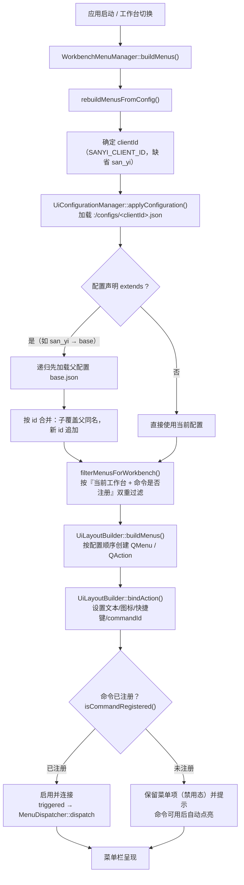

**关键点**
- 若 `SANYI_ENABLE_CONFIG_DRIVEN_UI == OFF` 或 JSON 加载失败 → `buildLegacyMenus()` 作为回退（已标记 deprecated）。
- 命令未注册的菜单项仍保留在菜单上（禁用态），避免结构与文档漂移。
- 顶层菜单顺序固定：`File → Edit → View → Draw → Algorithm → Laser → Vision → Help`。

### 2.2 菜单点击逻辑（用户点击 → 执行）

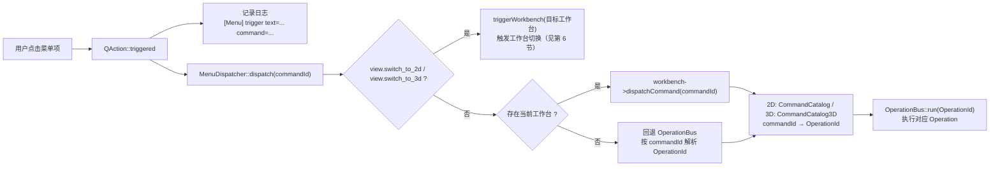

---

## 3. 工具栏：加载与点击

> 三套工具栏分工：**顶部**=全局高频入口；**左侧**=绘图/创建型入口；**右侧**=辅助/上下文入口。三者都与菜单同源（`CommandCatalog`）。

### 3.1 工具栏加载流程

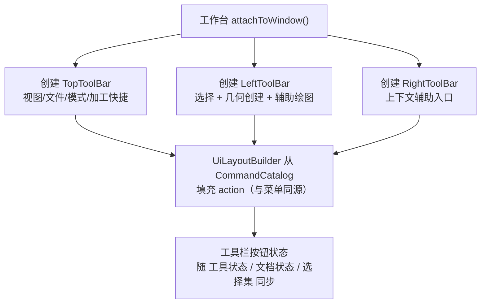

### 3.2 顶部 / 右侧工具栏点击（命令型，一步到位）


> 顶部工具栏按钮「只做一件事」：触发一个命令；不直连几何内核、不直改文档、不直操渲染（见 `顶部工具栏架构定义.md`）。

### 3.3 左侧工具栏点击（绘图工具型，进入交互式流程）

> 左侧绘图按钮走 **ToolManager + ITool** 路径（区别于普通命令），会激活工具并接管视口鼠标输入。

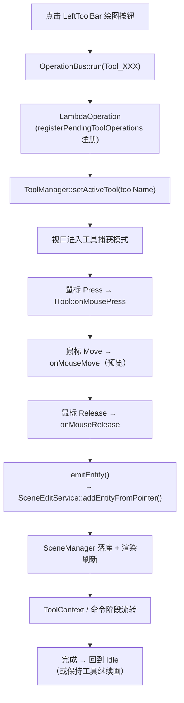

**鼠标事件优先级**（`RenderViewport2D::mousePressEvent`）：
1. 中键 → 平移
2. 左键 + 平移模式 → 平移
3. 左键 + IInteractionDispatcher 活动命令 → 转发（当前为预留空实现）
4. **左键 + ToolManager 活动工具 → 转发到 ITool（当前实际路径）**
5. 左键 + Selector → 选择

---

## 4. 状态栏（2D / 3D）挂载与刷新

> 状态栏是「反馈面」不是「入口」：订阅状态中心，不推导业务。2D / 3D 各自拥有独立状态栏类，切换时由 Workbench 负责创建/销毁。

### 4.1 状态栏挂载 / 卸载流程

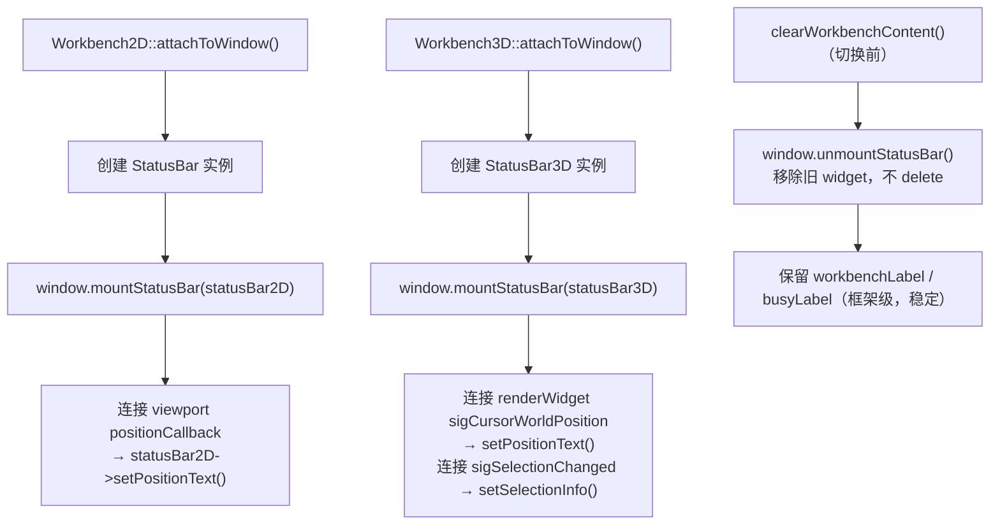

### 4.2 状态回流（文档 / 视口 → 状态栏）

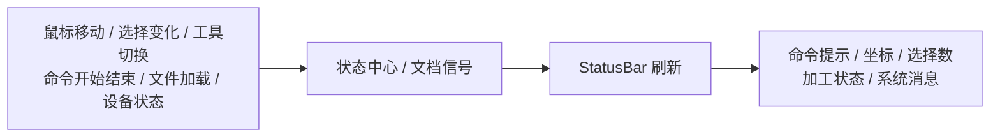

---

## 5. 停靠面板（场景树 / 属性面板）加载与交互

> 面板通过 `UiPanelRegistry` 工厂创建，可定制 / 可缺失，不影响算法层与数据层。

### 5.1 面板加载流程

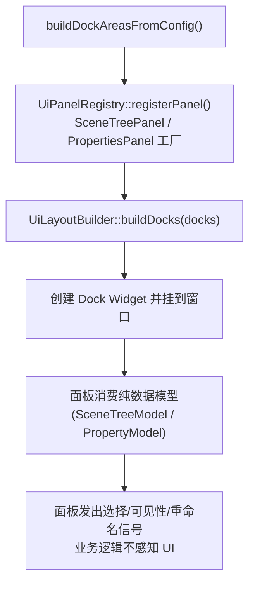

> 未注册的 `widgetType` 会降级为占位 `QWidget` 并 `SY_WARNF` 告警（不会崩）。

### 5.2 属性面板编辑交互（用户改属性 → 入撤销栈）

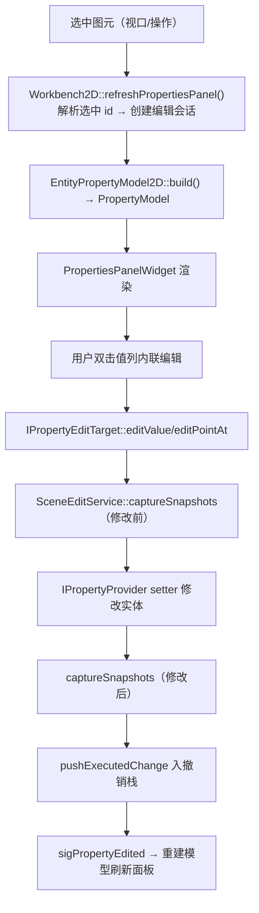

**刷新触发时机**：视口选择变化 / 撤销重做栈变化 / 导入完成 / 属性被编辑后。
**指针安全**：编辑会话只保存图元 **id**，每次按 id 重新解析，避免撤销后悬空指针。

---

## 6. 2D ⇄ 3D 工作台切换流程

> 切换工作台时，**整组 UI 重新装配**：菜单重建、工具栏重建、状态栏替换、面板替换。目标是只更新内容、不残留旧工作台来源标记。

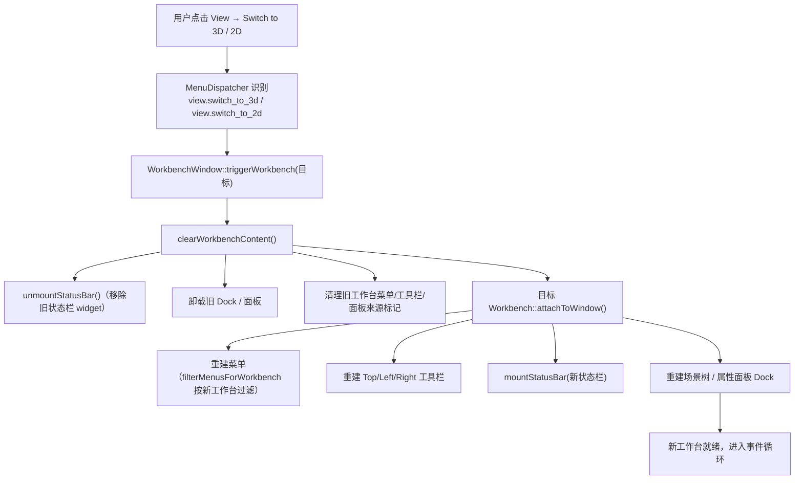

**切换一致性要求**
- 顶层分类不变：`File / Edit / View / Draw / Algorithm / Laser / Vision / Help`
- 构建方式一致（`UiLayoutBuilder`）、图标策略一致（自动从 `CommandCatalog` 读取）、日志策略一致
- 命令执行链一致（`OperationBus`）
- 差异只体现在：命令目录不同、工作台可见性不同、部分菜单项不同

---

## 7. 统一命令分发链（所有入口的汇合点）

> 无论用户从哪个 UI 表面发起操作，最终都汇合到同一条链。排查「点了没反应」时，从汇合点往下追。

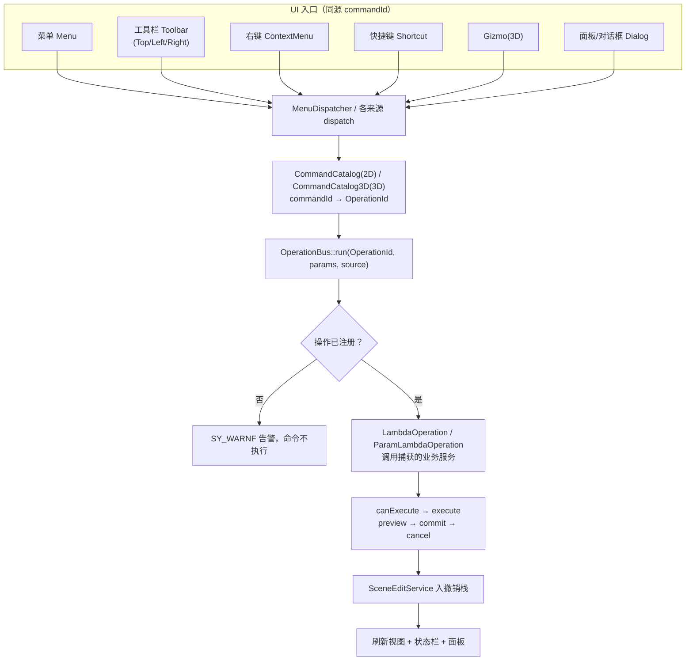

**命令来源枚举**（`Cmd::OperationSource`）：`Menu / ContextMenu / TopToolbar / LeftToolbar / RightToolbar / Toolbar / Shortcut / Keyboard / Gizmo / DrawTool / Dialog / Plugin / Script`。

**边界检查清单**
- [ ] 命令是否注册到 `OperationBus`？
- [ ] 是否经 `CommandCatalog` 映射到 `OperationId`？
- [ ] 图元修改是否走 `SceneEditService`（2D）/ `SceneEditService3D`（3D）单一入口（否则绕过撤销栈）？
- [ ] 是否记录统一日志？

---

## 8. 问题 → 看哪张图（快速定位索引）

| 现象 / 问题 | 优先看 | 章节 |
|---|---|---|
| 启动时界面（菜单/工具栏/面板）怎么来的 | 启动总流程 | 第 1 节 |
| 菜单顺序不对 / 某菜单项缺失 / 客户定制菜单 | 菜单加载流程 | 第 2.1 节 |
| 点了菜单没反应 / 走哪条执行链 | 菜单点击逻辑 | 第 2.2 节 |
| 顶部/右侧按钮点了没生效 | 工具栏点击（命令型） | 第 3.2 节 |
| 点左侧绘图按钮后鼠标画不出图元 | 左侧工具栏（ToolManager 路径） | 第 3.3 节 |
| 状态栏不显示坐标 / 选择数 | 状态栏挂载与回流 | 第 4 节 |
| 场景树 / 属性面板没出现 / 定制面板 | 面板加载流程 | 第 5.1 节 |
| 改属性没入撤销栈 / 撤销后异常 | 属性面板编辑交互 | 第 5.2 节 |
| 2D 切 3D 残留旧菜单 / 面板 / 状态栏 | 工作台切换流程 | 第 6 节 |
| 任何入口点了之后的统一去向 | 统一命令分发链 | 第 7 节 |
| 换客户的 UI 怎么配 | `UI定制.md` + 第 1 节 clientId 说明 | 第 1 节 |

---

## 9. 相关文件速查

| 关注点 | 文件 |
|---|---|
| 菜单管理 / 重建 / 工作台切换 | `Main/Src/UI/Workbench/WorkbenchMenuManager.cpp` |
| 菜单/工具栏/Dock/快捷键构建 | `Main/Src/UI/ClientConfig/UiLayoutBuilder.cpp` |
| 客户配置加载与回退 | `Main/Src/UI/ClientConfig/UiConfigurationManager.cpp` |
| 客户配置 JSON | `Main/Src/UI/ClientConfig/configs/{base,san_yi,client_a}.json` |
| 2D 命令目录 | `UI/2D/Src/Operation/CommandCatalog.cpp` |
| 3D 命令目录 | `UI/3D/Src/Operation/CommandCatalog3D.cpp` |
| 统一命令调度 | `UI/2D/Include/UI2D/Operation/OperationBus.h` |
| 工具注册 / 映射 | `ApplicationCompositionRoot.cpp`、`ToolInitializer::registerAllTools()` |
| 2D 状态栏 | `UI/2D`（StatusBar） |
| 3D 状态栏 | `UI/3D`（StatusBar3D） |
| 属性面板（UI/算法/数据三层） | `Main/Src/UI/Widgets/UiPropertiesPanel`、`UI2D/Service/EntityPropertyModel2D`、`UI/Dlg/PropertyModel.h` |
| 面板注册表 | `Main/Src/UI/ClientConfig/UiPanelRegistry.cpp` |
