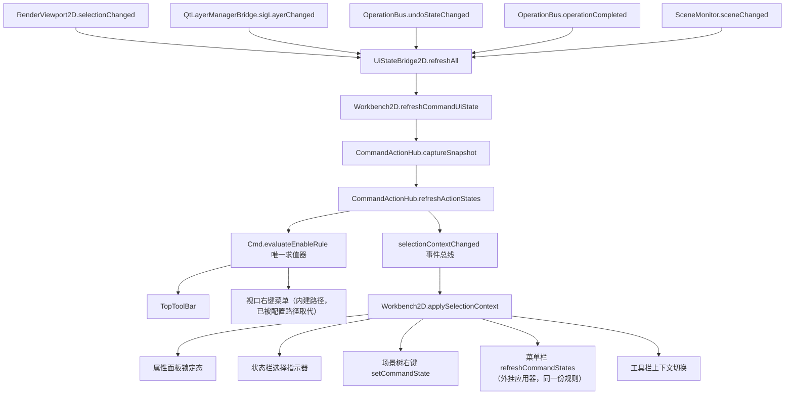

# 命令与状态流

## 概述

本文档描述命令的生命周期、状态管理机制、以及相关的数据流和事件流。

---

## 1. 命令生命周期

### 1.1 完整流程

```
用户操作 (按钮/菜单/快捷键/Gizmo)
    │
    ▼
OperationBus::run(OperationId, params, source) / 命令统一入口
    │
    ├─→ 检查操作是否注册
    │
    ├─→ 构建 DispatchRequest
    │
    ├─→ dispatchOperation() 执行
    │       │
    │       ├─→ 检查前置条件 (canExecute)
    │       │
    │       ├─→ 执行操作 (execute)
    │       │       │
    │       │       ├─→ 预览 (preview)
    │       │       │
    │       │       ├─→ 提交 (commit)
    │       │       │
    │       │       └─→ 取消 (cancel)
    │       │
    │       ├─→ 刷新视图 (refresh)
    │       │
    │       └─→ 记录日志
    │
    ├─→ onOperationCompleted() 回调
    │
    ├─→ postExecute() 后处理
    │
    └─→ 发出 operationCompleted 信号
```

### 1.2 命令注册

```cpp
// 在 ApplicationCompositionRoot 中注册操作
OperationBus* bus = compositionRoot->operationBus();
// 新代码统一通过 LambdaOperation / ParamLambdaOperation 捕获服务，不依赖 OperationContext
bus->registerOperation(std::make_unique<LambdaOperation>(OperationId::Edit_Delete, [editService] {
    editService->deleteSelected("Delete");
}));
// 所有命令统一注册到 OperationBus
```

### 1.3 命令执行

```cpp
// 用户触发操作
OperationResult result = OperationBus::instance()->run(
    OperationId::Tool_Line,
    QVariantMap(),
    OperationSource::Toolbar
);

// 操作注册（ApplicationCompositionRoot 中）
bus->registerOperation(std::make_unique<LambdaOperation>(OperationId::Tool_Line, [toolManager] {
    toolManager->setActiveTool("Line");
}));
```

---

## 2. 状态管理

### 2.1 核心状态

| 状态 | 定义 | 管理位置 |
|------|------|----------|
| **selection** | 当前选中的实体集合 | `SelectionSet` / `SelectionManager` |
| **activeTool** | 当前活动工具 | `ToolManager` |
| **commandStage** | 当前命令阶段 | `ToolContext` / 命令上下文 |
| **isBusy** | 是否正在执行操作 | `OperationBus` |
| **isDirty** | 文档是否被修改 | `SceneDocument2D/3D` / `DocumentTransaction` |
| **命令 UI 状态** | 每个命令当前是否可用（`CommandUiSnapshot`） | `CommandActionHub`（2D）/ `CommandActionHub3D`（3D），触发源由 `UiStateBridge2D` / `UiStateBridge3D` 集中挂载 |

#### 命令 UI 状态（CommandUiSnapshot）

这是一类独立于文档状态的派生状态：**"当前选择集与文档状态下，每个命令是否可用"**。它不存储在文档里，而是每次触发时重新抓取快照。

`Cmd::CommandUiSnapshotBase`（`UI/Common/Include/UI/Command/CommandUiSnapshotBase.h`）字段：

| 字段 | 含义 |
|---|---|
| `hasSelection` / `selectionCount` | 是否有选中 / 选中数量 |
| `anyLockedLayer` / `anyLockedEntity` | 选中项中是否存在图层锁 / 实体锁 |
| `anyLocked()` | 二者取或 —— **锁定判定的唯一入口** |
| `anyEditable` | 选中项中是否至少一个未锁定 |
| `typeMask` | 选中项类型直方图（驱动工具栏上下文切换） |
| `hasClipboard` / `canUndo` / `canRedo` | 剪贴板与撤销栈状态 |

2D 扩展 `CommandUiSnapshot` 追加 group / bezier 切换态；3D 扩展 `CommandUiSnapshot3D` 追加 wireframe / grid / bbox / floor / hasMeshTarget / hasReliefToolpath。

快照的数据源是**单一** provider：`Workbench2D` 注入的 `selectionContextProvider` 一次 `visitSelectedIds` 遍历同时产出全部字段，不存在多个 provider 各自遍历导致快照内部不一致的问题。

启用规则以声明方式写在命令目录条目上（见「4. 命令目录」与 `菜单架构.md`），求值器只有一处：`Cmd::evaluateEnableRule()` / `Cmd::satisfy()`（`UI/Common/Include/UI/Command/CommandActionHubBase.h`）。


### 2.2 状态流转

```
                     ┌──────────────┐
                     │   Idle       │
                     │  (无活动命令) │
                     └──────┬───────┘
                            │ 用户触发命令
                            ▼
                     ┌──────────────┐
                     │  Executing   │
                     │  (命令执行中) │
                     └──────┬───────┘
                            │
              ┌──────────────┼──────────────┐
              ▼              ▼              ▼
        ┌─────────┐   ┌─────────┐   ┌─────────┐
        │ Preview │   │  Commit │   │ Cancel  │
        │ (预览中) │   │ (已提交) │   │ (已取消) │
        └────┬────┘   └────┬────┘   └────┬────┘
             │             │             │
             └─────────────┼─────────────┘
                           ▼
                     ┌──────────────┐
                     │   Idle       │
                     └──────────────┘
```

### 2.3 Selection 状态

2D 选择状态由 `ISelectionService` 管理（实现类 `SelectionService` 包装 `Eg::SceneManager`），对外只暴露图元 ID，不泄漏引擎类型：

```cpp
// ISelectionService — 2D 选择服务（POD 安全接口）
class ISelectionService
{
public:
    virtual void visitSelectedIds(SelectedIdVisitor visitor, void* context) const = 0;
    virtual bool isSelected(const char* id) const = 0;
    virtual void select(const char* id) = 0;
    virtual void selectMultiple(const char* const* ids, size_t count) = 0;
    virtual void deselect(const char* id) = 0;
    virtual void clear() = 0;
    virtual void toggle(const char* id) = 0;
};
```

3D 选择管理走独立的 `Eg::SelectionManager3D`，不与 2D 接口强行统一。视图侧的选择交互由 `ViewportSelector` 负责（命中测试、框选、端点微调）。

### 2.4 Undo / Redo 状态

撤销栈由 `UndoRedoManager`（Engine2D）统一管理，`QtUndoRedoBridge` 仅作为 Qt 桥接观察者，把 `IUndoRedoManager` 状态变化转换为 Qt 信号：

```cpp
// QtUndoRedoBridge — 将 UndoRedoManager 通知转换为 Qt 信号
class QtUndoRedoBridge : public QObject, public IUndoRedoObserver
{
    Q_OBJECT
signals:
    void sigStateChanged();
    void sigCanUndoChanged(bool bCanUndo);
    void sigCanRedoChanged(bool bCanRedo);
};
```

---

## 3. 工具状态机

### 3.1 工具生命周期

```
┌────────────┐      ┌────────────┐      ┌────────────┐
│  Inactive  │─────→│  Activated │─────→│   Active   │
│  (未激活)   │      │   (激活中)   │      │  (活动中)   │
└────────────┘      └────────────┘      └──────┬─────┘
       ▲                                        │
       │                                        │ 用户操作
       └────────────────────────────────────────┘
              (工具切换或取消)
```

### 3.2 工具状态转换

```cpp
// BaseTool 状态机
class BaseTool : public ITool
{
public:
    void onActivate() override;    // 工具激活
    void onDeactivate() override;  // 工具失活
    
    void onMousePress(QMouseEvent* event) override;
    void onMouseMove(QMouseEvent* event) override;
    void onMouseRelease(QMouseEvent* event) override;
    
protected:
    void startPreview();   // 开始预览
    void updatePreview();  // 更新预览
    void commitPreview();  // 提交预览
    void cancelPreview();  // 取消预览
};
```

---

## 4. 命令分类

### 4.1 按功能分类

| 分类 | 示例 | 是否可撤销 |
|------|------|-----------|
| **编辑操作** | Undo, Redo, Delete, Copy, Move | ✅ |
| **绘图工具** | Line, Circle, Arc, Rectangle | ✅ |
| **视图操作** | ZoomFit, ZoomIn, ResetView | ❌ |
| **文件操作** | New, Open, Save, Export | ✅ |
| **算法操作** | Nesting, Offset, Boolean | ✅ |
| **激光操作** | Connect, Home, StartProcess | ❌ |

### 4.2 按来源分类

操作来源由统一枚举 `Cmd::OperationSource` 定义（2D/3D 共用）：`Menu` / `ContextMenu` / `TopToolbar` / `LeftToolbar` / `RightToolbar` / `Toolbar` / `Shortcut` / `Keyboard` / `Gizmo` / `DrawTool` / `Dialog` / `Plugin` / `Script`。

| 来源 | 触发方式 | 当前承载 |
|------|----------|----------|
| **Menu** | 顶部菜单栏 | `WorkbenchMenuManager`（2D/3D 共用工作台菜单） |
| **Toolbar** | 工具栏按钮 | `LeftToolBar`、`TopToolBar`、`RightToolBar` |
| **Shortcut** | 键盘快捷键 | `UiWorkbench` 快捷键映射；3D 另有 `ShortcutManager3D` |
| **Gizmo** | 变换手柄 | `TransformGizmo3D`（3D） |
| **ContextMenu** | 右键菜单 | `ViewWidget` / `ViewportInputRouter` |
| **DrawTool** | 绘图工具激活 | `ToolManager` 工具激活快速路径 |
| **Dialog** | 对话框确认 | 各对话框服务 |
| **Plugin** | 插件命令 | `Plugin_Demo` 占位入口 |

> **启用态归属**：上表描述的是「谁触发命令」。而「按钮是否可点」统一由命令 UI 快照驱动（见 6.3）。
> 其中 `TopToolBar` 与视口右键菜单复用 `CommandActionHub` 托管的**同一批 QAction**，因此天然联动；
> `WorkbenchMenuManager` 的菜单栏 QAction 是独立于 Hub 的第二套对象，**启用态由外挂刷新器 `refreshCommandStates(snapshot)` 按同一份快照驱动**（见 6.3 末尾）。


---

## 5. 关键数据流

### 5.1 命令参数流

```
用户输入
    │
    ▼
OperationRequest
    ├─→ id: OperationId
    ├─→ params: QVariantMap
    ├─→ transformParams: TransformParameters（变换类操作专用）
    ├─→ source: OperationSource
    └─→ traceId: QString
    │
    ▼
OperationBus::run(request) → registry 查表 → IOperation::execute(ctx, request)
```

界面菜单路由通过 `Cmd::dispatchFromCatalog()` 完成“菜单项 → OperationId → 参数填充 → bus->run”的统一映射，不保留独立的 DispatchRequest 中间类型。

### 5.2 命令结果流

```
OperationResult
    ├─→ success: bool
    ├─→ message: QString
    ├─→ phase: OperationPhase (None/Started/Completed)
    ├─→ flags: OperationFlag (OpFlagMutatesScene / OpFlagUndoable)
    │
    ▼
onOperationCompleted(id, success, message)
    │
    ▼
sigOperationCompleted(id, success, message)
    │
    ▼
UI 更新 (状态栏、日志)
```

---

## 6. 状态同步机制

### 6.1 文档 → UI 同步

```
SceneDocument2D / DocumentTransaction
    │
    ├─→ sigSceneChanged()
    │       │
    │       ▼
    │   ViewRenderCoordinator::updateRenderData()
    │       │
    │       ▼
    │   RenderWidget::update()
    │
    ├─→ sigSelectionChanged()
    │       │
    │       ▼
    │   ViewWidget::syncSelectionFromScene()
    │
    └─→ sigDocumentModified()
            │
            ▼
        MainWindow::updateWindowTitle()
```

### 6.2 UI → 文档同步

```
用户操作
    │
    ▼
ToolManager / OperationBus
    │
    ▼
SceneEditService (LambdaOperation 捕获)
    │
    ▼
SceneDocument2D::applyChange()
    │
    ▼
SceneDocument2D::notifyChange()
```

### 6.3 命令 UI 状态桥接（选择 / 锁定 → 按钮启用态）

这是**第三条独立链路**：状态变化 → 重新抓取命令 UI 快照 → 扇出到所有命令暴露面。

2D 由 `UiStateBridge2D`（`Main/Src/UI/Workbench/UiStateBridge2D.h/.cpp`）承担，3D 由 `UiStateBridge3D`（`UI/3D/Src/Operation/UiStateBridge3D.cpp`）承担，两者结构对等。



#### 五路触发源及其覆盖范围

| 触发源 | 覆盖的状态变化 |
|---|---|
| `RenderViewport2D::selectionChanged` | 点选 / 框选 / 绘制后自动选中 / 撤销引起的选择变化 |
| `QtLayerManagerBridge::sigLayerChanged` | 图层锁定与图层属性变更 |
| `OperationBus::undoStateChanged` | 撤销 / 重做栈变化（含经 `LayerEditService` 直接入栈的图层操作） |
| `OperationBus::operationCompleted` | 任意操作成功完成（含剪贴板写入） |
| `SceneMonitor::sceneChanged` | 图元级 `setLocked` / `setVisible` 等**不改变图元数量、也不经操作总线**的变更 |

最后一路是历史缺口：2D 此前未订阅 `sceneChanged`，`notifySceneChanged` 的唯一订阅者只按图元数量变化重建场景树，导致「场景树锁定图元后 Delete / Align 仍可点」。3D 侧一直订阅了 `SceneMonitor3D::sceneChanged`，故无此问题。

#### 单点入口与单一事件总线

- **唯一刷新入口**：`Workbench2D::refreshCommandUiState()`。所有触发源都收敛到这里，不允许在别处直接调 `captureSnapshot` + `refreshActionStates`。
- **唯一扇出通道**：`CommandActionHub::selectionContextChanged(snapshot)`。该信号在 `refreshActionStates()` 内部、`m_lastSnapshot` 更新之后发出，由 `Workbench2D::applySelectionContext(snapshot)` 消费并分发。

这个设计消除了两类历史缺陷：

1. **顺序依赖** —— 工具栏上下文切换曾单独监听 `selectionChanged`，依赖它与「刷新 Hub 状态」两个 connect 的建立先后来保证快照最新。现在改为在快照广播之后消费，顺序由数据流本身保证。
2. **重复遍历** —— 状态栏曾为拿选中数再次遍历 `getSelectedEntities()`，现直接用 `snapshot.selectionCount`；场景树右键菜单曾自算 `hasSelection`，现由 `setCommandState(hasSelection, anyLocked)` 推入。

#### 扩展方式

新增一个需要随选择/锁定联动的 UI 组件时：**订阅扇出，不要新增触发源**。即在 `applySelectionContext` 中增加一次推送，组件自身只渲染、不判定。新增一类状态变化时才在 `UiStateBridge2D::install()` 里挂新触发源。

#### 外部构建 QAction 树的启用态（2026-08-25 已落地）

2D 有三处 QAction 不是命令中枢创建的，`refreshActionStates` 触达不到：

- 配置化菜单栏（`UiLayoutBuilder::bindAction`）
- legacy 回退菜单（`WorkbenchMenuManager::addMenuAction`）
- **配置化视口右键菜单**（`UiLayoutBuilder::buildContextMenu`，每次弹出新建、弹完 delete）

接入方式不是把它们改成复用 Hub 的 QAction（那会牵动 JSON 的 label/shortcut/checkable/workbench 过滤与 dispatcher 接线），而是把"按快照应用启用态"提为中枢的静态 API，三处共用：

```text
CommandActionHub::applySnapshotToAction(QAction*, snapshot)
  → action->property("commandId")
  → CommandCatalog::menuIdForCommandId() → findByMenuId() → entry->enableRule
  → Cmd::evaluateEnableRule(rule, snapshot) → Cmd::setActionEnabled()

CommandActionHub::applySnapshotToMenu(QMenu*, snapshot)   // 递归整棵树
```

调用点：

- 菜单栏 —— `WorkbenchMenuManager::refreshCommandStates(snapshot)` 用私有 `forEachCommandAction()` 遍历 QMenuBar + legacy 菜单指针，逐个交给 `applySnapshotToAction`。本类只决定"遍历到哪些 action"，不做规则求值。
- 视口右键菜单 —— `Workbench2D::onViewportContextMenu()` 在 `configured->exec()` 之前调 `applySnapshotToMenu(configured, snapshot)`。

规则来源仍然只有命令目录一处。扇出统一挂在 `Workbench2D::applySelectionContext()`。

两类项被刻意跳过：

- `property("commandUnavailable")` 为真 —— `UiLayoutBuilder::bindAction` 对未注册命令做的构建期永久禁用。这是"功能没实现"，不是"当前条件不满足"，快照不该把它点亮。
- 规则为 `Always` 的非切换条目 —— 恒可用，写 `setEnabled(true)` 毫无意义，且会与 `setAllMenusEnabled(false)` 这类全局置灰互相打架。

切换类命令（`Edit_Group` / `Edit_BezierToggle`）的启用与 on/off 语义由快照的专用字段承载，抽成 `resolveToggleUiState(menuId, snapshot, isOnMode, enabled)`，`refreshToggleActionStates`（中枢托管动作）与 `applySnapshotToAction`（外部动作）共用，不再各写一套 menuId 分支。

另有一处：`rebuildAllMenus()` 结尾会调 `m_workbench->refreshCommandUiState()`。菜单重建产出全新 QAction，`enabled` 默认为 true，不补这一下，"无选中却能点删除"会在每次工作台切换 / 语言切换 / 配置重载后复现。这也是 `UiWorkbench` 基类新增 `virtual void refreshCommandUiState()`（默认空实现）的原因 —— 框架层不需要知道具体是 2D 还是 3D 工作台。

##### 曾经的误判

`populateContextMenu(menu, snapshot, ...)` 显式吃快照，很容易让人以为右键菜单一直是联动的。实际上只要客户配置声明了 `contextMenus["canvas.2d"]`（`base.json:379` 默认就有），配置分支恒命中并直接 return，这条内建路径是死代码。**判断某个面是否联动，要看它实际走的构建路径，而不是看有没有一个吃快照的函数存在。**

##### 仍未覆盖

- 右侧工具栏（`RightToolBar`）是 `QPushButton` 色块，没有 QAction 可灰显。其"移动选中图元到图层"语义等价 `edit.move_to_layer`，改为在 `sigLayerSelected` handler 里按 `currentSnapshot().anyLocked()` 前置 gate（「设为当前图层」不受锁定影响，仍始终执行）。这是本体系里唯一用"handler 前置判定"而非"控件灰显"实现规则的地方。
- 左侧绘图工具栏（`DrawToolBarWidget` 的 `QToolButton`）与 Hub 的 `m_toolActions` 不参与启用刷新 —— 绘图工具本就不该随选择灰显，属设计意图而非缺口。
- 3D 侧**由中枢直接建的菜单**（`CommandActionHub3D::bindEditMenu()` 等）没有此类问题：菜单项与工具栏按钮是同一个 QAction 实例，一次 `refreshFromSnapshot()` 全覆盖。但 3D 的**配置化菜单栏**（走 `UiLayoutBuilder` 的那一份）与 2D 一样绕过中枢，此前完全没有启用态刷新 —— 详见 6.4。


##### 特例：不在菜单树上的窗口级快捷键

`bindShortcuts()` 为 Ctrl+Z / Ctrl+Y 另建两个 QAction 挂到主窗口（存在 `m_editShortcuts`），不进任何菜单。它们同样调 `setCmdId()` 打上 `commandId`，`forEachCommandAction()` 在菜单树遍历之后追加一段遍历该容器，交给同一个 visitor。规则求值仍是 `applySnapshotToAction`，没有第二套判定。`bindShortcuts()` 结尾也调 `m_workbench->refreshCommandUiState()` 校正新建动作的默认 `enabled=true`。

推论：**任何"不挂在菜单树上但需要联动"的 QAction，接入成本就是"打 commandId + 加进遍历"两步**，不需要新机制。

---

### 6.4 2D / 3D 工作台切换时的状态残留（2026-08-25 已修）

工作台不是销毁重建的：`UiShellHost::m_workbench3D` 记忆化，2D 由 `AppBootstrapper` 持有，`WorkbenchWindow::m_workbench` 只是裸指针。切换只做 `deactivate()` → 清内容 → `attachToWindow()` → `activate()` → `rebuildAllMenus()`（`WorkbenchWindow.cpp:1083` 起的 `triggerWorkbench`）。**因此残留的来源不是"没删控件"，而是"活着的对象里留了上一个工作台的引用/状态"。**

#### P0：菜单管理器的工作台指针没跟着换

`WorkbenchWindow::triggerWorkbench` 更新了 `m_workbench`，但 `WorkbenchMenuManager::m_workbench` 一直停在启动时注入的那个（`setWorkbench` 原先只有 bootstrap 两个调用点）。该指针有三个消费者：

- `m_dispatcher->workbench` —— 菜单点击最终 `workbench->dispatchCommand()`，**3D 下点菜单会派发到 2D 的操作总线**
- `commandAvailable` 的 `isCommandRegistered()` —— 用 2D 的注册表判 3D 命令，3D 独有项被判为未注册而灰掉/消失
- `filterMenusForWorkbench` 的 `workbenchKind` —— `visibilityScope` 过滤方向反了

修法是切换序列里加步骤 6b（工厂解析出 `target`、赋给 `m_workbench` 之后立刻同步）：

```cpp
if (m_menuManager) { m_menuManager->setWorkbench(m_workbench); }
```

注意 `rebuildAllMenus(wbId)` 的 `wbId` 参数来自状态中心、一直是对的，所以 2D 独有项（`edit.align_*`）不会视觉上漏进 3D —— 这个缺陷是**行为性**的（派发目标错）加上**3D 项缺失**，不是"2D 界面残留在 3D 里"。这也是它一直没被肉眼发现的原因。

#### P1：3D 配置化菜单栏没有启用态刷新

2D 侧有 `refreshCommandStates`，3D 侧此前完全没有对应物 —— 3D 空选时配置化菜单栏的 Delete / 布尔运算仍是亮态。补齐方式与 2D 完全对称，且沿用同一份 `Cmd::evaluateEnableRule`：

```text
CommandActionHub3D::applySnapshotToAction(QAction*, snapshot3D)
  → property("commandId")
  → CommandCatalog3D::operationForCommandId() → findByOperation() → entry->enableRule
  → Cmd::evaluateEnableRule() → Cmd::setActionEnabled()
```

扇出链：`CommandActionHub3D::refreshFromSnapshot()` 结尾 `emit commandUiSnapshotRefreshed(snapshot)` → `build3DWorkbenchUi` 里订阅 → `WorkbenchMenuManager::refreshCommandStates3D(snapshot)` → 复用同一个 `forEachCommandAction()` 遍历。与 2D 的 `selectionContextChanged` 对等。

配套改动：`m_workbenchWindow` 从 `Workbench2D` 私有上移到 `UiWorkbench` protected（3D 也要用），`Workbench3D::attachToWindow` 赋值，`Workbench3D::refreshCommandUiState()` 转发给 `MainWindow3D`，这样 `rebuildAllMenus()` 结尾那次回调对 3D 也生效。

#### P2 / 次要：活着的对象里的累积与遗留

- `Workbench2D` 每次 attach 都 `new SceneMonitor(this)`，`deactivate()` 不释放 —— N 次往返就有 N 个监视器，一次场景变更触发 N 次刷新。现在 `deactivate()` 里 `deleteLater()` 并置空。
- `ToolBarContextManager` 的上下文（如 `TextEditing`）跨切换保留，回到 2D 时工具栏还是文字编辑态。现在 `deactivate()` 复位为 `ToolBarContext::Default`。
- `Workbench3D::deactivate()` 解绑 `renderWidget` 前未判空 `sceneEditService`，补了空指针保护。

#### 防串台的数据契约

两侧的应用器结构相同、识别依据相同（`property("commandId")`），唯一的隔离是**各自的目录解析不到对侧的 id**：3D 快照打到 2D 菜单树上必须是 no-op，而不是把 2D 项点亮或点灭。这条契约由 `CommandUiWiringTests.cpp` 的 `Switch_*` 用例锁定（2D 独有 id 在 3D 目录解析为 `OperationId3D::None`，3D 独有 id 在 2D 目录解析为 `0`，跨侧刷新对预置 `false` 的动作不产生改动），同时校验两个目录里同名命令（`edit.undo` / `edit.redo` / `edit.delete`）的 `enableRule` 取值一致 —— 否则同一份选择状态下切换会看到自相矛盾的灰显。


---

## 7. 边界检查清单

### 新增命令时检查
- [ ] 是否注册到 OperationBus？
- [ ] 是否实现 IOperation 接口？
- [ ] 是否正确处理 undo/redo？
- [ ] 是否正确记录日志？
- [ ] 是否返回正确的 OperationResult？

### 修改状态时检查
- [ ] 是否遵循状态机转换规则？
- [ ] 是否通知相关观察者？
- [ ] 是否处理取消/回滚？

---

---

## 8. 命令系统详细机制

### 8.1 当前命令系统结构

命令系统采用纯 `OperationBus` + `LambdaOperation` 模式：

| 组件 | 职责 | 文件 |
|------|------|------|
| `OperationBus` | 统一命令调度 | `UI/2D/Include/UI2D/Operation/OperationBus.h` |
| `CoreOperationRegistry` | 核心操作注册 | `Main/Src/Composition/CoreOperationRegistry.cpp` |
| `FileOperationRegistry` | 文件操作注册 | `Main/Src/Composition/FileOperationRegistry.cpp` |
| `PendingOperationRegistry` | 占位操作注册 | `Main/Src/Composition/PendingOperationRegistry.cpp` |

### 8.2 快照机制

> **术语区分**：本节的「快照」指**撤销数据快照**（实体克隆，用于回滚）。
> 与 6.3 的 `CommandUiSnapshot`（命令 UI 启用态快照）同名不同物，两者互不相关：
> 前者由 `captureEntitySnapshots()` 产出并进入撤销栈，后者由 `CommandActionHub::captureSnapshot()` 产出且不持久化。

撤销快照不再使用自定义 `EntitySnapshot` POD 结构，而是**在 Engine2D DLL 内部克隆 `SyEntity` 实体**（跨 DLL 安全），通过工厂函数创建撤销命令：

```cpp
// Engine2D/Edit/SceneUndoCommands.h — 跨 DLL 安全入口（导出 C 风格工厂）
ENGINE2D_API size_t captureEntitySnapshots(Eg::SceneManager* scene,
    const Eg::EntityId* ids, size_t idsCount,
    Eg::SyEntity** outSnapshots, size_t outCapacity);

ENGINE2D_API IUndoRedoCommand* createEntitySnapshotsCommand(Eg::SceneManager* scene,
    Eg::SyEntity** beforeSnapshots, size_t beforeCount,
    Eg::SyEntity** afterSnapshots, size_t afterCount,
    const char* description);

ENGINE2D_API IUndoRedoCommand* createDeleteEntitiesCommand(
    Eg::SceneManager* scene, const Eg::EntityId* ids, size_t count, const char* description);

ENGINE2D_API IUndoRedoCommand* createAddEntitiesCommand(
    Eg::SceneManager* scene, const Eg::SyEntity* const* entities, size_t count, const char* description);

ENGINE2D_API IUndoRedoCommand* createGroupStateCommand(Eg::SceneManager* scene,
    Eg::GroupManager* groups,
    const Eg::GroupStateRecord* before, size_t beforeCount,
    const Eg::GroupStateRecord* after, size_t afterCount,
    const char* description);
```

内部命令类型（`EntitySnapshotsCommand` / `DeleteEntitiesCommand` / `AddEntitiesCommand` / `GroupStateCommand`）只存在于 Engine2D DLL 内部，外部模块一律通过上述工厂创建，避免 `std::vector<std::unique_ptr<SyEntity>>` 跨 DLL 边界。

### 8.3 命令生命周期

当前命令由 `OperationBus` 统一调度，Undo 由 `SceneEditService → UndoRedoManager` 管理。
Ctrl+Z / Ctrl+Y 通过 `OperationBus::Edit_Undo/Edit_Redo` → `UndoRedoManager::undo/redo` 处理。
交互式命令生命周期由 `UiInteractionDispatcher` 管理（begin/submit/cancel）。

当前机制约束：
- 所有图元修改必须经 `SceneEditService` 单一入口（2D）或 `SceneEditService3D`（3D）
- 组合/打散/文件导入/阵列/文字/二维码/图片粘贴 等操作全部纳入撤销栈
- `UndoRedoManager` 具备历史裁剪、保存点、批处理、命令合并能力

当前命令生命周期完整流程：

```text
用户操作 (按钮/菜单/快捷键)
    │
    ▼
OperationBus::run(opId) → 统一命令调度
    │
    └─→ Operation (LambdaOperation / ParamLambdaOperation / ToolSwitchOperation)
            └─→ 直接调用捕获的服务引用

[交互式命令额外流程]
    │
    ├─→ IInteractionDispatcher::begin(commandId) → 标记命令开始
    │
    ├─→ [鼠标事件转发]
    │       ├─→ handler->onMouseDown → SceneEditService
    │       ├─→ handler->onMouseMove
    │       └─→ isComplete() → submit()
    │
    └─→ IInteractionDispatcher::submit()
            │
            ├─→ handler->commit()（图元已通过 SceneEditService 创建）
            ├─→ 清理状态中心
            └─→ handler->reset()
```

### 8.4 撤销/重做机制

当前 Undo/Redo 统一由 `UndoRedoManager` 管理（通过 `SceneEditService` 内部执行命令）。

当前机制：
- 撤销栈采用“双栈互换”算法（undoStack / redoStack）
- 历史裁剪：200 条，超出丢弃最旧
- 保存点：`markSavePoint()` / `isAtSavePoint()`
- 批处理：`beginBatch` / `endBatch`
- 命令合并：连续同类型操作自动合并
- `GroupStateCommand` 处理嵌套群组撤销（文字、二维码等复杂层级）
- 2D/3D 核心算法统一：`undo()` 弹 undoStack → undo() → 压 redoStack；`redo()` 反之

| 命令类型 | Undo 策略 | Redo 策略 |
|----------|-----------|-----------|
| 创建命令（Line/Circle/Arc/Polyline/Polygon） | `UndoRedoManager` → `AddEntitiesCommand::undo()` 移除图元 | `AddEntitiesCommand::redo()` 恢复图元 |
| 删除命令 | `UndoRedoManager` → `DeleteEntitiesCommand::undo()` 恢复图元 | `DeleteEntitiesCommand::redo()` 移除图元 |
| 变换命令（Move/Rotate/Mirror） | `UndoRedoManager` → `EntitySnapshotsCommand::undo()` 恢复快照 | `EntitySnapshotsCommand::redo()` 应用快照 |
| 复制命令 | `EntitySnapshotsCommand` 删除副本 + 恢复旧选区 | 重新复制并选中新图元 |
| 组合/打散 (Group/Ungroup) | `GroupStateCommand::undo()` 恢复群组拓扑 | `GroupStateCommand::redo()` 重建群组拓扑 |
| 文件导入 (Import) | `AddEntitiesCommand::undo()` 批量移除导入图元 | `AddEntitiesCommand::redo()` 批量恢复 |
| 阵列 (Array) | `AddEntitiesCommand::undo()` 移除阵列图元 | `AddEntitiesCommand::redo()` 重建阵列 |
| 文字/二维码/图片创建 | `AddEntitiesCommand` + `GroupStateCommand` 批处理 | 批处理 `redo()` 恢复实体与群组层级 |

## 9. 统一撤销架构原则

### 9.1 单一入口点原则
所有修改场景图元的操作**必须**通过 `SceneEditService`（2D）或 `SceneEditService3D`（3D）。
**禁止**直接调用 `SceneManager` 的增删改方法（`addEntity`/`removeEntity`/`insertEntityPreserveId`/`createGroup`/`ungroupSelected` 等），
否则将绕过撤销栈，导致该操作不可撤销。

### 9.2 撤销命令分类与职责
| 命令 | 适用场景 | 关键特性 |
|------|----------|----------|
| `AddEntitiesCommand` | 图元批量添加 | 单步撤销；支持批处理合并 |
| `DeleteEntitiesCommand` | 图元批量删除 | 捕获被删实体快照，undo 时恢复 |
| `EntitySnapshotsCommand` | 变换/移动/旋转/缩放/对齐 | before/after 全量快照；支持命令合并 |
| `GroupStateCommand` | 群组创建/打散/嵌套 | 捕获 GroupManager 全拓扑状态；支持嵌套群组 |
| `BatchCommand` | 多命令聚合为单步 | `beginBatch`/`endBatch` 包裹，undo/redo 逆序/正序回放 |

### 9.3 扩展能力对齐 (2D/3D)
- 历史裁剪：`s_nMaxHistorySz = 200`，超出丢弃最旧。
- 保存点：`markSavePoint()`/`isAtSavePoint()` 判断文档脏状态。
- 批处理：`beginBatch`/`endBatch` 支持多命令合并为单步。
- 命令合并：连续同类型操作（如连续平移）自动合并，减少撤销次数。

### 9.4 常见错误与规避
| ❌ 错误模式 | ✅ 规范做法 |
|-------------|-------------|
| `sceneManager->addEntity(e)` | `editService->addEntities({e}, "Desc")` |
| `sceneManager->createGroup(sel, "G")` | `editService->groupEntities(ids, "G")` |
| 文件导入直接 `scene->addEntity` | `editService->addEntities(entities, "Import")` |
| 图层直接 `layerManager->assign...` | 通过 `LayerEditService`（自带撤销） |

## 10. 与代码同步说明

本文描述的命令系统机制与当前工作树代码一致：

- `OperationBus` / `LambdaOperation` 为当前唯一命令模式
- `UndoRedoManager`（`Engine/2D/Include/Engine2D/Edit/UndoRedoManager.h`）为当前撤销核心
- 撤销命令实现位于 `Engine/2D/Include/Engine2D/Edit/SceneUndoCommands.h`（`EntitySnapshotsCommand` / `AddEntitiesCommand` / `DeleteEntitiesCommand` / `GroupStateCommand`）
- 命令 UI 状态桥接（6.3）为 2026-08-25 落地：`UiStateBridge2D` / `Workbench2D::refreshCommandUiState()` / `applySelectionContext()`，与 3D 的 `UiStateBridge3D` 对等；同日接入菜单栏外挂刷新器 `WorkbenchMenuManager::refreshCommandStates()`

- 代码变化时优先更新本文档，不再保留历史时间线

