# 图层系统设计与使用指南

## 概述

本文是图层系统的**唯一入口文档**，覆盖：图层数据模型、图层与图元/位图/填充色块的关系、
文件导入时的图层还原规则、图层管理（服务层、对话框、通知、撤销）与持久化。

阅读顺序建议：先看第 1、2 节建立模型，再按需查阅导入（第 3 节）、位图（第 4 节）、
填充（第 5 节）、管理与持久化（第 6、7 节）。

---

## 1. 数据模型

### 1.1 三层结构

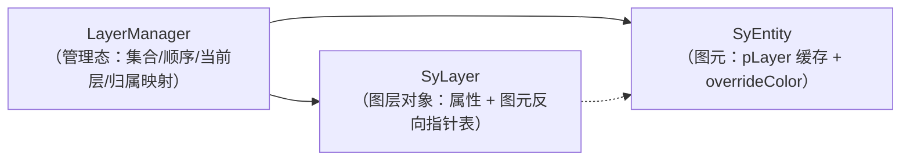

| 角色 | 类型 | 位置 | 职责 |
|------|------|------|------|
| 管理态 | `LayerManager` | `Engine/2D/Include/Engine2D/Interaction/LayerManager.h` | 图层集合、顺序、当前图层、`图元 id → 图层 id` 归属表、事件广播 |
| 图层对象 | `Eg::SyLayer` | `Engine/Common/Include/Engine/Layer/SyLayer.h` | 单个图层的属性；持有该层图元的**非拥有**指针列表 |
| 图元 | `Eg::SyEntity` | `Engine/Common/Include/Engine/SyEntity/SyEntity.h` | `pLayer` 是派生缓存，`m_overrideColor` 是可选的显式颜色 |

`LayerManager` 是唯一真值源；`SyLayer` 与 `SyEntity::pLayer` 都是派生视图。

### 1.2 `LayerManager::LayerInfo` 字段

`name`、`color`、`visible`、`locked`、`fill`、`fillColor`、`layerType`、`hardwareProfileId`。

> 早期还有 `lineWidth` / `lineStyle` 两个字段（以及 `setLayerLineWidth` / `setLayerLineStyle`
> 接口）。它们既不进 `SyLayer`、也不进 proto 与数据库，全工程没有任何调用方，
> 属于"看起来能改其实是空操作"的假能力，已连同字段一起删除。图层线宽如需支持，
> 必须一次打通 `LayerInfo → SyLayer → 渲染管线 → 持久化` 四处。

> **不变量：`LayerInfo` 与 `SyLayer` 必须逐字段一致。**
> 两者是同一份图层数据的两个副本——管理态读 `LayerInfo`，视图侧（渲染判定、序列化）
> 读 `SyLayer`。**新建 `SyLayer` 的任何路径都必须经 `LayerManager::syncSyLayerFromInfo()`**，
> 漏同步任一字段就会出现「LayerManager 说这是位图图层、SyLayer 说它是矢量图层」这类
> 两个真值互相矛盾的状态（历史上 `duplicateLayer` 与 `findOrCreateFillLayer` 就漏了
> `layerType` / `fill` / `fillColor`，导致复制出的位图图层退化成矢量层）。

### 1.3 `SyLayer` 字段与「集合」语义

字段：`nId`、`strName`、`nColor`、`nIndex`、`bVisible`、`bLocked`、`bFill`、`nFillColor`、
`eLayerType`，以及 `m_entities`（非拥有指针）与 `m_indexOf`。

`nIndex` 是图层在 `m_layerOrder` 中的位置（由 `syncLayerOrderIndices()` 统一写入），
即**图层面板里的行号**；它同时决定绘制次序，**0 = 面板首行 = 绘制在最上层**（见 2.5）。

`m_indexOf` 是 `SyEntity* → 下标` 的索引，因此：

- `hasEntity` / `removeEntity` 是 **O(1)**；`removeEntity` 用「与末尾交换后弹出」实现。
- **`getEntities()` 的顺序不保证**：任何一次移除都会打乱剩余元素的相对顺序。
  需要稳定顺序请按 id 或场景顺序自行排序，不要依赖图层内的排列。

为什么要这张索引：导入一个大文件时 `LayerManager::applyEntityLayerMap` 会对每个图元各调
一次 `removeEntity`（旧图层）+ `addEntity`（新图层）。原来两者都是线性 `std::find`，
在「全部图元同色同层」的 SVG 上实测是 O(N²)——2 万图元图层还原 29 ms、4 万图元 111 ms
（4 倍于 2 万，二次增长）。换索引后同样样本降到 10 ms / 24 ms。

### 1.4 默认图层表

`LayerManager` 构造时由 `ensureDefaultLayer()` 建立初始集合（仅在集合为空时执行）：

| 图层 id | 名称 | 颜色 | 类型 |
|---------|------|------|------|
| 0 | `Layer 0` | 黑 (0,0,0) | VECTOR |
| 1 | `Layer 1` | 红 (255,0,0) | VECTOR |
| 2 | `Layer 2` | 绿 (0,255,0) | VECTOR |
| 3 | `Layer 3` | 蓝 (0,0,255) | VECTOR |
| 4 | `Layer 4` | 橙 (255,165,0) | VECTOR |
| 5 | `Layer 5` | 紫 (128,0,128) | VECTOR |
| 6 | `Layer 6` | 青 (0,255,255) | VECTOR |
| 7 | `Layer 7` | 粉 (255,192,203) | VECTOR |
| 8 | `Bitmap 1` | 灰 (100,100,100) | BITMAP |

初始 `currentLayerId = 0`，`nextLayerId = 9`。图层数量上限 `kMaxLayerCount = 1024`，
达到上限后所有「创建图层」的接口一律拒绝并返回 `-1` / `0`，调用方需自行兜底。

> ⚠️ 默认 8 个矢量层的颜色恰好覆盖黑/红/绿/蓝等 CAD 最常见的图层色。
> 任何「按颜色查找或创建图层」的逻辑都必须先按**名称**匹配，否则源文件图层会被
> 整体吸进默认层（历史上导入丢图层就是这么发生的，见 3.6）。

### 1.5 归属的权威来源

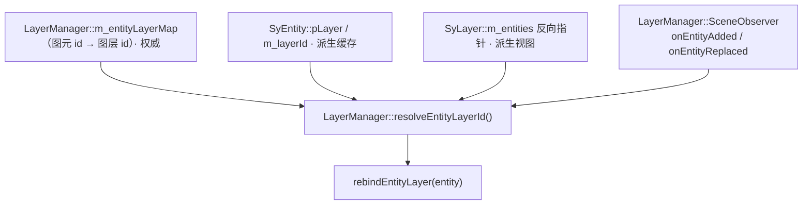

`m_entityLayerMap` 是权威来源，`SyEntity::pLayer` 只是缓存，两者不一致时以映射表为准。
`SceneObserver` 在**图元入场 / 同 id 换对象**时调用 `rebindEntityLayer()` 重新解析归属。

`m_entityLayerMap` 与 `SyLayer::m_entities` 的维护方式**刻意不同**：

- 映射表**保留已删除图元的条目**（每条约 16 字节），只在 `clearEntityMappings()`
  （新建 / 关闭文档）时整表清空。
- `SyLayer` 的反向指针表由 `SceneManager` 的离场 / 替换钩子维护。

早先的实现里有 `onSceneChanged → pruneStaleEntityMappings()`，图元一删就抹掉映射，
这与撤销直接冲突：撤销把图元插回来时映射已不存在，只能回落到图元自带的 `SyLayer*`，
而 `restoreDocument()` 会重建全部 `SyLayer`，那个指针可能已经悬空。现在不再 prune。

---

## 2. 图层与图元的关系

### 2.1 归属规则

- 一个图元**同时只属于一个图层**（`m_entityLayerMap` 是 `id → 单个 layerId`）。
- `assignEntityToLayer(entity, layerId)` 是唯一改归属的入口：从旧 `SyLayer` 移除 →
  写映射表 → 写 `pLayer` / `m_layerId` → 加入新 `SyLayer` → 标记 `setModified()`。
- 撤销 / 重做恢复归属走 `LayerEditService::pushEntityLayerChange` →
  `LayerManager::applyEntityLayerMap`（批量模式，只发一次场景变更通知）。
- `getEntityLayer()` → `resolveEntityLayerId()`，映射缺失时做**指针比对**兜底
  （不解引用，因为可能悬空），命中存活 `SyLayer` 才算数；都不命中则视为图层 0。
- `hasExplicitLayerAssignment()` 可判断映射表中是否存在显式条目。

### 2.2 颜色解析链

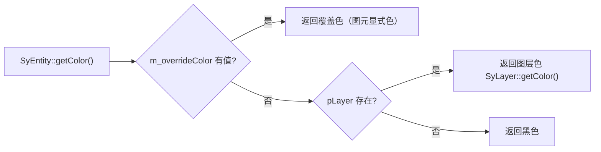

因此「改图层颜色，图元跟着变色」只在图元**没有覆盖色**时成立。导入时是否写覆盖色由
IR 的颜色来源策略决定，见 3.5。

### 2.3 新图元进入哪个图层

绘制 / 粘贴等常规新增走 `SceneEditService`，末尾调用
`LayerManager::assignEntityToCurrentLayer()`，它会按类型做**自动切换**：

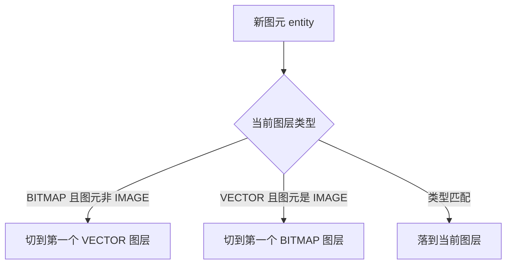

换句话说：矢量图形不会被放进位图图层，位图也不会被放进矢量图层。

### 2.4 图元入场与回绑

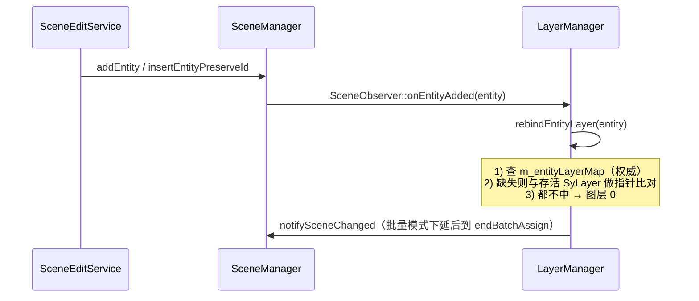

> 归属解析刻意不做「按颜色归层」的猜测：颜色是图元的显示属性，不是归属依据。

### 2.5 图层顺序决定绘制次序（z-order）

**约定：图层面板里越靠上的行，绘制越靠上（后画）。** 面板首行是 `m_layerOrder[0]`，
所以 `Eg::SyLayer::getIndex() == 0` 的图层画在最后。

链路（2D 场景图元）：

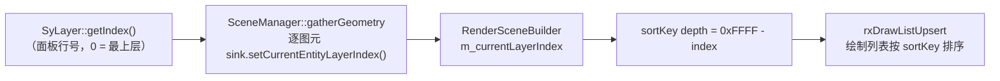

要点：

- 排序键布局是 `layer(8) | transparent(8) | depth(16) | seq(16)`，高位优先
  （`Render::RT::rxMakeSortKey`）。场景图元统一用 `layer = kSceneLayer(100)`——
  **不能**把图层序号塞进 `layer`：8 位装不下 1024 个图层，且该字段已被约定值占用
  （场景 100 / 覆盖层 200 / 环境层）。因此图层序号进 `depth`(16 位)，取反后
  序号越小 depth 越大、越晚绘制。
- 同一图层内部的先后仍由 `RenderSceneBuilder` 的 `sequence` 决定（首次出现的顺序，
  跨轮次保持稳定），因此同层图元的绘制次序不会随刷新抖动。
- **增量路径必须显式带上图层序号**：`RenderWidget::addRenderEntity /
  modifyRenderEntity` 有 `layerIndex` 参数，由 `SceneRefreshCoordinator` 在**主线程**
  从活图元解析（图元快照 clone 不复制图层指针，且工作线程不允许访问 `SceneManager`）。
  漏传会让新图元拿到更大的 `sequence`，永远画在最上面。
- **图层换序后必须触发一次全量装配**：换序只改 `LayerManager` 的图层顺序，图元本身没变、
  不会进脏集合，存量 sortKey 因此不会重算。触发点在 `UiStateBridge2D`：
  `QtLayerManagerBridge::sigLayerOrderChanged → RenderViewport2D::requestFullRefresh()`。
- `ISceneGeometrySink::setCurrentEntityLayerIndex()` 是**默认空实现**：不区分图层
  z-order 的渲染器（3D 网格、软件渲染）忽略它即退化为「按提交顺序绘制」。
- 性能取舍：按 sortKey 排序后，不同图层的相邻段不再落到一起，
  `DrawList` 的「相邻同伴合并」会因此少合一些批，draw call 数上升。
  这是"图层 z-order 正确"必然要付的代价。

---

## 3. 文件导入与图层

### 3.1 导入总链路

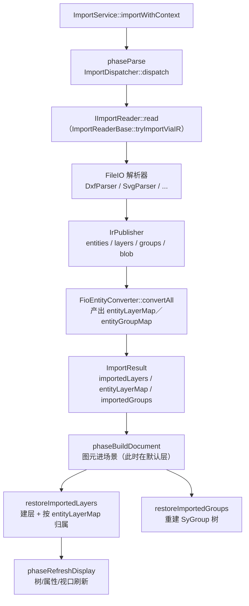

关键时序约束：**必须先让图元进场景拿到运行时 `EntityId`，才能按映射表反查归属**。
所以「建层 + 归属」放在 `phaseBuildDocument` 末尾，而不是解析阶段。

### 3.2 IR 层的图层契约

跨 DLL 的中立结构定义在 `FileIO/FileIO/Include/FileIO/FioTypes.h`：

| 结构 | 关键字段 | 说明 |
|------|----------|------|
| `IrLayerInfo` | `sourceId`（1-based）、`name[256]`、`color`（0xAARRGGBB）、`visible`、`locked` | 源文件图层表 |
| `EntityInfo` | `layerSourceId`（指向 `IrLayerInfo::sourceId`，0 = 未分配）、`groupSourceId` | 图元的单向归属 |
| `EntityInfo` | `color` + `colorPolicy`（`Explicit` / `ByLayer`） | 颜色值与其**来源语义** |

归属刻意只做**单向表达**（图元侧记 `layerSourceId`），图层侧不存成员列表——双向存储一旦
不一致就没有裁决依据，畸形文件很容易触发。

`IrPublisher` 侧还有两个上限：图层 `kMaxLayers = 1024`（与 `LayerManager::kMaxLayerCount`
对齐），超限时 `addLayer` 返回 0，图元落到下游默认层并记一条 warning；同名图层只登记一次。

### 3.3 DXF

- **图层表**：`TABLES/LAYER` 一定在 `BLOCKS` / `ENTITIES` 之前，所以 `addLayer()` 回调里
  就地登记图层并解析颜色，图元产出当场即可拿到 `layerSourceId`，不需要「先记名、读完回填」。
- **颜色**：`真彩色(420/color24)` > `ACI 索引(62)` > `BYLAYER/BYBLOCK`。
  ACI 走 libdxfrw 的 `dxfColors` 调色板；注意 **ACI 7 = 纯黑**（不是白），而许多 DXF 的
  图层默认色就是 7。
- **可见性 / 锁定**：`flags` 位 0 = 冻结、`color < 0` = 图层关闭 → `IrLayerInfo::visible`；
  `flags` 位 2 = locked → `IrLayerInfo::locked`。
- **图层名 `"0"`**：DXF 约定 `"0"` 是默认图层，导入时直接映射到软件的 `Layer 0`。
- **块（INSERT）**：块内图元若位于图层 `"0"`，实例化时改随 INSERT 所在图层；颜色为
  `BYBLOCK(0)` 时改随 INSERT 的颜色。这两条是「块能套用样式」的关键规则。
- **未声明的图层**：实体引用了 `TABLES` 里没有的图层时补登记一个默认色图层，
  而不是返回 0 让图元静默塌到默认层。
- **暂不支持**：`DIMENSION`、`LEADER`、`HATCH` 填充图案、`RAY`/`XLINE`、外部 `IMAGE` 引用
  等会发 warning 后跳过（不静默丢弃，便于排查"少东西"）。

### 3.4 SVG

SVG 没有标准图层概念，解析器**按颜色分层**：

- 颜色 → `IrLayerInfo`，图层名取 `#RRGGBB`（导入后在图层面板里能直接看出这层是什么颜色）。
- 上限 `kMaxSvgLayers = 256`，超出部分并入第一个图层并记 warning（按颜色分层时
  256 种已远超真实激光工艺需求；不返回 0 是为了避免图元「图层归属凭空消失」）。
- **不按 `shape id` 分层**：nanosvg 只把 `<g id>` 继承给无 id 的子 shape，Figma / SVGO
  导出的文件每个元素都带唯一 id，按 id 分层会变成「1 个图形 = 1 个图层」，1000 个 shape
  直接撞穿图层上限。原始 id 降级写入 `EntityInfo::name`，源对象仍可追溯。
- 解析前会把内联 `<style>` 里的 class 样式展开成元素属性，否则 nanosvg 看不到颜色 → 整图变黑。

> **取色陷阱**：nanosvg 的颜色打包宏是 `NSVG_RGB(r,g,b) = r | (g<<8) | (b<<16)`——**低位是 R、
> 高位是 B**，既不是 ARGB 也不是 ABGR。按 ABGR 解读会把 R/B 读反，红色 `#FF0000` 会变成
> 蓝色、图层名也跟着变成 `#0000FF`（已修复，`extractSvgColor` 是唯一读 `paint.color` 的地方）。

> 具名图层（Inkscape 的 `inkscape:label`、Illustrator 的 `Layer_N` `<g>`）目前**未**还原，
> 属于后续能力，不在当前实现范围内。

### 3.5 颜色保真策略（`colorPolicy`）

同一次导入必须区分「实体自身的显式色」和「随层色」，否则无法同时满足颜色一致与
图层色语义：

| 来源 | `colorPolicy` | 转换层行为 | 结果 |
|------|---------------|------------|------|
| DXF 真彩色 / ACI 1-255 | `Explicit` | 写 `setOverrideColor` | 图元固定显示自身颜色，改图层色不影响它 |
| DXF `BYLAYER(256)` / `BYBLOCK(0)` | `ByLayer` | **不写**覆盖色 | 显示色取所属图层颜色，改图层色图元跟着变（与 AutoCAD 一致） |
| SVG 描边/填充色 | `Explicit`（默认） | 写 `setOverrideColor` | 颜色严格与源文件一致 |
| 未区分来源的旧解析器 | 默认 `Explicit` | 同 `Explicit` | 行为保持不变 |

转换实现在 `Engine/3D/Src/Import/FioEntityConverter.cpp`：仅 `Explicit` 且颜色非 0 时才
调用 `setOverrideColor`。

### 3.6 落层规则（`ImportService::restoreImportedLayers`）

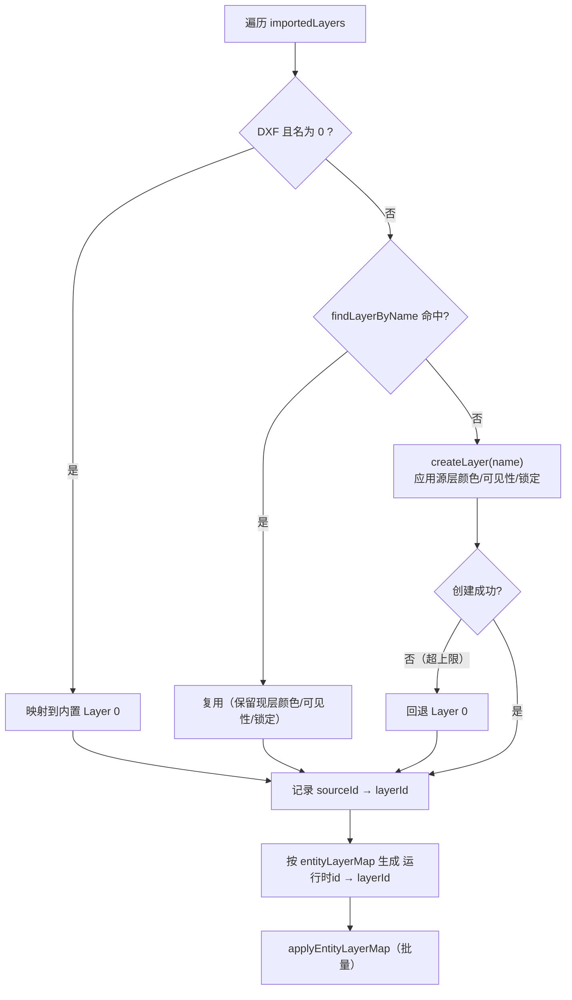

四条必须遵守的规则：

1. **按名称匹配，不按颜色复用。** 内置 8 个默认层的颜色恰好覆盖常见 CAD 色，按颜色去重
   会把源图层全部吸进默认层，图层名永远建不出来——这正是历史上「导入后全在默认层」的根因。
2. **同名图层保留现层设置**，不用源文件颜色/可见性覆盖，避免重复导入污染用户已配置的图层。
3. **归属只认本次导入的 `entityLayerMap`**，不做全场景扫描。全场景扫描会误改文档里
   已有的其他图元（合并导入时尤其明显）。
4. **解析失败/映射缺失的图元留在默认层**，并统计告警，不阻断导入。
5. **映射表的键必须是「入库后的最终 ID」**。`entityLayerMap` 由 `FioEntityConverter`
   在解析期产出，而 `SceneEditService::addEntities` 会在入库前把「ID 为 0 / 临时 ID /
   与场景已有图元冲突」的图元换成新持久 ID —— 键一旦对不上，`applyEntityLayerMap`
   会一条都查不到（日志表现为 `assigned 0 entities`），整批图元落回默认图层。
   两道防线：转换期显式取 `getNextPersistentId()`；入库时按 `addEntities` 返回的
   最终 ID 建 `idRemap` 修正表。**导入必须走同步路径（主线程）**，此时若有工具处于
   激活状态，`ToolManager` 已压入临时 ID 作用域，构造函数拿到的就是负数 ID。
6. **每个来源图层输出一条 INFO 日志（每层只记一次）**，格式为
   `Source layer '<源层名>' #RRGGBB -> runtime id=N ('<运行时层名>') <created|reused|回退>，N 个图元`。
   汇总行（`Layer restore: N total, ...`）看不出某层是被新建、被复用还是回退到了默认层，
   也核对不了图层名与颜色，多图层文件排查分层问题时要靠这一组逐层日志。
   最后一列是**本次导入**落在该层的图元数，不是场景总数。

> 版本提示：早期实现曾在此处「遍历全场景实体、按 `getColor()` 找或建同色图层」，
> 已移除。不要再引入任何基于颜色的图层归属推断。

### 3.7 群组 ≠ 图层

导入时**群组结构与图层结构是两套独立体系**，不要混淆：

| | 图层 | 群组 |
|---|---|---|
| IR 结构 | `IrLayerInfo` + `EntityInfo::layerSourceId` | `IrGroupInfo` + `EntityInfo::groupSourceId` |
| 运行时对象 | `SyLayer`（由 `LayerManager` 管） | `SyGroup`（由 `SceneManager::groupManager()` 管） |
| 来源 | DXF 的 `LAYER` 表、SVG 的颜色 | DXF 的 `INSERT` 块引用、SVG 的 `<g>`、OBJ 的 `o/g/usemtl` |
| 基数关系 | 一个图元属于**一个**图层 | 一个图元最多属于**一个**群组；群组可嵌套 |
| 3D 网格 | 不参与 | 不参与 |

DXF 的一次 `INSERT = 一个群组`（名字形如 `Block:<块名>`），嵌套引用递归成子群组。
群组重建带环检测（`wouldCreateCycle` 兜底），避免畸形文件把场景挂成环导致遍历无限递归。

### 3.8 与旧路径的关系

`ImportReaderBase::readViaLegacy` 是遗留通道，日志会明确打印
`Falling back to the legacy import path (no IR, no layer/group restore)`：
它**不还原图层与群组**，只返回图元与图层计数。旧的 `Fio::FileImporter` +
`SyDocument::entityLayerMap` 走的就是这条链，仅作兼容保留，新代码不要依赖。

---

## 4. 位图与图层

位图与矢量在图层语义上**强制分离**：位图图元（`Eg::EType::IMAGE`，`SyImage`）应落在
`LayerType::BITMAP` 图层上。

### 4.1 导入调用链

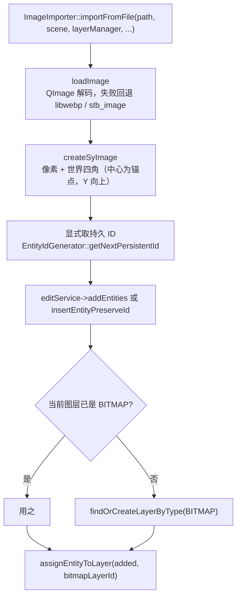

要点：

- **必须显式分配持久 ID 再插入**。若让 `insertEntityPreserveId` 替换掉临时 ID，
  随后 `findSyEntityById` 就查不到，位图不会被分层（早先的 bug）。
- 世界尺寸由 DPI 换算（`Fio::pixelsToUnit` + `readImageInfo`），默认单位为毫米。
- 粘贴路径同理：`ImagePasteService` 走 `findOrCreateLayerByType(BITMAP)` + `assignEntityToLayer`。

### 4.2 位图图层的查找语义

`findOrCreateLayerByType(BITMAP)` 按 `m_layerOrder` **创建顺序**返回**第一个**同类型图层。
因此默认的 `Bitmap 1`（id 8）会被优先命中；用户手工新建的位图图层只有在它被删除后才会被使用。

---

## 5. 填充色块与图层

### 5.1 填充图层标志

「填充图层」是**矢量图层上的一个布尔标记** `fill`，不是一个独立类型：

- `LayerManager::setLayerFill(id, true)` / `isLayerFill(id)`（带撤销版本在 `LayerEditService`）。
- 配套的 `fillColor`（`setLayerFillColor` / `layerFillColor`）是**该层色块填充使用的颜色**。
- `findOrCreateFillLayer()` 返回**第一个** `fill == true` 的图层；不存在则新建
  `Fill Layer`（`layerType = VECTOR`、`fill = true`）。
- 语义：该图层上的图元**参与色块填充剖分**。`EntityColorFiller::fillLayers()` 就是遍历
  所有 `isLayerFill()` 的图层逐个填。

### 5.2 两种填充入口

| 入口 | 触发 | 目标图层 | 颜色真值来源 |
|------|------|----------|--------------|
| 整层填充 `fillLayers` / `fillLayer` | 对已标记为填充图层的图层 | 该图层自身 | 图层 `fillColor` |
| 选中图元填充 `fillSelectedEntities` | 算法任务 `FillStyle::ColorFill` | `findOrCreateFillLayer()` | 对话框参数 `colorParams.fillColor`，随后回写图层 `fillColor` + `fill = true` |

### 5.3 填充流程

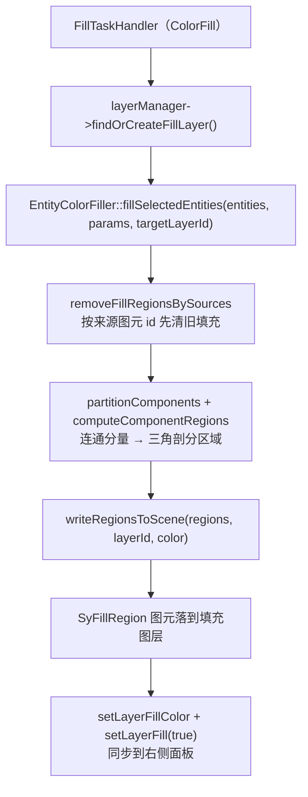

整层填充的差异只有两点：收集的是**该图层上所有**可填充图元（排除 `FILL_REGION` 自身），
且清理旧填充按**图层**（`removeFillRegionsOfLayer`）；颜色直接取 `layerFillColor(layerId)`。

### 5.4 色块与来源图元的关联

- 色块图元类型是 `Eg::EType::FILL_REGION`（`Engine/Common/Include/Engine/SyEntity/EType.h`），
  实现为 `Eg::SyFillRegion`，实心渲染。
- `SyFillRegion::vSourceIds`（`EntityId` 列表）= 该色块由哪些**来源图元**剖分而来。
  增量更新与「按来源删除旧色块」都靠它定位，因此**改图元后重填**能精确替换而不是堆叠。
- 色块自身也是普通图元，遵循第 2 节的归属规则：属于填充图层、可被隐藏/锁定/撤销。

---

## 6. 图层管理

### 6.1 接口分层

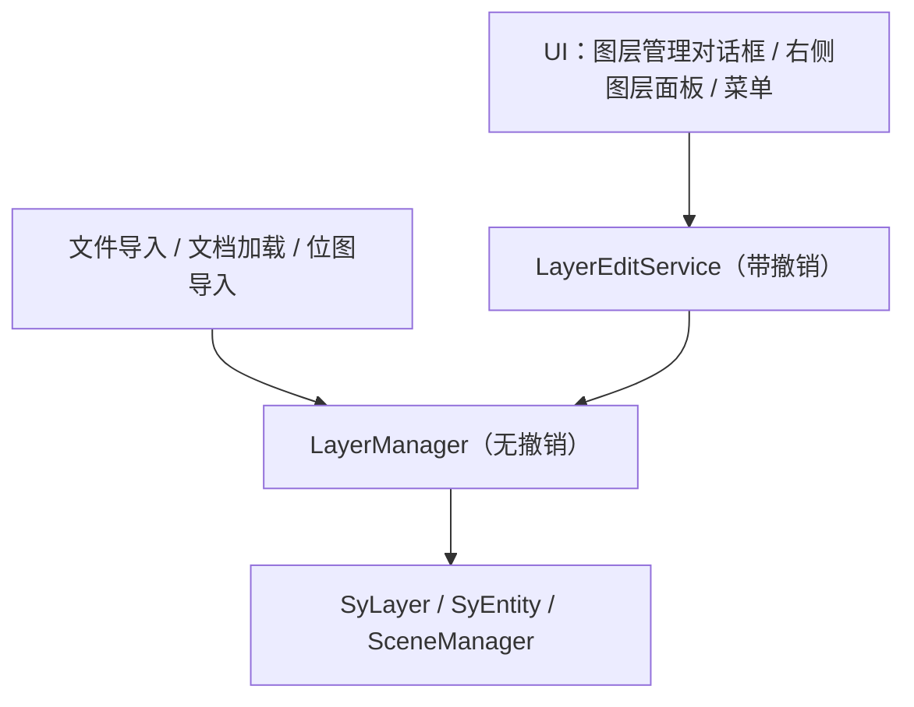

| 层 | 位置 | 规则 |
|----|------|------|
| `LayerManager` | `Engine/2D/Include/Engine2D/Interaction/LayerManager.h` | 纯运行态，无撤销 |
| `LayerEditService` | `Engine/2D/Include/Engine2D/Edit/LayerEditService.h` | **UI 与菜单的唯一入口**；全部操作进撤销栈 |
| `LayerManagerDialog` | `UI/2D/Include/UI2D/Dlg/LayerManagerDialog.h` | 只读真值 + 调服务层写 |

**UI 不是真值源**：所有写操作一律经 `LayerEditService`，写完调 `rebuildLayerList()` 把
**真实态**刷回控件。锁定图层会被服务层拒绝（`rejectIfLockedLayer` /
`rejectIfLockedEntities`），UI 不能自己假设成功。

文件加载等**批量初始化**仍可直接用 `LayerManager`（不需要逐条撤销）。

### 6.2 通知机制

`LayerManager` 通过 `ILayerManagerObserver` 广播 6 类事件，两个派生观察者：

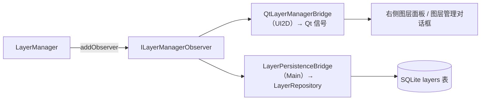

| 观察者 | 位置 | 用途 |
|--------|------|------|
| `QtLayerManagerBridge` | `UI/2D/Include/UI2D/Edit/QtLayerManagerBridge.h` | 把 C++ 回调转成 Qt 信号：`sigLayerAdded/sigLayerRemoved/sigLayerChanged/sigCurrentLayerChanged/sigLayerVisibilityChanged/sigLayerOrderChanged` |
| `LayerPersistenceBridge` | `Main/Src/Persistence/LayerPersistenceBridge.h` | 运行态 → 数据库**单向**同步 |

广播函数先拷快照再遍历，每次调用前校验观察者仍在册——允许观察者在回调里
`addObserver` / `removeObserver` 自己。

### 6.3 图层管理对话框（`LayerManagerDialog`）

三条硬约束：

1. **UI 不是真值源。** 所有写操作一律经 `LayerEditService`（因此都进撤销栈），
   写完调 `rebuildLayerList()` 把**真实态**刷回控件。锁定图层会被服务层拒绝，UI 不能自己假设成功。
2. **刷新不得改变选中与既有数据。** `rebuildLayerList()` 先记住 `prevCurrentId`，
   用 `QSignalBlocker` 屏蔽列表信号，`setCurrentRow(row, QItemSelectionModel::NoUpdate)`
   恢复选中，末尾再 `loadLayerDetails(selectedLayerId())`。
   同理 `loadLayerDetails()` 里对 `m_profileCombo` 加 `QSignalBlocker` —— 否则
   `setCurrentIndex` 触发的 `currentIndexChanged` 会把刚读出来的 profileId **回写一遍**，
   表现为"点一下图层，工艺参数被悄悄改成第一项"。
3. **多选是批量语义。** 统一走 `applyToSelectedLayers(op)`，返回成功计数；
   任一项失败弹一次 `QMessageBox` 汇总，不逐项弹。原先 visible / locked / fill /
   color / fillColor 五处各写一份单选逻辑，行为互不一致。

其余整理：

- 无有效图层时置灰两个 GroupBox，不留幽灵数据；锁定图层置灰 name / color / fill / rename，
  但 **Locked 复选框本身保持可用**，否则锁上就解不开。
- 尺寸用字体度量而非像素常量：`em = fm.horizontalAdvance('0')`，
  `setMinimumSize(em * 78, fm.height() * 26)`。高 DPI 与不同系统字号下才不会截断。
- 列表标签用 `QStringList tags` + `" [%1]"` 拼接，替换原先 `tr(" [BMP]")` 这类
  带前导空格的可译串（译者无从知道空格是有意义的）。
- 排序按钮改 2×2 `QGridLayout`；三个复选框并排一行；Close 与动作按钮同行。
- `showDialog` 返回值由 `bool` 改 `void`：对话框只有 Close / reject，永远返回 false。
- `m_nameEdit` 的 `returnPressed` 直接触发重命名。

### 6.4 图层动态刷新机制（2026-09-12）

填充操作会动态创建"填充图层"（`findOrCreateFillLayer`），两个消费方行为一度不一致：

| 消费方 | 状态 |
|--------|------|
| 右侧图层面板（`RightToolBar`） | 已连接 `QtLayerManagerBridge`，能自动刷新 |
| 图层管理对话框（`LayerManagerDialog`） | 仅在构造函数刷新，打开后不响应动态创建的图层 |

修法是给对话框补上同一组信号连接：

```cpp
// LayerManagerDialog.h
explicit LayerManagerDialog(LayerEditService* layerEditService,
                            QtLayerManagerBridge* bridge = nullptr,
                            QWidget* parent = nullptr);
static void showDialog(LayerEditService* layerEditService,
                       QWidget* parent,
                       QtLayerManagerBridge* bridge = nullptr);

// 构造函数中连接信号
if (m_layerBridge)
{
    connect(m_layerBridge, &QtLayerManagerBridge::sigLayerAdded, this, &LayerManagerDialog::onLayerChanged);
    connect(m_layerBridge, &QtLayerManagerBridge::sigLayerRemoved, this, &LayerManagerDialog::onLayerChanged);
    connect(m_layerBridge, &QtLayerManagerBridge::sigLayerChanged, this, &LayerManagerDialog::onLayerChanged);
    connect(m_layerBridge, &QtLayerManagerBridge::sigLayerOrderChanged, this, &LayerManagerDialog::onLayerChanged);
}
```

相关调试日志：

- `[LayerManager] findOrCreateFillLayer: found existing fill layer id=X name='...'`
- `[LayerManager] findOrCreateFillLayer: created new fill layer id=X name='...'`
- `[EntityColorFiller] writeRegionsToScene: layerId=X regions=Y color=(R,G,B)`

### 6.5 工艺参数进撤销栈（2026-08-31）

图层只存 `hardwareProfileId`，参数值本身（功率、速度、频率、焦点偏移、次数）在
`HardwareProfileManager` 里。这带来一个不对称：改图层颜色可以撤销，改功率不行 ——
`LayerDocumentSnapshot` 里没有参数值，撤销"改功率"无从恢复。

修法是**把参数组并入同一份图层文档快照**，而不是给参数另开一套撤销数据：

- `LayerSnapshot.h` 的 `LayerDocumentSnapshot` 增加
  `std::unordered_map<int, HardwareProfile> hardwareProfiles;`
- `LayerManager::captureDocument()` 顺带抄一份 profiles；
  `restoreDocument()` 在 `syncLayerOrderIndices()` 之后逐个 `setProfile(pid, profile)`，
  **只覆盖快照里存在的 profile**（快照之后新建的 profile 不被撤销删掉）。
- `LayerEditService` 新增 5 个带撤销的 setter：`setProfilePower / setProfileSpeed /
  setProfileFrequency / setProfileFocusOffset / setProfilePasses`，共用一个私有外壳
  `applyProfileChange(mutate, description)` —— 流程固定为
  captureDocument → mutate → `pushDocumentChange`。

为什么合并而不是分开：图层与参数是一个事务单位。"改图层的 profileId + 改那个 profile 的功率"
若落在两个撤销栈上，撤一次得到的是两者交叉的中间态。

---

## 7. 持久化

### 7.1 原生 `.sy` 格式（Protobuf）

`FileIO/FileIO/Proto/SanYiDocument.proto`：

```proto
message LayerData {
    uint32 id           = 1;  // 图层唯一标识
    string name         = 2;  // 图层名称 (UTF-8)
    uint32 color        = 3;  // ARGB
    bool   visible      = 4;
    bool   locked       = 5;
    repeated PropertyEntry custom_properties = 6;
    uint32 layer_type   = 7;  // 0=VECTOR, 1=BITMAP
    bool   fill         = 8;  // 是否填充图层
    uint32 fill_color   = 9;  // 填充色 ARGB
}

message EntityData {
    // ...
    uint32 layer_id = 3;      // 所属图层 ID
}
```

- 写：`SceneManagerSerializer::layersToProto` 优先从 `LayerManager::getAllLayerIds()`
  导出**完整图层列表（含空图层）**；无 `LayerManager` 时退化为从图元的 `e->layer()` 收集。
  图元侧 `entityCommonToProto` 写出 `layer_id`。
- 读：`SceneManagerSerializer::protoToLayers` 按 `id` 重建图层（不存在则 `createLayer`），
  再逐个恢复 name / visible / locked / color / layer_type / fill / fill_color。

### 7.2 数据库（SQLite）

`Main/Src/Persistence/DatabaseBootstrapper.cpp` 建表：

```sql
CREATE TABLE IF NOT EXISTS layers (
    id              INTEGER PRIMARY KEY AUTOINCREMENT,
    document_id     TEXT    NOT NULL,
    layer_id        INTEGER NOT NULL,
    name            TEXT    NOT NULL DEFAULT '',
    color           TEXT    DEFAULT '#000000',
    visible         INTEGER DEFAULT 1,
    locked          INTEGER DEFAULT 0,
    fill            INTEGER DEFAULT 0,
    fill_color      TEXT    DEFAULT '',
    layer_type      INTEGER DEFAULT 0,
    order_index     INTEGER DEFAULT 0,
    updated_at      TEXT    DEFAULT (datetime('now'))
)
```

- 旧库通过 `ensureLayerColumns()` 补 `fill` / `fill_color` 列（`CREATE TABLE IF NOT EXISTS`
  不会为已存在的表补列），否则持久化时报 `no such column`。
- 访问层是 `Main/Src/Persistence/Repositories/LayerRepository.cpp`，按
  `(document_id, layer_id)` 组合读写，`SELECT ... ORDER BY order_index ASC`。
- 同步方向是**单向**：`LayerPersistenceBridge` 监听运行态事件写库，见下表。

| 事件 | 动作 |
|------|------|
| `onLayerAdded` | `syncLayerToDb`（upsert 全字段） |
| `onLayerChanged` | `syncLayerToDb` |
| `onLayerRemoved` | `remove(documentId, layerId)` |
| `onLayerVisibilityChanged` | 只 `updateVisibility` |
| `onLayerOrderChanged` | 批量更新全部 `order_index` |
| `onCurrentLayerChanged` | **空实现**（当前层不落库） |

反向（库 → 运行态）由文档加载流程负责，不在此类内。

### 7.3 已知缺口

- **空图层不写进 DXF 导出**：`DxfFileWriter` 只拿得到图元列表、拿不到 `LayerManager`，
  因此只导出「有图元在用」的图层，导出后没有任何图元的图层会消失（实体的层名与图层
  颜色已按组码 `8` / `62` / `420` 正常写出，导入 → 导出往返的图层与颜色是一致的）。
  要保空图层需扩展写出器接口，让它同时接收图层表。
- **`.sy` 反序列化不回填图元归属**：`EntityData.layer_id` 写出了，但
  `SceneManagerSerializer::protoToEntities` 未消费它——图元经 `insertEntityPreserveId`
  入场后由 `rebindEntityLayer` 兜底成图层 0。加载 `.sy` 后图元会集中到默认层，
  图层表本身是完整的。`.sy` 属于待重新设计的自定义格式，此项暂不处理。
- **SVG 具名图层不还原**（见 3.4）。

---

## 8. 维护原则

- 图层类型由 `LayerManager` 统一管理；位图图层保持独立语义。
- 图层视觉规则尽量集中在 UI 层生成，不写进引擎。
- 持久化字段新增时同步更新：`LayerInfo` → `SyLayer` → `LayerDocumentSnapshot` →
  `LayerData`（proto）→ `layers` 表 + `ensureLayerColumns()`，五处漏一处就会出现
  「撤销丢字段」或「重启丢字段」。
- **任何图层归属逻辑都不得基于颜色推断**；只能按名称（源图层）或显式映射表。
- 改动图层顺序相关代码后，必须同时保证两件事：`syncLayerOrderIndices()` 被调用
  （否则 `getIndex()` 与面板行号脱节，z-order 跟着错），以及换序后触发一次渲染全量装配
  （见 2.5，否则存量 sortKey 不会重算）。
- 新增导入格式时：解析器负责填 `EntityInfo::layerSourceId` 与 `colorPolicy`，
  落层复用 `restoreImportedLayers`，不要在解析器里操作系统图层。
- 修改导入 / 位图 / 填充相关代码后，至少回归：
  - DXF 多图层文件导入 → 图层面板应出现**源图层名**，颜色与源文件一致；
  - SVG 彩色文件导入 → 出现 `#RRGGBB` 图层，颜色一致；
  - 改图层颜色 → 未设覆盖色的图元跟随变色（BYLAYER 生效）；
  - 位图导入 / 粘贴 → 落在 `Bitmap 1` 而非当前矢量层；
  - 色块填充 → 新建/复用填充图层，重复填充不堆叠旧色块；
  - 图层置顶 / 上移 → 重叠图元的覆盖关系跟着变；**新建或修改图元**也要落在它所属
    图层对应的层级上，不能一律压在最上面（这是增量路径漏传图层序号的典型症状）；
  - 导出 DXF → 重新导入 → 图层名与颜色与导出前一致；
  - 撤销 / 重做图层增删改、移层、改填充色 → 与操作前一致。
