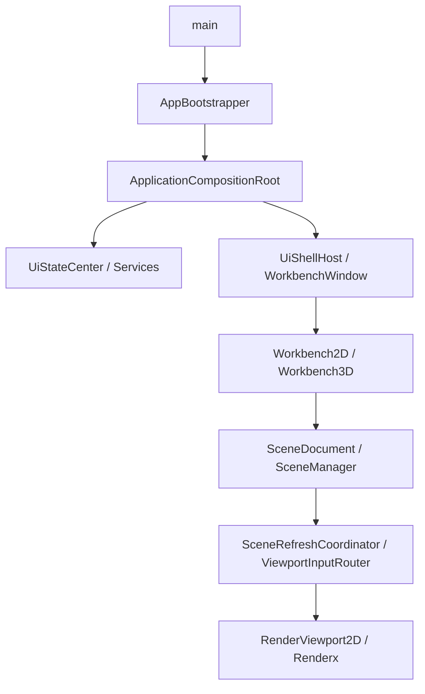

# 框架问题分析与重构路线图

> 适用目标：可切换 2D / 3D 显示的大型激光加工软件。  
> 当前约束：硬件驱动暂不考虑，重点只看 UI、交互、图元数据组织、流程、渲染与后端抽象。  
> 写作目的：把“现状判断、短板、缺陷、复用性、封装性、修改路线”放到同一份文档里，后续可以直接照着改。

---

## 0. 先说结论

这套框架不是“乱搭的工程”，它已经有一个比较清晰的中枢：启动链、组合根、状态中心、工作台壳、场景管理、渲染刷新、渲染适配层都已经出现了。  
如果目标只是做一个能跑的 2D CAD / 激光加工主程序，它是合格的，而且 2D 主链路已经有了产品级雏形。

但如果目标是“真正可扩展的 2D / 3D 统一平台，并且未来能切换 OpenGL / Vulkan / Metal 等后端”，那当前框架还没到终局形态。  
它现在更像“从单体 UI 工程向平台化框架过渡中的中期骨架”：

- 2D 数据链条是比较强的；
- 3D 是能工作，但还偏兼容层和过渡层；
- 多后端抽象还只是接口预留，不是已完成能力；
- `UiStateCenter` 和 `UiServices` 有明显的中心化和服务袋化趋势；
- `WorkbenchWindow` 仍然偏厚；
- 复用性在“场景、导入导出、状态汇聚”上不错，但在“渲染、交互、2D/3D统一模型”上还不够；
- 封装性在 `Engine/2D` 较强，在 UI 层和后端层较弱。

一句话概括：

> 当前框架适合作为“中期产品骨架”，但还不适合作为“最终平台骨架”。

---

## 1. 现有架构到底是什么样

### 1.1 启动链是清楚的

代码的启动链大致是：

对应文件主要是：

- [Main/Src/Runtime/main.cpp](C:\Users\xx\Documents\Cpp\CAD\Main\Src\Runtime\main.cpp)
- [Main/Src/Bootstrap/AppBootstrapper.cpp](C:\Users\xx\Documents\Cpp\CAD\Main\Src\Bootstrap\AppBootstrapper.cpp)
- [Main/Src/Composition/ApplicationCompositionRoot.cpp](C:\Users\xx\Documents\Cpp\CAD\Main\Src\Composition\ApplicationCompositionRoot.cpp)
- [Main/Src/Common/AppInitializer.cpp](C:\Users\xx\Documents\Cpp\CAD\Main\Src\Common\AppInitializer.cpp)

这个启动链的好处是：

- 应用初始化和业务装配分开；
- UI 壳和核心服务装配分开；
- 启动时就能明确工作台类型；
- 后续可以比较自然地扩展插件、主题、布局、导入导出、脚本等能力。

### 1.2 UI 壳层已经成型，但还偏厚

当前 UI 壳的核心是 `WorkbenchWindow`，它承担了：

- 菜单构建与刷新；
- 工具栏与状态栏布局；
- 工作台切换；
- 布局保存与恢复；
- GL 资源销毁和中央区切换；
- 一部分状态同步；
- 一部分工作台激活逻辑。

对应文件：

- [Main/Src/UI/Workbench/WorkbenchWindow.cpp](C:\Users\xx\Documents\Cpp\CAD\Main\Src\UI\Workbench\WorkbenchWindow.cpp)
- [Main/Src/UI/Workbench/WorkbenchMenuManager.cpp](C:\Users\xx\Documents\Cpp\CAD\Main\Src\UI\Workbench\WorkbenchMenuManager.cpp)
- [Main/Src/UI/Workbench/WorkbenchLayoutManager.cpp](C:\Users\xx\Documents\Cpp\CAD\Main\Src\UI\Workbench\WorkbenchLayoutManager.cpp)
- [Main/Src/UI/Workbench/WorkbenchActionManager.cpp](C:\Users\xx\Documents\Cpp\CAD\Main\Src\UI\Workbench\WorkbenchActionManager.cpp)

这说明窗口层已经不是纯“壳”，而是一个“壳 + 部分编排器”。  
这在中期项目里是可以接受的，但它也意味着：如果后面继续扩展，窗口类还要继续瘦身，否则会越来越像 God Class。

### 1.3 2D 数据主干已经比较像样

2D 这条链路是目前最成熟的部分：

- `SceneManager` 作为单一事实源；
- `SceneDocument2D` 作为文档/编辑入口；
- `SceneEditService` 作为撤销与编辑编排；
- `SelectionService` 作为选择包装层；
- `SceneRefreshCoordinator` 负责脏数据合并和刷新策略；
- `ViewportInputRouter` 负责输入事件分发；
- `EntityToVertices` 负责实体到顶点的转换；
- `RenderViewport2D` / `Renderx` 负责真正提交渲染。

对应文件：

- [Engine/2D/Include/Engine2D/Core/SceneManager.h](C:\Users\xx\Documents\Cpp\CAD\Engine\2D\Include\Engine2D\Core\SceneManager.h)
- [Main/Src/UI/Documents/SceneDocument2D.cpp](C:\Users\xx\Documents\Cpp\CAD\Main\Src\UI\Documents\SceneDocument2D.cpp)
- [Main/Src/UI/Services/SelectionService.cpp](C:\Users\xx\Documents\Cpp\CAD\Main\Src\UI\Services\SelectionService.cpp)
- [Main/Src/UI/Render/SceneRefreshCoordinator.cpp](C:\Users\xx\Documents\Cpp\CAD\Main\Src\UI\Render\SceneRefreshCoordinator.cpp)
- [Main/Src/UI/Render/ViewportInputRouter.cpp](C:\Users\xx\Documents\Cpp\CAD\Main\Src\UI\Render\ViewportInputRouter.cpp)
- [Main/Src/UI/Render/EntityToVertices.cpp](C:\Users\xx\Documents\Cpp\CAD\Main\Src\UI\Render\EntityToVertices.cpp)
- [Main/Src/UI/Render/RenderViewport2D.cpp](C:\Users\xx\Documents\Cpp\CAD\Main\Src\UI\Render\RenderViewport2D.cpp)
- [Renderx/src/c_api/render_c_api_device.cpp](C:\Users\xx\Documents\Cpp\CAD\Renderx\src\c_api\render_c_api_device.cpp)

对“大量 2D 图元”来说，这条链路的方向是对的。  
真正适合激光加工软件的，不是“炫酷 3D”，而是：

- 大量图元的稳定承载；
- 快速增量刷新；
- 可控的选择/编辑/命令流；
- 清晰的文档-场景-视口关系；
- 可追踪的状态变化。

你现在的 2D 链路，至少已经往这个方向走了。

### 1.4 3D 链路是能工作的，但还不统一

3D 这条链路有自己的适配层和兼容层：

- `Renderer3DFactory` 默认走 Compatible 路径；
- `RenderWidget3DAdapter` 负责适配旧 `RenderWidget3D`；
- `RenderWidget3D` 仍然是 Qt OpenGL widget；
- `SimpleRenderer3D` 更像校验/兼容/验证路径，不是统一主线；
- `UiViewport3D` 仍然更像独立视口实现。

对应文件：

- [Main/Src/UI/Render/Renderer3DFactory.cpp](C:\Users\xx\Documents\Cpp\CAD\Main\Src\UI\Render\Renderer3DFactory.cpp)
- [Main/Src/UI/Render/RenderWidget3DAdapter.cpp](C:\Users\xx\Documents\Cpp\CAD\Main\Src\UI\Render\RenderWidget3DAdapter.cpp)
- [Main/Src/UI/Render/SimpleRenderer3D.cpp](C:\Users\xx\Documents\Cpp\CAD\Main\Src\UI\Render\SimpleRenderer3D.cpp)
- [Main/Src/UI/Render/UiViewport3D.cpp](C:\Users\xx\Documents\Cpp\CAD\Main\Src\UI\Render\UiViewport3D.cpp)
- [UI/3D/Src/Render/RenderWidget3D.cpp](C:\Users\xx\Documents\Cpp\CAD\UI\3D\Src\Render\RenderWidget3D.cpp)

这说明 3D 目前仍处在“兼容优先、统一抽象不足”的状态。  
如果未来 3D 只是辅助展示，那么现在的结构可以继续用；如果未来 3D 要和 2D 一样成为主战场，那它还需要一轮明显的统一化改造。

### 1.5 多后端抽象目前只是“接口存在”，不是“能力存在”

这一点必须明确说清楚：  
`Renderx` 的类型里有 OpenGL / Vulkan / Metal / Null 等概念，但真正创建设备的代码目前只实现了 OpenGL 路径。

对应文件：

- [Renderx/include/render/render_types.h](C:\Users\xx\Documents\Cpp\CAD\Renderx\include\render\render_types.h)
- [Renderx/src/c_api/render_c_api_device.cpp](C:\Users\xx\Documents\Cpp\CAD\Renderx\src\c_api\render_c_api_device.cpp)
- [Renderx/CMakeLists.txt](C:\Users\xx\Documents\Cpp\CAD\Renderx\CMakeLists.txt)

也就是说，当前状态更接近：

| 层 | 当前状态 | 结论 |
|---|---|---|
| 类型定义 | 已预留多后端 | 只是接口预留 |
| 设备创建 | 仅 OpenGL 真正可用 | 其他后端尚未落地 |
| 构建系统 | 仅链接 OpenGL 相关实现 | 还不是多后端构建 |
| UI 视口 | 仍强依赖 Qt OpenGL 组件 | 后端切换还未真正打通 |

所以如果现在就说“我们已经是多后端平台”，那是不准确的。  
更准确的说法是：

> 我们已经有了多后端的命名和入口，但还没有多后端的实现和验证链路。

---

## 2. 这套框架合理在哪里

### 2.1 组合根和服务装配是合理的

`ApplicationCompositionRoot` 的价值很大，它把很多对象在启动期就装配好了：

- 状态中心；
- 主题服务；
- 布局服务；
- 交互分发；
- 操作总线；
- 图层管理；
- 文档对象；
- 导入导出；
- 场景对象；
- 编辑服务。

这种结构对大型软件是对的，因为后面功能一多，如果没有一个统一装配点，依赖关系会很快乱掉。

### 2.2 场景单一事实源的思路是对的

`Engine/2D` 里的 `SceneManager` 作为单一事实源，是非常好的设计。  
它负责：

- 图元拥有权；
- 选择状态；
- 空间查询；
- 脏图元追踪；
- 观察者通知；
- 数据访问。

这比把数据分散在 UI、工具、视口、渲染器里要健康得多。

### 2.3 2D 增量刷新方向正确

`SceneRefreshCoordinator` + `EntityToVertices` + `RenderWidget` 的组合，说明当前框架已经意识到“大量图元不能靠全量重绘硬扛”。

这对激光加工软件非常关键，因为真正的压力通常不是单个图元，而是：

- 大量几何对象；
- 多层图层；
- 局部修改；
- 高亮和选择反馈；
- 导入后批量重建；
- 撤销/重做连续触发。

现在的 2D 链路已经具备“增量刷新”的基本形态，这是很值得保留的。

### 2.4 状态中心化管理有现实价值

`UiStateCenter` 的好处是：

- UI 能统一读取当前状态；
- 菜单、状态栏、窗口标题、忙闲提示可以统一响应；
- 工作台切换、文档切换、命令切换、工具切换能够串起来；
- 状态保存和恢复更容易组织。

所以问题不在“状态中心这个思想错了”，而在“状态中心管得太多了”。

### 2.5 适配层思路是对的

`RenderWidget3DAdapter` 这种适配层，短期内是合理的。  
它允许你：

- 不立刻推翻旧实现；
- 保持 UI 层能继续跑；
- 逐步把新接口往上提；
- 给旧代码留缓冲区。

它的问题不在存在本身，而在于它不能永远停留在“临时桥”状态。

---

## 3. 当前最大的短板和缺陷

下面这部分是最重要的，因为它决定后面怎么改。

### 3.1 多后端不是事实，只是愿景

这是当前最核心的技术短板。

现状问题：

- `Renderx` 的后端枚举看起来像多后端；
- 实际实现只有 OpenGL；
- `Main` / `UI` 的视口路径还强依赖 Qt OpenGL；
- Vulkan / Metal 没有真正进入构建与运行链路；
- 目前无法证明“同一套渲染模型可以真正切换不同后端”。

这会带来两个风险：

1. 团队会误以为架构已经铺好了，实际下一层还没做；
2. 后续如果强行补 Vulkan/Metal，会发现底层抽象不够，最后只能在旧代码上打补丁。

### 3.2 2D / 3D 复用性还不够

当前 2D 和 3D 不是共享一套统一模型，而是各自一套：

- 2D 有 `SceneManager`、`SceneDocument2D`、`RenderViewport2D`；
- 3D 有 `SceneManager3D`、`SceneDocument3DAdapter`、`UiViewport3D`、`RenderWidget3DAdapter`。

问题不是“不能这么做”，而是：

- 业务语义没有统一；
- 选择模型没有统一；
- 视口行为没有统一；
- 渲染编译链没有统一；
- 后端能力也没有统一。

这会直接降低软件复用性。  
以后如果要加新的视图模式、预览模式、测量模式、工艺检查模式，就很可能又复制一套。

### 3.3 `UiStateCenter` 太像全局大状态袋

从封装角度看，这是一个明显的风险点。

它现在同时管：

- 工作台；
- 主题；
- 视图模式；
- 图层；
- 文档；
- 命令；
- 选择；
- busy / dirty；
- 错误；
- 进度；
- 刷新状态；
- 激活工具；
- 输入焦点；
- metadata。

这样做的好处是方便，但坏处也很明显：

- 容易变成“什么都往里塞”；
- 容易出现重复状态；
- 容易出现状态同步循环；
- 容易让新功能在不知不觉中依赖它；
- 容易让 UI 以外的模块开始滥用它。

它应该是“UI 会话状态中心”，而不应该变成“所有状态都丢进去”的总线。

### 3.4 `UiServices` 的封装性偏弱

`UiServices` 是一个很实用的服务袋，但它也有典型问题：

- 成员多；
- 大量 raw pointer；
- 很多服务是可选的；
- 生命周期和所有权不够显式；
- 调用方一旦拿到这个包，几乎什么都能碰。

这会让模块边界变软。  
短期它是好用的，长期它会让模块之间越来越像“共享内存”。

### 3.5 `WorkbenchWindow` 还是偏厚

虽然已经拆出一些 manager，但窗口层仍然承担很多事。  
这会导致：

- 视图切换、菜单刷新、布局状态、工具栏状态混在一起；
- 任何工作台改动都要碰它；
- 很容易引入隐式耦合；
- 单元测试很难写；
- 维护成本高。

从架构角度，窗口应该是“宿主容器”，不是“业务编排中心”。

### 3.6 交互层还不够统一

`UiInteractionDispatcher` 目前已经开始承担命令生命周期同步，但还没有成为完整的“统一输入分发器”。  
同时，2D / 3D / 工具 / 视口之间的输入责任边界还没有完全收紧。

这会导致：

- 鼠标、键盘、快捷键、工具事件容易在不同层重复处理；
- 交互流程不容易追踪；
- 后续加新工具时会遇到“到底谁接收事件”的问题；
- 不同视图模式的输入行为不好统一。

不过当前代码已经有了比较清晰的起点：`ViewportInputRouter` 负责输入事件路由，`UiInteractionDispatcher` 负责活动命令的状态同步，下一步更适合继续收口，而不是推翻重来。

### 3.7 文档接口还有封装泄漏

`SceneDocument2D` 做得比“直接操作场景对象”要好，但它还是存在几类泄漏：

- 暴露了大量 ID 级别操作；
- 提供了遍历实体的底层入口；
- 对 `SceneManager` 的依赖比较直接；
- `QString` / 数字 ID / 原始实体指针之间的转换较多。

这会让上层更容易碰到下层细节。  
短期这不是大问题，但长期会影响复用和扩展。

### 3.8 构建系统的模块边界还不够硬

`Main/CMakeLists.txt` 使用了 `file(GLOB_RECURSE ...)` 去扫所有源码，这会带来几个问题：

- 模块边界不够显式；
- 很容易把旧代码、临时代码、兼容代码一起编进去；
- 一眼看不出哪个模块真正属于哪个 target；
- 更难做“只改一个模块”的依赖收敛；
- 容易让编译图越来越大。

这不是功能错误，但会伤害长期维护性和封装性。

### 3.9 2D / 3D 的运行路径还没有真正统一

现在的情况更像是“2D 一套主线，3D 一套兼容线”。  
这意味着：

- 共用逻辑少；
- 不同视图模式维护成本高；
- 一些生命周期问题需要分别处理；
- 切换工作台时要特别小心资源释放和状态恢复。

但这里也要注意，3D 链路并不是纯粹的旧代码残留；它已经有适配层和统一接口雏形，只是还没有收敛到和 2D 同等的模型层。

### 3.10 旧路径和新路径并存的风险

从当前目录结构看，`Main` 同时包含 `UI/2D`、`UI/3D`、`Main/Src/UI/...` 等路径。  
这本身不是错，但它意味着：

- 可能存在旧实现和新实现并行；
- 容易出现同类功能多个版本；
- 新成员上手时很难判断“该改哪条路径”；
- 长期会拖累复用性和封装性。

---

## 4. 软件复用性评价

### 4.1 复用性好的地方

目前复用性相对好的部分是：

- `SceneManager`：场景事实源，可作为 2D 主复用核心；
- `SceneRefreshCoordinator`：刷新策略可复用；
- `ImportService` / `ExportService` / `ImportDispatcher` / `ExportDispatcher`：流程型复用较好；
- `UiStateCenter`：状态读取层面有统一入口；
- `ApplicationCompositionRoot`：服务装配可复用；
- `WorkbenchHost` 思路：统一壳层装配是对的。

### 4.2 复用性弱的地方

复用性弱的地方主要集中在：

- 渲染实现；
- 2D / 3D 视口；
- 交互链路；
- 文档层和场景层的边界；
- 后端能力抽象；
- 工具激活与视图切换的共用策略。

### 4.3 为什么复用性还不够

因为现在的复用很多停留在“服务复用”层，而不是“模型复用”层。

举个很直白的例子：

- 当前可以复用一个 `SceneManager`；
- 但不能很好复用一套“统一的 viewport controller”；
- 可以复用一个状态中心；
- 但不能很好复用一套“统一的 command / tool / interaction model”；
- 可以复用一些导入导出流程；
- 但不能很好复用“2D / 3D 的渲染编译和提交层”。

服务复用只能解决“装配方便”，模型复用才能解决“长期扩展方便”。

### 4.4 复用性要怎么提升

核心原则只有一句话：

> 让“业务语义”和“显示实现”分离，让“通用模型”和“具体视图”分离。

具体做法：

- 让 2D / 3D 都依赖统一的 document / scene contract；
- 把真正变化大的部分放到 adapter；
- 把不会变的部分提到 `Engine` 或独立服务；
- 把 UI 只保留成壳层和交互入口；
- 让渲染后端只面对渲染数据，不面对业务对象细节。

---

## 5. 封装性评价

### 5.1 封装性强的部分

`Engine/2D` 的封装性是当前最好的：

- `SceneManager` 集中管理图元；
- 选择、空间索引、脏标记都有明确内部机制；
- 外部不需要知道太多内部结构；
- 适合做长期核心域。

### 5.2 封装性一般的部分

- `SceneDocument2D`：已经比直接操作场景好，但仍暴露较多底层细节；
- `WorkbenchWindow`：已经不是纯窗口，但也还没彻底分层；
- `RenderWidget3DAdapter`：是必要的兼容层，但接口和实现仍然混杂在一起；
- `UiServices`：装配方便，边界偏软。

### 5.3 封装性弱的部分

- `UiStateCenter`：状态太多，语义太杂；
- `Renderx` 对 UI 的影响：后端类型和 OpenGL 细节仍然在上层可见；
- `Main/CMakeLists.txt`：全局 include 和 glob 让模块边界不够清楚；
- `SceneDocument2D` 对 `SceneManager` 的直连：容易把下层细节带到上层。

### 5.4 封装性要怎么修

封装性不是“把代码藏起来”这么简单，而是：

1. 谁拥有数据，谁就负责它的生命周期；
2. 谁提供能力，谁定义稳定接口；
3. 谁是适配层，谁就不要承载业务规则；
4. 谁是 UI 层，谁就不要直接决定底层渲染实现；
5. 谁是状态中心，谁就只负责状态，不负责业务流程。

---

## 6. 三层重构路线图

下面是你后续可以直接照着改的路线。  
我按“短期能改 / 中期重构 / 长期平台化”来拆，并且尽量对应到现有目录和模块。

---

### 6.1 短期能改：先收边界，先把当前框架变稳

目标：不推翻现有结构，先把最危险的耦合、最模糊的边界、最容易误用的接口收紧。  
建议周期：1 ～ 4 周。

#### 当前完成度总览（2026-08-05）

| 任务 | 状态 | 说明 |
|---|---|---|
| 状态中心分层 | 部分完成 | 已有 `statusPrompt`、交互专用状态和快照字段；窗口仍保留少量 metadata 兼容读取 |
| 统一交互入口 | 部分完成 | 已有 `InteractionEvent`、dispatcher 消费回调和 2D 工具绑定；3D 尚未接入同一事件链 |
| 文档层封装 | 部分完成 | 已有 `SceneEntityInfo2D` 快照接口，但仍保留 `sceneManager()` 兼容入口和实体指针型编辑回调 |
| WorkbenchWindow 收敛 | 部分完成 | 已拆出多个 manager，切换链路已有生命周期日志；状态清理仍包含较多兼容 metadata |
| 后端现实校准 | 未完成 | OpenGL 仍是主要可用后端，其他后端仍属于接口/构建预留 |
| 显式构建模块 | 部分完成 | Main 已开始显式列举源文件，Renderx 和部分模块仍有过渡性扫描/生成文件 |

#### 本轮剩余推进顺序

1. 继续收紧 `SceneDocument2D` 的编辑和查询边界，减少上层直接依赖 `SceneManager` 与实体指针；
2. 继续收敛 `WorkbenchWindow` 的工作台切换和状态清理职责，优先消除重复 metadata 写入；
3. 完成 2D/3D 统一输入契约的设计和最小接入；
4. 整理 Renderx backend capability 与构建事实，暂不把接口预留描述为已实现；
5. 最后推进统一文档/视口模型和真实多后端实现。

本节状态以代码和构建验证为准；“已落地的具体动作”只记录已经存在于当前代码中的改动，不将设计方案视为完成。

#### 任务 1：把状态中心从“大杂烩”收成“会话状态中心”

落点文件：

- [Main/Src/UI/Services/UiStateCenter.h](C:\Users\xx\Documents\Cpp\CAD\Main\Src\UI\Services\UiStateCenter.h)
- [Main/Src/UI/Services/UiStateCenter.cpp](C:\Users\xx\Documents\Cpp\CAD\Main\Src\UI\Services\UiStateCenter.cpp)

怎么改：

- 保留当前 API，但把状态分层理解清楚：
  - 稳定 UI 状态：工作台、主题、busy、dirty、激活工具、当前文档；
  - 临时命令状态：commandId、phase、owner、type、失败信息；
  - 任务/进度状态：progress、taskPhase、statusMessage、errorCode；
  - 渲染/刷新状态：refreshState；
  - 其他零散状态尽量少放进来。
- `metadata` 只作为“临时附加信息”使用，不要变成新的万能通道。
- 新增状态时先问一句：
  “这个状态是 UI 会话状态，还是命令状态，还是业务状态？”

验收标准：

- 状态中心的用途更清楚；
- 新功能不再随手往 `metadata` 塞东西；
- 菜单、状态栏、工作台切换的状态来源更稳定。

当前代码已经开始向这个方向收敛，`statusPrompt` 就是一个可见的第一步。

已落地的具体动作：

- `UiStateCenter` 新增了 `statusPrompt` 独立属性和信号；
- `statusPrompt` 会同步进快照与元数据，方便展示层统一读取；
- 交互分发器开始通过标准状态接口同步命令开始 / 结束。

#### 任务 2：把交互分发变成真正的入口，而不是摆设

> 当前状态：部分完成。2D 活动工具已经绑定 `InteractionEvent` 消费回调；命令提交/取消、3D 输入和统一测试仍未闭环。

落点文件：

- [Main/Src/UI/Interaction/UiInteractionDispatcher.cpp](C:Users\xx\Documents\Cpp\CAD\Main\Src\UI\Interaction\UiInteractionDispatcher.cpp)
- [Main/Src/UI/Interaction/UiInteractionDispatcher.h](C:Users\xx\Documents\Cpp\CAD\Main\Src\UI\Interaction\UiInteractionDispatcher.h)
- [Main/Src/UI/Render/RenderViewport2D.cpp](C:\Users\xx\Documents\Cpp\CAD\Main\Src\UI\Render\RenderViewport2D.cpp)
- [Main/Src/UI/Render/ViewportInputRouter.cpp](C:\Users\xx\Documents\Cpp\CAD\Main\Src\UI\Render\ViewportInputRouter.cpp)

怎么改：

- 明确鼠标/键盘/快捷键事件最终走哪条链路；
- `UiInteractionDispatcher` 不要只是写状态，要能明确地把事件转给视口或工具；
- 如果某些方法暂时还不能真正 forward，就不要伪装成已完成，至少要在文档里说明当前状态；
- 让 2D / 3D 的事件入口尽量共享同一套语义，而不是各写各的。

验收标准：

- 事件流清晰；
- 工具激活、选择、拖拽、缩放、旋转等动作能清楚追踪；
- 不同视图模式下的输入行为更一致。

当前实现已经比“只写 metadata”更进一步，但仍然应该继续向“事件转发 + 状态同步”收口。

已落地的具体动作：

- 交互分发器开始显式同步命令开始 / 提交 / 取消状态；
- 鼠标与按键事件先记入统一状态，再由上层进一步决定如何消费；
- 2D 输入路由器已经能直接调用交互分发器的转发入口。

#### 任务 3：收紧文档层的封装

> 当前状态：部分完成。已有稳定 ID 和 `SceneEntityInfo2D` 查询快照；`sceneManager()` 兼容出口、`SceneEditService` 的原始实体回调和 C 接口式遍历仍需继续收口。

落点文件：

- [Main/Src/UI/Documents/SceneDocument2D.cpp](C:\Users\xx\Documents\Cpp\CAD\Main\Src\UI\Documents\SceneDocument2D.cpp)
- [Main/Src/UI/Documents/SceneDocument2D.h](C:\Users\xx\Documents\Cpp\CAD\Main\Src\UI\Documents\SceneDocument2D.h)
- [Main/Src/UI/Services/SelectionService.cpp](C:\Users\xx\Documents\Cpp\CAD\Main\Src\UI\Services\SelectionService.cpp)

怎么改：

- `SceneDocument2D` 继续保留“创建/删除/遍历/查询”能力，但减少对下层细节的暴露；
- 逐步减少“上层直接拿实体指针干活”的情况；
- 如果需要给 UI 提供遍历能力，尽量返回稳定 ID、快照或轻量句柄，而不是把底层结构裸露出去；
- 让 `SelectionService` 成为唯一的选择入口之一，而不是多处散落查找。

验收标准：

- 上层不需要知道太多 `SceneManager` 内部细节；
- 新增文档类型时，上层代码修改更少；
- 选择和删除路径更统一。

已落地的具体动作：

- `SceneDocument2D` 新增了 `entityInfos()`，用于返回更轻量的图元信息快照；
- 移除了直接暴露底层实体指针的公开接口；
- `SelectionService` 增加了英文日志，并支持重新绑定场景模型，方便文档切换时保持封装边界。

#### 任务 4：把 `WorkbenchWindow` 继续减肥

落点文件：

- [Main/Src/UI/Workbench/WorkbenchWindow.cpp](C:\Users\xx\Documents\Cpp\CAD\Main\Src\UI\Workbench\WorkbenchWindow.cpp)
- [Main/Src/UI/Workbench/WorkbenchMenuManager.cpp](C:\Users\xx\Documents\Cpp\CAD\Main\Src\UI\Workbench\WorkbenchMenuManager.cpp)
- [Main/Src/UI/Workbench/WorkbenchLayoutManager.cpp](C:\Users\xx\Documents\Cpp\CAD\Main\Src\UI\Workbench\WorkbenchLayoutManager.cpp)
- [Main/Src/UI/Workbench/WorkbenchActionManager.cpp](C:\Users\xx\Documents\Cpp\CAD\Main\Src\UI\Workbench\WorkbenchActionManager.cpp)

怎么改：

- 窗口层只保留“宿主”职责；
- 菜单、布局、动作、状态栏的细节继续向小控制器迁移；
- 工作台切换逻辑保留在窗口，但业务规则尽量外移；
- 避免窗口类再长出新的业务分支。

验收标准：

- `WorkbenchWindow` 不再持续增肥；
- 新增按钮/菜单时，优先改管理器而不是窗口本体；
- 切换工作台、恢复布局、更新状态更容易定位。

已落地的具体动作：

- 状态栏文本优先读取 `UiStateCenter::statusPrompt()`，减少对 `metadata` 的直接依赖；
- 窗口切换上下文新增了显式的 `setWorkbenchTransitionState()`；
- 工作台切换时的状态刷新更依赖统一状态快照，减少本地镜像的二次解释。

#### 任务 5：明确当前后端现实，别让愿景遮住事实

> 当前状态：未完成。当前生产链路仍以 OpenGL 为主，Vulkan/Metal 等只完成类型或接口预留，尚未形成可运行、可验证的后端切换链路。

落点文件：

- [Renderx/include/render/render_types.h](C:\Users\xx\Documents\Cpp\CAD\Renderx\include\render\render_types.h)
- [Renderx/src/c_api/render_c_api_device.cpp](C:\Users\xx\Documents\Cpp\CAD\Renderx\src\c_api\render_c_api_device.cpp)
- [Renderx/CMakeLists.txt](C:\Users\xx\Documents\Cpp\CAD\Renderx\CMakeLists.txt)
- [Main/Src/UI/Render/RenderWidget3DAdapter.cpp](C:\Users\xx\Documents\Cpp\CAD\Main\Src\UI\Render\RenderWidget3DAdapter.cpp)

怎么改：

- 先把“当前只有 OpenGL 真正可用”这个事实在代码和文档里讲清楚；
- 对 `BackendType` 增加 capability 意义上的说明，而不是只保留名字；
- 在 UI 层明确“当前后端 = OpenGL”，不要伪装成已经多后端；
- 给未来的 Vulkan / Metal 留接口，但不要让接口比实现更像完成品。

验收标准：

- 不会再误把“预留枚举”当成“真实能力”；
- 以后补 Vulkan / Metal 时，入口和职责更清楚。

#### 任务 6：把构建入口从“扫描式”收向“显式模块式”

落点文件：

- [Main/CMakeLists.txt](C:\Users\xx\Documents\Cpp\CAD\Main\CMakeLists.txt)
- [Renderx/CMakeLists.txt](C:\Users\xx\Documents\Cpp\CAD\Renderx\CMakeLists.txt)

怎么改：

- `Main` 的源码收集尽量从 `GLOB_RECURSE` 过渡到显式 target sources；
- 将 `UI/2D`、`UI/3D`、`Main/Src/UI/...` 的职责划清；
- 避免“目录里有啥就编啥”，因为那会让旧代码和新代码长期并存；
- 通过显式 target 让模块边界变得可见。

验收标准：

- 依赖关系更清楚；
- 误编译风险更低；
- 后续重构更容易判断影响面。

已落地的具体动作：

- `Main/CMakeLists.txt` 的应用源文件已改为按 Common / Composition / Import / Export / Persistence / UI 等模块显式列出；
- 3D 相关源文件仅在 `BUILD_UI3D` 开启时加入应用目标；
- `MainTests` 的依赖源文件也改为显式列表，避免测试目标意外编译新增或遗留源文件；
- 当前仍保留 `.qrc` 的资源扫描，因为资源文件数量少且不参与 C++ 模块边界判断。

#### 任务 2：把交互分发变成真正的入口，而不是摆设

落点文件：

- [Main/Src/UI/Interaction/UiInteractionDispatcher.cpp](C:\Users\xx\Documents\Cpp\CAD\Main\Src\UI\Interaction\UiInteractionDispatcher.cpp)
- [Main/Src/UI/Interaction/UiInteractionDispatcher.h](C:\Users\xx\Documents\Cpp\CAD\Main\Src\UI\Interaction\UiInteractionDispatcher.h)
- [Main/Src/UI/Render/RenderViewport2D.cpp](C:\Users\xx\Documents\Cpp\CAD\Main\Src\UI\Render\RenderViewport2D.cpp)
- [Main/Src/UI/Render/ViewportInputRouter.cpp](C:\Users\xx\Documents\Cpp\CAD\Main\Src\UI\Render\ViewportInputRouter.cpp)

怎么改：

- 明确鼠标/键盘/快捷键事件最终走哪条链路；
- `UiInteractionDispatcher` 不要只是写状态，要能明确地把事件转给视口或工具；
- 如果某些方法暂时还不能真正 forward，就不要伪装成已完成，至少要在文档里说明当前状态；
- 让 2D / 3D 的事件入口尽量共享同一套语义，而不是各写各的。

验收标准：

- 事件流清晰；
- 工具激活、选择、拖拽、缩放、旋转等动作能清楚追踪；
- 不同视图模式下的输入行为更一致。

当前实现已经比“只写 metadata”更进一步，但仍然应该继续向“事件转发 + 状态同步”收口。

已落地的具体动作：

- 交互分发器开始显式同步命令开始 / 提交 / 取消状态；
- 鼠标与按键事件先记入统一状态，再由上层进一步决定如何消费；
- 2D 输入路由器已经能直接调用交互分发器的转发入口，并统一以视口本地坐标为输入基准；
- 交互事件状态已经从 `UiStateCenter::metadata()` 中抽离，改由 `UiStateCenter` 的专用字段、读接口、写接口和信号承载；
- `UiInteractionDispatcher` 只负责命令生命周期和事件状态提交，`RenderViewport2D` 只负责视口编排，`ViewportSelector` 只负责选择命中与选择结果。

#### 任务 3：收紧文档层的封装

---

### 6.2 中期重构：把 2D / 3D / 渲染抽成统一平台能力

目标：建立真正可复用的统一模型，让 2D 和 3D 不再各写一套主逻辑。  
建议周期：1 ～ 3 个月。

这一阶段不要追求“所有东西一次性统一”，而是先统一最容易复用的模型，再统一输入和渲染边界。

#### 任务 1：建立统一的场景 / 文档抽象

落点目录：

- [Engine/2D](C:\Users\xx\Documents\Cpp\CAD\Engine\2D)
- [Engine/3D](C:\Users\xx\Documents\Cpp\CAD\Engine\3D)
- [Engine/Common](C:\Users\xx\Documents\Cpp\CAD\Engine\Common)
- [Main/Src/UI/Documents](C:\Users\xx\Documents\Cpp\CAD\Main\Src\UI\Documents)

怎么改：

- 抽出统一的文档契约，如：
  - `IDocument`
  - `ISceneModel`
  - `ISelectionModel`
  - `IEntityQuery`
  - `IEditSession`
- 2D / 3D 各自实现适配器，不再各自维护一整套语义；
- 让“文档”成为上层稳定入口，把“场景实现”藏在适配层之后；
- 把 `SceneDocument2D` / `SceneDocument3DAdapter` 往同一风格收拢。

为什么要做：

- 这样 2D / 3D 的很多 UI 逻辑才能真正复用；
- 以后再加“预览模式 / 检查模式 / 工艺模式”时，不需要重建一套文档模型。

#### 任务 2：建立统一的视口 / 输入 / 相机控制接口

落点目录：

- [Main/Src/UI/Render](C:\Users\xx\Documents\Cpp\CAD\Main\Src\UI\Render)
- [Main/Src/UI/Interaction](C:\Users\xx\Documents\Cpp\CAD\Main\Src\UI\Interaction)

怎么改：

- 把平移、缩放、旋转、框选、吸附、视图切换等能力抽成视口控制契约；
- 2D 和 3D 只在相机模型和输入映射上不同；
- 工具逻辑尽量从视口 widget 中再往外提；
- 不要让 widget 同时承担“显示、事件分发、工具选择、状态写入、渲染编排”。

结果：

- 2D / 3D 的交互复用性会明显提升；
- 视口相关 bug 更容易定位；
- 日后切换渲染后端时，输入层不会跟着一起大改。

#### 任务 3：把“实体转顶点”从视口逻辑提升为独立编译层

落点文件：

- [Main/Src/UI/Render/EntityToVertices.cpp](C:\Users\xx\Documents\Cpp\CAD\Main\Src\UI\Render\EntityToVertices.cpp)
- [Main/Src/UI/Render/SceneRefreshCoordinator.cpp](C:\Users\xx\Documents\Cpp\CAD\Main\Src\UI\Render\SceneRefreshCoordinator.cpp)

怎么改：

- 让 `EntityToVertices` 更像“场景编译器”而不是 widget 的附属工具；
- 增加缓存边界、脏标记边界和批量编译边界；
- 曲线、文字、填充、标注等复杂对象尽量走统一编译接口；
- 视口只负责把编译结果交给渲染器，不再自己做太多几何判断。

为什么要做：

- 这是提升大场景性能的关键；
- 也是把渲染从业务里抽离出来的关键一步。

#### 任务 4：把 `Renderx` 真正演进成后端层，而不是 OpenGL 包装层

落点目录：

- [Renderx/include/render](C:\Users\xx\Documents\Cpp\CAD\Renderx\include\render)
- [Renderx/src/rhi](C:\Users\xx\Documents\Cpp\CAD\Renderx\src\rhi)
- [Renderx/src/core](C:\Users\xx\Documents\Cpp\CAD\Renderx\src\core)
- [Renderx/src/c_api](C:\Users\xx\Documents\Cpp\CAD\Renderx\src\c_api)

怎么改：

- 先定义稳定的后端能力契约；
- 再逐步引入 Vulkan / Metal 实现；
- GL 作为首个成熟实现保留；
- 不要在 UI 层直接关心 OpenGL 细节；
- `Renderx` 内部再决定使用哪种图形 API。

中期的关键判断：

> 只要 `Renderx` 还是“OpenGL 实现库”，它就还不是“真正的多后端平台层”。

#### 任务 5：把 `UiServices` / `UiFrameworkServices` 收成更小的上下文对象

落点文件：

- [Main/Src/UI/Services/UiServices.h](C:\Users\xx\Documents\Cpp\CAD\Main\Src\UI\Services\UiServices.h)
- [Main/Src/UI/Services/UiFrameworkServices.h](C:\Users\xx\Documents\Cpp\CAD\Main\Src\UI\Services\UiFrameworkServices.h)

怎么改：

- 将“仅工作台需要的服务”和“全局框架服务”拆开；
- 对不同模块只传它真正需要的最小集合；
- 限制 raw pointer 的散布范围；
- 重要对象用明确的生命周期管理和只读接口。

这样做的好处：

- 依赖更清楚；
- 复用更容易；
- 也更方便做测试替身。

#### 任务 6：把 2D / 3D 视图实现收敛到统一平台接口上

落点文件：

- [UI/2D](C:\Users\xx\Documents\Cpp\CAD\UI\2D)
- [UI/3D](C:\Users\xx\Documents\Cpp\CAD\UI\3D)
- [Main/Src/UI/Render](C:\Users\xx\Documents\Cpp\CAD\Main\Src\UI\Render)

怎么改：

- 不要让 2D / 3D 各自维护完全不同的视口行为；
- 统一“视口宿主接口”和“渲染视图接口”；
- 让不同后端仅仅是实现不同，而不是调用链完全不同。

结果：

- 复用性更高；
- 未来增加模式更容易；
- 3D 不会永远停留在兼容适配状态。

---

### 6.3 长期平台化：把软件从“项目”变成“平台”

目标：让它不仅能跑当前项目，而是能长期支撑多个工作台、多个后端、多个业务域。  
建议周期：3 个月以上，按产品节奏推进。

#### 任务 1：插件化工作台和工具系统

落点目录：

- [Main/Src/Bootstrap](C:\Users\xx\Documents\Cpp\CAD\Main\Src\Bootstrap)
- [Main/Src/UI/Workbench](C:\Users\xx\Documents\Cpp\CAD\Main\Src\UI\Workbench)
- [Plugins](C:\Users\xx\Documents\Cpp\CAD\Plugins)（如果后续新增）

怎么改：

- 让 workbench 更像插件；
- 让 tool / command / menu / panel 的注册更像扩展点；
- 让不同业务工作台能独立装配；
- 保留统一 shell，但不把所有东西都写死在主程序里。

#### 任务 2：后端插件化

落点目录：

- [Renderx](C:\Users\xx\Documents\Cpp\CAD\Renderx)
- [Hardware](C:\Users\xx\Documents\Cpp\CAD\Hardware)

怎么改：

- 把渲染后端和硬件后端都变成可插拔能力；
- 让 UI 不依赖具体后端实现；
- 能力协商放在启动时或运行时；
- 未来即使换图形 API，UI 也不需要大改。

#### 任务 3：把工艺 / 业务 / 设备分成独立域

面向激光加工软件，长期上还应该明确：

- 设计几何域；
- 工艺规划域；
- 排样 / 套料域；
- 文件交换域；
- 设备执行域；
- UI 呈现域。

这些域不应该互相穿透得太厉害。  
它们应该通过稳定接口通信，而不是谁都直接 include 谁。

#### 任务 4：把大场景能力平台化

后期一定会遇到：

- 超大图元集；
- 多层复杂结构；
- 频繁局部编辑；
- 自动套料；
- 局部高亮；
- 海量导入后首屏压力；
- 复杂撤销 / 重做。

所以长期上需要：

- 分块 / 分层；
- 更强的脏区和缓存策略；
- 更成熟的批处理提交；
- 更明确的渲染图 / 编译图 / 数据图边界。

#### 任务 5：让脚本 / 自动化成为平台能力

落点目录：

- [PythonHost](C:\Users\xx\Documents\Cpp\CAD\PythonHost)
- [PyBindCore](C:\Users\xx\Documents\Cpp\CAD\PyBindCore)

怎么改：

- 把命令系统、导入导出、批处理操作暴露成自动化接口；
- 让脚本调用的是稳定 API，而不是 UI 私有逻辑；
- 用脚本能力支撑测试、批量转换、生产自动化。

---

## 7. 具体到模块，应该怎么改

下面这一节是最适合后续“拿着就开改”的部分。

| 模块 / 目录 | 当前作用 | 主要问题 | 建议修改方向 |
|---|---|---|---|
| `Main/Src/Common/AppInitializer.cpp` | 日志、语言、字体、持久化初始化 | 初始化里仍可能混入过多产品逻辑 | 保持纯启动初始化，不要往里塞业务逻辑 |
| `Main/Src/Bootstrap/AppBootstrapper.cpp` | 组合根装配、工作台启动 | 装配逻辑清晰，但仍应继续控制复杂度 | 只做装配，不做业务决策 |
| `Main/Src/Composition/ApplicationCompositionRoot.cpp` | 服务聚合 | 服务太多，容易变成大容器 | 保持装配职责，向更小上下文对象收口 |
| `Main/Src/UI/Services/UiStateCenter.*` | UI 状态汇聚 | 状态过多、metadata 容易膨胀 | 分离稳定状态与临时状态，减少全局写入面 |
| `Main/Src/UI/Interaction/*` | 输入/交互 | 分发职责不够完整 | 建立真正的输入入口和工具路由 |
| `Main/Src/UI/Documents/SceneDocument2D.*` | 2D 文档封装 | ID / 指针 / SceneManager 细节外泄 | 收紧接口，增强句柄化和封装 |
| `Main/Src/UI/Render/RenderViewport2D.cpp` | 2D 视口协调 | 还承担较多编排职责 | 继续只保留视口职责，更多逻辑外移 |
| `Main/Src/UI/Render/SceneRefreshCoordinator.*` | 刷新合并 | 已是好方向 | 保留，继续增强缓存和脏区粒度 |
| `Main/Src/UI/Render/EntityToVertices.*` | 实体转顶点 | 仍偏几何转换工具 | 提升为场景编译层 |
| `Main/Src/UI/Render/RenderWidget3DAdapter.*` | 3D 兼容适配 | 过渡层痕迹较重 | 保留短期兼容，长期收敛到统一视口接口 |
| `UI/3D/Src/Render/RenderWidget3D.cpp` | 旧 3D OpenGL 渲染 | 后端强绑定 | 后移渲染细节，减少 UI 对 OpenGL 的直接依赖 |
| `Engine/2D/*` | 2D 核心域 | 当前最强核心 | 保持纯领域，不要倒灌 UI 细节 |
| `Engine/3D/*` | 3D 核心域 | 与 2D 契约不统一 | 逐步对齐统一模型 |
| `Renderx/*` | 渲染库 | 实际仍是 OpenGL 为主 | 建立真正的 backend / rhi 分层 |
| `Main/CMakeLists.txt` | 主程序构建 | glob + 大量 include，模块边界偏软 | 向显式模块 sources 迁移 |
| `Renderx/CMakeLists.txt` | 渲染库构建 | 只实现 GL | 明确后端路线，逐步补齐其他实现 |

---

## 8. 推荐的修改顺序

不要一口气全改。正确的顺序很重要，否则容易把当前能跑的 2D 主链路打断。

### 第一步：先收边界

优先改：

- `UiStateCenter`
- `UiInteractionDispatcher`
- `SceneDocument2D`
- `WorkbenchWindow`
- `Main/CMakeLists.txt`

这一步的目标不是“功能变多”，而是“边界变清楚”。

### 第二步：再统一 2D / 3D 的上层语义

优先改：

- 文档接口；
- 视口接口；
- 选择接口；
- 命令 / 工具 / 交互语义；
- `EntityToVertices` / 渲染编译层。

这一步的目标是“复用性变高”。

### 第三步：最后做真正的多后端

优先改：

- `Renderx`；
- `render_types`；
- `rhi`；
- 3D / 2D widget 对后端的直接依赖。

这一步的目标是“后端可切换、平台可扩展”。

---

## 9. 不建议现在做的事情

为了避免重构失控，下面这些事情不建议现在就做：

- 不要直接重写整套 UI；
- 不要在没有统一契约前先强行把 2D 和 3D 全部合并；
- 不要在 `Renderx` 还只是 OpenGL 实现库时就大规模宣传 Vulkan / Metal 已完成；
- 不要把 `UiStateCenter` 一次性拆成很多类导致接口碎裂；
- 不要删掉当前稳定的 `SceneManager` 单一事实源；
- 不要让新业务再往 `UiServices` 里无节制地加成员。

---

## 10. 最终判断

如果从“能支撑当前项目”的角度看，这个框架是合理的。  
如果从“未来十年都能持续扩展”的角度看，它还需要再完成三件事：

1. 把 2D / 3D 的语义统一起来；
2. 把后端抽象做成真实能力，而不是命名预留；
3. 把 UI 壳、状态中心、服务袋、兼容层的边界继续收紧。

最稳妥的路线不是推翻重来，而是：

> 先稳住当前 2D 主链路，再统一 2D / 3D 的上层模型，最后把多后端平台化。

如果按这个顺序推进，当前框架是可以慢慢长成一个真正的大型激光加工软件平台的。

