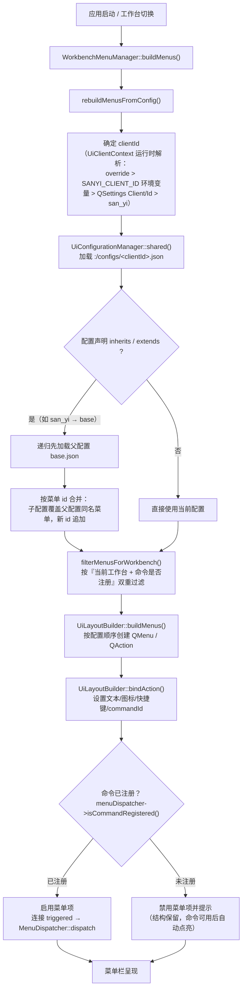
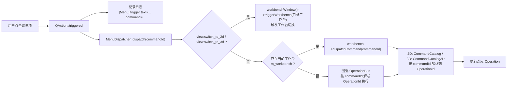

# 菜单架构定义

> **文档定位**：本文档是菜单体系的总纲，后续菜单设计、菜单实现、菜单定制与菜单迭代都以本文档为基准。
>
> **适用范围**：2D / 3D 主菜单、工具栏、快捷入口、工作台切换菜单、客户化菜单配置。
>
> **核心目标**：
> 1. 让菜单成为“所有功能的统一入口集合”。
> 2. 让 2D / 3D 菜单遵循同一套逻辑、同一套命令体系、同一套日志规范。
> 3. 让菜单支持配置化定制，而不是继续依赖大规模硬编码。
> 4. 让菜单与主框架的交互方式清晰、稳定、可扩展。

---

## 1. 菜单在系统中的定位

菜单不是业务实现层，也不是数据层，而是**应用级入口层**。

它的作用是把不同来源的能力整齐地组织起来，并把用户的操作稳定地转发到统一命令系统。

```text
用户点击菜单
    → 菜单项 / 子菜单 / 快捷键
    → CommandCatalog / CommandCatalog3D
    → 统一 action 工厂 (UiLayoutBuilder) / WorkbenchMenuManager
    → OperationBus::run(OperationId)
    → 具体业务服务 / 场景 / 文档 / 渲染刷新
```

### 1.1 菜单不负责什么

菜单不直接负责：

- 几何算法实现
- 场景对象修改
- 渲染后端处理
- 实体生命周期管理
- 文档保存细节
- 业务状态持久化细节

这些事情必须由主框架和业务层完成，菜单只负责触发。

### 1.2 菜单负责什么

菜单负责：

- 提供全局入口
- 承载低频但重要的功能
- 组织功能分类
- 提供功能发现能力
- 与工具栏、快捷键共享同一套命令 ID
- 支持工作台切换和客户化定制
- 记录命令点击日志，便于排查和审计
- 管理 `checkable` / `checked` 状态的呈现与同步

---

## 2. 当前菜单体系的框架组成

菜单体系由多个层协作完成：

### 2.1 命令目录层

命令目录定义“系统里有哪些功能”。

- 2D 使用 `UI/2D/Src/Operation/CommandCatalog.cpp`
- 3D 使用 `UI/3D/Src/Operation/CommandCatalog3D.cpp`

命令目录是菜单体系的**唯一命令事实来源**。菜单可以重排、分组、隐藏，但命令定义本身不能分裂成多套。

命令目录中通常包含：

- `operationId` — 映射到 OperationBus 的执行 ID
- `menuId` — MenuActionId 枚举值
- `text` — 显示文本
- `shortcutId` — 命令 ID 字符串（用于 dispatch）。**实际已是必填项**，见下方说明
- `iconResource` — 图标资源路径
- `surfaces` — 出现表面（Menu/Toolbar/Shortcut/ContextMenu）
- `enable rule` — 启用规则，取值见下方清单
- `toolName` — 绘图工具名（2D 专用）

#### shortcutId 为何是必填

`shortcutId` 名字上像"快捷键 id"，实际承担的是**命令字符串 id**这一角色，是 `CommandCatalog::menuIdForCommandId()` 的主要匹配依据：

```
menuIdForCommandId(cmd)
  1. cmd 以 "2d." 开头 → 返回 0，回退 OperationId 分发
  2. 查 precise[] 精确表（同一 OperationId 映射多个 MenuActionId 的命令，如 rotate_90cw / unit_*）
  3. 遍历 allCommands()，匹配 entry.shortcutId → 返回 entry.menuId    ← 主路径
  4. 兜底 operationForCommandId() → findByOperation() → entry->menuId
```

顶部工具栏的 `ToolBarAction::actionId` 也走这条解析链（见 `顶部工具栏架构定义.md`）。若条目缺 `shortcutId` 且未进 `precise[]`，解析可能落空，工具栏会退化为创建非托管 QAction，**该按钮的启用态从此不再随选择/锁定联动**。历史上 6 个对齐命令就因此长期失效。

因此：**新增命令必须填 `shortcutId`**，且不要在 `precise[]` 里重复登记已有 `shortcutId` 的条目（两处真值源会漂移）。回归测试 `CommandUiWiringTest.CatalogShortcutIdsResolveBackToOwnMenuId` 会校验「凡声明 shortcutId 的条目，反向解析必须回到自己的 menuId」。

#### 启用规则完整清单

规则声明在 `CommandEnable2D` / `CommandEnable3D`（取值与 `Cmd::CmdCond` 位掩码对齐），求值器只有一处：`Cmd::evaluateEnableRule()` / `Cmd::satisfy()`（`UI/Common/Include/UI/Command/CommandActionHubBase.h`）。

| 规则 | 判定条件 | 典型命令 |
|---|---|---|
| `Always` | 恒可用 | Select All、绘图工具 |
| `RequiresSelection` | `hasSelection` | Get Bounding Box、Export |
| `RequiresMultiSelection` | `selectionCount >= 2` | —（暂无单独使用） |
| `RequiresClipboard` | `hasClipboard` | Paste |
| `RequiresUndo` / `RequiresRedo` | `canUndo` / `canRedo` | Undo / Redo |
| `RequiresUnlockedSelection` | `hasSelection && !anyLocked()` | Delete、Cut、Copy、Move、Rotate、Mirror、Group |
| `RequiresUnlockedMultiSelection` | `selectionCount >= 2 && !anyLocked()` | **Align 六向**、Boolean |
| `Never` | 永不可用 | 占位 |

`anyLocked()` = 实体锁 `||` 图层锁，是锁定判定的唯一入口。新命令推荐直接使用可组合位掩码 `CmdCond`（`Cmd::RequiresUnlockedMultiSelection` 等组合常量），新增条件只需在 `CmdCond` 加一位 + 在 `satisfy()` 加一行。

规则层测试见 `UI/Common/Test/CommandKernelTests.cpp`。

### 2.2 菜单配置层

菜单配置层定义“这些功能怎么展示”。

它解决的是：

- 顶层菜单有哪些
- 菜单顺序如何
- 子菜单如何分组
- 图标如何显示
- 哪些工作台可见
- 哪些客户版本启用

当前代码使用 `UiConfigData / UiConfigLoader / UiLayoutBuilder / UiConfigurationManager` 完成菜单从硬编码到配置驱动的迁移。

### 2.3 菜单构建层

菜单构建层负责把配置变成 Qt 控件。

- `WorkbenchMenuManager`：主窗口菜单管理与工作台菜单刷新
- `UiLayoutBuilder`：通用菜单 / 工具栏 / Dock / 快捷键构建器，自动从 CommandCatalog 读取图标
- `UiConfigurationManager`：客户配置加载与回退

### 2.4 工作台控制层

工作台决定当前应该显示哪一套菜单。

- 2D 工作台显示 2D 菜单逻辑
- 3D 工作台显示 3D 菜单逻辑
- 切换工作台时，菜单重建
- 部分菜单项会因为工作台不同而显示 / 隐藏 / 禁用

### 2.5 业务执行层

菜单最终触发的是业务执行层：

- `OperationBus`
- 场景服务
- 文件服务
- 编辑服务
- 工艺服务
- 视图服务

菜单不直接写业务逻辑，只把命令送到业务系统。

---

## 3. 菜单的设计原则

### 3.1 命令来源唯一

菜单命令必须以命令目录为准。

> **原则：CommandCatalog / CommandCatalog3D 是命令的唯一来源。**

这样可以避免：

- 菜单写一套命令名
- 工具栏写另一套命令名
- 快捷键再写第三套命令名

### 3.2 菜单结构固定，内容可变

菜单顶层结构固定为：

- `File` — 文件生命周期
- `Edit` — 编辑操作
- `View` — 视图操作
- `Draw` — 绘图入口
- `Algorithm` — 算法入口
- `Laser` — 激光入口
- `Vision` — 视觉入口
- `Help` — 帮助 / 设置 / 主题 / 语言 / 关于

每个菜单内部的具体命令由命令目录、工作台、配置文件、客户版本共同决定。

### 3.3 菜单按语义归类

菜单不能按“写代码方便”来分，而必须按业务语义来分：

- 文件导入/导出放 `File`
- 变换、阵列、布尔、图层、分组放 `Edit`
- 缩放、平移、单位、网格、捕捉、工作台切换放 `View`
- 绘图、创建图元、草图与编辑入口放 `Draw`
- 填充、排样、偏移、浮雕、刀路生成放 `Algorithm`
- 连接、回原点、开始/暂停/停止、安全复位放 `Laser`
- 图像检测、识别、标定、增强放 `Vision`
- 文档、设置、主题、语言、关于放 `Help`

### 3.4 图标、日志、快捷键必须统一

如果一个命令在命令目录中配置了图标，就应该尽量在菜单中显示图标。

`UiLayoutBuilder::bindAction` 会优先从 JSON `iconName` 读取图标，如果 JSON 没有配置图标，则自动从 `CommandCatalog` 的 `iconResource` 字段回读，保证图标来源一致。

菜单点击统一日志格式：

```text
[Menu] trigger text='<菜单文本>' command='<commandId>'
```

建议至少记录：

- 菜单显示文本
- 命令 ID
- 工作台 ID
- 是否成功触发
- `checkable` / `checked` 状态变化

### 3.5 菜单与工具栏必须同源

菜单、工具栏、快捷键可以是不同入口，但必须使用同一套命令 ID 和同一套执行链。

> 菜单是主入口，工具栏是快捷入口，快捷键是高频入口，但三者不能互相独立维护。
> 2D 的绘图工具定义应从同一份元数据视图生成，避免 createToolbars 再拼装一遍。
---

## 4. 菜单实现方式

### 4.1 配置驱动优先

当前菜单系统**只有配置驱动一条路径**，硬编码仅作为「配置完全取不到」时的静态兜底：

```text
WorkbenchMenuManager::rebuildAllMenus()
    → rebuildMenusFromConfig()
        → UiClientContext::instance().clientId()          // 运行时解析客户 ID
        → UiConfigurationManager::shared()                // 进程级唯一配置源
            ├─ configData() != nullptr
            │     → UiLayoutBuilder::buildMenus() 生成菜单
            └─ configData() == nullptr（连 san_yi.json 都加载失败）
                  → SY_WARNF + buildLegacyMenus()（deprecated 静态兜底）
    → bindConfiguredMenuState() → bindMenuCommands()
    → workbench->refreshCommandUiState()                  // 重推命令 UI 快照
```

> **`SANYI_ENABLE_CONFIG_DRIVEN_UI` 宏已废弃**，代码中已无引用；
> `SANYI_CLIENT_ID` 编译期宏已废除，客户 ID 改为运行时解析。详见《UI定制.md》§3.1 / §4。
>
> 菜单重建后 `refreshCommandUiState()` 是必须的 —— 新建的 `QAction` 默认 `enabled=true`，
> 不重推快照会出现「无选中却能点删除/对齐」。

`WorkbenchMenuManager::rebuildAllMenus()` 始终优先走配置驱动路径，JSON 菜单树由 `base.json` / `san_yi.json` / `client_a.json` / `client_b.json` 等定义。

### 4.1.0 3D 菜单已并入同一路径

2026-08-25 起，3D 菜单不再由 `MenuManager3D` 及其 5 个 Menu 子类硬编码构建，
而与 2D 共用 `WorkbenchMenuManager` + JSON + `CommandCatalog3D`：

- `Workbench3D::managesOwnMenus()` 恒返回 `false`；
- 3D 专属菜单项通过 JSON 的 `workbenches: ["3D"]` 过滤；
- 3D 画布右键菜单来自 `contextMenus` 中 `id = "canvas.3d"` 的定义。


### 4.1.1 顶层菜单的配置归属（当前约定）

当前菜单体系已经把 **2D / 3D 的顶层功能入口** 清晰收敛到配置文件与同源命令目录中，约定如下：

- `File`：文件生命周期
- `Edit`：编辑操作
- `View`：视图操作、工作台切换、网格/捕捉/单位
- `Draw`：绘图与图元创建
- `Algorithm`：算法与刀路/加工类入口
- `Laser`：激光控制入口
- `Vision`：视觉/图像/识别入口
- `Help`：文档、设置、主题、语言、关于

> 注意：`Algorithm` 是**顶层菜单**，不能放入 `Tools`。
> `Laser`、`Vision` 也应保持顶层，不能再收敛回 `Tools`。
> `Theme` 归入 `Help`，作为帮助体系的一部分。

### 4.1.2 2D / 3D 一致性原则

- 2D / 3D 共享同一套菜单结构骨架：`File / Edit / View / Draw / Algorithm / Laser / Vision / Help`
- 2D / 3D 的区别只体现在具体命令项、可见性与工作台切换入口
- 切换工作台时要尽量只更新菜单内容，不残留旧工作台的菜单项 / 工具栏 / 面板状态

> 设计要求：不要把 `Draw`、`Algorithm`、`Laser`、`Vision` 收敛进 `Tools`，否则会破坏功能发现性与顶层分类一致性。

### 4.2 统一 action 工厂

`UiLayoutBuilder::bindAction` 负责生成 QAction 并完成以下统一处理：

- 设置文本（来自 JSON `label` 或 CommandCatalog `text`）
- 设置图标（优先 JSON `iconName`，其次 CommandCatalog `iconResource`）
- 设置快捷键（来自 JSON `shortcut` 或 `shortcuts` 数组）
- 记录日志 `[Menu] trigger text='...' command='...'`
- 绑定命令分发器 `IUiCommandDispatcher::dispatch(commandId)`
- 标记 `commandId` property 用于状态同步
- 命令未注册时自动禁用并显示提示

### 4.3 工作台菜单过滤

`WorkbenchMenuManager::filterMenusForWorkbench()` 按以下规则过滤菜单：

1. `workbenches` 字段匹配当前工作台
2. `visibilityScope` 匹配（shared / 2D / 3D）
3. 命令是否注册 (`isCommandRegistered`)

---

## 5. 2D 菜单逻辑

### 5.1 推荐分类

- `File`
- `Edit`
- `View`
- `Draw`
- `Algorithm`
- `Laser`
- `Vision`
- `Help`

2D 菜单的目标是：**覆盖 2D 场景下的软件全部功能入口**。

### 5.2 2D 的菜单组织原则

- 文件生命周期：新建、打开、保存、导入、导出、最近文件
- 绘图操作：点、线、圆、弧、矩形、多段线、样条、文本、二维码、位图
- 编辑操作：撤销、重做、复制、粘贴、删除、分组、布尔、偏移、阵列
- 视图操作：缩放、平移、单位、网格、捕捉、图层管理、工作台切换
- 算法操作：填充、排样、阵列、偏移、浮雕、刀路生成与导出
- 激光操作：连接、断开、回原点、试喷、开始、暂停、停止、材料库、工艺参数、安全复位、自检
- 视觉操作：图像/视频检测、增强、识别、标定
- 帮助操作：文档、快捷键、设置、主题、语言、关于
- 以上各类入口必须全部能从菜单中找到，不应只在工具栏或右键菜单中存在

### 5.3 2D 菜单树

> 说明：下列结构为 2D 的推荐顶层结构与功能目录，**实际运行时菜单以 `base.json` + 客户配置继承结果为准**。
> 当前默认客户 `san_yi.json` 仅覆盖工具栏 / Dock / 快捷键，不再覆盖 `menus`，因此 2D 运行时菜单顺序与下列结构一致。

```text
File
├─ New                     (file.new)
├─ Open                    (file.open)
├─ Save                    (file.save)
├─ Save As                 (file.save_as)
├─ Recent Files
│  └─ Open Recent          (file.open_recent)
├─ Import
│  ├─ All Supported...     (file.open)
│  ├─ DXF...               (file.import_dxf)
│  ├─ PLT...               (file.import_plt)
│  ├─ SVG...               (file.import_svg)
│  ├─ PDF...               (file.import_pdf)
│  ├─ AI...                (file.import_ai)
│  ├─ UG...                (file.import_ug)
│  ├─ Image...             (file.import_image)
│  └─ STEP...              (file.import_step)
├─ Export
│  ├─ DXF                  (file.export_dxf)
│  ├─ SVG                  (file.export_svg)
│  ├─ PLT                  (file.export_plt)
│  ├─ BMP                  (file.export_bmp)
│  └─ PNG                  (file.export_png)
└─ Exit                    (file.exit)

Edit
├─ Undo                    (edit.undo)
├─ Redo                    (edit.redo)
├─ Select All              (edit.select_all)
├─ Invert Selection        (edit.invert_selection)
├─ Clear Selection         (edit.deselect)
├─ Cut                     (edit.cut)
├─ Copy                    (edit.copy)
├─ Paste                   (edit.paste)
├─ Paste as Text           (edit.paste_text)
├─ Paste as Image          (edit.paste_image)
├─ Delete                  (edit.delete)
├─ Transform
│  ├─ Move                 (edit.move)
│  ├─ Rotate 90 CW         (edit.rotate_90cw)
│  ├─ Rotate 90 CCW        (edit.rotate_90ccw)
│  ├─ Rotate 180           (edit.rotate_180)
│  ├─ Mirror Horizontal   (edit.mirror_horizontal)
│  ├─ Mirror Vertical      (edit.mirror_vertical)
│  └─ Scale                (edit.scale)
├─ Align
│  ├─ Left                 (edit.align_left)
│  ├─ Right                (edit.align_right)
│  ├─ Center H             (edit.align_center_h)
│  ├─ Top                  (edit.align_top)
│  ├─ Bottom               (edit.align_bottom)
│  └─ Center V            (edit.align_center_v)├─ Group                   (edit.group)
├─ Ungroup                 (edit.ungroup)
├─ Path Operations
│  ├─ Offset               (edit.offset)
│  ├─ Union                (edit.boolean_union)
│  ├─ Intersection         (edit.boolean_intersection)
│  ├─ Difference           (edit.boolean_difference)
│  └─ Xor                  (edit.boolean_xor)
├─ Layer
│  ├─ Set Current Layer    (edit.set_current_layer)
│  ├─ Move to Layer        (edit.move_to_layer)
│  ├─ Get Bounding Box     (edit.get_bbox)
│  └─ Random Generate      (edit.random_generate)
├─ Array                   (edit.array)
└─ Test                    (edit.test)

View
├─ Switch to 3D            (view.switch_to_3d)
├─ Zoom
│  ├─ Zoom In             (view.zoom_in)
│  ├─ Zoom Out            (view.zoom_out)
│  ├─ Zoom to Fit         (view.zoom_fit)
│  ├─ Zoom to Selection   (view.zoom_selection)
│  └─ Reset View          (view.reset)
├─ Pan                     (view.pan)
├─ Unit
│  ├─ mm                  (view.unit_mm)
│  ├─ cm                  (view.unit_cm)
│  └─ inch                (view.unit_inch)
├─ Grid && Snap
│  ├─ Show Grid           (view.grid_visible)
│  ├─ Enable Snap         (view.snap_enabled)
│  ├─ Ortho Mode          (view.ortho_mode)
│  └─ Angle Snap          (view.angle_snap)
├─ Layer Manager            (view.layer_manager)
├─ Layer
│  ├─ New Layer            (view.new_layer)
│  └─ Delete Layer         (view.delete_layer)
└─ 

Draw
├─ Select                  (tool.select)
├─ Point                   (tool.point)
├─ Line                    (tool.line)
├─ Polyline                (tool.polyline)
├─ Polygon                 (tool.polygon)
├─ Smart Line              (tool.smartline)
├─ Circle                  (tool.circle)
├─ Arc                     (tool.arc)
├─ Ellipse                 (tool.ellipse)
├─ Rectangle               (tool.rectangle)
├─ Triangle                (tool.triangle)
├─ Quadratic Bezier        (tool.bezier2)
├─ Cubic Bezier            (tool.bezier)
├─ Spline                  (tool.spline)
├─ Nurbs                   (tool.nurbs)
├─ Text                    (tool.text)
├─ Bitmap                  (tool.bitmap)
└─ QR Code                 (tool.qrcode)

Algorithm
├─ Fill                    (algo.fill)
├─ Nesting                 (algo.nesting)
├─ Array                   (algo.array)
├─ Offset                  (algo.offset)
├─ Relief Engraving        (algo.relief_engraving)
├─ Nesting from Mesh       (algo.nesting_from_mesh)
├─ Generate Toolpath       (process.generate_relief_toolpath)
├─ Export Toolpath         (process.export_relief_toolpath)
└─ Send to Laser           (process.send_relief_to_laser)

Laser
├─ Connect                 (laser.connect)
├─ Disconnect              (laser.disconnect)
├─ Home                    (laser.home)
├─ Test Fire               (laser.test_fire)
├─ Start Process           (laser.start_process)
├─ Pause Process           (laser.pause_process)
├─ Stop Process            (laser.stop_process)
├─ Material Database       (laser.material_db)
├─ Process Parameters      (laser.process_params)
├─ Emergency Stop          (laser.emergency_stop)
├─ Reset Safety            (laser.reset_safety)
└─ Self Check              (laser.self_check)

Vision
├─ Test Shape Detect       (vision.test_shape_detect)
├─ Test Barcode            (vision.test_barcode)
├─ Test Perspective        (vision.test_perspective)
├─ Test Enhance            (vision.test_enhance)
├─ Test Denoise            (vision.test_denoise)
├─ Test Sharpen            (vision.test_sharpen)
├─ Test Video Capture      (vision.test_video_capture)
├─ Test Camera Calibration (vision.test_camera_calibration)
├─ Test Image Stitch       (vision.test_image_stitch)
├─ Test Feature Match      (vision.test_feature_match)
└─ Test Face Recognition   (vision.test_face_recognition)

Help
├─ Documentation            (help.docs)
├─ Keyboard Shortcuts       (help.shortcuts)
├─ Settings                 (help.settings)
├─ Theme
│  ├─ System
│  ├─ Light
│  ├─ Dark
│  └─ Blue
├─ Language
│  ├─ English
│  ├─ 简体中文
│  ├─ 繁體中文
│  ├─ 日本語
│  ├─ 한국어
│  ├─ Français
│  ├─ Deutsch
│  ├─ Español
│  ├─ Português
│  ├─ Русский
│  ├─ العربية
│  ├─ Italiano
│  ├─ हिन्दी
│  ├─ Türkçe
│  └─ Tiếng Việt
└─ About                    (help.about)

```

### 5.4 2D 与工具栏的关系

2D 菜单和 2D 工具栏不能各做一套。

- 菜单负责完整入口
- 工具栏负责高频快捷入口
- 两者都必须引用同一个命令 ID
- 2D 的绘图工具定义应直接复用命令目录元数据，不再各自维护一份列表

### 5.5 2D 的定制空间

2D 菜单支持定制：

- 菜单项显隐
- 顶层菜单显隐
- 菜单排序
- 菜单图标
- 菜单标题
- 工作台范围
- 客户行业专属功能

---

## 6. 3D 菜单逻辑

### 6.1 推荐分类

- `File`
- `Edit`
- `View`
- `Draw`
- `Algorithm`
- `Laser`
- `Vision`
- `Help`

3D 菜单的目标是：**保持与 2D 同样的顶层结构逻辑，但内容以 3D 命令为准**。

顶层分类由 `base.json` 的 `menus` 顺序唯一决定，2D / 3D 共享同一份定义；
差异只由每个条目的 `workbenches` 字段与命令目录注册情况产生，代码里不存在第二套顶层分类。

### 6.2 3D 的菜单组织原则

- 文件生命周期：导入、导出、保存、打开、最近文件
- 编辑操作：选择、删除、变换、组装、编辑辅助
- 视图操作：相机、旋转、平移、重置、显示模式
- 绘图入口：3D 场景编辑 / 选择 / 建模入口（基本体、布尔、剖切）
- 算法操作：3D 算法、行业模块、扩展功能
- 激光操作：与 3D 相关的加工/输出入口
- 视觉操作：与 3D 相关的视觉处理入口
- 帮助操作：文档、设置、主题、语言、关于、快捷键

> `Draw` 在 2D 下是绘图工具入口，在 3D 下是建模入口 —— 同一个顶层分类，
> 内容由 `workbenches` 切换，不新增 `Tools` / `Model` 之类只在单侧存在的顶层菜单。

### 6.3 3D 菜单树

> 说明：以下是 `base.json` 过滤到 3D 后的**实际**菜单树；条目能否出现取决于命令是否在
> `CommandCatalog3D` 注册。
> 约定：2D / 3D 下，导入 / 导出只支持各自格式；`Open` 只能打开各自原生文档（2D 仅 `.sy`，3D 仅 `.sy3d / .syx`）。
```text
File
├─ New                     (file.new_scene)
├─ Open                    (file.open)   ← 仅 *.sy3d / *.syx
├─ Save                    (file.save)
├─ Save As                 (file.save_as)
├─ Import
│  ├─ All Supported...     (file.import_model)
│  ├─ STEP...              (file.import_step)
│  ├─ OBJ...               (file.import_obj)
│  └─ STL...               (file.import_stl)
├─ Export
│  ├─ OBJ                 (file.export_obj)
│  ├─ STL                 (file.export_stl)
│  └─ STEP                (file.export_step)
└─ Exit                    (file.exit)

Edit
├─ Undo                    (edit.undo)
├─ Redo                    (edit.redo)
├─ Select All              (edit.select_all)
├─ Invert Selection        (edit.invert_selection)
├─ Clear Selection         (edit.clear_selection)
├─ Delete                  (edit.delete)
└─ Transform
   ├─ Translate            (edit.transform_translate)
   ├─ Rotate               (edit.transform_rotate)
   ├─ Scale                (edit.transform_scale)
   └─ Mirror               (edit.mirror)

View
├─ Zoom
│  └─ Reset View          (view.reset)
├─ Camera
│  ├─ Fit All              (view.fit_all)
│  ├─ Front                (view.front)
│  ├─ Back                 (view.back)
│  ├─ Left                 (view.left)
│  ├─ Right                (view.right)
│  ├─ Top                  (view.top)
│  ├─ Bottom               (view.bottom)
│  ├─ Isometric            (view.isometric)
│  ├─ Dimetric             (view.dimetric)
│  └─ Trimetric            (view.trimetric)
├─ Display
│  ├─ Wireframe            (view.wireframe)
│  ├─ Show Grid            (view.grid)
│  ├─ Show Bounding Box    (view.bbox)
│  └─ Show Floor           (view.floor)
└─ Switch to 2D            (view.switch_to_2d)

Draw   ← 3D 下为建模入口（ENABLE_GEOMODELCORE 关闭时整菜单消失）
├─ Box                     (model.make_box)
├─ Sphere                  (model.make_sphere)
├─ Cylinder                (model.make_cylinder)
├─ Boolean
│  ├─ Fuse                 (model.boolean_fuse)
│  └─ Cut                  (model.boolean_cut)
└─ Split
   ├─ Half by X            (model.split_half_x)
   ├─ Half by Y            (model.split_half_y)
   ├─ Half by Z            (model.split_half_z)
   └─ By Picked Plane      (model.split_by_pick_plane)

Algorithm
├─ Relief Engraving        (algo.relief_engraving)
├─ Nesting from Mesh       (algo.nesting_from_mesh)
├─ Generate Relief Toolpath (process.generate_relief_toolpath)
├─ Export Relief Toolpath   (process.export_relief_toolpath)
└─ Send Relief to Laser     (process.send_relief_to_laser)

Laser
├─ Connect                 (laser.connect)
├─ Disconnect              (laser.disconnect)
├─ Home                    (laser.home)
├─ Test Fire               (laser.test_fire)
├─ Start Process           (laser.start_process)
├─ Pause Process           (laser.pause_process)
├─ Stop Process            (laser.stop_process)
├─ Material Database       (laser.material_db)
├─ Process Parameters      (laser.process_params)
├─ Emergency Stop          (laser.emergency_stop)
├─ Reset Safety            (laser.reset_safety)
└─ Self Check              (laser.self_check)

Vision
├─ Shape Detect            (vision.test_shape_detect)
├─ Barcode                 (vision.test_barcode)
├─ Perspective             (vision.test_perspective)
├─ Enhance                 (vision.test_enhance)
├─ Denoise                 (vision.test_denoise)
├─ Sharpen                 (vision.test_sharpen)
├─ Video Capture           (vision.test_video_capture)
├─ Camera Calibration      (vision.test_camera_calibration)
├─ Image Stitch            (vision.test_image_stitch)
├─ Feature Match           (vision.test_feature_match)
└─ Face Recognition        (vision.test_face_recognition)

Help
├─ Documentation           (help.docs)
├─ Keyboard Shortcuts      (help.shortcuts)
├─ Settings                (help.settings)
├─ Theme                   (theme.system / light / dark / blue)
├─ Language                (language.* 15 项)
└─ About                   (help.about)
```

> 已知空缺（命令目录尚未注册，JSON 里刻意不写，避免出现永久灰掉的入口）：
> 3D 侧的 `view.zoom_in / zoom_out / zoom_fit`、`edit.group / ungroup`、`file.export_pdf / export_png`。
> 反向的 `laser.connect` / `vision.*` 只在 3D 目录注册，因此 2D 下 Vision 整菜单不出现 ——
> 这不是两套菜单，而是同一份配置被命令目录裁剪的结果。


### 6.4 3D 与 2D 的一致性要求

2D / 3D 之间必须保持：

- 顶层分类一致 (File / Edit / View / Draw / Algorithm / Laser / Vision / Help)
- 菜单构建方式一致 (UiLayoutBuilder)
- 图标策略一致 (自动从 CommandCatalog 读取)
- 日志策略一致 (`[Menu] trigger text='...' command='...'`)
- 命令执行链一致 (OperationBus)
- 导入入口一致：都提供“所有支持格式”汇总入口，而不是让用户先猜格式
- UI 语义一致：工作台切换时清理残留的菜单/工具栏/面板来源标记

差异只应体现在：

- 命令目录不同
- 工作台可见性不同
- 部分菜单项不同

### 6.5 3D 的定制空间

3D 菜单后续也要支持：

- 仅显示部分菜单项
- 隐藏行业模块
- 替换图标
- 定制子菜单结构
- 按客户版本启用 / 禁用功能

---

## 7. 菜单定制开发的实现路径

菜单定制不是直接在 `WorkbenchMenuManager` 里继续加硬编码，而是应该按以下路径实施：

### 7.1 第一步：统一命令目录

先把 2D / 3D 需要的命令统一整理出来。

要求：

- 命令 ID 统一
- 图标资源统一
- 工作台可见性统一
- 能否显示到菜单统一
- 导入格式入口统一成“所有支持格式”级别，而不是按 DXF / PLT / SVG 等碎片化菜单拆分

### 7.2 第二步：统一菜单 schema

把菜单从代码抽离成 JSON 配置。

要求：

- 顶层菜单稳定 (File / Edit / View / Draw / Algorithm / Laser / Vision / Help)
- 子菜单按业务语义组织
- 每个菜单项能绑定 `commandId`
- 支持 `visible`、`workbenches`、`icon`、`shortcut`、`checkable`
- 支持 `action`、`separator`、`submenu`
- 导入相关入口应以“支持格式聚合”方式呈现，避免用户在菜单里寻找特定格式

> 注意：2D / 3D 共享同一套顶层分类骨架；差异只体现在可见性和具体命令项，不应再回到按格式拆散的菜单组织方式。

### 7.3 第三步：统一 action 工厂

由 `UiLayoutBuilder::bindAction` 负责生成动作并接线。

要求：

- 设置文本
- 设置图标 (自动从 CommandCatalog 回读)
- 设置快捷键
- 记录日志
- 绑定 `OperationBus`
- 标记工作台信息

### 7.4 第四步：由工作台控制显示范围

2D / 3D 由工作台决定当前应展示哪些菜单项。

要求：

- 2D 只显示 2D 菜单项
- 3D 只显示 3D 菜单项
- 共用项保持一致
- 切换工作台时重建菜单
- 2D 的左侧绘图栏和菜单导入入口必须同源，不允许分别维护

判定只有三条，`WorkbenchMenuManager::filterMenusForWorkbench` 之外不允许再加第四条：

1. 条目的 `workbenches` 字段
2. 条目的 `visibilityScope`
3. 命令是否在当前工作台命令目录注册（窗口级命令 —— 工作台切换 / 主题 / 语言 / About —— 直接放行）

**不得按命令 ID 前缀做白名单**。历史实现曾在 3D 下只放行 `view. / edit. / tool. / model. / process. / algo. / file. / help. / theme.`，
结果 `laser.*`、`vision.*` 这些已在 `CommandCatalog3D` 注册的行业模块被静默吞掉，
JSON 配置无论怎么写都出不来 —— 这直接违背"配置驱动"的前提。

过滤会把条目删掉，但 JSON 里的分隔符是按"全部条目都在"排版的，因此过滤后必须归一化分隔符
（去掉首尾与连续的空分隔线），否则 3D 菜单会出现开头就是分隔线、或成片空分隔线的排版。
这一步同样在 `filterMenusForWorkbench` 里做，构建层（`UiLayoutBuilder`）不参与。


### 7.5 第五步：支持客户配置

最终要支持按客户版本配置菜单。

要求：

- 不同客户可以有不同菜单树 (base.json / san_yi.json / client_a.json)
- 不同客户可以有不同图标包
- 不同客户可以隐藏/启用不同命令
- 不同客户可以调整菜单顺序

---

## 8. 菜单加载与点击流程

> 目标：菜单结构由 JSON 配置驱动（默认加载 `san_yi.json`，继承 `base.json`），
> 代码中不存在独立维护的菜单树。以下两张图为实际运行链路。

### 8.1 菜单加载流程



```text
关键点
1. 菜单的“顺序 / 分组 / 文案”全部来自 JSON 配置，代码不重建菜单树。
2. 顶层菜单顺序即 base.json menus 数组顺序：File → Edit → View → Draw → Algorithm → Laser → Vision → Help。
3. client 配置（san_yi.json）默认不再覆盖 menus，因此运行时即 base 的文档结构；
   若某个客户需要定制，可通过自己的 menus 数组按 id 覆盖。
4. 命令未注册的菜单项仍会保留在菜单上（禁用态），避免结构与文档漂移。
```

### 8.2 菜单点击逻辑



```text
关键点
1. 所有菜单项（含工具栏、快捷键）共用同一条命令分发链，保证行为一致。
2. 工作台切换命令是窗口级动作，在分发器处单独放行，不进入命令总线。
3. 未被命令目录识别的 commandId 不会执行，只有已注册命令可被触发。
```

---

## 9. 工作流程（菜单 → 命令 → 业务）

> 本节描述从“用户看到菜单”到“业务真正执行”的完整工作流，以及 2D / 3D 各自文件导入导出的内部流程。

### 9.1 菜单项触发工作流

```text
用户点击菜单项
  → QAction::triggered
  → UiLayoutBuilder 绑定的 lambda
      → logMenuTrigger(text, commandId)              // 统一菜单触发日志
      → MenuDispatcher::dispatch(commandId)           // 窗口级分发
          ├─ view.switch_to_2d / view.switch_to_3d    // 工作台切换命令，窗口级放行
          └─ 其它 → workbench->dispatchCommand(commandId)
              → CommandCatalog / CommandCatalog3D      // commandId → OperationId
              → OperationBus::run(OperationId)         // 执行
              → 业务服务 / 场景 / 文档 / 渲染刷新
```

### 9.2 文件导入工作流（2D）

```text
File ▸ Import ▸ DXF...  (file.import_dxf)
  → CommandCatalog: file.import_dxf → OperationId::File_ImportDXF
  → OperationBus::run(File_ImportDXF)
  → FileOperationRegistry::doImportByFormat(Fio::FileFormat::DXF)
      → FileDialogService::getOpenFileName(importFilterForFormat(DXF))
      → ImportService::importWithContext(context, opts)
          → ImportDispatcher 按格式路由
          → ImportService 业务编排（解析 → 建实体 → 落库）
      → 渲染刷新 + 状态栏更新
```

### 9.3 文件导入工作流（3D）

```text
File ▸ Import ▸ OBJ...  (file.import_obj)
  → CommandCatalog3D: file.import_obj → OperationId3D::File_ImportOBJ
  → OperationBus3D::run(File_ImportOBJ)
  → FileOperations3D::registerAll 注册的 lambda
      → importModelWithFilter(ctx, false, path, "obj")
          → QFileDialog（All Supported 前置 + OBJ 过滤）
          → importModel(ctx, false, path)
              → ObjLoader::load / StlLoader::load / STEP(GeoModelCore)
              → sceneManager->addEntity()
              → pushSceneUndo（撤销栈）
              → renderWidget->markSceneDirty() + fitAll()
```

### 9.4 工作台切换工作流

```text
View ▸ Switch to 3D / 2D  (view.switch_to_3d / view.switch_to_2d)
  → MenuDispatcher 识别工作台切换命令（窗口级）
  → WorkbenchWindow::triggerWorkbench(目标)
  → 旧 Workbench::deactivate()      // 断信号、释放 SceneMonitor、复位工具栏上下文
  → clearWorkbenchContent()         // 卸载旧状态栏 / Dock / 菜单来源标记
  → 目标 Workbench::attachToWindow()
  → m_menuManager->setWorkbench(m_workbench)   // 步骤 6b：菜单管理器必须跟着换
  → restoreLayoutSnapshot() → activate()
  → rebuildAllMenus(wbId)
      → rebuildMenusFromConfig()    // 按新工作台过滤菜单
      → m_workbench->refreshCommandUiState()   // 新建 QAction 默认 enabled=true，需即刻校正
```

步骤 6b 不可省。`WorkbenchMenuManager::m_workbench` 原先只在 bootstrap 注入，切换后仍指向上一个工作台，导致：菜单点击派发到旧工作台的操作总线；`commandAvailable` 用旧目录判定新命令（3D 独有项被判未注册）；`filterMenusForWorkbench` 的 `workbenchKind` 过滤方向相反。详见《命令与状态流.md》6.4。

---

## 10. 核心数据流

> 本节描述菜单体系中最核心的三条数据流：配置加载、命令执行、状态回流。

### 10.1 配置加载数据流

```text
clientId（运行时解析：override > SANYI_CLIENT_ID 环境变量 > QSettings Client/Id > san_yi）
  → UiClientContext::configResourcePath()   // 资源不存在则 WARN 并回退 san_yi.json
  → UiConfigurationManager::shared()（ConfigFallbackPolicy::Fallback）
      → UiConfigLoader::loadWithInheritance(path)
          → 解析 JSON
          → 若声明 extends → 递归加载父配置（如 san_yi → base）
          → mergeConfig：同 id 覆盖、新 id 追加、未声明字段继承父
                         statusBar 整段替换、contextMenus 同 id 替换 / 新 id 追加
  → UiConfigData（menus / toolbars / docks / shortcuts / statusBar / contextMenus）
  → 菜单：WorkbenchMenuManager::rebuildMenusFromConfig()
      → filterMenusForWorkbench(当前工作台 + 命令是否注册)
      → UiFeatureGate::isAllowed(feature) 过滤未授权项（不创建）
      → UiLayoutBuilder::buildMenus() → QMenu / QAction
  → 工具栏 / Dock / 状态栏：WorkbenchLayoutManager
  → 右键菜单：Workbench2D/3D::buildConfiguredContextMenu()
```

### 10.2 命令执行数据流

```text
commandId（菜单 / 工具栏 / 快捷键 / 右键 / Gizmo / 插件）
  → CommandCatalog(2D) / CommandCatalog3D(3D)     // 唯一命令事实来源
  → OperationId（Cmd::OperationId 统一枚举，2D/3D 共用）
  → OperationBus::run(OperationId, params, source)
  → LambdaOperation / ParamLambdaOperation
  → 业务服务（ImportService / ExportService / SceneEditService / ...）
  → 撤销栈 / 场景 / 渲染刷新
```

### 10.3 状态回流数据流

```text
业务执行 / 场景变更 / 选择变化 / 工具切换
  → UiStateCenter / 文档信号
  → 状态栏（坐标 / 选择数 / 加工状态）
  → 属性面板（选中图元属性）
  → 场景树（节点刷新）
  → 视口刷新
```

---

## 11. 关键设计要点

1. **命令来源唯一**：`CommandCatalog / CommandCatalog3D` 是命令的唯一事实来源，菜单 / 工具栏 / 快捷键 / 右键 / Gizmo 全部引用同一套 commandId。
2. **配置驱动优先**：菜单结构由 JSON 配置驱动（base.json 为公共基线，客户配置 extends 继承），硬编码仅作为失败回退（已标记 deprecated）。
3. **工作台过滤**：`filterMenusForWorkbench()` 按「当前工作台 + 命令是否注册」双重过滤，2D / 3D 只显示各自菜单项。
4. **格式聚合入口**：每个工作台的 Import 提供「All Supported...」聚合入口 + 独立格式项；All Supported 只是各格式文件的集合，用户无需先猜格式。
5. **原生格式隔离**：2D `Open` 仅允许 `.sy`，3D `Open` 仅允许 `.sy3d / .syx`；其它格式一律走 Import。
6. **未注册命令降级**：命令未注册的菜单项保留在菜单上（禁用态）并提示，命令可用后自动点亮，避免结构与文档漂移。
7. **统一日志**：菜单点击统一 `[Menu] trigger text='...' command='...'`，便于排查与审计。
8. **2D / 3D 一致性**：同一套顶层分类骨架（File / Edit / View / Draw / Algorithm / Laser / Vision / Help）、同一套 schema、图标策略、日志策略、执行链。

---

## 12. 命令目录与相关文件

### 12.1 2D 命令目录（CommandCatalog.cpp）

| commandId | OperationId | 说明 |
|---|---|---|
| file.new | File_New | 新建 |
| file.open | File_Open | 打开（仅 .sy） |
| file.save / file.save_as | File_Save / File_SaveAs | 保存 / 另存为 |
| file.open_recent | File_OpenRecent | 最近文件 |
| file.import_dxf | File_ImportDXF | 导入 DXF |
| file.import_plt | File_ImportPLT | 导入 PLT |
| file.import_step | File_ImportStep | 导入 STEP |
| file.import_ug | File_ImportUG | 导入 UG |
| file.import_svg | File_ImportSVG | 导入 SVG |
| file.import_pdf | File_ImportPDF | 导入 PDF |
| file.import_ai | File_ImportAI | 导入 AI |
| file.import_image | File_ImportImage | 导入图片 |
| file.export_dxf | File_ExportDXF | 导出 DXF |
| file.export_svg | File_ExportSVG | 导出 SVG |
| file.export_plt | File_ExportPLT | 导出 PLT |
| file.export_bmp | File_ExportBMP | 导出 BMP |
| file.export_png | File_ExportPNG | 导出 PNG |

### 12.2 3D 命令目录（CommandCatalog3D.cpp）

| commandId | OperationId3D | 说明 |
|---|---|---|
| file.new_scene | File_NewScene | 新建场景 |
| file.open | File_Open | 打开（仅 .sy3d / .syx） |
| file.save / file.save_as | File_Save / File_SaveAs | 保存 / 另存为 |
| file.import_model | File_ImportModel | 导入模型（All Supported） |
| file.import_obj | File_ImportOBJ | 导入 OBJ |
| file.import_stl | File_ImportSTL | 导入 STL |
| file.import_step | File_ImportSTEP | 导入 STEP（需 GeoModelCore） |
| file.open_step | File_OpenStep | 打开 STEP（需 GeoModelCore） |
| file.exit | File_Exit | 退出 |

> ⚠️ 已知缺口：3D 导出命令（file.export_obj / file.export_stl / file.export_step / file.export_pdf / file.export_png）当前 **未注册** 到 CommandCatalog3D 与 FileOperations3D，base.json 中对应菜单项会以禁用态呈现。需补充 OperationId + 命令映射 + 处理器（对接 3D 网格导出）后方可启用。

### 12.3 文件操作注册

- **2D**：`Main/Src/Composition/FileOperationRegistry.cpp` — 通过 `registerFromFormatMap` 按格式映射批量注册导入（DXF/SVG/PLT/STEP/PDF/AI/UG）与导出（DXF/SVG/PLT/BMP/PNG），统一走 `doImportByFormat` / `doExportByFormat`。
- **3D**：`UI/3D/Src/Operation/FileOperations3D.cpp` — 在 `OperationSetup3D::initialize` 中经 `FileOperations3D::registerAll(*bus)` 注册导入 / 保存 / 打开操作。

### 12.4 相关文件清单

（保留原第 13 节相关文件清单，并补充下列文件）

- `Main/Src/Composition/FileOperationRegistry.cpp` — 2D 文件操作注册
- `UI/3D/Src/Operation/FileOperations3D.cpp` — 3D 文件操作注册
- `UI/3D/Src/Operation/OperationSetup3D.cpp` — 3D 操作系统初始化
- `UI/Common/Include/UI/Command/OperationId.h` — 统一 OperationId 枚举（2D/3D 共用）
- `UI/2D/Include/UI2D/Operation/OperationBus.h` — 2D 命令总线
- `UI/3D/Include/UI3D/Operation/OperationBus3D.h` — 3D 命令总线
- `Main/Src/Import/ImportService.h/.cpp` — 导入服务
- `Main/Src/Export/ExportService.h/.cpp` — 导出服务
- `Main/Src/UI/ClientConfig/UiConfigLoader.cpp` — JSON 配置加载与继承合并

---

## 13. 相关文件

- `Main/Src/UI/Workbench/WorkbenchMenuManager.cpp` — 菜单管理器，负责菜单重建、工作台切换、状态同步
- `Main/Src/UI/Workbench/WorkbenchMenuManager.h` — 菜单管理器头文件
- `Main/Src/UI/ClientConfig/UiLayoutBuilder.h/.cpp` — 菜单/工具栏/Dock 构建器
- `Main/Src/UI/ClientConfig/UiConfigurationManager.h/.cpp` — 客户配置加载与回退
- `Main/Src/UI/ClientConfig/UiClientConfigBase.h` — 配置数据结构定义 (MenuDef/ToolBarDef/DockDef/ShortcutDef)
- `Main/Src/UI/ClientConfig/configs/base.json` — 基础菜单配置 (所有客户端继承)
- `Main/Src/UI/ClientConfig/configs/san_yi.json` — 三义标准版配置（默认运行时加载；不再覆盖 menus，仅覆盖工具栏/Dock/快捷键）
- `Main/Src/UI/ClientConfig/configs/client_a.json` — 客户 A 精简版菜单配置 (演示定制)
- `UI/2D/Src/Operation/CommandCatalog.cpp` — 2D 命令目录
- `UI/3D/Src/Operation/CommandCatalog3D.cpp` — 3D 命令目录
- `UI/3D/Include/UI3D/Menu/MenuActionId3D.h` — 3D 菜单动作 ID 枚举

---

## 14. 当前状态

- ✅ 菜单逻辑已经迁移到配置化 (base.json / san_yi.json / client_a.json)
- ✅ 运行时默认菜单结构（File / Edit / View / Draw / Algorithm / Laser / Vision / Help）与《菜单架构.md》5.3 / 6.3 对齐
- ✅ san_yi.json 不再覆盖 menus，运行时直接采用 base.json 的文档结构；客户定制仅覆盖差异项
- ✅ 语言选项（English / 简体中文 / 繁體中文）与主题选项（System / Light / Dark / Blue）位于 Help 菜单
- ✅ File → Import 采用「All Supported... 聚合入口 + 独立格式项」结构：2D 显示 DXF / PLT / SVG / PDF / AI / UG / Image / STEP，3D 显示 OBJ / STL / STEP；All Supported 只是各格式文件的集合
- ✅ File → Export 按工作台隔离：2D 仅 DXF / SVG / PLT / BMP / PNG，3D 仅 OBJ / STL / STEP / PDF / PNG
- ✅ Open 只打开各自原生文档：2D 仅 `.sy`，3D 仅 `.sy3d / .syx`
- ✅ 图标自动从 CommandCatalog 读取 (UiLayoutBuilder::bindAction)
- ✅ 菜单点击统一日志 (`[Menu] trigger text='...' command='...'`)
- ✅ 2D / 3D 菜单逻辑遵循同一套 schema
- ✅ 工作台切换时菜单重建 (filterMenusForWorkbench)
- ✅ 硬编码路径已标记 deprecated，仅作为 config 失败回退
- ✅ 工具栏从 CommandCatalog 填充，与菜单/快捷键同源
- ✅ 顶部工具栏 actionId 经 `CommandCatalog::menuIdForCommandId()` 解析，命名空间与菜单 commandId 统一（`edit.align_left` 而非 `Edit_AlignLeft`）；`TopToolBar` 的手写 `actionIdToMenuActionId` 映射表（76 行）已删除
- ✅ 按钮启用态由命令 UI 快照统一驱动（`UiStateBridge2D` → `refreshCommandUiState()`）：顶部工具栏复用 Hub 托管的同一批 QAction；菜单栏与配置化右键菜单走 `CommandActionHub::applySnapshotToAction/applySnapshotToMenu` 外挂应用同一份规则
- ✅ Laser / Vision 命令已补齐到 CommandCatalog3D
- ✅ 2D 下通过 `ensureWorkbenchCompatibilityMenus()` 对 `Draw` / `View` 做最小兼容补齐，配置驱动仍为主路径
- ⚠️ 3D 导出命令（file.export_obj / file.export_stl / file.export_step / file.export_pdf / file.export_png）尚未注册处理器，菜单项当前为禁用态（见 12.2 已知缺口）
- ✅ **菜单栏启用态已接入统一快照**（2026-08-25）：`WorkbenchMenuManager::refreshCommandStates(snapshot)` 按 `property("commandId")` → `CommandCatalog::menuIdForCommandId()` → `findByMenuId()` → `enableRule` → `Cmd::evaluateEnableRule()` 刷新，规则来源与顶部工具栏/右键菜单同一处；`forEachCommandAction()` 同时覆盖 config-driven 与 legacy 两条构建路径。跳过 `commandUnavailable`（构建期永久禁用）与规则为 `Always` 的条目。`rebuildAllMenus()` 结尾回调 `m_workbench->refreshCommandUiState()`，保证重建后的新 QAction 立即拿到正确启用态
- ✅ **配置化右键菜单启用态已接入**（2026-08-25）：`Workbench2D::onViewportContextMenu()` 在 `exec()` 前调 `CommandActionHub::applySnapshotToMenu()`。此前 `base.json` 定义了 `contextMenus["canvas.2d"]` 时配置分支恒命中，右键的 Cut / Copy / Delete / Paste 完全不受选择/锁定约束
- ✅ 切换类命令（Group / Bezier）的 on/off 与启用语义抽成 `resolveToggleUiState()`，中枢托管动作与外部动作共用，菜单栏的 Group 项不再恒可点
- ✅ 窗口级 Undo/Redo 快捷键动作（`bindShortcuts()` 建、不进菜单）也打了 `commandId` 并纳入 `forEachCommandAction()` 遍历，无历史时真正禁用而非触发后空转
- ✅ **工作台切换时菜单管理器指针已同步**（2026-08-25）：`triggerWorkbench` 步骤 6b 调 `m_menuManager->setWorkbench(m_workbench)`。此前 `m_workbench` 停在 bootstrap 注入的工作台上，3D 下点菜单会派发到 2D 操作总线，且 3D 独有项被 `isCommandRegistered` 判为未注册
- ✅ **3D 配置化菜单栏启用态已接入**（2026-08-25）：`CommandActionHub3D::applySnapshotToAction/applySnapshotToMenu` + `WorkbenchMenuManager::refreshCommandStates3D(snapshot)`，扇出源为新增信号 `CommandActionHub3D::commandUiSnapshotRefreshed`。与 2D 侧结构对等、共用 `Cmd::evaluateEnableRule`；两侧靠"各自目录解析不到对侧 id"实现隔离（`CommandUiWiringTests.cpp` 的 `Switch_*` 用例锁定）

---

## 15. 开发步骤

### 第 0 步：明确范围

先确认本轮要做的是：

- 只做 2D / 只做 3D / 2D + 3D 一起做
- 只做菜单 / 菜单 + 工具栏一起做

### 第 1 步：盘点命令目录

先把命令目录盘清楚：

- 哪些命令已有
- 哪些命令缺失
- 哪些命令只在工具栏出现
- 哪些命令应补入菜单

### 第 2 步：整理最终菜单目录表

把命令 ID 映射到菜单位置。

要求：

- 2D 一张表
- 3D 一张表
- 顶层分类一致
- 冲突项先统一语义再落位

### 第 3 步：定义菜单配置 JSON

把最终菜单目录表转成配置文件。

要求：

- 结构清晰 (base.json 为基础)
- 支持嵌套子菜单
- 支持图标和可见性
- 支持工作台范围

### 第 4 步：接入统一构建器

让 `UiLayoutBuilder` 负责真正生成菜单项。

要求：

- 菜单、工具栏、快捷键同源
- 缺失命令自动禁用或告警
- 图标和日志统一处理

### 第 5 步：让菜单管理器读取配置

`WorkbenchMenuManager` 以配置为主、兼容逻辑为辅。

要求：

- 新路径优先
- 兼容路径可回退
- 2D / 3D 切换一致
- 2D 下通过 `ensureWorkbenchCompatibilityMenus()` 补齐 `Draw` / `View` 最小入口，而不是整套回退 legacy

### 第 6 步：补齐图标、日志和注释

每个关键菜单入口都应该具备：

- 图标
- 日志
- 清晰命名

### 第 7 步：回归验证

最后确认：

- 菜单能正常显示
- 工作台切换后菜单正确重建
- 2D / 3D 规则一致
- 客户配置可正常覆盖
- 日志能准确记录菜单行为

---

## 16. 结论

菜单是整个应用功能组织的第一层入口，它必须做到：

- 👉 命令来源统一 (`CommandCatalog / CommandCatalog3D` 是唯一事实来源)
- 👉 架构边界清晰 (CommandCatalog → JSON 配置 → UiLayoutBuilder → OperationBus)
- 👉 2D / 3D 逻辑一致 (同一套 schema、图标、日志、执行链)
- 👉 支持客户化配置 (base.json / san_yi.json / client_a.json)
- 👉 支持日志追踪 (`[Menu] trigger text='...' command='...'`)
- 👉 支持后续持续演进 (JSON 配置化，无需改核心代码)
- 👉 2D 强制入口有保障 (`ensureWorkbenchCompatibilityMenus()` 最小补齐 Draw / View，不整套回退 legacy)

> **后续所有菜单功能完善、菜单定制开发、工作台菜单切换、菜单图标和日志规范，都应以本文档为准。**
