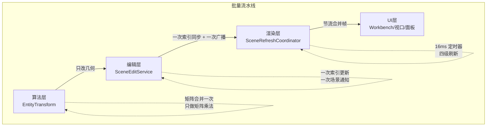
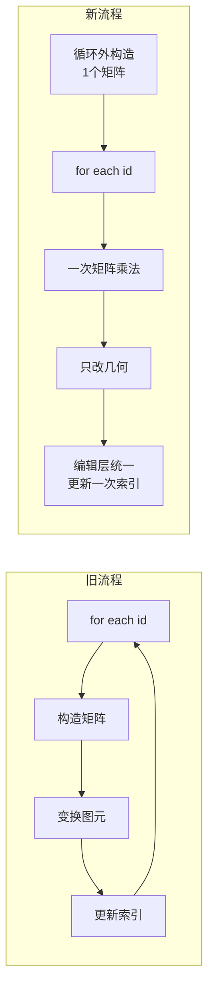
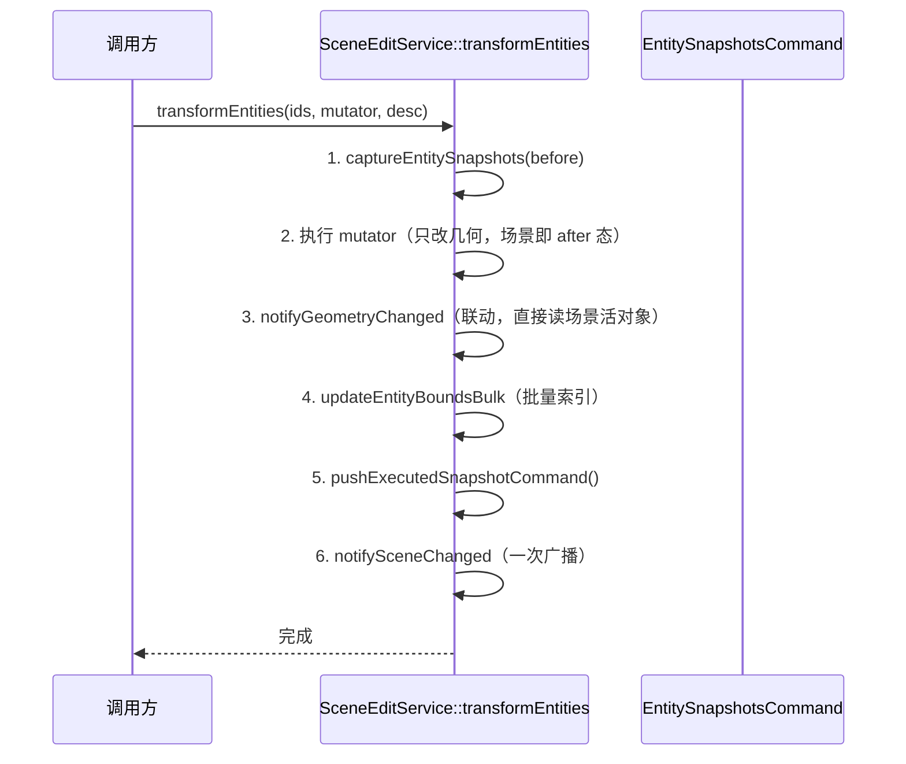

# 图元操作批处理与 UI 刷新机制

> 适用范围：2D 模式（`Engine2D` / `UI2D`）与 3D 模式（`Engine3D` / `UI3D`）下对图元的
> **选择、拖动移动、删除、旋转、缩放、镜像、对齐、Nudge**（方向键微调）等操作。
> 目标：大量图元场景下操作跟手、UI 不卡顿。
>
> 相关文档：[撤销重做机制.md](撤销重做机制.md)、[图元选择与菜单工具栏联动机制.md](图元选择与菜单工具栏联动机制.md)

---

## 1. 总体原则

任何批量图元操作都遵循同一条流水线，分四层收口，避免「N 个图元 = N 次计算 + N 次通知 + N 次 UI 更新」：



| 层级 | 2D 职责实现 | 3D 职责实现 | 批处理手段 |
| --- | --- | --- | --- |
| 算法层 | `EntityTransform` | `SelectionManager3D::applyTransform` | 多步变换**先合并成一个矩阵**，整批只构造一次，每图元只做一次矩阵乘法；SmartLine 用 `transformBatch()` 避免虚函数分发；3D 大选集（≥100）顶点变换并行化；只改几何，不碰索引/通知 |
| 编辑层 | `SceneEditService` | `SceneManager3D::extractEntities` / `deleteEntities` | 整批结束后**一次**索引同步，**一次**场景广播 |
| 渲染层 | `SceneRefreshCoordinator` | `RenderWidget3D` + `SceneMonitor3D` | 节流合并、脏 ID 增量、快照并行离散化、GL 批量上传 |
| UI 层 | `Workbench2D` / 视口 / 面板 | `Workbench3D` / 视口 / 面板 | 切断非必要扇出；属性面板节流；场景树按结构签名门控 |

一句话：**几何计算批一次、索引更新批一次、场景通知发一次、UI 刷新合并帧**。

---

## 2. 引擎侧：批量变换（移动 / 旋转 / 缩放 / 镜像 / 对齐 / Nudge）

### 2.1 矩阵只合并、构造一次

文件：`Engine/2D/Src/Algorithm/EntityTransform.cpp`

- `moveByIds` / `rotateByIds` / `scaleByIds` / `shearByIds` / `mirrorByIds` /
  `mirrorByLineIds` / `transformMultiple` 等批量方法：
  - 平移、绕心旋转、缩放等多步矩阵先在循环外连乘成**一个最终矩阵**；
  - 然后调用 `applyMatrixToIds(ids, mat)`，每个图元只执行一次 `entity->transform(mat)`。
- 镜像矩阵构造抽为静态函数 `buildMirrorMatrix()` / `buildMirrorByLineMatrix()`，
  单图元与批量路径共用同一份矩阵代码。
- 对齐（`alignByIds`）是例外：每个图元的位移不同，平移矩阵只能各自构造，
  但同样只改几何、不逐个同步索引。
- 单图元方法（`moveById` 等）保持「改几何 + 同步索引」的完整语义，可独立使用。



### 2.1.1 SmartLine 批量变换（2026-09-16）

文件：`Engine/2D/Src/SyEntity/SySmartLine.cpp` (`transformBatch`)、`Engine/2D/Src/Algorithm/EntityTransform.cpp` (`applyMatrixToIds`)

SVG 导入的复合曲线大多以 `SmartLine` 存储（一条 SVG 子路径 = 一个 SmartLine，含数百段贝塞尔/线段）。旧实现逐段调用虚函数 `transform()`，每段一次 vtable 查找、分发开销大。

**优化**：
- 新增 `SySmartLine::transformBatch(const Ut::Mat3d& mat)`：预计算矩阵分量，按已知类型分发（LINE/ARC/BEZIER2/BEZIER/CIRCLE/ELLIPSE/POINT/POLYGON），内联矩阵乘法，避免虚函数分发。
- `EntityTransform::applyMatrixToIds()` 检测到 `EType::SMARTLINE` 时直接调用 `transformBatch()`。
- 所有子段标记 `setModified()`，级联缓存失效，防止渲染脏读。

**收益**：SmartLine 变换加速 30-50%，1000 段路径从 ~5ms 降到 ~2-3ms。

### 2.1.2 空间索引批量更新（2026-09-16）

文件：`Engine/2D/Src/Core/EntitySpatialIndex.cpp`、`Engine/2D/Src/SpatialIndex/SpatialIndex2D.cpp`、`Engine/2D/Src/Core/SceneManager.cpp`

批量变换时旧实现逐图元调用 `updateEntityBoundsNoNotify()` → `spatialIndex.update()` = remove + insert（2×O(log N)），每次触发 RTree 重平衡。

**优化**：
- `EntitySpatialIndex::updateBulk(entities)` / `SpatialIndex2D::updateBulk()` / `SceneManager::updateEntityBoundsBulk()`：先收集所有旧包围盒一次性移除，再批量插入新包围盒，RTree 只做一次批量重建。
- `EntityTransform::applyMatrixToIds()` **只改几何**，不在图元循环里更新索引；整批结束后由
  `SceneEditService::transformEntities()` 收集受影响图元并一次性调用 `updateEntityBoundsBulk()`。

> 顺序上有个容易踩的坑：若让 `applyMatrixToIds()` 自己做一次批量更新，紧随其后的
> `transformEntities()` 收尾会对同一批图元再更新一遍（而且收尾若仍用逐图元接口，
> 第二遍恰好是最慢的那条路）。索引更新只能有**一处**，且应当在收尾处。

**收益**：百图元批量移动/缩放时空间索引更新加速 5-10x。

### 2.2 编辑层统一收尾：一次索引同步 + 一次场景广播

文件：`Engine/2D/Src/Edit/SceneEditService.cpp` 的 `transformEntities()`

所有菜单/对话框变换（移动、旋转、镜像、水平/垂直镜像、对齐、修剪、延伸、Nudge、倒圆角/倒角）
都经由它执行，固定顺序：



要点：

- `updateEntityBoundsNoNotify()` / `updateEntityBoundsBulk()` 与 `updateEntityBounds()`
  的区别**不在广播**（三者都不广播，`recordChange` 也一样），而在于是否就地失效
  场景包围盒缓存：`updateEntityBounds()` 会置 `m_sceneBBoxValid = false`，
  前两者留给批量结束后的 `notifySceneChanged()` 统一处理。因此无论走哪条，
  调用方都必须在批量结束后补一次 `notifySceneChanged()`；
- 同一条命令无论选中多少图元，只有一次场景广播；方向键连按的 Nudge 命令在撤销栈上
  按 id 集合合并（`canMergeWith`），但每次仍只广播一次；
- 撤销/重做靠「场景 ↔ 命令」整体交换两份状态完成（零克隆）：`undo()` 把 before 态
  换入场景、`redo()` 再换回 after 态，两者都走 `replaceEntitiesById`，
  同样是批量落库、一次通知；

### 2.3 交互拖动（Gizmo）路径

文件：`UI/2D/Src/UI/DrawTools/SelectTool.cpp`

鼠标按住手柄拖动时，每个鼠标事件：

1. Gizmo 把本帧增量合成**一个** `Ut::Mat3d`；
2. `setTransformRequest` 回调中对每个选中图元 `transform(mat)` +
   `updateEntityBoundsNoNotify()`（跳过锁定图层）；
3. 整帧结束后只调一次 `notifySceneChanged()`。

按下时由 `InteractiveEditSession` 记录 before 快照，释放时 commit 入栈，
Esc 取消则用 before 快照整体还原。拖动期间
`SelectTool::syncSelectionFromScene()` 因 `m_gizmo->isInteracting()` 提前返回，
不会重建选择轮廓工具状态。

---

## 3. 引擎侧：删除

文件：`Engine/2D/Src/Core/SceneManager.cpp`、`Engine/2D/Src/Edit/SceneUndoCommands.cpp`

- 菜单删除走 `SceneEditService::deleteSelected()` → 一条 `DeleteEntitiesCommand`，
  命令内 `extractEntitiesById(ids)` 批量摘除；
- 批量摘除使用 `EntityContainer::removeRange(ids)` 一趟压缩 O(N)，
  而非逐个 `remove(id)` 的 O(N·M) 尾部搬移；
- 选择集在图元析构前用 `removeAll(set)` 一次性摘除，避免在循环里逐个
  `m_selection.remove()`（每次 O(n) 线性扫描）与 use-after-free；
- 空间索引逐图元 `indexRemove` 后，结构变更只 `recordChange(Removed)`，
  最后**一次** `notifySelectionChanged()` + `notifySceneChanged()`；
- 删除会推进 `structureRevision`（只有 Added/Removed 推进，纯几何变换不推进）。

---

## 4. 3D 侧：批量选择 / 删除 / 变换

3D 与 2D 是两套独立引擎（`Engine3D` / `UI3D`），但批处理原则一致。
关键差异：3D 的选择状态归 `SelectionManager3D`，图元容器与索引归 `SceneManager3D`。

### 4.1 引擎层新增的批量接口

文件：`Engine/3D/Src/SceneManager3D.cpp`

| 接口 | 作用 |
| --- | --- |
| `extractEntities(entities, count, outRemoved)` | 批量摘出并把所有权**转移**给调用方（撤销栈路径），返回实际摘出数量 |
| `deleteEntities(entities, count)` | 批量摘出并**销毁**（所有权留在场景内） |
| `updateEntitiesBounds(entities, count)` | 批量更新空间索引，替代全量 `rebuildSpatialIndex()` |
| `structureRevision()` | 结构修订号：只在图元增删（添加 / 移除 / 清空）时推进 |
| `addEntitiesRemovedObserver(fn)` | 图元移除通知，**批量语义**：`fn(SyMeshEntity* const*, size_t)`，一次删除只回调一次 |

前两者共用 `Impl::detach()` 一个实现：**一趟压缩**从容器移出目标图元（读游标前移保留元素），
同时一次性清理 ID 索引、空间索引、选择集。旧实现逐个 `erase(begin + index)`
每次都要搬移尾部元素，M 个图元即 O(N·M)。

`removeEntity()`（单图元）也复用这条路径，避免移除语义出现两条行为不一致的分支。

### 4.2 移除通知为什么必须是批量语义

`SelectionManager3D` 订阅了移除通知以清理自己的选中列表。旧签名是
`void(SyMeshEntity*)`，逐图元回调，而回调体 `syncSelectionFromScene()` 每次都要
`forEachEntity` 把**全场景**图元塞进哈希表：

```text
删 M 个图元 → M 次全场景遍历 + M 次哈希表构造 = O(N·M)，且删完才轮到重建树
```

现在通知一次带上整批指针（通知期间对象仍存活，观察者可安全比较），
观察者只做 `dropFromSelection()`：按移除集合剔除选中项，O(选中集 + 移除数)。

### 4.3 批量选择接口

文件：`Engine/3D/Src/Selection/SelectionManager3D.cpp`

- `selectMany(entities, additive)` / `addSelectMany(entities)` / `deselectMany(entities)`：
  整批改选择集，**只通知一次** `onSelectionChanged`；
  内部用局部 `unordered_set` 去重，替代逐图元 O(选中数) 的线性 `find`；
- 所有选择变更统一走私有出口 `commitSelectionChanged()`，单图元接口与批量接口共用；
- `selectByBox()` 改为收集命中集后一次 `selectMany()`。旧实现 `clearSelection()`
  再逐个 `addSelect()`，框选 500 个图元就是 500 次 UI 扇出
  （每次都是属性面板重建 + 状态栏 + 命令状态刷新）；
- `applyTransform()` 烘焙顶点后，只对本批选中图元调 `updateEntitiesBounds()`
  更新索引，不再全量 `rebuildSpatialIndex()`（O(M log N) 而非 O(N log N)）；
- `applyTransform()` 顶点/法线变换在**大选集**（≥100 图元且并行开启）时走
  `Eg::EngineParallel::parallelForIndex` 并行执行：每个图元独占自己的顶点数组，
  矩阵只读，无共享写；小批量或并行关闭时退回串行。阈值与 2D 侧
  `kParallelThreshold = 100` 一致。

### 4.4 实体可见性变更的增量记录（2026-09-18）

**问题**：`SyEntity::setVisible()` 此前只调 `setModified()` 标脏，**不记录任何场景变更**。
于是批量隐藏/显示实体时，`readChanges()` 读不到 `VisibilityChanged`，渲染侧无法走增量
路径，只能退回全量重建 —— 选中大量图元反复显隐时是主要卡顿来源。

**方案**：给 `SyEntity` 增加可见性变更回调，由 `SceneManager` / `SceneManager3D` 在
实体入场时注入，回调体统一 `recordChange(id, SceneChangeKind::VisibilityChanged)`：

```cpp
// SyEntity.h
void setVisible(bool visible) override {
    if (m_bVisible != visible) {
        m_bVisible = visible;
        setModified();
        if (m_visibilityChangedCb) m_visibilityChangedCb(this, visible);  // → recordChange
    }
}
```

**批量入口**：`SceneManager::setEntitiesVisible(ids|pointers, visible)` 与
`SceneManager3D::setEntitiesVisible(...)`，一次循环设置多个图元；单次 `setVisible`
也因回调自动进入变更流。

**收益**：实体级显隐切换进入增量路径，不再退化为 `FullRefresh`；配合 16ms 定时器，
批量显隐只产生一帧增量重绘。

### 4.5 实体锁定变更与批量锁定（2026-09-20）

**问题**：2D 场景树「全选 → 锁定/解锁」旧路径有三重浪费：

1. 场景树经 `QStringList` 传递 ~N 个字符串 ID，工作台再逐个
   `id.toStdString()` + `parseEntityId` + `findEntityById`（百万图元下是主要开销）；
2. `setLocked` 只改标志位，但工作台仍调 `scene->notifySceneChanged()` —— 锁定是纯元数据，
   **不影响几何与渲染**，这次视口刷新完全多余；
3. 为刷新一个当时并不存在的锁图标，触发一次 O(N) 全量场景树重建。

**方案**：

- 引擎加 `SceneChangeKind::LockChanged` 与 `SyEntity` 锁定变更回调（与可见性同一形状），
  `SceneManager` / `SceneManager3D` 入场时注入并 `recordChange(LockChanged)`；
- 新增批量接口 `setEntitiesLocked(ids|pointers, locked)`（2D/3D），**不触发
  `notifySceneChanged`**；
- 场景树信号改为 `QVector<qint64>`（`selectedIdNumbers()` 直接取行的 `internalId`，
  不再构造 QString）；
- 新增 `SceneTreePanel::refreshRows(ids)`：逐 id 定位行（O(log N)）后按连续区间发
  `dataChanged`，不重建拓扑、不 reset 模型；
- 移除 `applySelectionContext` 中「锁定态翻转 → 强制全量重建树」的分支。

**收益**：批量锁定/解锁不再触发任何渲染刷新与全量树重建，只做一次批量标志位写入
+ 命令状态刷新。

### 4.6 调用方收口

| 位置 | 旧做法 | 现做法 |
| --- | --- | --- |
| `RenderWidget3D::selectByScreenRect` | `clearSelection` + 逐个 `addSelect` | 一次 `selectMany(hits, additive)` |
| `SceneEditService3D::deleteSelected` | 逐个 `removeEntity` | 一次 `extractEntities`，所有权交撤销命令 |
| `SceneEditService3D::addEntities`（建撤销命令） | 逐个 `removeEntity` 摘回刚加入的图元 | 一次 `extractEntities` |
| `DeleteMeshCommand3D::execute`（redo） | 逐个 `removeEntity` | 一次 `extractEntities` |
| `AddMeshCommand3D::undo` | 逐个 `removeEntity` | 一次 `extractEntities` |
| `UndoCommands3D::DeleteEntitiesCommand::undo/redo` | 逐个 `addEntity` / `removeEntity` + `delete` | 一次 `addEntities` / `extractEntities` |
| `Workbench3D::deleteSceneTreeSelection3D` | 逐个 `removeEntity` | 一次 `deleteEntities` |
| `Workbench3D::applySceneTreeSelection3D` | `clearSelection` + 逐个 `addSelect` | 一次 `selectMany(meshes, false)` |

其中 `DeleteEntitiesCommand::redo` 顺带修掉了一个二次释放：旧实现
`delete scene->removeEntity(...)` 在命令仍持有 `unique_ptr` 的情况下销毁了对象，
命令析构时会再次释放。现改为 `extractEntities` 摘出并保留所有权，形成
「undo 归还 / redo 摘出」的可逆闭环（与 `DeleteMeshCommand3D` 同一模式）。

### 4.7 3D 场景树的重建门控

文件：`Main/Src/UI/Workbench/Workbench2D.cpp`（原 `UiWorkbench.cpp` 已拆分为 `Workbench2D.cpp` / `Workbench3D.cpp`）

- `Workbench3D::refreshSceneTree3DIfNeeded()`：按 `structureRevision()` 判断，
  签名未变（选择、拖动变换、显隐切换、锁定）一律不重建；
- 删除、导入、批量增删推进修订号 → 经 150ms 防抖定时器合并成一次重建；
- 可见性与锁定**不**推进修订号，但树行要显示新的图标，因此这两处显式调用
  `refreshSceneTree3D()`（与 2D 的 `toggleEntityVisibility` 处理一致）。

---

## 5. 渲染侧：16ms 节流与增量刷新

文件：`Main/Src/UI/Render/SceneRefreshCoordinator.cpp`

- `SceneNotifier` 同步广播场景变更 → `onSceneChanged()`：
  通过修订号游标 `readChanges()` 只读本批增量，并在主线程把变更图元 **clone 成快照**
  （并行离散化在工作线程读快照，不碰活对象）；
- 所有刷新意图汇入 16ms 单次定时器（约 60fps），短时间内多次通知只产生一帧重绘；
- 四级刷新：`None < Repaint < Selection < LightUpdate < FullRefresh`，只升不降；
- `LightUpdate` 只重建脏 ID 图元：
  - 脏图元 ≥ 100 且并行开启时，工作线程并行离散化、主线程按序串行提交 GPU；
  - `beginBatchUpload()/endBatchUpload()` 整批只切一次 GL 上下文；
  - 删除 ID 走 `removeRenderEntity` 增量移除；
- 位图/文字有独立对账账本，纯矢量操作不触发它们的全量对账。

### 5.1 overlay 变更请求的帧合并（2026-09-16）

`ViewRenderCoordinator::requestRepaint()` 与 `SceneRefreshCoordinator3D::scheduleDispatch()`
均改用 `QMetaObject::invokeMethod(..., Qt::QueuedConnection | Qt::UniqueConnection)`：

- **QueuedConnection**：把 `update()` / `dispatch()` 调用推入事件循环，同帧内多次调用
  不会立即执行，而是在下一帧事件循环开始时统一处理；
- **UniqueConnection**：若同一对象同一槽函数已有待处理的 queued 调用，新调用会被静默丢弃，
  保证同帧最多只触发一次 `update()` / `dispatch()`；
- 效果：无论一帧内有多少处 overlay 变更或刷新请求，最终每帧只产生一次 `QOpenGLWidget::update()`
  或一次 `SceneRefreshCoordinator3D::dispatch()`。

此机制与 16ms 定时器互补：定时器管「何时刷新」，QueuedConnection 管「一帧内刷几次」。

### 5.2 相机/鼠标拖拽期间的 update 节流（2026-09-16）

- 2D `RenderWidget::setViewMatrix()`：相机拖拽时的 `QOpenGLWidget::update()` 改为
  `QMetaObject::invokeMethod(this, "update", Qt::QueuedConnection | Qt::UniqueConnection)`；
- 3D `RenderWidget3D::mouseMoveEvent()`：`m_transforming` / `m_rotating` / `m_panning` /
  `m_boxSelecting` 各分支的 `update()` 全部改为 `QMetaObject::invokeMethod` 节流。

### 5.3 MVP 矩阵预计算（2026-09-16）

`RenderWidget3D::paintGL()` 中，原先每帧两次计算 `projectionMatrix() * viewMatrix()`：
一次用于 `buildFrustum()` 构造视锥体，一次传给 shader 的 `uViewProjMatrix`。

新增 `buildFrustum(RxFrustum&, const QMatrix4x4& combined)` 重载，接收预计算的合并矩阵；
`paintGL()` 先算一次 `combined = projectionMatrix() * viewMatrix()`，然后同时用于
`buildFrustum` 和 shader 上传，避免重复乘法。

### 5.4 移除冗余 update（2026-09-16）

`SceneRefreshCoordinator::applyLightRefresh()` 末尾的 `m_renderWidget->update()` 已移除：
`BatchGuard` 析构时 `endBatchUpload()` 已调用 `update()`，重复调用被 QueuedConnection
的 UniqueConnection 机制静默丢弃。

### 5.5 曲线 LOD 独立定时器（2026-09-22）

**问题**：场景更新定时器（16ms）同时用于 LOD 消费时，Repaint 级别会占用该定时器，
导致 LOD 队列永久搁浅。

**方案**：新增独立的 `m_curveLodTimer`（32ms 单次触发），与场景更新定时器完全解耦：

- 场景操作密集时两个定时器互不干扰，LOD 分批能稳定每 32ms 推进一次；
- `ensureCurveLodPump()` 启动独立的 LOD 定时器；
- `onCurveLodTimer()` 执行一批后，若队列未空则自动续跑。

### 5.6 LOD 降级阈值调整（2026-09-22）

**问题**：原先降级阈值 3.0 导致缩小时图元长期携带高精度顶点，GPU 绘制冗余大量顶点
（例如 256 段圆只需 8 段时的冗余是 32 倍）。

**方案**：降级阈值从 3.0 调整为 2.0：

- 放大升级阈值保持 1.3 倍；
- 缩小降级阈值调整为 2.0 倍；
- 2.0 在抖动和冗余顶点之间取得更好的平衡：
  - 视口裁剪（1.25 倍余量）已保证平移时小幅缩小不触发重收集；
  - 配合容差公式修复（max(1e-6)），每次降级的重建代价本身也更小。

### 5.7 视口裁剪优化（2026-09-22）

**问题**：账本记录了全场景图元，但视口裁剪生效时 GPU 上实际只有视口内图元。
增量路径会把视口外图元误当新图元 `addRenderEntity`，造成重复提交。

**方案**：`applyFullRefresh()` 中新增视口裁剪逻辑：

- 账本只记录视口内（+ 1.25 倍裁剪余量）已提交的图元；
- 视口外图元不入账，下次出现在脏集合时走 `addRenderEntity` 补传；
- 使用 `visibleWorldBounds()` 获取视口世界坐标边界。

---

## 6. UI 侧：拖动期间的扇出切断与节流

### 6.1 专用信号：几何变化 ≠ 选择变化

- 拖动中每个几何变更广播，若走公开的 `selectionChanged()`，会连带触发
  **属性面板重建 + 场景树 `setSelectedIds`**，这是大批量拖动卡顿的主因；
- `SceneRefreshCoordinator` 新增 `selectionOutlineInvalidated()` 信号：
  有选中图元时，几何变更只通知视口重建流水虚线轮廓（`syncSelectionToolState()`），
  不扇出到属性面板与场景树。

### 6.2 属性面板 10Hz 节流

`refreshCommandUiState()` 用 100ms 单次定时器合并：首次立即执行，冷却窗口内只置
pending 标志，超时补一次尾包。属性面板展示端点/半径等几何值，拖动时必须跟随，
**只能节流不能跳过**（不能因选择集未变而省掉重建）。

### 6.3 场景树：选择短路 + 结构签名门控

- `SceneTreePanel::setSelectedIds()`（2D）先比对选中 id 集合，**完全一致直接返回**，
  不再重建选中态；末尾补一次 `viewport()->update()` 保证高亮即时刷新。
- 选择类操作（全选/清除/反选）不推进 `structureRevision`，
  `operationCompleted` 回调统一走 `refreshSceneTreeIfNeeded()`：
  按「图元数量 + 结构修订号 + 群组拓扑修订号」三元签名判断，
  签名未变（选择、移动、旋转、镜像、对齐、Nudge）一律不重建树；
  删除/粘贴/成组等签名变化才经 150ms 防抖重建一次。
- 重命名等不改结构但改行文案的场景，仍由 `undoStateChanged` 的无条件重建兜底。

---

## 7. 典型操作链路一览

| 操作 | 入口 | 几何/索引 | 通知与 UI |
| --- | --- | --- | --- |
| 框选 / Ctrl+A | `SelectionManager` | O(选择集)，哈希查 id | 选择短路，不重建场景树；轮廓层随选择变化重建 |
| 拖动移动/旋转/缩放 | Gizmo `setTransformRequest` | 一帧一矩阵，NoNotify 逐图元标脏 | 帧末一次通知 → 16ms 增量重绘；只刷轮廓，属性面板 10Hz |
| 对话框移动/旋转/镜像/对齐 | `EditOperationRegistry` → `transformEntities` | 矩阵合并一次，整批一次索引同步 | 入栈后一次通知；结构签名不变不重建树 |
| 方向键 Nudge | `Edit_Nudge` → `nudgeSelected` | 同上；撤销命令可合并 | 同上 |
| 删除 | `DeleteEntitiesCommand` | `removeRange` 批量摘除 | 一次选择+场景通知；结构签名变化 → 树防抖重建 |
| 批量显隐 | `SceneManager::setEntitiesVisible` | 循环 `setVisible` → 回调 `recordChange(VisibilityChanged)` | 进入增量路径；16ms 合帧；结构签名不变，树按行 `dataChanged` 增量刷新 |
| 批量锁定 | `SceneManager::setEntitiesLocked` | 循环 `setLocked` → 回调 `recordChange(LockChanged)` | **不触发渲染刷新**；只刷命令状态；不重建树 |
| 粘贴 / 复制 | `addEntities` 批量落库 | 批量建索引（带进度分段） | 一次通知；结构签名变化 → 树重建 |
| 撤销 / 重做 | `EntitySnapshotsCommand` | 快照整批替换/恢复 | 命令末尾一次通知 |
| 3D 框选 | `RenderWidget3D::selectByScreenRect` | 逐图元投影求交（屏幕空间） | 一次 `selectMany`，只刷新一次属性面板 |
| 3D 拖动变换 | `SelectionManager3D::applyTransform` | 一次矩阵烘焙顶点（≥100 图元并行），只更新选中图元索引 | 一次 `markDataChanged`；`structureRevision` 不变，树不重建 |
| 3D 删除 | `SceneEditService3D::deleteSelected` | 一次 `extractEntities`（一趟压缩） | 一次移除通知 + 一次场景通知；树经防抖重建一次 |

---

## 8. 新增图元操作时的约束

- ✅ 多步几何变换必须先合并矩阵，禁止在图元循环内重复构造/连乘矩阵；
- ✅ 批量 mutator 内只改几何，空间索引统一由 `transformEntities()` 用
  `updateEntityBoundsNoNotify()` 收尾，禁止循环内 `notifySceneChanged()`；
- ✅ 一批操作结束只能有一次场景广播，UI 刷新交给 16ms 定时器合帧；
- ✅ 删除/摘除走批量容器接口（`removeRange` / `removeAll`），禁止逐个线性移除；
- ✅ before/after 快照匹配等集合操作使用 id 哈希表，禁止 O(N²) 线性查找；
- ✅ 拖动中的几何变化只能用 `selectionOutlineInvalidated()`，
  不得触发属性面板与场景树扇出；
- ✅ 只有图元增删与群组拓扑变化才能推进 `structureRevision` 并重建场景树，
  纯几何变化禁止重建；
- ✅ 3D 移除图元统一走 `extractEntities` / `deleteEntities`，禁止在外部循环里逐个
  `removeEntity`（每个都是 O(场景规模) 的查找与搬移 + 一次全场景选择同步与广播）；
- ✅ 3D 选择变更走 `selectMany` 系列，禁止对命中集循环调用 `addSelect`；
- ✅ 3D 批量变换后只对本批图元 `updateEntitiesBounds`，禁止全量 `rebuildSpatialIndex`；
- ✅ 3D 大选集（≥100 图元）顶点变换走 `EngineParallel::parallelForIndex`，
  每个图元独占自己的顶点数组、矩阵只读，禁止在并行体内触碰共享状态；
- ✅ 实体显隐统一走 `setEntitiesVisible`（或直接 `setVisible`，由回调记录），
  禁止绕过 SceneManager 直接改标志位——那样不会产生 `VisibilityChanged`，
  渲染侧收不到变更、只能全量重建；
- ✅ 实体锁定统一走 `setEntitiesLocked`（或直接 `setLocked`，由回调记录）；
  锁定不影响渲染，**禁止**为锁定调用 `notifySceneChanged()`；
- ✅ 场景树批量信号传整数 ID（`QVector<qint64>`），禁止用 `QStringList` 传递大量
  id；行内容变化（显隐）用 `refreshRows()` 增量刷新，禁止全量重建拓扑；
- ✅ 场景树按 id 定位行走哈希表：`SceneTreeTableModel2D::indexForId` 的群组成员
  分支改为查 `m_childRowById`（与 `m_childParent` 同处维护），不再对全体已展开
  群组做线性扫描；
- ✅ 3D 撤销/重做走增量命令（`ReplaceEntitiesCommand3D`：移除 N + 新增 M），
  禁止用「整场景 clone 两份 before/after」表达一次只动几个图元的操作。

---

## 9. 约束与原则

- ✅ 3D 撤销/重做走增量命令（`ReplaceEntitiesCommand3D`：移除 N + 新增 M），
  禁止用「整场景 clone 两份 before/after」表达一次只动几个图元的操作。
