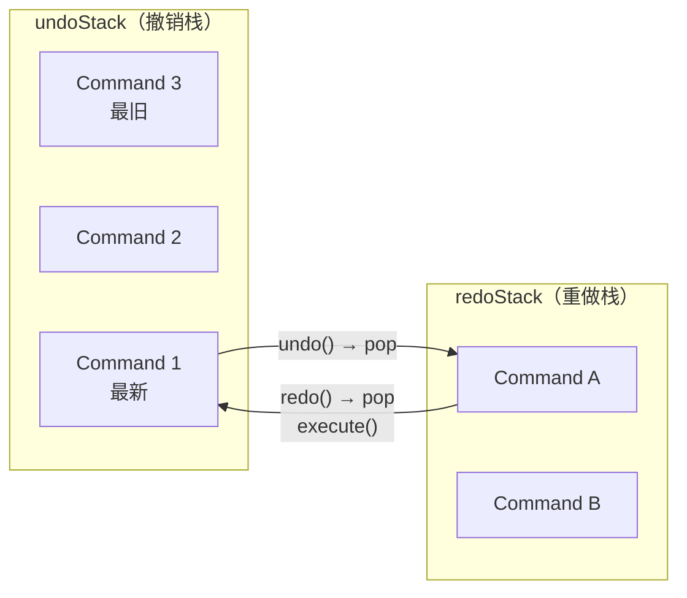
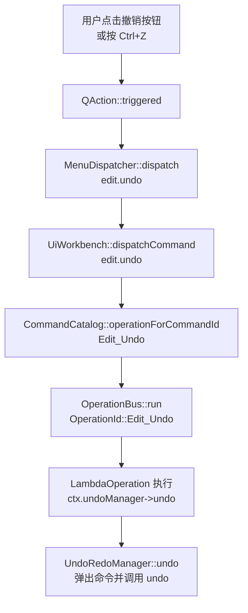
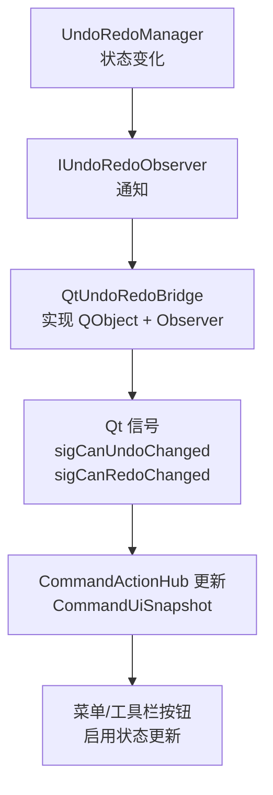

# 撤销重做机制

## 1. 概述

撤销重做（Undo/Redo）是 CAD 软件的核心功能之一，允许用户撤销误操作并重新执行。本文档记录该机制的使用方式、架构设计和软件中的执行流程。

---

## 2. 核心接口与类

### 2.1 命令基类 `IUndoRedoCommand`

**文件**: `Engine/Common/Include/Engine/Edit/IUndoRedoCommand.h`

```cpp
class ENGINE_API IUndoRedoCommand
{
public:
    virtual ~IUndoRedoCommand();

    /** 正向执行（首次执行或重做时调用） */
    virtual void execute() = 0;

    /** 撤销执行 */
    virtual void undo() = 0;

    /** 重做（默认调用 execute()，子类可覆盖以区分首次执行和重做） */
    virtual void redo() { execute(); }

    /** 命令描述（用于 UI 显示） */
    virtual const char* description() const = 0;

    /** 是否可与另一命令合并（用于连续相同操作合并） */
    virtual bool canMergeWith(const IUndoRedoCommand* other) const;

    /** 合并另一命令到自身 */
    virtual void mergeWith(IUndoRedoCommand* other);
};
```

### 2.2 撤销重做管理器接口 `IUndoRedoManager`

**文件**: `Engine/2D/Include/Engine2D/Edit/IUndoRedoManager.h`

```cpp
class ENGINE2D_API IUndoRedoManager
{
public:
    virtual ~IUndoRedoManager();

    /// 执行命令（接管所有权，调用方用 new 分配后传入）
    virtual void executeCommand(IUndoRedoCommand* cmd) = 0;

    virtual bool canUndo() const = 0;
    virtual bool canRedo() const = 0;
    virtual void undo() = 0;
    virtual void redo() = 0;

    /// 获取撤销/重做按钮显示文本
    virtual const char* undoText() const = 0;
    virtual const char* redoText() const = 0;
    virtual size_t undoCount() const = 0;
    virtual size_t redoCount() const = 0;

    virtual void clear() = 0;

    /// 批处理：多命令合并为单步撤销
    virtual void beginBatch(const char* description) = 0;
    virtual void endBatch() = 0;

    /// 保存点：用于判断文档是否已保存
    virtual void markSavePoint() = 0;
    virtual bool isAtSavePoint() const = 0;

    /// 观察者模式：监听撤销状态变化
    virtual void addObserver(IUndoRedoObserver* observer) = 0;
    virtual void removeObserver(IUndoRedoObserver* observer) = 0;
};
```

### 2.3 观察者接口 `IUndoRedoObserver`

**文件**: `Engine/2D/Include/Engine2D/Edit/IUndoRedoManager.h`

```cpp
class IUndoRedoObserver
{
public:
    virtual ~IUndoRedoObserver() = default;
    virtual void onUndoStateChanged() = 0;
    virtual void onCanUndoChanged(bool bCanUndo) = 0;
    virtual void onCanRedoChanged(bool bCanRedo) = 0;
};
```

---

## 3. 架构设计

### 3.1 双栈结构

`UndoRedoManager` 内部使用**双栈**实现撤销重做：



### 3.2 执行命令流程

```mermaid
flowchart TD
    A[executeCommand(cmd)] --> B{批处理模式?}
    B -->|是| C[加入当前批次命令列表]
    B -->|否| D{可以与栈顶命令合并?}
    D -->|是| E[cmd->mergeWith(栈顶命令)]
    D -->|否| F[cmd->execute()]
    F --> G[push 到 undoStack]
    G --> H[清空 redoStack]
    H --> I[notifyObservers()]
    E --> I
    C --> I
```

- **undoStack**: 存放已执行的命令，undo 时弹出
- **redoStack**: 存放被撤销的命令，redo 时弹出
- 新命令执行时，redoStack 被清空

### 3.2 历史记录限制

```cpp
// 默认值 50，可通过接口动态调整
m_nMaxHistorySize = 50;  // 2D
m_impl->maxHistorySize = 50;  // 3D
```

可通过以下接口调整：
```cpp
// 获取当前最大历史记录数量
size_t max = undoManager->maxHistorySize();

// 设置最大历史记录数量
undoManager->setMaxHistorySize(100);
```

最大保存 50 条撤销记录（默认值），超出时丢弃最旧的记录。

### 3.3 预置命令类型

| 命令类 | 用途 |
|--------|------|
| `AddEntitiesCommand` | 添加图元（按 id 克隆入场，undo 取回保管） |
| `DeleteEntitiesCommand` | 删除图元（execute 取走原件保管，undo 归还） |
| `ModifyEntityCommand` | 通用属性修改 |
| `LambdaCommand` | 自定义 lambda 操作 |
| `EntitySnapshotsCommand` | 变换 / 属性批量修改（与场景交换状态，支持合并） |
| `GroupStateCommand` | 群组/解组操作 |

> 平移不再有独立的 `MoveEntityCommand`：`SceneEditService::nudgeSelected` 等统一走
> `EntitySnapshotsCommand`，其合并语义由 `canMergeWith` / `mergeWith` 承载。

---

## 4. 使用方式

### 4.1 唯一入口：SceneEditService

**所有图元修改必须通过 SceneEditService**，这是强制要求：

**文件**: `Engine/2D/Include/Engine2D/Edit/SceneEditService.h`

```cpp
class ENGINE2D_API SceneEditService
{
public:
    SceneEditService(Eg::SceneManager* scene, IUndoRedoManager* undo);

    // ---- 添加/删除图元 ----

    /// 添加单个图元
    Eg::SyEntity* addEntity(
        std::unique_ptr<Eg::SyEntity> entity,
        const std::string& description,
        CommitMode mode = CommitMode::Undoable);

    /// 批量添加图元
    std::vector<Eg::EntityId> addEntities(
        std::vector<std::unique_ptr<Eg::SyEntity>> entities,
        const std::string& description,
        CommitMode mode = CommitMode::Undoable);

    /// 删除图元
    void deleteEntities(const std::vector<Eg::EntityId>& ids, const std::string& description);

    // ---- 变换操作 ----

    /// 变换图元（移动、旋转、缩放等）
    void transformEntities(
        const std::vector<Eg::EntityId>& ids,
        const std::function<void()>& applyTransform,
        const std::string& description,
        bool allowMerge = false);

    // ---- 群组操作 ----

    void groupEntities(const std::vector<Eg::EntityId>& ids, const std::string& name = "Group");
    void ungroupSelectedEntities(const std::string& description = "Ungroup");

    // ---- 交互式编辑 ----

    /// 开始交互式编辑（如拖拽）
    InteractiveSession beginInteractive(const std::vector<Eg::SyEntity*>& entities);

    /// 提交交互式编辑
    void commitInteractive(
        InteractiveSession& session,
        const std::string& description,
        bool allowMerge = false);
};
```

### 4.2 提交模式

```cpp
enum class CommitMode
{
    Undoable,  // 走 UndoRedoManager 压栈，支持单步撤销
    Direct     // 直接提交到 SceneManager，不入栈（导入批量等场景）
};
```

### 4.3 添加新的可撤销操作

#### 方式一：通过 SceneEditService（推荐）

```cpp
// 添加图元（自动创建 AddEntitiesCommand）
auto entity = std::make_unique<MyEntity>();
sceneEditService->addEntity(std::move(entity), "Add Rectangle");

// 删除图元（自动创建 DeleteEntitiesCommand）
sceneEditService->deleteEntities(selectedIds, "Delete");

// 变换操作（自动创建 EntitySnapshotsCommand）
sceneEditService->transformEntities(
    selectedIds,
    []() { /* 应用变换 */ },
    "Move",
    false);  // false = 不允许合并（完整操作）
```

#### 方式二：使用 transformEntities 的合并功能

连续微调（如方向键 nudge）允许合并为单步撤销：

```cpp
// 允许合并：方向键微调
sceneEditService->transformEntities(
    selectedIds,
    []() { /* 应用微调 */ },
    "Nudge",
    true);  // true = 允许合并
```

#### 方式三：直接使用工厂函数

**文件**: `Engine/2D/Include/Engine2D/Edit/SceneUndoCommands.h`

```cpp
// 创建快照命令（适用于复杂变换）
// 只传「修改前」快照：调用前须已把变更应用到场景，场景当前状态即「修改后」态
IUndoRedoCommand* cmd = Eg::createEntitySnapshotsCommand(
    sceneManager,
    beforeSnapshots,    // 变换前的图元快照
    beforeCount,
    "Transform",
    mergeable);        // 是否允许合并

undoManager->executeCommand(cmd);
```

> 撤销/重做靠命令与场景**整体交换两份状态**完成，全程零克隆：`undo()` 把 before 态换入场景并取回场景中的 after 态，`redo()` 再反交换一次。

#### 方式四：使用 LambdaCommand（简单场景）

```cpp
auto cmd = std::make_unique<UndoRedoManager::LambdaCommand>(
    []() { /* 执行操作 */ },      // doFunc
    []() { /* 撤销操作 */ },     // undoFunc
    "Custom Operation");

undoManager->executeCommand(cmd.release());
```

### 4.4 批处理操作

多命令合并为单步撤销：

```cpp
undoManager->beginBatch("Create and Group");

// 执行多个操作
sceneEditService->addEntity(std::move(entity1), "");
sceneEditService->addEntity(std::move(entity2), "");
sceneEditService->groupEntities(ids, "Group");

undoManager->endBatch();  // 撤销时一步完成
```

### 4.5 保存点

用于判断文档是否已保存：

```cpp
// 保存文档时标记保存点
undoManager->markSavePoint();

// 检查是否有未保存的更改
if (!undoManager->isAtSavePoint())
{
    // 提示用户保存
}
```

---

## 5. 软件中的执行流程

### 5.1 用户触发撤销/重做



### 5.2 撤销/重做状态同步到 UI



### 5.3 菜单/工具栏状态查询

**文件**: `UI/2D/Src/Operation/CommandActionHubActions2D.cpp`

```cpp
CommandUiSnapshot CommandActionHub::captureSnapshot() const
{
    CommandUiSnapshot snapshot;

    // 通过 OperationBus 的 context 获取撤销/重做状态
    if (m_bus)
    {
        const auto& ctx = m_bus->context();
        if (ctx.undoManager)
        {
            snapshot.canUndo = ctx.undoManager->canUndo();
            snapshot.canRedo = ctx.undoManager->canRedo();
        }
    }

    // ...

    return snapshot;
}
```

---

## 6. 命令合并策略

### 6.1 合并条件

```cpp
// EntitySnapshotsCommand 合并条件（见 SceneUndoCommands.cpp）
bool EntitySnapshotsCommand::canMergeWith(const Command* other) const
{
    const auto* cmd = dynamic_cast<const EntitySnapshotsCommand*>(other);
    if (!cmd || cmd->m_description != m_description)
    {
        return false;
    }

    // 合并判定对称：相邻两条里只要有一条声明了不可合并就不合并
    if (!m_mergeable || !cmd->m_mergeable)
    {
        return false;
    }

    // 同一批图元（id 集合相同）才可合并
    return sortedIds() == cmd->sortedIds();
}

void EntitySnapshotsCommand::mergeWith(Command* other)
{
    auto* cmd = dynamic_cast<EntitySnapshotsCommand*>(other);
    if (!cmd)
    {
        return;
    }

    // 只保留最早那份 before 态：此刻场景里是 other 的 after 态，本命令持有的
    // m_detached 正是「最早 before」，两者恰好构成合并后需要的一对状态，无需搬运。
    cmd->m_detached.clear();
}
```

### 6.2 合并使用场景

| 场景 | allowMerge | 效果 |
|------|-------------|------|
| 鼠标拖拽 | false | 完整操作，一步撤销 |
| 方向键 nudge | true | 连续微调合并为一步 |
| 滚轮微调 | true | 连续滚动合并为一步 |

---

## 7. 约束与原则

1. **单一入口**: 所有图元修改必须通过 `SceneEditService`（2D）或 `SceneEditService3D`（3D）

2. **撤销粒度**: 一次用户可感知操作 = 一条撤销记录

3. **合并策略**:
   - `allowMerge = true`: 方向键 nudge、滚轮微调等连续操作
   - `allowMerge = false`: 鼠标拖拽等完整操作

4. **空操作过滤**: 如果交互过程中没有真正修改，不应创建撤销记录

5. **ID 保留**: 添加/删除操作使用 `extractEntityById` 保留原始 ID，避免克隆导致 ID 变化

---

## 8. 相关文件索引

| 分类 | 文件路径 |
|------|----------|
| 核心接口 | `Engine/Common/Include/Engine/Edit/IUndoRedoCommand.h` |
| 管理器接口 | `Engine/2D/Include/Engine2D/Edit/IUndoRedoManager.h` |
| 管理器实现 | `Engine/2D/Src/Edit/UndoRedoManager.cpp` |
| 场景编辑服务 | `Engine/2D/Include/Engine2D/Edit/SceneEditService.h` |
| 预置命令工厂 | `Engine/2D/Include/Engine2D/Edit/SceneUndoCommands.h` |
| Qt 桥接 | `UI/2D/Include/UI2D/Edit/QtUndoRedoBridge.h` |
| 命令目录 | `UI/2D/Src/Operation/CommandCatalog.cpp` |
| UI 状态快照 | `UI/2D/Src/Operation/CommandActionHubActions2D.cpp` |

---

## 9. 3D 支持

3D 模块的撤销重做机制与 2D 类似，使用 `UndoRedoManager3D`：

- 核心接口: `Engine/3D/Include/Engine3D/Edit/IUndoRedoManager3D.h`
- 管理器: `Engine/3D/Src/Edit/UndoRedoManager3D.cpp`
- 编辑服务: `Engine/3D/Include/Engine3D/Edit/SceneEditService3D.h`

架构和使用方式与 2D 一致。
