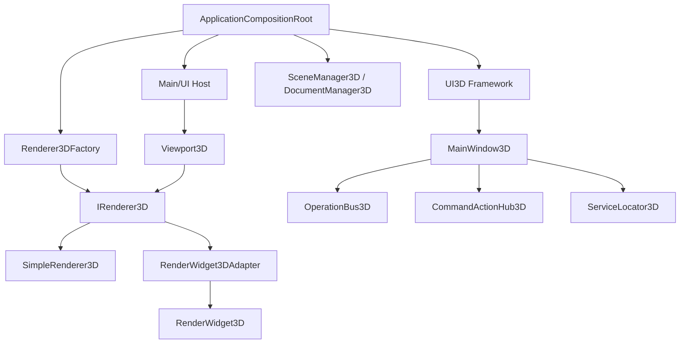

好，我把上面提到的遗漏和优化点也一并加进去。  
下面这版可以直接作为你 `Docs/3DTodo.md` 的最终增强版思路基础，重点补了三类内容：

- `IRenderer3D` 的唯一创建来源
- `SceneDocument3D / SceneManager3D / CameraController3D` 的归属边界
- `Viewport3D` 的最终定位与退场标准

---

# 3D 视图架构整改 TODO

## 目标

把当前 3D 视图从“过渡型可运行实现”收口为符合现有框架标准的正式链路。

目标原则：

- `Main` 只负责宿主与视图装配，不直接绑定具体渲染后端
- `UI3D` 作为 3D 工作台框架主层，负责菜单、工具栏、状态栏、命令总线、快捷键
- `RenderCompat` 作为旧 OpenGL 渲染兼容层
- `IRenderer3D` 作为唯一渲染抽象接口
- `IRenderer3D` 的创建必须有唯一来源，禁止在视图宿主中分散创建
- `SimpleRenderer3D` 仅保留为验证链或临时默认实现，不作为最终框架主链
- `Viewport3D` 定位为统一宿主壳，负责承载 renderer，不承担后端选择职责

---

## 一、当前链路现状

### 1. Main/UI 层

当前核心文件：

- `Main/Src/UI/UiViewport3D.h`
- `Main/Src/UI/UiViewport3D.cpp`
- `Main/Src/UI/SimpleRenderer3D.h`
- `Main/Src/UI/SimpleRenderer3D.cpp`
- `Main/Src/UI/RenderWidget3DAdapter.h`
- `Main/Src/UI/RenderWidget3DAdapter.cpp`
- `Main/Src/UI/UiWorkbench.h`
- `Main/Src/UI/UiWorkbench.cpp`
- `Main/Src/UI/WorkbenchWindow.h`
- `Main/Src/UI/WorkbenchWindow.cpp`
- `Main/Src/UI/SceneBuilder3D.h`
- `Main/Src/UI/SceneBuilder3D.cpp`

现状判断：

- `Viewport3D` 已经通过 `IRenderer3D` 解耦渲染实现
- 但默认 renderer 仍然在构造函数内直接创建，耦合过强
- 3D 视图装配还没有完全纳入组合根
- `Main` 侧仍然承担了部分后端选择职责
- `Workbench3D` 实际渲染路径当前绕过 `Viewport3D` 的问题必须优先修复

---

### 2. UI/RenderCompat 层

当前核心文件：

- `UI/RenderCompat/Src/RenderWidget3D.cpp`
- `Main/Src/UI/RenderWidget3DAdapter.h`
- `Main/Src/UI/RenderWidget3DAdapter.cpp`

现状判断：

- `RenderWidget3D` 是旧 OpenGL 3D widget
- `RenderWidget3DAdapter` 是过渡适配层
- 适配器目前只完成了事件转发和基本状态回调
- `setScene`、`setCamera`、路径同步等关键能力还未完整收口

---

### 3. UI3D 层

当前核心文件：

- `UI/3D/Src/Ui/MainWindow/MainWindow3D.cpp`
- `UI/3D/Src/Ui/MainWindow/MainWindow3D.h`
- `UI/3D/Include/UI3D/Operation/OperationBus3D.h`
- `UI/3D/Include/UI3D/Operation/OperationDispatch3D.h`
- `UI/3D/Include/UI3D/Operation/CommandActionHub3D.h`
- `UI/3D/Include/UI3D/Operation/CommandRegistry3D.h`
- `UI/3D/Include/UI3D/Service/ServiceLocator3D.h`
- `UI/3D/Src/Operation/CommandCatalog3D.cpp`
- `UI/3D/Src/Ui/MenuManager/ViewMenu3D.cpp`

现状判断：

- 3D 工作台框架骨架已经存在
- 有独立主窗口、操作总线、服务定位器
- 但和 `Main` 的视图链路还没统一
- 还缺少完整的“视图宿主 + 命令总线 + 渲染器注入”闭环
- `MainWindow3D::setupCentralWidget()` 当前属于死路径或未收口路径

---

## 二、目标架构

### 当前架构现状（已完成）

#### 2.1 真实主链已经收口

当前 3D 视图的真实主链为：

- `Workbench3D`
- `Viewport3D`
- `IRenderer3D`
- 具体 renderer 由 `Renderer3DFactory` 创建并注入

3D 工作台不再直接绕过宿主层去创建具体渲染控件。

#### 2.2 `Viewport3D` 已经是统一宿主壳

`Viewport3D` 当前职责：

- 承载 renderer
- 接收 UI 输入事件
- 转发给 renderer 接口
- 持有视图生命周期
- 通过抽象接口连接场景、相机、选择和路径

它不再负责决定使用哪种具体渲染后端。

#### 2.3 `Renderer3DFactory` 已成为唯一创建入口

当前 renderer 的创建必须通过 `Renderer3DFactory` 完成。

支持的类型：
- `Simple`
- `Compatible`
- `None`

禁止在 `Viewport3D`、`Workbench3D`、`MainWindow3D` 等宿主层直接 `new` 具体 renderer。

#### 2.4 兼容链已经可用

`RenderWidget3DAdapter` 已经从"只接壳"变成"可桥接"：

- 可绑定 `SceneManager3D`
- 可连接 `CameraController3D`
- 可同步选中状态
- 可同步路径名称
- 可向上层回传状态

它仍属于兼容层，不是未来主框架核心。

#### 2.5 文档模型与相机控制器已经明确

当前语义边界：

- `SceneDocument3D` 是 UI 视图层文档对象
- `SceneManager3D` 是引擎/场景层管理器
- `CameraController3D` 是视图交互层控制器
- `Camera3D` 是渲染层相机对象

三者之间通过适配层和控制器解耦，不直接互相替代。

---

### 当前架构约束

#### 3.1 渲染器创建约束

**必须遵守**：
- 所有 `IRenderer3D` 实例必须由 `Renderer3DFactory` 创建
- `Viewport3D` 只能接收外部注入的 renderer
- `Workbench3D` 只能通过统一工厂获取 renderer

**禁止**：
- 在 UI 宿主层直接 `new SimpleRenderer3D`
- 在 UI 宿主层直接 `new RenderWidget3DAdapter`
- 在多个位置绕过工厂创建 renderer

---

#### 3.2 `Viewport3D` 职责约束

**必须遵守**：
- `Viewport3D` 只负责宿主和事件转发
- `Viewport3D` 不负责选择渲染后端
- `Viewport3D` 不负责绑定业务逻辑
- `Viewport3D` 不应持有额外的场景管理职责

**禁止**：
- 在 `Viewport3D` 内部硬编码 renderer 类型
- 在 `Viewport3D` 内部处理具体 3D 业务逻辑
- 在 `Viewport3D` 内部直接操作引擎图元

---

#### 3.3 `RenderWidget3DAdapter` 职责约束

**必须遵守**：
- 适配器只做桥接
- 适配器只维护兼容层行为
- 适配器只同步状态，不编排业务
- 适配器可连接场景、相机、选择、路径回调

**禁止**：
- 在适配器中加入新业务逻辑
- 把适配器演化成第二套主框架
- 让适配器承担未来主链职责

**当前允许**：
- 场景同步
- 相机连接
- 选择同步
- 路径同步
- 状态提示回传

---

#### 3.4 `SceneDocument3D` 职责约束

**必须遵守**：
- `SceneDocument3D` 代表 UI 视图层文档对象
- 它可以持有文档级 UI 状态
- 它可以只读访问 `SceneManager3D`
- 它可以保存选中状态、路径状态、文档名称、文件路径、脏标记等

**禁止**：
- 直接在 `SceneDocument3D` 中修改引擎层图元
- 把它变成 `SceneManager3D` 的简单壳
- 把所有 UI 状态无限堆叠到文档对象里

---

#### 3.5 `CameraController3D` 职责约束

**必须遵守**：
- `CameraController3D` 是视图交互控制器
- 它通过外部注入的 `Camera3D*` 工作
- 它负责复位、拟合、预设视角、轨道模式等控制操作
- 它不拥有相机生命周期

**禁止**：
- 在控制器内部创建并独占 `Camera3D`
- 在控制器中直接耦合渲染管线
- 把控制器当成渲染器的一部分

---

#### 3.6 `MainWindow3D` 职责约束

**必须遵守**：
- `MainWindow3D` 负责 3D 工作台的菜单、工具栏、状态栏、命令入口
- 如果它不承载 central widget，就不要保留会误导的 central widget 死代码
- 它应作为 UI3D 的协调器，而不是再争夺主渲染入口

**禁止**：
- 形成与 `Workbench3D` 并存的第二套主窗口链
- 让 `MainWindow3D` 与 `Workbench3D` 同时持有互相冲突的中央视图职责

---

### 现阶段推荐使用方式

#### 4.1 新 renderer 的接入方式

推荐流程：
1. `Renderer3DFactory` 创建 renderer
2. `Workbench3D` 获取 renderer
3. `Workbench3D` 创建 `Viewport3D`
4. `Viewport3D::setRenderer()` 注入 renderer
5. `Viewport3D::setSceneDocument()` 注入场景文档
6. `Viewport3D::setCameraController()` 注入相机控制器

---

#### 4.2 场景和相机的接入方式

推荐流程：
1. `ServiceLocator3D` 提供 `SceneDocument3D`
2. `ServiceLocator3D` 提供 `CameraController3D`
3. `Workbench3D` 获取这两个对象
4. 注入到 `Viewport3D`
5. 兼容链通过 `RenderWidget3DAdapter` 完成具体桥接

---

#### 4.3 选择和路径同步方式

推荐流程：
- renderer 内部处理选中逻辑
- 选中结果回传给 `SceneDocument3D`
- `SceneDocument3D` 保存 UI 层选择状态
- UI 回调同步路径名称和状态栏提示

---

### 维护建议

#### 5.1 如果新增 renderer
必须通过 `Renderer3DFactory` 扩展，不允许散装创建。

#### 5.2 如果新增视图交互逻辑
优先放到 `Viewport3D` 的事件转发链和 `CameraController3D` 中，不要写进适配器业务层。

#### 5.3 如果新增选中或路径功能
优先复用现有选择回调、路径回调、状态回调，不要在多个层重复维护。

#### 5.4 如果需要废弃兼容层
先确认主链完全稳定，再逐步收缩 `RenderWidget3DAdapter` 和 `RenderWidget3D` 的默认参与范围。

---

### 当前架构的稳定性结论

目前 3D 架构已经具备以下稳定特征：
- 主链清楚
- 工厂统一
- 宿主纯净
- 兼容链可用
- 文档模型边界明确
- 相机控制职责明确

这意味着当前 3D 架构已经可以作为后续开发的稳定基线。

---

### 后续开发必须遵守的底线

- 不绕过 `Renderer3DFactory`
- 不让 `Viewport3D` 负责后端选择
- 不让 `RenderWidget3DAdapter` 承担新主链职责
- 不让 `SceneDocument3D` 和 `SceneManager3D` 职责混淆
- 不让 `CameraController3D` 侵入渲染器生命周期
- 不让 `MainWindow3D` 与 `Workbench3D` 重复争夺主入口

---

### 一句话总结

当前 3D 架构的核心原则是：

**`Workbench3D` 负责装配，`Viewport3D` 负责宿主，`Renderer3DFactory` 负责创建，`RenderWidget3DAdapter` 负责兼容，`SceneDocument3D` 和 `CameraController3D` 负责语义边界。**

---

## 推荐定位

### 主链
`UI3D` 作为正式 3D 工作台框架主链。

### 兼容链
`RenderWidget3DAdapter + RenderWidget3D` 作为旧 OpenGL 渲染兼容链。

### 验证链
`SimpleRenderer3D` 作为最小可运行验证链。

### 宿主层
`Viewport3D` 作为统一宿主壳，负责承载 renderer，不直接决定 renderer 类型。

---

## 推荐架构图



---

## 推荐职责划分

### `Main`
负责：

- 宿主窗口
- 视图容器
- renderer 注入
- 事件转发
- 组合根依赖接入

不负责：

- 渲染后端选择
- OpenGL / QPainter 具体实现判断
- 3D 业务命令编排

---

### `UI3D`
负责：

- 3D 工作台主窗口
- 菜单、工具栏、状态栏
- 命令总线
- 快捷键绑定
- 3D 服务装配
- 视图状态同步

---

### `RenderCompat`
负责：

- 保留旧 OpenGL widget
- 适配到统一接口
- 兼容旧数据与旧交互
- 不再承载业务编排

---

### `IRenderer3D`
负责：

- 场景绑定
- 相机控制
- 输入处理
- 选中/路径回调
- 渲染生命周期

---

### `SceneDocument3D / SceneManager3D / CameraController3D`
建议归属边界：

- **`SceneDocument3D`**：UI 视图层文档对象（非薄桥接）
  - 职责：管理文档级 UI 属性（文档名称、文件路径、脏标记、最后修改时间）
  - 持有 `SceneManager3D*` 作为引擎层引用（只读访问）
  - 不直接暴露引擎层业务逻辑给 UI
  - 定位：真正的 UI 文档对象，承担 UI 层文档职责

- **`SceneManager3D`**：引擎/场景层管理器
  - 职责：管理 3D 图元、空间索引、选择状态
  - 通过 `SceneDocument3D` 暴露给 UI 层
  - 定位：纯粹的引擎层组件

- **`CameraController3D`**：视图交互层相机控制器
  - 职责：管理相机视图操作（复位、拟合、预设视角、轨道模式）
  - 通过外部注入 `Camera3D*` 实现真正的视图控制
  - 不依赖具体渲染器实现
  - 定位：独立的视图交互控制器，可跨渲染后端复用

- **适配层**：负责跨模型桥接，不在宿主层混用两套语义

### 设计约束与注意事项

#### SceneDocument3D 状态管理约束
- **当前属性**：名称、路径、脏标记、时间、选择状态
- **禁止**：不要把它演变成"所有 UI 状态都往里塞"的大杂烩
- **原则**：保持文档模型清晰，必要时把更重的状态拆出去独立管理

#### CameraController3D 生命周期约束
- **持有方式**：外部注入 `Camera3D*`，生命周期由注入方（渲染层）管理
- **禁止重复持有**：不要在多个地方重复持有同一个 `Camera3D`
- **禁止所有权假设**：控制器不拥有 camera，只是操作它
- **禁止越权修改**：renderer 之外的人不要随意改内部相机状态
- **原则**：相机状态的唯一来源是渲染层，控制器只提供操作接口

---

## 三、直接落地的任务拆分

## Phase 0：修复实际渲染入口绕过

### Phase 0A 把 Workbench3D 的 central widget 改成 Viewport3D

目标：

- 让 3D 工作台真正进入 `Viewport3D -> IRenderer3D` 链
- 不再直接创建 `RenderWidget3D`
- 让 renderer 通过组合根或工厂注入

理想路径：

```cpp
Workbench3D::build3DWorkbenchUi()
    -> new Viewport3D(&window)
    -> viewport->setRenderer(...)
    -> viewport->setSceneDocument(...)
    -> viewport->setCameraController(...)
    -> window.setCentralWidget(viewport)
```

验收：

- `Workbench3D` 不再直接 new `RenderWidget3D`
- 3D 工作台通过 `Viewport3D` 承载渲染
- Renderer 通过外部注入（兼容链 `RenderWidget3DAdapter` 或验证链 `SimpleRenderer3D`）
- 渲染窗口能正常创建和显示
- `Workbench3D` 启动时，实际 central widget 必须是 `Viewport3D`
- 不能再默认直接走 `RenderWidget3D`
- **注意**：本阶段 `RenderWidget3DAdapter::setScene()` 和 `setCamera()` 仍为空桩实现，场景/相机同步功能将在阶段 3 补齐，不影响本阶段验收

> **风险提示**：由于 `Viewport3D` 构造函数中仍硬编码创建 `SimpleRenderer3D`（阶段 1 才移除），调用 `setRenderer()` 时需确保旧实例被正确清理，避免双重渲染器问题。

---

### Phase 0B 清理 `MainWindow3D::setupCentralWidget()` 的死路径

当前问题：

- `MainWindow3D::setupCentralWidget()` 创建自己的 `RenderWidget3D`
- 但该方法从未被调用，Workbench3D 手动创建独立的 `RenderWidget3D` 实例
- `MainWindow3D` 本身被隐藏，只作为工具栏和菜单的宿主

方案选择：

**方案 1：删除死代码（推荐）**

- 删除 `setupCentralWidget()` 方法及其相关成员变量
- 添加注释说明 `MainWindow3D` 当前的定位是“工具条/菜单协调器”而非“主窗口容器”
- 避免误导后续开发者

**方案 2：重构为真正被调用的装配入口（后续可选）**

- 如果未来需要让 `MainWindow3D` 真正承担主窗口职责
- 让 `Workbench3D` 不再自己创建 central widget
- 统一由 `MainWindow3D::setupCentralWidget()` 装配
- 让 `MainWindow3D` 成为唯一窗口入口

当前推荐方案 1，保持 `Workbench3D + Viewport3D` 的统一入口，后续再决定 `MainWindow3D` 的定位。

验收：

- `setupCentralWidget()` 被删除或明确标记为废弃
- `MainWindow3D` 的职责边界清晰
- 不影响现有 3D 工作台功能

---

## 阶段 1 统一渲染接入方式

### 任务 1
把 `Viewport3D` 的默认 renderer 创建从构造函数中移除。

目标：

- `Viewport3D` 只保留宿主职责
- renderer 由外部注入
- 不再在 UI 类里写死 `SimpleRenderer3D`

验收：

- `Viewport3D` 构造后不自动绑定具体渲染实现
- `initialize` 仍可由外部触发
- 所有交互事件仍然可透传给 renderer
- `Viewport3D` 最终只承担宿主壳职责，不承担后端选择逻辑

---

### 任务 2
增加 3D renderer 的创建入口，统一由组合根或工厂决定。

目标：

- 在组合根中决定默认主链
- 支持验证链与兼容链切换
- 不让 `Main` 直接依赖后端实现类
- `IRenderer3D` 必须由唯一来源创建，避免在宿主层分散 new

验收：

- 组合根能明确创建 `SimpleRenderer3D` 或 `RenderWidget3DAdapter`
- `Viewport3D` 仅接收注入结果

---

## 阶段 2 收口 UI3D 框架层

### 任务 3
补齐 `MainWindow3D` 的中央视图、状态栏、菜单与命令绑定。

目标：

- 让 3D 工作台真正可用
- 让 UI3D 成为 3D 功能的正式入口

验收：

- 中央视图可显示 3D 视图
- 菜单、工具栏、状态栏工作正常
- 命令总线能触发对应 UI 行为

---

### 任务 4
补齐 `OperationBus3D` 到 UI 行为的执行闭环。

目标：

- 统一 3D 命令入口
- 统一菜单、工具栏、快捷键的触发逻辑

验收：

- 命令有唯一执行路径
- 命令执行结果能同步到 UI 状态

---

## 阶段 3 收口兼容层

### 任务 5
补齐 `RenderWidget3DAdapter` 的场景、相机和状态同步。

目标：

- 让旧 OpenGL widget 真正通过统一接口工作
- 避免适配器只有壳，没有实际桥接能力

验收：

- `setScene` 生效
- `setCamera` 生效
- 选择同步、路径同步、状态同步可用

---

### 任务 6
明确 `RenderWidget3D` 的定位为兼容后端，不再作为主框架入口。

目标：

- 避免主链和旧链混乱
- 避免 `Main` 层直接接触 OpenGL widget

验收：

- `Main` 不直接 new `RenderWidget3D`
- 旧链仅通过适配器出现

---

## 阶段 4 收口场景与相机

### 任务 7
统一 `SceneManager3D`、`DocumentManager3D`、`CameraController3D` 的注入关系。

目标：

- 3D 视图数据流清晰
- 视图、文档、相机职责明确

验收：

- 场景数据有明确来源
- 相机有唯一控制来源
- 视图刷新与输入流稳定

---

### 任务 8
统一选择、路径、状态提示的回传路径。

目标：

- 选中对象、路径树、状态栏提示一致
- 不同后端行为一致

验收：

- `selectedNodeId`
- `selectedPathNames`
- status callback 全部可用

---

## 四、逐文件修改清单

## Phase 0 相关文件

### `Main/Src/UI/UiWorkbench.cpp`（Phase 0A）

修改内容：

- `build3DWorkbenchUi()` 不再直接 new `RenderWidget3D`
- 改为创建 `Viewport3D` 作为 central widget
- 通过组合根或工厂获取 `IRenderer3D` 实例
- 调用 `viewport->setRenderer()`、`setSceneDocument()`、`setCameraController()`

重点：

- 删除 `new RenderWidget3D(&window)`
- 新增 `auto* viewport = new Viewport3D(&window)`
- 新增 renderer 注入逻辑
- 绑定 3D 状态回调

---

### `UI/3D/Src/Ui/MainWindow/MainWindow3D.cpp`（Phase 0B）

修改内容：

- 删除 `setupCentralWidget()` 方法
- 删除 `m_renderWidget3D` 成员变量
- 删除 `renderWidget()` 和 `setRenderWidget()` 方法
- 添加注释说明当前定位：“工具栏/菜单协调器，不承载中央视图”

重点：

- 删除死代码，避免误导
- 保留菜单、工具栏、状态栏管理能力
- 保持与 `Workbench3D` 的配合关系

---

### `UI/3D/Src/Ui/MainWindow/MainWindow3D.h`（Phase 0B）

修改内容：

- 删除 `RenderWidget3D* m_renderWidget3D` 成员声明
- 删除 `renderWidget()` 和 `setRenderWidget()` 方法声明
- 删除 `setupCentralWidget()` 方法声明

---

## Main/UI 层

### `Main/Src/UI/UiViewport3D.h`
修改内容：

- 保留 `IRenderer3D` 宿主接口
- 移除任何默认后端假设
- 保留 setter 和事件入口
- 保持 `Viewport3D` 作为统一宿主壳

重点：

- `setRenderer`
- `initialize`
- `setSceneDocument`
- `setCameraController`
- `setOrbitMode`
- `setMeasureMode`

---

### `Main/Src/UI/UiViewport3D.cpp`
修改内容：

- 删除构造函数里对 `SimpleRenderer3D` 的直接创建
- 改为外部注入 renderer 后再 initialize
- 明确 `paintEvent` 只处理非 OpenGL 后端
- 维护 resize / mouse / wheel 事件转发

重点要改：

- 构造函数
- `setRenderer`
- `paintEvent`
- `resizeEvent`

---

### `Main/Src/UI/SimpleRenderer3D.h`
修改内容：

- 保留为验证链 renderer
- 注释改成“临时验证实现”
- 不再强调它是默认正式实现

---

### `Main/Src/UI/SimpleRenderer3D.cpp`
修改内容：

- 保持最小渲染能力
- 补充必要的状态同步稳定性
- 仅作为开发验证用途

---

### `Main/Src/UI/RenderWidget3DAdapter.h`
修改内容：

- 明确这是兼容层
- 补齐 bridge 能力说明
- 规范 `isOpenGL()`、`setScene()`、`setCamera()` 的职责

---

### `Main/Src/UI/RenderWidget3DAdapter.cpp`
修改内容：

- 实现 `setScene`
- 实现 `setCamera`
- 补齐路径和选择同步
- 减少占位代码
- 保持“只做适配，不做业务”

---

### `Main/Src/UI/UiWorkbench.h`
修改内容：

- 明确 3D 工作台入口
- 添加必要的 3D 视图装配接口
- 让 UI workbench 能接收 3D 宿主视图

---

### `Main/Src/UI/UiWorkbench.cpp`
修改内容：

- 按组合根注入 3D renderer
- 统一初始化 `Viewport3D`
- 绑定 3D 状态提示和命令入口

---

### `Main/Src/UI/WorkbenchWindow.h`
修改内容：

- 如果承载 3D 视图，补齐对应接口
- 明确 central widget 的接入方式

---

### `Main/Src/UI/WorkbenchWindow.cpp`
修改内容：

- 补齐 3D 视图切换或显示逻辑
- 避免直接耦合后端实现

---

### `Main/Src/UI/SceneBuilder3D.h`
修改内容：

- 明确场景构建职责
- 与 `SceneManager3D` 的边界清晰化

---

### `Main/Src/UI/SceneBuilder3D.cpp`
修改内容：

- 生成 3D 场景初始数据
- 与渲染后端解耦

---

## UI/RenderCompat 层

### `UI/RenderCompat/Src/RenderWidget3D.cpp`
修改内容：

- 保持 OpenGL widget 的旧实现
- 清理与上层业务强耦合的部分
- 作为兼容后端保留

---

### `Main/Src/UI/RenderWidget3DAdapter.h`
修改内容：

- 标明适配器退场条件
- 规范仅做桥接的定位

---

### `Main/Src/UI/RenderWidget3DAdapter.cpp`
修改内容：

- 场景绑定
- 相机绑定
- 输入事件转发
- 选择状态同步
- 状态回调同步

---

## UI3D 层

### `UI/3D/Src/Ui/MainWindow/MainWindow3D.h`
修改内容：

- 补齐主窗口对中央视图的管理
- 补齐状态栏、菜单、工具栏、快捷键接口
- 统一 3D 命令绑定入口

---

### `UI/3D/Src/Ui/MainWindow/MainWindow3D.cpp`
修改内容：

- 实现 `setupCentralWidget`
- 实现菜单和状态栏绑定
- 实现命令绑定
- 实现 3D 视图切换和状态同步

重点：

- `createToolBars`
- `createMenuBar`
- `createStatusBar`
- `bindCommandActions`
- `syncViewDisplayUi`
- `updateStatusBar`

---

### `UI/3D/Include/UI3D/Operation/OperationBus3D.h`
修改内容：

- 明确 3D 命令总线是唯一命令入口
- 保持和 `CommandActionHub3D` 的配合
- 统一命令执行与状态更新

---

### `UI/3D/Src/Operation/CommandCatalog3D.cpp`
修改内容：

- 补齐 3D 命令 catalog
- 和 UI 菜单、工具栏绑定一致

---

### `UI/3D/Include/UI3D/Operation/CommandActionHub3D.h`
修改内容：

- 统一把 UI 动作接到 `OperationBus3D`
- 作为命令分发的桥梁

---

### `UI/3D/Include/UI3D/Operation/OperationDispatch3D.h`
修改内容：

- 明确 3D 操作分发规则
- 与窗口状态、上下文绑定一致

---

### `UI/3D/Include/UI3D/Operation/CommandRegistry3D.h`
修改内容：

- 定义 3D 命令注册集合
- 支持菜单、快捷键、工具栏共享

---

### `UI/3D/Include/UI3D/Service/ServiceLocator3D.h`
修改内容：

- 明确 3D 服务装配边界
- 避免与 `Main` 的服务重复或冲突

---

### `UI/3D/Src/Ui/MenuManager/ViewMenu3D.cpp`
修改内容：

- 将视图菜单与命令总线对齐
- 补齐视图显示项、导航项、切换项

---

## 五、推荐开发顺序

### 第一优先级（Phase 0）
- **Phase 0A**：改 `UiWorkbench.cpp`
  - `build3DWorkbenchUi()` 使用 `Viewport3D + IRenderer3D`
  - 通过 `RenderWidget3DAdapter` 注入旧 OpenGL 渲染器
- **Phase 0B**：清理 `MainWindow3D`
  - 删除 `setupCentralWidget()` 死代码
  - 明确当前定位为“工具栏/菜单协调器”

### 第二优先级（阶段 1）
- 改 `UiViewport3D`
- 去掉内部默认 renderer 创建（构造函数中的 `SimpleRenderer3D`）
- 改为外部注入

### 第三优先级（阶段 2）
- 补 `MainWindow3D`（如需要提升为主窗口容器）
- 打通中央视图、状态栏、菜单、快捷键

### 第四优先级（阶段 3）
- 补 `RenderWidget3DAdapter`
- 让旧 OpenGL 链真正可桥接（场景、相机、状态同步）

### 第五优先级（阶段 4）
- 收口组合根
- 明确主链、兼容链、验证链的选择策略
- 统一场景与相机管理
- 确保 `IRenderer3D` 只有唯一创建来源

---

## 六、结论

当前 3D 视图的状态可以概括成：

- 接口方向是对的
- 实现还停留在过渡期
- 框架归属还没有完全统一
- 最合理的方向是：

**`UI3D` 主框架 + `RenderCompat` 兼容链 + `Main` 宿主化接入**

---

**按文件逐项执行**的版本，一边改一边勾。

---

# 3D 视图重构逐文件执行清单

## Phase 0A 先让 `Workbench3D` 走 `Viewport3D`

### `Main/Src/UI/UiWorkbench.cpp`
- [ ] 把 `build3DWorkbenchUi()` 中直接创建 `RenderWidget3D` 的代码改成创建 `Viewport3D`
- [ ] 用统一入口获取 `IRenderer3D`
- [ ] 调用 `viewport->setRenderer(...)`
- [ ] 调用 `viewport->setSceneDocument(...)`
- [ ] 调用 `viewport->setCameraController(...)`
- [ ] 把 `window.setCentralWidget(...)` 改为 `Viewport3D`

**验收**
- 3D 工作台的 central widget 是 `Viewport3D`
- 页面上不再直接 new `RenderWidget3D`

---

## Phase 0B 清理 `MainWindow3D` 死路径

### `UI/3D/Src/Ui/MainWindow/MainWindow3D.cpp`
- [ ] 删除或废弃 `setupCentralWidget()`
- [ ] 删除 `m_renderWidget3D` 相关使用
- [ ] 删除 `renderWidget()` / `setRenderWidget()`，如果存在
- [ ] 给类注释补上当前真实定位：菜单/工具栏协调器

**验收**
- 不再存在“看起来会创建中央控件但实际没用”的代码

### `UI/3D/Src/Ui/MainWindow/MainWindow3D.h`
- [ ] 同步删除不再使用的 central widget 声明
- [ ] 同步删除相关成员变量

---

## 阶段 1 收口 `Viewport3D`

### `Main/Src/UI/UiViewport3D.cpp`
- [ ] 删除构造函数里 `std::make_unique<SimpleRenderer3D>()`
- [ ] 删除构造函数里对 renderer 的自动 `initialize()`
- [ ] 保留 `setRenderer()` 作为唯一注入入口
- [ ] 确保 `setRenderer()` 会正确 shutdown 旧 renderer 再接入新 renderer
- [ ] 保留鼠标、滚轮、resize、paint 事件转发

**验收**
- `Viewport3D` 不再自动绑定具体 renderer
- renderer 必须由外部注入

### `Main/Src/UI/UiViewport3D.h`
- [ ] 保留宿主接口
- [ ] 不加入具体渲染后端的类型依赖
- [ ] 确保只暴露抽象层能力

---

## 阶段 2 补齐 `UI3D` 主框架

### `UI/3D/Src/Ui/MainWindow/MainWindow3D.cpp`
- [ ] 补齐 `createToolBars()`
- [ ] 补齐 `createMenuBar()`
- [ ] 补齐 `createStatusBar()`
- [ ] 补齐命令动作绑定
- [ ] 补齐状态栏刷新
- [ ] 补齐导航/视图状态同步

**验收**
- `MainWindow3D` 能真正作为 3D 工作台容器使用

### `UI/3D/Src/Ui/MainWindow/MainWindow3D.h`
- [ ] 整理 toolbar/menu/status 相关成员
- [ ] 保证接口和 cpp 一致

### `UI/3D/Include/UI3D/Operation/OperationBus3D.h`
- [ ] 检查命令注册/运行/回调路径是否完整
- [ ] 确认状态变化能回到 UI

### `UI/3D/Src/Operation/CommandCatalog3D.cpp`
- [ ] 补齐需要的 3D 命令目录
- [ ] 与菜单、工具栏命令对齐

### `UI/3D/Include/UI3D/Operation/CommandActionHub3D.h`
- [ ] 确认 UI 动作能触发 `OperationBus3D`

### `UI/3D/Src/Ui/MenuManager/ViewMenu3D.cpp`
- [ ] 让视图菜单动作与命令总线对齐
- [ ] 补齐视图显示/切换项

### `UI/3D/Include/UI3D/Service/ServiceLocator3D.h`
- [ ] 确认 3D 服务装配边界清晰
- [ ] 避免和 `Main` 的服务重复职责

---

## 阶段 3 补齐兼容链

### `Main/Src/UI/RenderWidget3DAdapter.cpp`
- [ ] 实现 `setScene`
- [ ] 实现 `setCamera`
- [ ] 补齐选择同步
- [ ] 补齐路径同步
- [ ] 补齐状态同步

### `Main/Src/UI/RenderWidget3DAdapter.h`
- [ ] 明确这是兼容层
- [ ] 明确只做桥接，不做业务编排

### `UI/RenderCompat/Src/RenderWidget3D.cpp`
- [ ] 保留旧 OpenGL 渲染实现
- [ ] 不新增业务逻辑
- [ ] 不作为默认主入口

---

## 阶段 4 收口组合根

### `Main/Src/UI/UiWorkbench.cpp`
- [ ] 改成从统一工厂/组合根获取 `IRenderer3D`
- [ ] 不在局部散装创建 renderer
- [ ] 确保主链和兼容链的选择来自统一位置

### 组合根或 renderer factory 相关文件
- [ ] 增加 `IRenderer3D` 唯一创建入口
- [ ] 明确默认使用哪个 renderer
- [ ] 支持验证链和兼容链切换

### 场景与相机相关代码
- [ ] 明确 `SceneDocument3D` 的归属
- [ ] 明确 `SceneManager3D` 的归属
- [ ] 明确 `CameraController3D` 的归属

建议规则：
- `SceneDocument3D` 属于 UI 文档层
- `SceneManager3D` 属于引擎/场景层
- `CameraController3D` 属于视图交互层

---

## 最终验收
- [ ] 3D 工作台实际走 `Viewport3D -> IRenderer3D`
- [ ] 不再直接绕过到 `RenderWidget3D`
- [ ] `MainWindow3D` 没有死代码误导
- [ ] `RenderWidget3DAdapter` 可用
- [ ] 组合根统一创建 renderer
- [ ] scene / camera / selection / path 都有清晰归属

---
