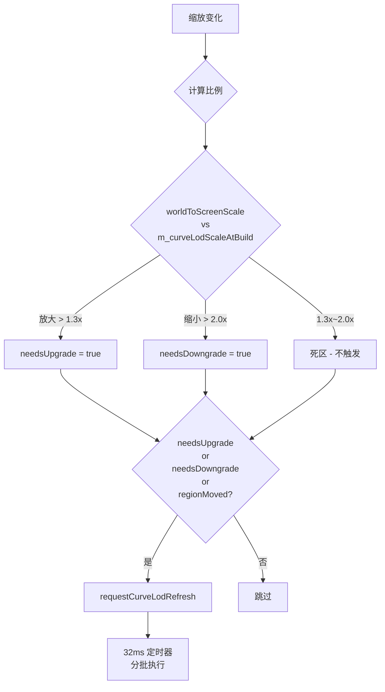
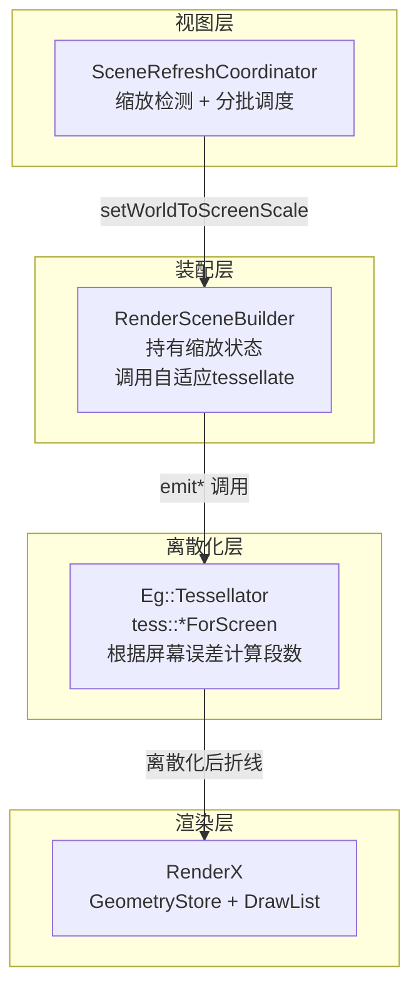

# LOD 多级细节：跨层设计

> 定位：几何离散化的精度策略，根据屏幕缩放比例动态调整曲线图元的细分程度。
> 这是**应用层主导**的改动——几何离散化本就在应用层，RenderX 基本不需要动。

***

## 1. 数据流

```mermaid
flowchart LR
    A[SyEntity<br/>圆/弧/椭圆/折线] -->|gatherGeometry()| B[ISceneGeometrySink]
    B -->|emitCircle/Arc/Ellipse| C[RenderSceneBuilder]
    C -->|自适应tessellate<br/>段位哈希增量| D[PersistentGeometryStore]
    D --> E[RenderX<br/>GeometryStore + DrawList]
    C -.->|setWorldToScreenScale()| C
```

关键事实：

1. **离散化在应用层**（`RenderSceneBuilder`），tessellate 精度由它决定。
2. **自适应段数**：使用 `tess::*ForScreen` 函数，根据屏幕弦高误差动态计算段数。
3. **缩放状态通过接口传入**：`setWorldToScreenScale()` 和 `setLodChordErrorPixels()`。

***

## 2. 设计决策

### D1 LOD 度量：屏幕空间误差

圆/弧/椭圆的段数由「曲线在屏幕上的投影大小」决定，目标是**屏幕弦高误差 ≤ 1 像素**。

* 段数 = f(世界尺寸, 缩放比例)。世界尺寸在 emit 参数里（radius），缩放比例通过接口传入。

**弦高误差公式**：

```
段数 n = π · √( screenRadius / (2 · ε) )
其中 screenRadius = worldRadius × worldToScreenScale，ε = 目标弦高误差（像素）
```

### D2 滞后机制

zoom 是连续高频操作，做法：

* **连续缩放比例 + 滞后阈值**：
  * 记录 `m_curveLodScaleAtBuild` = 上次构建时的 `worldToScreenScale`
  * **升级阈值**：`worldToScreenScale > m_curveLodScaleAtBuild * 1.3`（放大 1.3 倍以上）
  * **降级阈值**：`worldToScreenScale * 2.0 < m_curveLodScaleAtBuild`（缩小 2 倍以上）
  * 死区：1.3x ~ 2.0x 之间不触发，避免抖动

### D3 状态管理

`RenderSceneBuilder` 持有视口缩放状态：

```cpp
class RenderSceneBuilder {
    void setWorldToScreenScale(double scale);  // 世界单位 → 屏幕像素
    double worldToScreenScale() const;

    void setLodChordErrorPixels(double pixels);  // 用户可调，默认 1.0 像素
    double lodChordErrorPixels() const;
};
```

关键：内容哈希要把 `worldToScreenScale` 算进去，确保缩放变化时曲线图元触发重建。

### D4 触发通道

`SceneRefreshCoordinator` 在缩放变化时检测是否需要 LOD 重建：



* 缩放连续变化时不重置队列，继续用最新比例重建
* 跨越阈值时由独立定时器（32ms）分批执行

### D5 代价管理

* **只重建曲线类图元**：CIRCLE, ARC, ELLIPSE, BEZIER2, BEZIER, SPLINE, NURBS, SMARTLINE, POLYGON
* **按预算分批**：每帧 2000 个图元，跨多帧完成
* **视口裁剪**：只重建视口内（+ 1.25x 余量）曲线图元

***

## 3. 分层与接口



***

## 4. 关键难点与对策

| 难点 | 对策 |
| --- | --- |
| zoom 不改业务图元 | 比较 `worldToScreenScale` vs `m_curveLodScaleAtBuild` 比例判断 |
| 大量曲线重建 | 分批限流（2000个/帧，32ms 定时器） |
| 阈值抖动 | 滞后区间：升级 1.3x < 降级 2.0x |
| 连续缩放 | 不重置队列，用最新比例继续重建 |
| 视口外图元 | 只重建视口内（+ 1.25x 余量） |

***

## 5. 验收标准

* **正确性**：同一图元在各级 LOD 下视觉形状一致（屏幕误差 ≤ 1px）
* **性能**：百万级场景 zoom out 全图，单帧耗时 < 10ms
* **无回归**：增量渲染路径不受影响
* **交互无感**：LOD 切换分批完成，无单帧卡顿

***

## 6. 范围外

* 不做 3D LOD（3D 已有 `DisplayCache3D`）
* 不做折线 Douglas-Peucker 抽稀
* 不改 RenderX 公共 ABI
