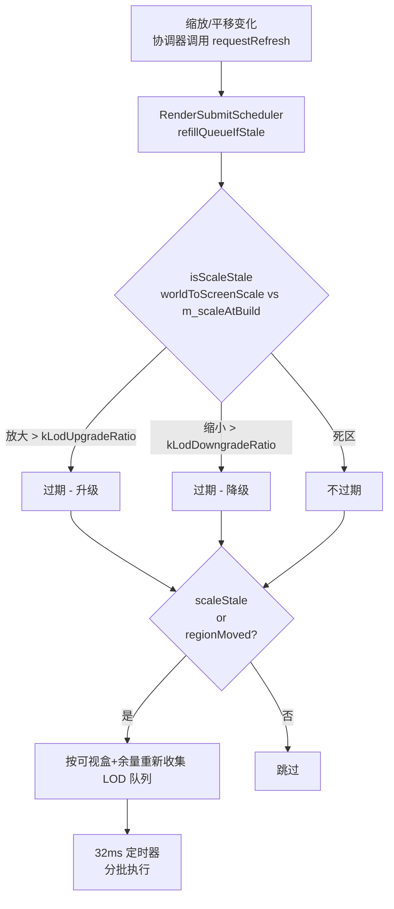
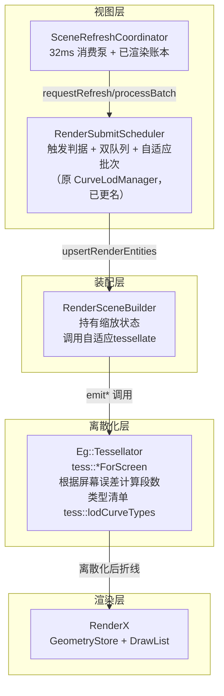

# LOD 精度自适应（习惯称「多级细节」）：跨层设计

> 定位：几何离散化的精度策略，根据屏幕缩放比例动态调整曲线图元的细分程度。
> 这是**应用层主导**的改动——几何离散化本就在应用层，RenderX 基本不需要动。
>
> **正名**：实现是「**连续自适应离散 + 滞后重建**」——按屏幕弦高误差连续选择
> 细分程度、跨过滞后阈值后批量重建，**没有多级几何缓存**（不存在 LOD 层级档位
> 或分级缓存）。标题里的「多级细节」只是沿用的习惯叫法，不要按 mip / LOD 层级
> 架构去理解本设计。

***

## 1. 数据流

```mermaid
flowchart LR
    A[AprEntity<br/>圆/弧/椭圆/折线] -->|gatherGeometry()| B[ISceneGeometrySink]
    B -->|emitCircle/Arc/Ellipse| C[RenderSceneBuilder]
    C -->|自适应tessellate<br/>顶点哈希增量| D[PersistentGeometryStore]
    D --> E[RenderX<br/>GeometryStore + DrawList]
    C -.->|setWorldToScreenScale()| C
```

关键事实：

1. **离散化在应用层**（`RenderSceneBuilder`），tessellate 精度由它决定。
2. **自适应段数**：使用 `tess::*ForScreen` 函数，根据屏幕弦高误差动态计算段数。
3. **缩放状态通过接口传入**：`setWorldToScreenScale()` 和 `setLodChordErrorPixels()`。

***

## 2. 设计决策

### D1 LOD 度量：屏幕空间误差

圆/弧/椭圆的段数由「曲线在屏幕上的投影大小」决定，目标是**屏幕弦高误差 ≤ 1 像素**。

* 段数 = f(世界尺寸, 缩放比例)。世界尺寸在 emit 参数里（radius），缩放比例通过接口传入。

**弦高误差公式**：

```
段数 n = π · √( screenRadius / (2 · ε) )
其中 screenRadius = worldRadius × worldToScreenScale，ε = 目标弦高误差（像素）
```

极端缩放下公式会解出海量顶点，输出规模同时受**离散上界**钳制（见 D6）。

### D2 滞后机制

zoom 是连续高频操作，做法：

* **连续缩放比例 + 滞后阈值**（判据收敛为纯函数 `RenderSubmitScheduler::isScaleStale`，可直测）：
  * 记录 `m_scaleAtBuild` = 上次收集队列时的 `worldToScreenScale`
  * **升级阈值**：`worldToScreenScale > m_scaleAtBuild * kLodUpgradeRatio`（放大 1.3 倍以上）
  * **降级阈值**：`worldToScreenScale * kLodDowngradeRatio < m_scaleAtBuild`（缩小 2 倍以上）
  * 死区：1.3x ~ 2.0x 之间不触发，避免抖动
* 阈值常量（`kLodUpgradeRatio = 1.3`、`kLodDowngradeRatio = 2.0`）与收集余量
  `kCollectBoxMargin = 1.25`、批次预算 `kBatchBudgetMs` 等调参值**全部收敛在
  `RenderSubmitScheduler` 的 public static constexpr**，测试与文档引用同一份。

### D3 状态管理

`RenderSceneBuilder` 持有视口缩放状态：

```cpp
class RenderSceneBuilder {
    void setWorldToScreenScale(double scale);  // 世界单位 → 屏幕像素
    double worldToScreenScale() const;

    void setLodChordErrorPixels(double pixels);  // 用户可调，默认 1.0 像素
    double lodChordErrorPixels() const;
};
```

关键：重建触发靠**顶点哈希**间接覆盖缩放变化，`worldToScreenScale` 不直接进哈希——
缩放变化改变弦高容差，离散结果（顶点序列）随之变化，顶点哈希必然不同，重建自然
触发；哈希相同意味着顶点逐点一致，此时短路跳过是有意为之（省一次无意义重写），
不存在「要求哈希算缩放、代码没做」的缺口。

### D4 触发通道

触发判据**整体位于 `RenderSubmitScheduler`**（`requestRefresh` → `refillQueueIfStale`）。
`SceneRefreshCoordinator` 只持有 32ms 消费泵（`kPumpIntervalMs`）与已渲染账本，
相机变化时调用 `requestRefresh()`，判据与收集都在调度器内部完成：


```mermaid
flowchart TD
    A[缩放/平移变化<br/>协调器调用 requestRefresh] --> B[RenderSubmitScheduler<br/>refillQueueIfStale]
    B --> C{isScaleStale<br/>worldToScreenScale vs m_scaleAtBuild}
    C -->|放大 > kLodUpgradeRatio| D[过期 - 升级]
    C -->|缩小 > kLodDowngradeRatio| E[过期 - 降级]
    C -->|死区| F[不过期]
    D --> G{scaleStale<br/>or<br/>regionMoved?}
    E --> G
    F --> G
    G -->|是| H[按可视盒+余量重新收集 LOD 队列]
    G -->|否| I[跳过]
    H --> J[32ms 定时器<br/>分批执行]
```

* 缩放连续变化时不重置队列（队列未消费完只记 `m_recollectPending`，排空后重新评估），继续用最新比例重建
* 跨越阈值时由协调器持有的独立定时器（32ms，`kPumpIntervalMs`）分批执行

### D5 代价管理

* **只重建曲线类图元**：类型清单的单一来源是 `Eg::tess::lodCurveTypes()`（[TessParams.h](../../Engine/Common/Include/Engine/Render/TessParams.h)），
  当前为 CIRCLE, ARC, ELLIPSE, BEZIER2, BEZIER, SPLINE, NURBS, SMARTLINE, POLYGON；
  队列收集的谓词 `Eg::tess::isLodCurveType()` 由该清单派生。POLYGON 仅在
  `hasBulges() || 顶点数 > kPolygonSimplifyMinVertices` 时入队（其余多边形离散结果与缩放无关）。
* **按预算分批（自适应）**：单批目标耗时 `kBatchBudgetMs = 6ms`，
  批量在 `kMinBatchSize = 128 ~ kMaxBatchSize = 8192` 间按上一批实测耗时反馈调节
  （超预算减半、余量充足 ×1.5），跨多帧完成
* **视口裁剪**：只重建视口内（+ `kCollectBoxMargin = 1.25` 倍余量）曲线图元
* **双队列**：LOD 精度队列之外还有**视口扩展队列**（相机移出已装配范围时，
  新进视野但从未上 GPU 的图元增量补传，替代「可视盒越界 → 整场景全量重建」）。
  消费时**扩展优先**（画面缺块比精度更新紧急），两条队列共用批次预算与提交链路；
  `markViewportReconciled` 在对账完成后清掉已作废的 LOD 队列，
  但**不动缩放基准 `m_scaleAtBuild`**（扩展只补新图元，不重刷已在 GPU 上的曲线精度）。

### D6 离散上界：顶点数封顶

极端缩放（超大半径 / 极小容差）下 D1 公式会解出海量顶点，单条曲线就能吃掉整个
批次预算甚至撑爆几何仓。为此离散输出有**硬上界**，常量单一来源在
[TessParams.h](../../Engine/Common/Include/Engine/Render/TessParams.h)：

* `kLodMaxCurvePoints = 4096`：单条曲线离散顶点数上限
* `kLodMaxCurveSubdivDepth = 12`：递归细分深度硬上限（2^12 = 4096 叶子，与点数上界
  同量级），兼作控制点 NaN/Inf 时的递归兜底（平坦度判据恒 false 也不会栈溢出）；
  精确点数上界由 curveSubdivDepthForBudget 的有效深度保证
* `curveSubdivDepthForBudget()`：把点数预算换算成有效递归深度（2^depth ≤ maxPoints - 1，
  输出点数 = 1 起点 + 叶子数 ≤ maxPoints）；复合曲线（SMARTLINE 多跨）按跨数
  摊分预算（`max(2, kLodMaxCurvePoints / segCount)`）

**取值依据**：批预算 `kBatchBudgetMs = 6ms` ÷ `kMaxBatchSize = 8192` ≈ 0.73µs/顶点，
4096 顶点 ≈ 3ms（半批预算，最坏曲线不挤占整批）；为 `kLodMaxSegments = 1024`
的 4 倍，兼容多跨样条 / SMARTLINE 拼接的密度需求。

**几何质量：钳制是「拉平」而非「截断」**——递归到深度上界的子段用弦近似覆盖
剩余参数域，不丢尾、不塌形；超界时相邻点弦高仍与容差同量级
（`ClampedChordHeightSameOrderAsTolerance` 系列回归验证）；正常缩放区间
（预算内）输出与无上界时完全一致（`NormalZoomUnchanged` 系列回归验证）。

### D7 提交失败语义：失败条目可重试、永不丢弃

批次提交可能失败（GL 上下文不可用、渲染场景无效、几何仓 allocBlock /
writeBlock / upsertDrawItem 写入失败、检查时可用提交时失败的 TOCTOU）。
失败语义分四条路径：

* **游标回退重试（主机制）**：提交失败时两队列游标回退到建批前位置，失败条目
  留在原队列原位置原样重试——不写账本、不丢弃、不重置队列进度
  （`m_recollectPending` 语义保持）。整批重试幂等：addPiece 按内容哈希短路。
* **预检挂起（整批必然失败）**：`submitAvailable()` 为假（GL 上下文不可用、
  scene 无效）时不建批、不提交、不动游标，只留 `kPumpIntervalMs` 低频探测，
  条件恢复后自动续跑——不烧 CPU、不永久卡住。
* **指数退避（残余失败）**：几何仓写入失败 / TOCTOU 按 2^(n-1) 个 tick 退避后
  原样重试，封顶 `kSubmitRetryBackoffMaxTicks = 16` 个 tick（32ms × 16 ≈ 512ms），
  最迟半秒内自动恢复重试。
* **对账兜底**：`markViewportReconciled` 丢弃未消费队列条目时，若存在未补交的
  失败条目，强制一次重收集（`m_scaleAtBuild` 归零绕过 staleness 前置门）；
  扩展队列的非曲线图元由对账账本差分 toAdd 补回（失败不写账本，必在 toAdd 里）。

***

## 3. 分层与接口


```mermaid
flowchart TB
    subgraph 视图层
        A[SceneRefreshCoordinator<br/>32ms 消费泵 + 已渲染账本]
        S[RenderSubmitScheduler<br/>触发判据 + 双队列 + 自适应批次<br/>（原 CurveLodManager，已更名）]
    end

    subgraph 装配层
        B[RenderSceneBuilder<br/>持有缩放状态<br/>调用自适应tessellate]
    end

    subgraph 离散化层
        C[Eg::Tessellator<br/>tess::*ForScreen<br/>根据屏幕误差计算段数<br/>类型清单 tess::lodCurveTypes]
    end

    subgraph 渲染层
        D[RenderX<br/>GeometryStore + DrawList]
    end

    A -->|requestRefresh/processBatch| S
    S -->|upsertRenderEntities| B
    B -->|emit* 调用| C
    C -->|离散化后折线| D
```

***

## 4. 关键难点与对策

| 难点 | 对策 |
| --- | --- |
| zoom 不改业务图元 | `isScaleStale` 比较 `worldToScreenScale` vs `m_scaleAtBuild` 比例判断 |
| 大量曲线重建 | 分批限流（`kBatchBudgetMs = 6ms` 预算自适应批量，32ms 定时器） |
| 阈值抖动 | 滞后区间：升级 `kLodUpgradeRatio = 1.3x` < 降级 `kLodDowngradeRatio = 2.0x` |
| 连续缩放 | 不重置队列，用最新比例继续重建 |
| 视口外图元 | 只重建视口内（+ `kCollectBoxMargin = 1.25x` 余量） |
| 相机移出已装配范围 | 视口扩展队列增量补传/回收，替代整场景全量重建 |
| 极端缩放顶点爆炸 | 离散上界钳制：拉平而非截断（见 D6） |
| 批次提交失败 | 游标回退重试 + 预检挂起 + 指数退避 + 对账兜底（见 D7） |

***

## 5. 验收标准

* **正确性**：同一图元在各级 LOD 下视觉形状一致（屏幕误差 ≤ 1px）
  —— **待基准验证**（离散化单元测试按弦高公式间接覆盖，真机基准未跑）
* **性能**：百万级场景 zoom out 全图，单帧耗时 < 10ms —— **待基准验证**
* **无回归**：增量渲染路径不受影响
* **交互无感**：LOD 切换分批完成，无单帧卡顿

***

## 6. 范围外

* 不做 3D LOD（3D 已有 `DisplayCache3D`）
* 不改 RenderX 公共 ABI

> 注：「不做折线 Douglas-Peucker 抽稀」已不成立 —— POLYGON 在 zoom out 时
> 走 Douglas-Peucker 简化、带 bulge 的多段线按弦高容差展开（见 D5 的 POLYGON 入队判据）。
