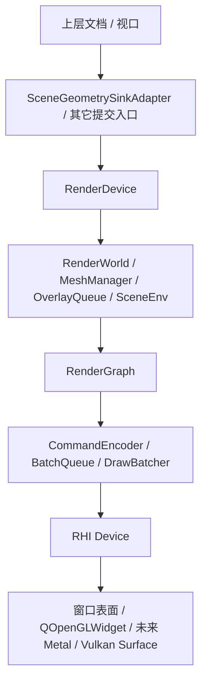
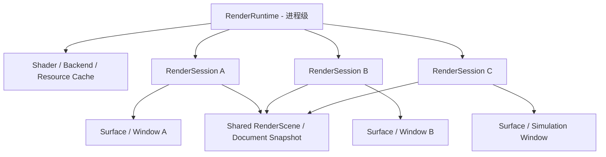

# RenderX 问题分析与重构路线图

> 适用目标：大型激光加工软件底层渲染 DLL。  
> 目标场景：2D / 3D 可切换，多窗口共存，未来可挂接仿真窗口、预览窗口、测量窗口等不同渲染宿主。  
> 关键约束：硬件驱动暂不讨论，只看 RenderX 自身的框架、数据流、性能边界、跨平台能力与重构路线。  
> 本文写法：尽量按现有代码事实来分析，不按愿景写。

---

## 0. 先说结论

RenderX 现在不是“一个很薄的图形 API”，而是一个已经长出很多子系统的渲染运行时：

- 有 C API façade；
- 有 `RenderDevice`；
- 有 2D 场景世界；
- 有 3D 网格管理；
- 有 overlay / text / scene env；
- 有命令编码器；
- 有渲染图；
- 有 pipeline 缓存；
- 有持久图元管理器；
- 还有 RHI 设备抽象。

这说明它的方向不是错的，甚至已经比很多“把 OpenGL 直接塞进 UI”的工程更像平台了。

但如果我们把目标定得更高一点——

“RenderX 作为底层统一渲染 DLL，要给 2D 编辑、3D 视图、仿真窗口、预览窗口等多个宿主复用，并且未来要跨平台，MacOS 上不一定用 OpenGL”

那么当前架构还不够稳，核心原因有四个：

1. 现在的多后端是“类型上预留”，不是“实现上成立”；
2. 2D / 3D 的内部数据流还没有完全统一；
3. RenderX 仍然夹杂一些全局状态、过渡层和隐式假设；
4. 当前高性能路径里仍有“每帧全量同步、GPU 回读、OpenGL 4.6 依赖”这类跨平台和大图元风险。

所以我的判断是：

> RenderX 现在是一个“有骨架、有方向、但还没收敛成真正稳定平台层”的中期渲染框架。

如果后期要稳，我建议不要把它继续当成“OpenGL 渲染库”来理解，而要把它收敛成：

**RenderX Runtime + RenderSession + SceneCompiler + BackendDriver**

这会是更稳的终态。

---

## 1. RenderX 现在到底是什么

### 1.1 当前真实定位

从代码看，RenderX 目前承担的不是单一职责，而是“渲染平台的一整个半边”：

- 对外提供统一 C API；
- 对内管理渲染世界、网格、叠加层、文本、场景环境；
- 对 GPU 提供 RHI 封装；
- 对上层提供 2D / 3D 两类渲染模式；
- 对当前窗口提供一整套生命周期管理。

对应文件：

- [Renderx/include/render/render.h](C:\Users\xx\Documents\Cpp\CAD\Renderx\include\render\render.h)
- [Renderx/include/render/render_types.h](C:\Users\xx\Documents\Cpp\CAD\Renderx\include\render\render_types.h)
- [Renderx/src/c_api/render_c_api_internal.h](C:\Users\xx\Documents\Cpp\CAD\Renderx\src\c_api\render_c_api_internal.h)
- [Renderx/src/c_api/render_c_api_device.cpp](C:\Users\xx\Documents\Cpp\CAD\Renderx\src\c_api\render_c_api_device.cpp)
- [Renderx/src/c_api/render_c_api_frame.cpp](C:\Users\xx\Documents\Cpp\CAD\Renderx\src\c_api\render_c_api_frame.cpp)
- [Renderx/src/c_api/render_c_api_entity.cpp](C:\Users\xx\Documents\Cpp\CAD\Renderx\src\c_api\render_c_api_entity.cpp)
- [Renderx/src/c_api/render_c_api_overlay.cpp](C:\Users\xx\Documents\Cpp\CAD\Renderx\src\c_api\render_c_api_overlay.cpp)

### 1.2 现有模块组成

| 模块 | 当前职责 | 评价 |
|---|---|---|
| `RenderDevice` | 把所有渲染状态、资源、队列、图元池都收在一个实例里 | 适合“每窗口一份”宿主，但职责过厚 |
| `RenderWorld` | 2D 图元管理、顶点池、四叉树、脏列表、材质 | 很好，是当前最像核心域的部分 |
| `BatchQueue` | 可见图元分组、间接绘制命令生成 | 方向正确 |
| `OverlayQueue` | 交互叠加层与 UI 视觉元素 | 实用，但长期要收敛成更通用的 overlay/annotation 模型 |
| `TextAtlas` / `ScreenTextRenderer` | 世界文本 / 屏幕文本 | 分层合理 |
| `SceneEnv` | 网格背景、环境图元 | 合理，但偏“场景附属物” |
| `MeshManager` | 3D 网格注册与实例渲染 | 能用，但当前容量与后端绑定都偏硬 |
| `CommandEncoder` | 统一命令排序与绑定 | 适合做中间层 |
| `RenderGraph` | 显式 Pass 顺序执行 | 现在是线性调度器，不是完整 frame graph |
| `PipelineStateManager` | 管线缓存 | 很有必要 |
| `DrawBatcher` | overlay 合批 | 是向 GPU 批处理迈进的方向 |
| `PersistentEntityManager` | 持久图元 SSBO + GPU 剔除 | 说明 RenderX 已经在走 GPU 化路线 |
| `rhi::IDevice` | 后端硬件抽象 | 设计是对的，但实现目前还不完整 |

### 1.3 RenderX 的“真实数据流”

RenderX 现在不是单纯的“画一帧就结束”，而是一个混合了：

- 文档提交；
- 场景编译；
- 资源上传；
- GPU 视图剔除；
- Pass 编排；
- 命令执行；
- 文本渲染；
- 呈现交换

的混合流水线。

大致流程可以概括成：

在 2D 路径里，核心是：

- 文档几何被编译成 `GeometryPrimitive`；
- 进入 `renderSubmitGeometry()`；
- 落入 `RenderWorld`；
- 之后由 `renderFrame()` 统一编排 Pass 并渲染。

在 3D 路径里，核心是：

- 网格注册进 `MeshManager`；
- 实例进入实例缓冲；
- `renderFrame()` 的 3D 分支负责绘制。

也就是说，RenderX 现在是“统一渲染运行时”，不是单纯的“画图 API”。

---

## 2. 现在的渲染主链到底怎么走

### 2.1 2D 主链

2D 视图在 UI 层的典型链路是：

1. `RenderWidget` 创建 `RenderDevice`
2. 视图矩阵通过 `renderSetView2D()` 写入
3. 文档或场景通过 `SceneGeometrySinkAdapter` 转成 `GeometryPrimitive`
4. `renderSubmitGeometry()` 写入 `RenderWorld`
5. `paintGL()` 调 `renderFrame()`
6. `renderFrame()` 执行场景同步、剔除、批处理、overlay、文本、呈现

对应文件：

- [UI/2D/Src/Ui/ViewWidget/RenderWidget.cpp](C:\Users\xx\Documents\Cpp\CAD\UI\2D\Src\Ui\ViewWidget\RenderWidget.cpp)
- [UI/2D/Src/Ui/ViewWidget/SceneGeometrySinkAdapter.cpp](C:\Users\xx\Documents\Cpp\CAD\UI\2D\Src\Ui\ViewWidget\SceneGeometrySinkAdapter.cpp)
- [Renderx/src/c_api/render_c_api_frame.cpp](C:\Users\xx\Documents\Cpp\CAD\Renderx\src\c_api\render_c_api_frame.cpp)

更具体一点，`paintGL()` 里有两条分支：

- 脏场景：先 `submitSceneFromDataSource()`，再 `renderFrame()`
- 非脏场景：尽量复用已提交的几何，只重新提交屏幕文本，然后 `renderFrame()`

这一点很重要，因为它说明 RenderX 不是纯 immediate-mode，它已经开始做“保留式场景 + 每帧渲染”的混合模型。

### 2.2 2D 全量提交与增量提交是分开的

当前 2D 里最值得保留的一点，是它明确区分了：

- 全量重建
- 增量修改

`submitSceneFromDataSource()` 是全量重建路径，用于：

- 首次加载
- 导入后重建
- FullRefresh

而高频交互应该走：

- `addRenderEntity()`
- `modifyRenderEntity()`
- `removeRenderEntity()`

这比“每次都全量重建”要健康很多。

不过，现有实现仍然有一个现实问题：  
`renderFrame()` 内部会把 `RenderWorld` 同步到 `PersistentEntityManager`，并且每帧还要做 GPU 剔除和可见性回读。  
这说明它虽然已经有增量意图，但还没有完全把热路径从“同步式”进化成“真正事件驱动式”。

### 2.3 3D 主链

RenderX 自己内部的 3D 路径主要由：

- `MeshManager`
- `ViewDesc3D`
- `renderSetView3D()`
- `renderSetViewMode(ViewMode::Mode3D)`
- `renderFrame()` 的 3D 分支

构成。

`renderFrame()` 的 3D 分支目前比较简单：

- 设置深度测试和混合；
- 如果有实例，就更新网格并绘制；
- 依赖 `MeshManager` 做实例管理和可见性处理。

对应文件：

- [Renderx/src/core/mesh_manager.h](C:\Users\xx\Documents\Cpp\CAD\Renderx\src\core\mesh_manager.h)
- [Renderx/src/core/mesh_manager.cpp](C:\Users\xx\Documents\Cpp\CAD\Renderx\src\core\mesh_manager.cpp)
- [Renderx/src/c_api/render_c_api_frame.cpp](C:\Users\xx\Documents\Cpp\CAD\Renderx\src\c_api\render_c_api_frame.cpp)

这里的判断很直接：

> RenderX 内部已经有 2D 和 3D 两条渲染路径，但 2D 路径比 3D 路径成熟得多。

### 2.4 overlay / text / scene env 是独立附属层

这一点设计得还不错：

- `OverlayQueue` 专门负责十字准星、捕捉点、选择框、预览线、手柄等；
- `TextAtlas` / `ScreenTextRenderer` 处理世界文本和屏幕文本；
- `SceneEnv` 管理背景网格、地面、辅助线等场景环境。

这样不会把这些 UI 视觉元素和文档几何混成一团。

对应文件：

- [Renderx/src/core/overlay_queue.h](C:\Users\xx\Documents\Cpp\CAD\Renderx\src\core\overlay_queue.h)
- [Renderx/src/c_api/render_c_api_overlay.cpp](C:\Users\xx\Documents\Cpp\CAD\Renderx\src\c_api\render_c_api_overlay.cpp)
- [Renderx/src/core/text_atlas.h](C:\Users\xx\Documents\Cpp\CAD\Renderx\src\core\text_atlas.h)
- [Renderx/src/core/screen_text_renderer.h](C:\Users\xx\Documents\Cpp\CAD\Renderx\src\core\screen_text_renderer.h)
- [Renderx/src/core/scene_env.h](C:\Users\xx\Documents\Cpp\CAD\Renderx\src\core\scene_env.h)

---

## 3. 多窗口能力：现在其实是“可行，但还没统一”

### 3.1 当前多窗口的真实形态

RenderX 现在天然支持“每窗口一份渲染设备”，因为 `RenderWidget` 在 `initializeGL()` 里会：

- 创建自己的 `RenderDevice`
- 绑定自己的视口大小
- 绑定自己的 view matrix
- 在销毁时销毁自己的设备

对应文件：

- [UI/2D/Src/Ui/ViewWidget/RenderWidget.cpp](C:\Users\xx\Documents\Cpp\CAD\UI\2D\Src\Ui\ViewWidget\RenderWidget.cpp)

所以从“架构天然支持多个窗口”这个角度看，它是成立的。

但要注意，这种支持方式是“每窗口各持有一份 device / world / buffer / command graph”，不是“共享一个 runtime 供多个 session 使用”。

这意味着：

- 多窗口能跑；
- 但资源会重复；
- 场景数据会重复提交；
- GPU buffer 会重复占用；
- shader / font / backend 初始化有可能带有进程级共享假设；
- 不同窗口之间没有正式的共享会话层。

### 3.2 现在的好处

这种设计的优点是：

- 窗口之间隔离好；
- 某个窗口崩了不容易牵连另一个窗口；
- 单窗口逻辑简单；
- 适合尽快落地。

### 3.3 现在的代价

代价也很明显：

- 如果两个窗口显示同一份场景，数据会重复编译；
- 如果仿真窗口、预览窗口、主编辑窗口同时打开，后台资源占用会上升；
- 共享资源的策略不清晰；
- 没有“共享 scene / 多 view / 多 session”的显式结构；
- 渲染状态、相机、overlay、文本、选择状态全都绑在 device 里，长期不好复用。

### 3.4 我建议的多窗口终态

更稳的做法不是“一个 device 管所有窗口”，也不是“每个窗口各写一套渲染库”，而是：

- 一个进程级 `RenderRuntime`
- 多个窗口级 `RenderSession`
- 一个统一的 `RenderSceneCompiler`
- 多个窗口级 `RenderSurfaceAdapter`

可以理解为：

这个结构的核心好处是：

- 共享引擎能力；
- 每个窗口有独立视图、相机、overlay、焦点、交互状态；
- 场景编译结果可以共享或增量复制；
- 后续添加仿真窗口、剖面窗口、预览窗口时，不需要复制一整套 RenderX。

---

## 4. RenderX 现在的强项

### 4.1 2D 场景管理方向是正确的

RenderX 的 2D 部分不是“每帧重新乱画”，它已经有：

- 顶点池
- 空闲链表
- 脏列表
- 四叉树
- 批处理队列
- 命令编码器
- 渲染图
- 文本渲染

这套组合是有产品意识的，不是 demo 结构。

### 4.2 统一命令编码器思路很好

`CommandEncoder` 把 world 和 overlay 放到同一条排序 / 执行链上，这很重要，因为它减少了“谁先画、谁后画”的散乱逻辑。

对应文件：

- [Renderx/src/core/command_encoder.h](C:\Users\xx\Documents\Cpp\CAD\Renderx\src\core\command_encoder.h)

它做的事情是：

- 收集绘制意图；
- 按 sortKey 排序；
- 绑定 pipeline；
- 执行命令。

这是未来做多窗口、多 pass、多后端时非常有价值的中间层。

### 4.3 `RenderGraph` 虽然还简单，但方向对

RenderGraph 现在只是线性顺序执行器，不是完整 DAG frame graph。  
但它至少把“渲染流程”显式化了，而不是散落在各个 widget 里。

对应文件：

- [Renderx/src/core/render_graph.h](C:\Users\xx\Documents\Cpp\CAD\Renderx\src\core\render_graph.h)

这点很重要，因为它让未来的：

- simulation pass
- post-process pass
- overlay pass
- picking pass
- export pass

都有机会变成显式阶段，而不是插在某个 widget 的 paintEvent 里。

### 4.4 3D 资产管理比很多 2D 平台成熟

`MeshManager`、`PersistentEntityManager` 说明 RenderX 已经在面向“重资源管理”设计，不只是轻量绘制。

特别是 `PersistentEntityManager`：

- 有 SSBO 思路；
- 有 compute culling；
- 有 indirect command generation；
- 有可见性缓冲；

这说明 RenderX 已经在向 GPU-driven / retained GPU state 进化。

对应文件：

- [Renderx/src/core/persistent_entity_manager.h](C:\Users\xx\Documents\Cpp\CAD\Renderx\src\core\persistent_entity_manager.h)

---

## 5. 现在的短板和风险

### 5.1 最大短板：多后端还没有落地

这个要说得很直接：

RenderX 当前的 `BackendType` 里虽然写了：

- OpenGL
- Vulkan
- Metal
- Null

但真正实现上，当前构建链和创建链路仍然是 OpenGL-only。

证据：

- [Renderx/src/c_api/render_c_api_device.cpp](C:\Users\xx\Documents\Cpp\CAD\Renderx\src\c_api\render_c_api_device.cpp)
- [Renderx/CMakeLists.txt](C:\Users\xx\Documents\Cpp\CAD\Renderx\CMakeLists.txt)

`renderCreateDevice()` 里现在只真正创建 OpenGL 设备；  
`Renderx/CMakeLists.txt` 里也只链接了 OpenGL 实现。

所以当前状态不是“多后端渲染库”，而是：

> “OpenGL 实现 + 多后端类型预留 + RHI 接口雏形”

这不是坏事，但它决定了后续路线一定不能跳步。

### 5.2 MacOS 兼容性风险非常明确

这里不是泛泛而谈，而是代码层面的现实问题：

- `RenderWidget` 请求了 OpenGL 4.6 core profile；
- RenderX 使用了 compute shader、SSBO、indirect draw、persistent mapping 这类更偏现代 GL 的能力；
- MacOS 系统 OpenGL 只到 4.1，而且 Apple 已经长期不再推进 OpenGL。

所以如果 MacOS 是正式目标，当前 OpenGL 路线不能作为终局方案。

结论很明确：

> 在 MacOS 上，RenderX 未来需要 Metal，或者至少要有一个真正可用的非 OpenGL 后端。  
> 仅靠当前 OpenGL 路线，不足以支撑你描述的跨平台目标。

对应文件：

- [UI/2D/Src/Ui/ViewWidget/RenderWidget.cpp](C:\Users\xx\Documents\Cpp\CAD\UI\2D\Src\Ui\ViewWidget\RenderWidget.cpp)
- [Renderx/include/render/render_types.h](C:\Users\xx\Documents\Cpp\CAD\Renderx\include\render\render_types.h)

### 5.3 `RenderDevice` 太厚了

现在 `RenderDevice` 里同时放了：

- 后端指针
- 2D world
- 3D mesh
- overlay
- text
- scene env
- command encoder
- render graph
- pipeline cache
- draw batcher
- persistent entity manager
- 视图模式
- 清屏颜色
- 视图矩阵
- 统计
- 屏幕文本缓存
- viewport 尺寸
- entity id 计数器
- camera center

这意味着它既像：

- session 容器；
- 又像 scene 容器；
- 又像 backend 容器；
- 还像资源缓存容器。

短期它能用，长期它会成为扩展的重心负担。

对应文件：

- [Renderx/src/c_api/render_c_api_internal.h](C:\Users\xx\Documents\Cpp\CAD\Renderx\src\c_api\render_c_api_internal.h)

### 5.4 2D / 3D 的生命周期模型并不完全一致

RenderX 内部现在存在三种不同生命周期：

- 2D world：经常会被 `renderBeginScene()` 清空，偏重建式；
- 3D mesh：更偏持久化实例式；
- overlay / screen text：更偏 transient / per-frame 式。

这三种模型都合理，但放在同一个 `RenderDevice` 里时，很容易让上层误解：

- 什么时候该重建？
- 什么时候该增量更新？
- 哪些是常驻资源？
- 哪些是每帧临时资源？

如果不把这几类资源边界明确下来，后面就会越来越乱。

### 5.5 `renderFrame()` 热路径里还有同步点

在 2D 路径里，`renderFrame()` 现在会做这些事情：

- `syncWorldToPersistentManager()`：把 RenderWorld 全量同步到持久图元管理器
- `uploadChanges()`
- `executeCulling()`
- `generateIndirectCommands()`
- `readBackGpuVisibility()`
- 回退 CPU 四叉树查询

也就是说，这条链路里仍然有明显的 CPU-GPU 同步行为，尤其是 `readBackGpuVisibility()` 会造成潜在阻塞。

这对小中型场景没问题，但如果你要把它当成“海量图元 + 高频编辑 + 多窗口共存”的主引擎，这个热路径需要继续收敛。

对应文件：

- [Renderx/src/c_api/render_c_api_frame.cpp](C:\Users\xx\Documents\Cpp\CAD\Renderx\src\c_api\render_c_api_frame.cpp)

### 5.6 3D 侧容量还偏保守

`MeshManager` 里有 `MAX_INSTANCES = 512` 这种明显的 UBO 容量上限，这在复杂 3D 或仿真窗口里很快就会不够。

对应文件：

- [Renderx/src/core/mesh_manager.h](C:\Users\xx\Documents\Cpp\CAD\Renderx\src\core\mesh_manager.h)

这意味着 3D 侧如果想上更大的实例数量，迟早要迁移到更强的实例缓冲方案，例如：

- SSBO
- texture buffer
- 更大的 instance streaming
- 或 GPU-driven instancing

### 5.7 shader 管理有全局状态味道

`shader::initialize()` 会把 shader 源码读入一组静态字符串指针里。  
这意味着 shader 资源更像“进程级共享资源”，而不是严格的“每个渲染会话独立资源”。

对应文件：

- [Renderx/src/shader/shaders.cpp](C:\Users\xx\Documents\Cpp\CAD\Renderx\src\shader\shaders.cpp)
- [Renderx/src/shader/shaders.h](C:\Users\xx\Documents\Cpp\CAD\Renderx\src\shader\shaders.h)

这在单窗口、单主题、单 shader 包的阶段问题不大。  
但如果后面要做：

- 多窗口独立 shader 主题
- 调试窗口和正式窗口不同 shader 组合
- 热更新
- 插件式 shader

那现在这种全局静态管理方式就不够稳。

### 5.8 现有 RenderGraph 还是线性的，不是真正依赖图

现在 `RenderGraph` 的实现是“按添加顺序执行”。  
这非常适合作为过渡架构，但它还不是真正意义上的图调度器。

对应文件：

- [Renderx/src/core/render_graph.h](C:\Users\xx\Documents\Cpp\CAD\Renderx\src\core\render_graph.h)

问题不是它现在不能用，而是：

- 一旦仿真窗口、离屏窗口、后处理窗口、导出窗口都要接入，它就会很快不够表达依赖关系；
- 资源读写冲突、阶段屏障、并行执行都还没落地。

### 5.9 当前应用层 3D 还没完全收敛到 RenderX

这是个非常重要但容易被忽略的事实：

- RenderX 自己内部已经有 3D 相关能力；
- 但应用层 3D 工作台仍有自己的 `RenderWidget3D` / `RenderWidget3DAdapter` / `Engine3D` 链路；
- 它并不是完全由 RenderX 统一承载。

对应文件：

- [Main/Src/UI/Render/RenderWidget3DAdapter.cpp](C:\Users\xx\Documents\Cpp\CAD\Main\Src\UI\Render\RenderWidget3DAdapter.cpp)
- [UI/3D/Src/Render/RenderWidget3D.cpp](C:\Users\xx\Documents\Cpp\CAD\UI\3D\Src\Render\RenderWidget3D.cpp)

这说明目前的工程状态是：

> RenderX 是统一底层的方向，但应用层还没有完全收敛到它。

如果后面不处理，这会让“2D 在 RenderX，3D 在另一套栈”的割裂长期存在。

---

## 6. 大图元量到底能不能扛住

### 6.1 目前已经具备的大图元能力

RenderX 不是在纯 CPU 线性画图，它已经有不少大场景应对能力：

- `RenderWorld` 顶点池 + 稀疏索引映射；
- `RenderWorld` 四叉树；
- `BatchQueue` 分组；
- `CommandEncoder` 排序；
- `PipelineStateManager` 管线缓存；
- `PersistentEntityManager` SSBO + GPU culling；
- `DrawBatcher` 对 overlay 做合批；
- 文本渲染和 scene env 分层。

这些东西加起来，说明它不是一个“小数据量渲染玩具”。

### 6.2 但当前 hot path 仍然有几类瓶颈

#### 瓶颈 1：每帧全量同步到持久图元管理器

`renderFrame()` 2D 路径里会把 `RenderWorld` 里的实体同步到 `PersistentEntityManager`。  
这会让帧循环对 CPU 数据整理很敏感。

这在几千到几万图元时通常还能接受；  
但如果数据量再上一个量级，且窗口数增加，就需要更强的增量策略。

#### 瓶颈 2：GPU 剔除结果回读

`readBackGpuVisibility()` 会把可见性结果从 GPU 读回 CPU。  
这很可能会引入 stall，削弱 GPU-driven 的收益。

#### 瓶颈 3：2D / 3D 混合资源路径

2D 的 retained scene、3D 的 mesh instance、overlay 的 transient data、文本的 per-frame cache 现在都在同一个 `RenderDevice` 里跑。  
对性能来说，这会让资源生命周期更复杂，也更难做统一优化。

#### 瓶颈 4：3D 侧实例上限偏低

`MAX_INSTANCES = 512` 这个量级对真正复杂的 3D / 仿真窗口偏小。

#### 瓶颈 5：OpenGL 4.6 依赖

这个会把平台限制和性能假设一起带上来。  
尤其在 MacOS 上，很多现代 GL 能力根本不成立。

### 6.3 我对可承载图元量级的判断

只看现在的结构，我会这么判断：

| 量级 | 预期情况 |
|---|---|
| 几千图元 | 很轻松 |
| 几万图元 | 结构上可承载，需看更新频率和文本/overlay 密度 |
| 十几万图元 | 开始要非常关注同步、回读、窗口数量和 GPU 内存 |
| 更大规模 | 需要把 RenderX 的场景编译、增量上传、后端能力再往前推一档 |

这不是绝对数字，而是架构判断。

结论是：

> RenderX 已经有“大图元渲染”的骨架，但如果你要把“海量图元、多窗口、多模式、跨平台”四个目标同时拉满，它还需要继续重构。

---

## 7. 我建议的未来架构

如果我们把 RenderX 作为长期稳定底座，我建议把它拆成四层：

### 7.1 第 1 层：Public Render Facade

对外只保留稳定 C API，负责：

- 创建 / 销毁会话
- 设置视口 / 相机 / 模式
- 提交场景 / overlay / text / mesh
- 提交帧
- 读取统计

这层应该尽量稳定，不能频繁改。

### 7.2 第 2 层：RenderSession

每个窗口、每个宿主、每个独立视图，都有自己的 RenderSession。

它负责：

- 当前相机
- viewport
- 当前 view mode
- overlay state
- 选择状态
- 屏幕文本状态
- 当前 scene snapshot

这个层是“窗口实例级”的，不是“全局级”的。

### 7.3 第 3 层：SceneCompiler / FrameBuilder

它负责把上层数据转成 RenderX 可执行的数据：

- 几何编译
- 文本编译
- overlay 编译
- 3D mesh 编译
- 资源更新计划
- dirty region / dirty entity 合并

这是后续提升大图元性能的关键层。

### 7.4 第 4 层：BackendDriver / RHI

这层负责：

- OpenGL / Vulkan / Metal 的统一抽象
- buffer / texture / pipeline / pass / present
- 平台 surface 绑定

这层才是真正决定跨平台能力的地方。

---

## 8. 详细重构路线图

下面这部分是给后续开发直接照着做的。  
我按“短期能改 / 中期重构 / 长期平台化”来分。

---

### 8.1 短期能改：先把 RenderX 变稳

目标：不推翻现有结构，先让当前渲染链更清晰、更少隐患。  
建议周期：1 ～ 4 周。

#### 任务 1：把 RenderX 的真实定位写清楚

要做的事：

- 文档和代码注释里明确：当前 RenderX 是 OpenGL-first；
- 不要把 Vulkan / Metal 写成“已经完成”；
- 让 `BackendType` 成为“能力预留”，不是“能力现状”。

落点文件：

- [Renderx/README.md](C:\Users\xx\Documents\Cpp\CAD\Renderx\README.md)
- [Renderx/include/render/render_types.h](C:\Users\xx\Documents\Cpp\CAD\Renderx\include\render\render_types.h)
- [Renderx/src/c_api/render_c_api_device.cpp](C:\Users\xx\Documents\Cpp\CAD\Renderx\src\c_api\render_c_api_device.cpp)

#### 任务 2：把 RenderDevice 的职责边界先说清

要做的事：

- 先不强拆 `RenderDevice`，但把它视作“单窗口渲染会话容器”；
- 把“会话级状态”和“共享级资源”先在概念上分开；
- 不要再往里无止境增加全局型字段。

建议原则：

- session 级：view、overlay、text、selection、stats
- scene 级：world2D、meshManager、environment
- backend 级：rhiDevice、shader cache、pipeline cache

#### 任务 3：把 shader 管理从隐式全局收成显式资源层

现在的 `shader::initialize(shaderDir)` 是全局静态字符串模式。  
短期至少要做到：

- 明确它是进程级共享；
- 允许在文档里注明“当前不是 per-window 独立 shader 资源”；
- 后续准备迁移到 `RenderRuntime` 管理。

落点文件：

- [Renderx/src/shader/shaders.cpp](C:\Users\xx\Documents\Cpp\CAD\Renderx\src\shader\shaders.cpp)

#### 任务 4：确认多窗口模型

当前最合理的策略是：

- 一个窗口对应一个 `RenderDevice`
- 每个窗口独立 `RenderSession`
- 如果未来想共享资源，再补 `RenderRuntime`

不要反过来先把多个窗口硬塞进一个全局 device，那个会很难维护。

#### 任务 5：给 `renderBeginScene()` 和 `renderSubmitGeometry()` 设定语义边界

建议在文档和接口层明确：

- `renderBeginScene()` 是“场景重建入口”，不是每帧都应该调用；
- `renderSubmitGeometry()` 是“场景编译提交入口”，不是所有 overlay 的入口；
- overlay / text / mesh / env 不要再混着用。

落点文件：

- [Renderx/src/c_api/render_c_api_frame.cpp](C:\Users\xx\Documents\Cpp\CAD\Renderx\src\c_api\render_c_api_frame.cpp)
- [Renderx/src/c_api/render_c_api_overlay.cpp](C:\Users\xx\Documents\Cpp\CAD\Renderx\src\c_api\render_c_api_overlay.cpp)

#### 任务 6：先把 MacOS 兼容性风险说死

现在代码里有 OpenGL 4.6 请求和 compute shader 路线。  
如果未来 MacOS 是目标，请在文档里明确：

- 不能依赖系统 OpenGL 继续扩展；
- 必须有 Metal 或等价后端；
- 不能把 OpenGL-only 当成跨平台方案。

这一步不是代码修改，而是路线收敛。

---

### 8.2 中期重构：把 RenderX 变成真正的平台层

目标：让 2D / 3D / 仿真窗口都能复用同一套渲染平台能力。  
建议周期：1 ～ 3 个月。

#### 任务 1：拆出 RenderRuntime

职责：

- 维护 shader / pipeline / font / backend factory 的共享资源；
- 维护全局 capability；
- 维护进程级服务；
- 不直接持有窗口级 view 状态。

#### 任务 2：把 RenderDevice 变成 RenderSession

职责：

- 单窗口
- 单视图
- 单相机
- 单 overlay
- 单 text state
- 单 scene snapshot

这样每个窗口都很干净，不会互相污染。

#### 任务 3：建立统一 SceneCompiler

它应该负责把不同来源的数据编译成 RenderX 所需的中间表示：

- 2D 文档几何
- 3D 网格
- 仿真数据
- 标注 / 预览 / 交互层

这个阶段建议让 `SceneGeometrySinkAdapter` 演进成更正式的编译器接口。

对应文件：

- [UI/2D/Src/Ui/ViewWidget/SceneGeometrySinkAdapter.cpp](C:\Users\xx\Documents\Cpp\CAD\UI\2D\Src\Ui\ViewWidget\SceneGeometrySinkAdapter.cpp)

#### 任务 4：把 2D / 3D 资源模型统一起来

建议统一成四类：

- persistent geometry
- transient overlay
- screen text
- environment / helper geometry

然后 2D / 3D / 仿真窗口只是不同的渲染配置，而不是不同的数据结构。

#### 任务 5：升级 RenderGraph

现在是线性 pass scheduler。  
中期要让它至少具备：

- pass 依赖描述
- 资源读写声明
- 顺序稳定性
- 可扩展到离屏渲染 / post-process / picking / export

#### 任务 6：升级 MeshManager

当前 3D 实例上限太保守。  
中期建议让 MeshManager 变成：

- 大容量实例流
- 不依赖 512 这种 UBO 上限
- 能承载仿真场景或 3D 预览窗口

#### 任务 7：把 backend 真的做成多实现

建议顺序：

1. 先保留 OpenGL 作为可工作的基线
2. 再补真正的 Null backend
3. 再引入 Metal 或 Vulkan 的独立实现

注意：

- 不要把 Metal / Vulkan 当成 OpenGL wrapper；
- 不要在 UI 层暴露 backend 细节；
- 不要让不同后端共享不该共享的实现代码。

---

### 8.3 长期平台化：把 RenderX 变成多宿主渲染平台

目标：RenderX 不只是 CAD 的底层，还能服务仿真、检测、预览、批量导出等不同窗口类型。  
建议周期：3 个月以上。

#### 任务 1：明确“宿主类型”与“渲染能力”分离

宿主类型可以有：

- CAD 编辑窗口
- 3D 预览窗口
- 仿真窗口
- 检测窗口
- 轻量预览窗口

渲染能力则由能力组合决定：

- 2D 视图
- 3D 视图
- overlay
- text
- offscreen
- post-process
- picking

两者不要绑死。

#### 任务 2：引入共享资源池

长期上，RenderX 应该有一个共享资源池，至少包括：

- shader
- font atlas
- pipeline cache
- 通用纹理
- 可共享的 scene cache

这样多个窗口同时打开时，资源不会无限重复。

#### 任务 3：支持离屏渲染

仿真窗口、导出窗口、截图窗口、预览窗口经常需要离屏输出。  
RenderX 后期应该把“输出目标”抽象出来，而不是只绑定屏幕窗口。

#### 任务 4：支持 capability negotiation

不同平台、不同后端、不同窗口类型，能力不同。  
RenderX 需要能告诉上层：

- 是否支持 compute
- 是否支持 MDI
- 是否支持 SSBO
- 是否支持高精度文本
- 是否支持深度缓冲
- 是否支持离屏输出

上层再根据能力选择路径。

#### 任务 5：把线程模型和上传模型补齐

长期要有：

- 渲染线程
- 数据编译线程
- 资源上传队列
- 主线程宿主交互

否则多窗口加重后，主线程会越来越沉。

---

## 9. 模块级修改路线图

下面这张表更适合后期照着改。

| 当前模块 | 当前作用 | 当前问题 | 建议目标 |
|---|---|---|---|
| [Renderx/src/c_api/render_c_api_device.cpp](C:\Users\xx\Documents\Cpp\CAD\Renderx\src\c_api\render_c_api_device.cpp) | 创建设备、设 view、设模式 | 目前只是真正创建 OpenGL 设备 | 变成 backend facade |
| [Renderx/src/c_api/render_c_api_frame.cpp](C:\Users\xx\Documents\Cpp\CAD\Renderx\src\c_api\render_c_api_frame.cpp) | 一帧渲染主循环 | 2D 热路径有全量同步和回读 | 拆成 session frame builder |
| [Renderx/src/c_api/render_c_api_entity.cpp](C:\Users\xx\Documents\Cpp\CAD\Renderx\src\c_api\render_c_api_entity.cpp) | 2D 图元 / 3D 网格 / 材质 | 职责较大 | 归到 scene compiler / resource manager |
| [Renderx/src/c_api/render_c_api_overlay.cpp](C:\Users\xx\Documents\Cpp\CAD\Renderx\src\c_api\render_c_api_overlay.cpp) | overlay / scene env / text | 语义较杂 | 拆成 annotation / helper / text 三层 |
| [Renderx/src/core/render_world.*](C:\Users\xx\Documents\Cpp\CAD\Renderx\src\core\render_world.h) | 2D 场景世界 | 未来可继续保留，但要更明确它是 scene 还是 device 内部仓库 | 成为稳定的 2D scene core |
| [Renderx/src/core/batch_queue.*](C:\Users\xx\Documents\Cpp\CAD\Renderx\src\core\batch_queue.h) | 2D 批处理 | 目前偏 world 绑定 | 提升为 scene batch compiler |
| [Renderx/src/core/overlay_queue.*](C:\Users\xx\Documents\Cpp\CAD\Renderx\src\core\overlay_queue.h) | overlay 管理 | 仍有专用类型较多 | 收敛为通用 annotation overlay |
| [Renderx/src/core/command_encoder.*](C:\Users\xx\Documents\Cpp\CAD\Renderx\src\core\command_encoder.h) | 命令排序执行 | 很适合保留 | 作为 session 内 command scheduler |
| [Renderx/src/core/render_graph.*](C:\Users\xx\Documents\Cpp\CAD\Renderx\src\core\render_graph.h) | pass 顺序执行 | 目前只是线性执行器 | 升级为真正 frame graph |
| [Renderx/src/core/persistent_entity_manager.*](C:\Users\xx\Documents\Cpp\CAD\Renderx\src\core\persistent_entity_manager.h) | 持久图元 + GPU culling | 每帧同步 / 回读仍然明显 | 保留，但减少同步点 |
| [Renderx/src/core/mesh_manager.*](C:\Users\xx\Documents\Cpp\CAD\Renderx\src\core\mesh_manager.h) | 3D 网格与实例 | 512 实例上限偏小 | 升级为大容量实例流 |
| [Renderx/src/shader/shaders.*](C:\Users\xx\Documents\Cpp\CAD\Renderx\src\shader\shaders.h) | shader 加载 | 静态全局味道较重 | 迁移到 runtime resource cache |
| [UI/2D/Src/Ui/ViewWidget/RenderWidget.cpp](C:\Users\xx\Documents\Cpp\CAD\UI\2D\Src\Ui\ViewWidget\RenderWidget.cpp) | Qt OpenGL 宿主 | 依赖 GL 4.6，MacOS 风险高 | 变成 surface adapter |
| [UI/2D/Src/Ui/ViewWidget/SceneGeometrySinkAdapter.cpp](C:\Users\xx\Documents\Cpp\CAD\UI\2D\Src\Ui\ViewWidget\SceneGeometrySinkAdapter.cpp) | 文档到 RenderX 的桥 | 很关键，当前是正确方向 | 升级为正式 scene compiler bridge |
| [UI/3D/Src/Render/RenderWidget3D.cpp](C:\Users\xx\Documents\Cpp\CAD\UI\3D\Src\Render\RenderWidget3D.cpp) | 当前 3D QWidget 渲染 | 仍与 RenderX 没完全统一 | 后续收敛到统一 session model |
| [Main/Src/UI/Render/RenderWidget3DAdapter.cpp](C:\Users\xx\Documents\Cpp\CAD\Main\Src\UI\Render\RenderWidget3DAdapter.cpp) | 3D 兼容适配 | 过渡痕迹明显 | 长期要收口 |

---

## 10. 推荐修改顺序

这个顺序很重要，建议按这个来，不要乱跳。

### 第一阶段：先稳住现有 OpenGL 路径

先做这些：

- 把 RenderX 当前定位写清楚；
- 把 render/session/scene 的边界说清楚；
- 把多窗口理解为“多 session”；
- 把 shader 管理的全局状态风险记下来；
- 把 MacOS 不能只靠 OpenGL 的事实写死。

### 第二阶段：收敛成 RenderRuntime + RenderSession

先拆：

- 共享资源
- 窗口会话
- 场景编译
- 输出表面

这是未来稳不稳的关键一步。

### 第三阶段：补真正的 backend 多实现

按优先级建议：

1. Null backend
2. OpenGL 稳定化
3. Metal 或 Vulkan

不要一上来就把 OpenGL 包一层假 Vulkan，那样只会把债转移到更深层。

### 第四阶段：升级大场景性能路线

重点消掉这些热路径问题：

- 每帧全量同步
- GPU 回读
- 过多 per-frame rebuild
- 3D 实例上限
- 过于依赖 widget 生命周期

---

## 11. 不建议现在做的事情

为了稳，我建议现在不要做这些：

- 不要把 RenderX 重写成完全不同的 API；
- 不要在没有 `RenderRuntime` 的情况下先乱拆 `RenderDevice`；
- 不要把 Vulkan / Metal 先当成“接口名”而不是“实现任务”；
- 不要让 `RenderWidget` 继续承担越来越多业务编排；
- 不要把多个窗口硬塞进一个全局渲染对象；
- 不要把 MacOS 兼容性继续建立在“OpenGL 4.6 能跑”的假设上。

---

## 12. 最终判断

如果只看“当前能不能用”，RenderX 是能用的，而且 2D 路径已经有相当强的骨架。

如果看“能不能作为大型激光加工软件长期稳定的底层渲染平台”，答案是：

> 方向是对的，但还需要一次明确的架构收敛。

这次收敛的核心不是“多写点功能”，而是把下面四件事彻底做清楚：

1. RenderX 是会话型渲染运行时，不是杂糅式 OpenGL 包装；
2. 多窗口是多 session，不是全局 device；
3. MacOS / 跨平台不能依赖 OpenGL-only；
4. 大图元性能不能靠每帧全量同步和 GPU 回读硬扛。

如果按本文的短期 / 中期 / 长期路线推进，RenderX 是有机会长成一个很稳的底层渲染平台的。

