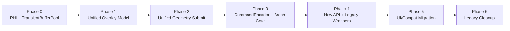

# RenderX 统一渲染管线设计方案

> **版本**: 2.0.0  
> **日期**: 2026-07-27  
> **目标**: 重构 RenderX 对外 API，建立 2D/3D 通用、GPU-driven、面向未来的渲染架构

---

## 1. 设计目标与核心原则

### 1.1 现状痛点

当前 `render.h` 的 API 表面将两类完全不同的职责混在同一层：

- **通用几何提交**：`renderEmitPolyline`、`renderEmitCircle`、`renderAddEntity`
- **UI 交互语义搬运**：`renderSetSelectionHandles`、`renderSetSelectionBox`、`renderSetControlLines`

这导致渲染 DLL 变成了 UI 状态的直接搬运工，每增加一种交互可视化就要新增一个专用 C API，扩展性极差。

### 1.2 重构目标

| 维度 | 当前状态 | 目标状态 |
|------|----------|----------|
| API 数量 | 20+ 个专用入口 | **5 个通用分组入口** |
| 2D/3D 统一 | 完全分离的代码路径 | **统一 RenderPass 架构** |
| 动态更新 | 全量场景重建为主 | **Persistent Buffer + 增量更新** |
| GPU 利用率 | 多次 draw call、频繁状态切换 | **Multi-Draw Indirect + 自动批次合并** |
| 可扩展性 | 修改渲染器内部 + 新增 C API | **仅修改数据描述即可新增图元** |

### 1.3 核心原则

1. **语义下沉，通用上浮**：渲染层只认识"线/面/点/文本/图片"，不认识"选择框/手柄/预览线"
2. **数据驱动**：用"类型 + 几何数据 + 样式"描述一切，消灭专用函数
3. **GPU-Driven**：让 GPU 决定画什么、怎么画，CPU 只做数据准备
4. **2D/3D 同构**：通过统一的 RenderPass 和 Resource Binding 模型服务两种视图

---

## 2. 总体架构

### 2.1 分层架构

```
┌─────────────────────────────────────────────────────────────┐
│                      Application Layer                        │
│  (CAD Editor / 3D Viewer)                                     │
│         │                                                     │
│         ▼                                                     │
├─────────────────────────────────────────────────────────────┤
│                    Unified Render API (C)                     │
│  ┌─────────────┐ ┌─────────────┐ ┌─────────────────────────┐ │
│  │ Frame API   │ │ Pass API    │ │ Submit API              │ │
│  │             │ │             │ │ (Lines/Surfaces/Points/ │ │
│  │ Begin/End   │ │ Begin/End   │ │  Text/Images/Meshes)    │ │
│  └─────────────┘ └─────────────┘ └─────────────────────────┘ │
├─────────────────────────────────────────────────────────────┤
│                    RenderX Core (Internal)                    │
│  ┌─────────────┐ ┌─────────────┐ ┌─────────────────────────┐ │
│  │ RenderGraph │ │ Command     │ │ Pipeline State          │ │
│  │ (Pass DAG)  │ │ Encoder     │ │ Manager                 │ │
│  └─────────────┘ └─────────────┘ └─────────────────────────┘ │
│  ┌─────────────┐ ┌─────────────┐ ┌─────────────────────────┐ │
│  │ Transient   │ │ DrawBatcher │ │ GPU Resource            │ │
│  │ Buffer Pool │ │ (MDI/SSBO)  │ │ Cache                   │ │
│  └─────────────┘ └─────────────┘ └─────────────────────────┘ │
├─────────────────────────────────────────────────────────────┤
│                      RHI Backend (OpenGL 4.6)                 │
│  ┌─────────────┐ ┌─────────────┐ ┌─────────────────────────┐ │
│  │ DSA Object  │ │ Persistent  │ │ Compute /               │ │
│  │ Management  │ │ Mapping     │ │ SPIR-V Pipeline         │ │
│  └─────────────┘ └─────────────┘ └─────────────────────────┘ │
└─────────────────────────────────────────────────────────────┘
```

### 2.2 关键数据流

```
Application
    │
    │ ① 构造 PrimitiveBatch[]
    ▼
renderSubmitPrimitives() ──► CommandEncoder
                                 │
                                 │ ② 写入 Transient Ring Buffer
                                 ▼
                            TransientBufferPool
                                 │
                                 │ ③ 按 (Shader, Blend, Depth) 排序分组
                                 ▼
                            DrawBatcher
                                 │
                                 │ ④ 生成 Multi-Draw-Indirect 命令
                                 ▼
                            RHI::drawIndirect()
```

---

## 3. 对外 C API 设计

### 3.1 核心类型（render_types.h）

```cpp
// 统一的坐标模式：世界空间或屏幕像素空间
enum class CoordinateSpace : uint8_t
{
    World = 0,   // 世界坐标，受视图矩阵变换
    Screen = 1,  // 屏幕像素坐标，不受视图矩阵变换
    NDC = 2,     // 标准化设备坐标 [-1, 1]
};

// 通用图元类别
enum class PrimitiveCategory : uint8_t
{
    Lines = 0,      // 线段、折线、线环
    Surfaces = 1,   // 填充三角形/多边形
    Points = 2,     // 点精灵/标记
    Text = 3,       // 文本字形
    Image = 4,      // 贴图/位图
    Mesh = 5,       // 3D 三角网格
};

// 顶点布局枚举
enum class VertexFormat : uint8_t
{
    P2C3 = 0,       // float2 pos + float3 color
    P3C3 = 1,       // float3 pos + float3 color
    P3C4 = 2,       // float3 pos + float4 color
    P3C4T2 = 3,     // float3 pos + float4 color + float2 uv
    P3N3C4 = 4,     // float3 pos + float3 normal + float4 color
    P3N3T2 = 5,     // float3 pos + float3 normal + float2 uv
};

// 通用顶点（最大对齐格式，用于可变布局传输）
struct GenericVertex
{
    float px, py, pz;      // 位置
    float nx, ny, nz;      // 法线
    float cr, cg, cb, ca;  // 颜色
    float tu, tv;          // 纹理坐标
};
static_assert(sizeof(GenericVertex) == 52, "GenericVertex must be 52 bytes");

// 渲染状态描述（用于自动分组和管线选择）
struct RenderStateDesc
{
    uint32_t shaderId;          // 着色器程序 ID
    uint32_t textureId;         // 主纹理 ID（0 表示无）
    float    lineWidth;         // 线宽（像素，仅线有效）
    float    pointSize;         // 点大小（像素，仅点有效）
    uint32_t blendMode;         // 预定义混合模式枚举
    uint8_t  depthTest;         // 是否启用深度测试
    uint8_t  depthWrite;        // 是否写入深度缓冲
    uint8_t  _pad[2];
};

// 单次绘制批次描述
struct PrimitiveBatch
{
    PrimitiveCategory category; // 图元类别
    VertexFormat      format;   // 顶点格式
    CoordinateSpace   space;    // 坐标空间
    RenderStateDesc   state;    // 渲染状态
    const void*       vertices; // 顶点数据指针
    uint32_t          vertexCount;     // 顶点数量
    const uint32_t*   indices;  // 可选索引数组
    uint32_t          indexCount;      // 索引数量
    float             modelMatrix[16]; // 可选局部变换（4x4 列主序，identity 时忽略）
    uint32_t          zOrder;   // 层叠顺序（同 Pass 内按此排序）
};

// 3D 网格实例批次
struct MeshInstanceBatch
{
    MeshId    meshId;           // 预注册网格 ID
    uint32_t  instanceCount;    // 实例数量
    const float* modelMatrices; // instanceCount x 16 float 数组
    const float* colors;        // instanceCount x 4 float 数组（可选）
    const uint32_t* materialIds;// 实例材质覆盖（可选）
};

// 渲染通道描述
struct RenderPassDesc
{
    const char* name;           // 调试用名称
    uint32_t    targetFbo;      // 目标 FBO（0 表示默认后备缓冲）
    float       clearColor[4];  // 清屏颜色
    uint32_t    clearFlags;     // 清除掩码（Color/Depth/Stencil）
    uint8_t     viewMode;       // 0=2D Ortho, 1=3D Perspective
    uint8_t     _pad[3];
    float       viewMatrix[16]; // 视图矩阵（2D 时后 7 个元素忽略）
    float       projMatrix[16]; // 投影矩阵（2D 时可忽略）
};

// 全局 Uniform 数据（每帧/每 Pass 更新一次）
struct GlobalUniforms
{
    float viewMatrix[16];
    float projMatrix[16];
    float viewProjMatrix[16];
    float viewportSize[2];      // width, height in pixels
    float viewportOffset[2];    // x, y offset in pixels
    float time;                 // 当前时间秒数（用于动画）
    uint32_t frameIndex;        // 帧计数器
    float _pad[2];
};
```

### 3.2 新 API 接口（render.h）

```cpp
// ============================================================================
// 帧生命周期
// ============================================================================

/**
 * @brief 开始一帧渲染
 *
 * 重置 Transient Buffer Pool 的读写指针，准备接收新的渲染数据。
 * 此调用必须在任何 submit 操作之前。
 */
RENDER_API void renderBeginFrame(RenderDevice* dev);

/**
 * @brief 结束一帧渲染
 *
 * 提交所有已编码的命令到 GPU，执行渲染图，呈现到屏幕。
 */
RENDER_API void renderEndFrame(RenderDevice* dev);

// ============================================================================
// 渲染通道（RenderPass）
// ============================================================================

/**
 * @brief 开始一个渲染通道
 *
 * 每个 RenderPass 拥有独立的清屏设置、视图矩阵和渲染目标。
 * 2D 场景和 3D 场景分别使用不同的 Pass，由内部自动调度。
 *
 * @param dev 渲染设备
 * @param desc 渲染通道描述
 */
RENDER_API void renderBeginPass(RenderDevice* dev, const RenderPassDesc* desc);

/**
 * @brief 结束当前渲染通道
 *
 * 触发该 Pass 内所有批次的排序、合并和命令生成。
 */
RENDER_API void renderEndPass(RenderDevice* dev);

// ============================================================================
// 统一几何提交（替代所有 renderSet* 和 renderEmit*）
// ============================================================================

/**
 * @brief 批量提交图元数据
 *
 * 统一的图元提交入口。传入的批次数组会按 (state, zOrder) 排序后自动合并，
 * 生成尽可能少的 draw call。
 *
 * 替代范围：
 *   - renderEmitPolyline / renderEmitCircle / renderEmitArc / renderEmitEllipse
 *   - renderSetPreviewLines / renderSetControlLines / renderSetSelectionBox
 *   - renderSetSelectionRect / renderSetSceneEnv
 *   - renderAddEntity（2D 静态图元）
 *
 * @param dev 渲染设备
 * @param batches 批次数组指针
 * @param batchCount 批次数量
 */
RENDER_API void renderSubmitPrimitives(RenderDevice* dev,
                                       const PrimitiveBatch* batches,
                                       uint32_t batchCount);

/**
 * @brief 提交 3D 网格实例批次
 *
 * 用于批量渲染预注册网格的多个实例。
 *
 * 替代范围：renderAddInstance / renderModifyInstance
 *
 * @param dev 渲染设备
 * @param batches 网格实例批次数组
 * @param batchCount 批次数量
 */
RENDER_API void renderSubmitMeshInstances(RenderDevice* dev,
                                          const MeshInstanceBatch* batches,
                                          uint32_t batchCount);

/**
 * @brief 提交文本字符串
 *
 * 文本使用专用入口，因为内部需要将 UTF-8 文本字形化为顶点数据。
 *
 * @param dev 渲染设备
 * @param items 文本项数组
 * @param count 文本项数量
 */
RENDER_API void renderSubmitTexts(RenderDevice* dev,
                                  const TextItem* items,
                                  uint32_t count);

// ============================================================================
// 全局状态
// ============================================================================

/**
 * @brief 设置当前 Pass 的全局 Uniforms
 *
 * 数据写入 Uniform Buffer Object，在 Pass 内所有绘制共享。
 *
 * @param dev 渲染设备
 * @param uniforms 全局 Uniform 数据指针
 */
RENDER_API void renderSetGlobalUniforms(RenderDevice* dev,
                                        const GlobalUniforms* uniforms);

// ============================================================================
// 资源管理（保持现有功能，接口微调）
// ============================================================================

RENDER_API MeshId    renderRegisterMesh(RenderDevice* dev,
                                        const float* positions,
                                        const float* normals,
                                        const float* uvs,
                                        const uint32_t* indices,
                                        uint32_t vertexCount,
                                        uint32_t indexCount);
RENDER_API void      renderUnregisterMesh(RenderDevice* dev, MeshId mesh);
RENDER_API uint16_t  renderAddMaterial(RenderDevice* dev, const MaterialDesc* desc);
RENDER_API void      renderUpdateMaterial(RenderDevice* dev, uint16_t idx, const MaterialDesc* desc);
RENDER_API void      renderResize(RenderDevice* dev, uint32_t width, uint32_t height);
RENDER_API void      renderGetStats(RenderDevice* dev, RenderStats* stats);
RENDER_API void*     renderGetNativeContext(RenderDevice* dev);
```

### 3.3 旧 API 兼容映射

所有旧 API 保留为**内部包装函数**，不删除，实现原地转发到新 API：

| 旧 API | 内部转发逻辑 |
|--------|-------------|
| `renderSetPreviewLines` | 构造 1 个 `PrimitiveBatch{Lines, P3C3, World, state, verts, count}` 并调用 `renderSubmitPrimitives` |
| `renderSetControlLines` | 同上，仅 `state.shaderId` 不同 |
| `renderSetSelectionBox` | 构造 `PrimitiveBatch{Lines, P3C4, World, state, rectVerts, 8}`（LineLoop 展开为线段） |
| `renderSetSelectionRect` | 构造 2 个 Batch：Triangles（填充）+ Lines（边框） |
| `renderSetSelectionHandles` | 构造 `PrimitiveBatch{Points, P2C4, World, state, expandedVerts, count}` |
| `renderSetPointMarkers` | 同上 |
| `renderSetSceneEnv` | 逐层构造 `PrimitiveBatch{Lines/Surfaces, ...}` 数组后批量提交 |
| `renderEmitPolyline` | 构造 1 个 `PrimitiveBatch{Lines, P2C3, World, defaultState, tessellatedVerts, count}` |
| `renderEmitCircle` | 细分后构造 `PrimitiveBatch{Lines, P2C3, World, ...}` |
| `renderAddEntity` | 归入 Persistent Entity 路径，见第 5 节 |

---

## 4. 内部核心架构

### 4.1 RenderGraph（渲染图）

RenderGraph 是帧内渲染的最高级调度器，管理所有 RenderPass 的依赖关系和执行顺序。

```cpp
namespace render::core {

class RenderGraph {
public:
    // 声明一个 RenderPass，返回 PassHandle
    PassHandle addPass(const RenderPassDesc& desc);

    // 声明资源依赖（texture/buffer 的读/写）
    void declareResourceAccess(PassHandle pass, ResourceHandle res, AccessFlags access);

    // 编译图：拓扑排序、资源分配、屏障插入
    void compile();

    // 执行图：遍历排序后的 Pass，调用每个 Pass 的回调
    void execute(rhi::IDevice* device);

    // 重置图（每帧调用）
    void reset();

private:
    std::vector<RenderPassNode> m_passes;
    std::vector<ResourceNode>   m_resources;
    std::vector<uint32_t>       m_sortedOrder; // 拓扑排序结果
    bool                        m_compiled = false;
};

} // namespace render::core
```

在 2D CAD 场景下，典型的渲染图为：

```
[ClearPass] ──► [SceneEnvPass] ──► [Entity2DPass] ──► [OverlayPass] ──► [TextPass]
```

在 3D 场景下：

```
[ClearPass] ──► [Opaque3DPass] ──► [Transparent3DPass] ──► [OverlayPass]
```

### 4.2 CommandEncoder（命令编码器）

CommandEncoder 负责将高层 `PrimitiveBatch` 转换为 GPU 原生命令。

```cpp
namespace render::core {

class CommandEncoder {
public:
    void beginPass(const RenderPassDesc& desc);
    void endPass();

    // 写入顶点数据到 Transient Buffer，记录绘制命令
    void encodePrimitives(const PrimitiveBatch* batches, uint32_t count);
    void encodeMeshInstances(const MeshInstanceBatch* batches, uint32_t count);
    void encodeTexts(const TextItem* items, uint32_t count);

    // 获取生成的命令缓冲区，供 RenderGraph 执行
    const EncodedPass& getEncodedPass() const { return m_encoded; }

private:
    EncodedPass m_encoded;
    TransientBufferAllocator* m_transientAlloc;
    DrawBatcher* m_batcher;
};

} // namespace render::core
```

### 4.3 TransientBufferPool（瞬态资源池）

使用 **Persistent Mapped Buffer (GL 4.4+)** 实现 CPU 零拷贝写入。

```cpp
namespace render::core {

class TransientBufferPool {
public:
    void initialize(rhi::IDevice* device, uint32_t vertexBufferSize, uint32_t indexBufferSize);
    void shutdown();

    // 每帧重置读写指针
    void resetFrame();

    // 分配顶点/索引空间，返回设备地址偏移和 CPU 可写指针
    struct Allocation {
        uint64_t deviceOffset;  // GPU 缓冲区偏移
        void*    cpuPtr;        // Persistent Mapping 的 CPU 指针
        uint32_t capacity;      // 分配的字节数
    };

    Allocation allocateVertices(uint32_t sizeBytes);
    Allocation allocateIndices(uint32_t sizeBytes);
    Allocation allocateUniforms(uint32_t sizeBytes);

    // 获取用于间接绘制的 GPU 缓冲区句柄
    rhi::BufferHandle getVertexBuffer() const;
    rhi::BufferHandle getIndexBuffer() const;
    rhi::BufferHandle getIndirectBuffer() const;

private:
    // 使用 3 缓冲（Triple Buffering）避免 CPU/GPU 竞争
    static constexpr uint32_t kFrameLatency = 3;

    struct RingBuffer {
        rhi::BufferHandle handle;
        void*             mappedPtr;
        uint32_t          capacity;
        uint32_t          head;     // 当前写入偏移
    };

    RingBuffer m_vertexRing[kFrameLatency];
    RingBuffer m_indexRing[kFrameLatency];
    RingBuffer m_indirectRing[kFrameLatency];
    RingBuffer m_uniformRing[kFrameLatency];

    uint32_t m_currentFrameIndex = 0;
};

} // namespace render::core
```

**OpenGL 4.6 实现要点**：

- 使用 `glBufferStorage` + `GL_MAP_PERSISTENT_BIT | GL_MAP_COHERENT_BIT` 创建持久映射缓冲区
- 使用 `glMapBufferRange` 获取 CPU 可写指针
- 无需 `glBufferSubData` 或 `glUnmapBuffer`，直接 `memcpy` 即可对 GPU 可见
- 配合 Triple Buffering，CPU 写入帧 N+2 时 GPU 正在读取帧 N

### 4.4 DrawBatcher（绘制批处理器）

自动将 `PrimitiveBatch` 按渲染状态排序，生成 Multi-Draw-Indirect 命令。

```cpp
namespace render::core {

class DrawBatcher {
public:
    void reset();

    // 摄入批次
    void feed(const PrimitiveBatch& batch, uint64_t vertexOffset, uint64_t indexOffset);

    // 排序并生成间接命令
    void bake();

    // 获取生成的命令列表
    const std::vector<DrawCommand>& getCommands() const { return m_commands; }

private:
    struct SortKey {
        uint64_t stateHash;     // shader + blend + depth
        uint32_t zOrder;
        uint32_t sequence;      // 打破排序稳定性
    };

    struct BatchEntry {
        SortKey          key;
        PrimitiveBatch   batch;
        uint64_t         vertexOffset;
        uint64_t         indexOffset;
    };

    std::vector<BatchEntry> m_entries;
    std::vector<DrawCommand> m_commands;

    // 按 stateHash 分组后，每组生成一个 MultiDrawIndirect 命令
    void buildMultiDrawCommands();
};

} // namespace render::core
```

**OpenGL 4.6 特性利用**：

- **Multi-Draw-Indirect (MDI)**：`glMultiDrawArraysIndirect` / `glMultiDrawElementsIndirect`
- 间接命令数组存储在 GPU 缓冲区中，由 `DrawBatcher::bake()` 生成
- 支持 **BaseVertex** 和 **BaseInstance**，实现单缓冲区多批次绘制

### 4.5 PipelineStateManager（管线状态管理）

基于 **OpenGL DSA (Direct State Access, GL 4.5+)** 实现零绑定管线切换。

```cpp
namespace render::core {

struct PipelineStateKey {
    uint32_t shaderId;
    uint32_t blendMode;
    uint8_t  depthTest;
    uint8_t  depthWrite;
    uint8_t  primitiveTopology; // LineList / TriangleList / etc
    uint8_t  _pad;
};

class PipelineStateManager {
public:
    void initialize(rhi::IDevice* device);

    // 从状态描述获取或创建管线
    rhi::PipelineHandle getOrCreatePipeline(const RenderStateDesc& desc,
                                             PrimitiveCategory category);

    // 使用 DSA 直接绑定管线，无需切换 VAO/VBO 绑定点
    void bindPipeline(rhi::PipelineHandle handle, rhi::IDevice* device);

private:
    std::unordered_map<uint64_t, rhi::PipelineHandle> m_pipelineCache;
};

} // namespace render::core
```

---

## 5. 2D 动态图元更新机制

### 5.1 问题背景

当前 2D 图元的修改通过 `renderModifyEntity` 实现，内部直接替换顶点池数据。这在图元数量大、更新频繁时存在性能瓶颈：

- 每次修改触发顶点池的 `memcpy` 和 GPU 重新上传
- 缺乏 dirty region 合并，多次小修改导致多次上传

### 5.2 新方案：Persistent Entity Buffer + Delta Update

```cpp
namespace render::core {

/**
 * @brief 2D 持久图元管理器
 *
 * 用于管理 CAD 文档中的静态/半静态 2D 图元（线条、圆、弧等）。
 * 使用 GPU 端的 SSBO（Shader Storage Buffer Object）存储图元属性，
 * 支持高效的增量更新和 GPU 端剔除。
 */
class PersistentEntityManager {
public:
    void initialize(rhi::IDevice* device, uint32_t maxEntities, uint32_t maxVertices);
    void shutdown();

    // 添加图元，返回图元句柄
    EntityHandle addEntity(const VertexP3C3* vertices, uint32_t vertexCount,
                           PrimitiveType type, const MaterialDesc& material);

    // 增量更新：仅修改变化的顶点范围
    void updateEntity(EntityHandle handle, const VertexP3C3* vertices,
                      uint32_t vertexOffset, uint32_t vertexCount);

    // 删除图元（标记为无效，延迟回收）
    void removeEntity(EntityHandle handle);

    // 设置图元可见性（写入 SSBO 标志位，GPU 端读取）
    void setVisibility(EntityHandle handle, bool visible);

    // 执行 GPU 端视锥剔除（Compute Shader）
    void cull(const float viewMatrix[9], const float frustum[4]);

    // 获取剔除后的间接绘制命令
    const IndirectCommandBuffer& getCulledCommands() const;

private:
    // SSBO 布局
    struct EntitySSBO {
        uint32_t vertexOffset;  // 在全局顶点缓冲中的偏移
        uint32_t vertexCount;
        uint32_t primitiveType;
        uint32_t materialIndex;
        uint32_t flags;         // Visible / Selected / Highlighted
        float    bboxMinX, bboxMinY, bboxMaxX, bboxMaxY;
    };

    rhi::BufferHandle m_entitySSBO;      // 图元元数据 SSBO
    rhi::BufferHandle m_vertexBuffer;    // 全局顶点缓冲（Persistent Mapped）
    rhi::BufferHandle m_indirectBuffer;  // 间接命令缓冲（由 Compute Shader 写入）
    rhi::BufferHandle m_materialSSBO;    // 材质数据 SSBO

    // Compute Shader 程序
    rhi::PipelineHandle m_cullComputePipeline;
};

} // namespace render::core
```

### 5.3 GPU 端视锥剔除（Compute Shader）

```glsl
#version 460 core

layout(local_size_x = 64, local_size_y = 1, local_size_z = 1) in;

struct Entity {
    uint vertexOffset;
    uint vertexCount;
    uint primitiveType;
    uint materialIndex;
    uint flags;
    float bboxMinX, bboxMinY, bboxMaxX, bboxMaxY;
};

layout(std430, binding = 0) readonly buffer EntityBuffer {
    Entity entities[];
};

layout(std430, binding = 1) writeonly buffer IndirectBuffer {
    DrawArraysCommand commands[];
};

layout(std430, binding = 2) buffer CounterBuffer {
    uint validCount;
};

uniform vec4 uFrustum; // left, right, bottom, top

shared uint s_localCount;
shared uint s_localOffset;

void main() {
    uint gid = gl_GlobalInvocationID.x;
    if (gid >= entities.length()) return;

    Entity e = entities[gid];

    // 不可见或已删除
    if ((e.flags & 1u) == 0u) return;

    // AABB-Frustum 测试
    bool visible = e.bboxMinX <= uFrustum.y && e.bboxMaxX >= uFrustum.x &&
                   e.bboxMinY <= uFrustum.w && e.bboxMaxY >= uFrustum.z;

    if (visible) {
        uint slot = atomicAdd(validCount, 1);
        commands[slot] = DrawArraysCommand(e.vertexCount, 1, e.vertexOffset, 0);
    }
}
```

**优势**：

- 剔除完全在 GPU 进行，零 CPU-GPU 往返
- 输出直接为 `DrawArraysIndirect` 可用的命令格式
- 图元数量变化时只需 `glDispatchCompute((count+63)/64, 1, 1)`

---

## 6. OpenGL 4.6 技术特性应用

### 6.1 特性对照表

| OpenGL 4.6 特性 | 应用场景 | 当前是否使用 | 目标状态 |
|-----------------|----------|-------------|----------|
| **DSA (Direct State Access)** | 缓冲区/纹理/管线的无绑定创建和修改 | 否 | 全面使用 |
| **Persistent Mapped Buffers** | 零拷贝 CPU->GPU 数据流 | 否 | TransientBufferPool 核心 |
| **SSBO (Shader Storage Buffer)** | 图元元数据、材质数组、实例数据 | 否 | 2D/3D 统一使用 |
| **Multi-Draw-Indirect** | 单次调用绘制多个批次 | 否（BatchQueue 用普通 indirect） | DrawBatcher 核心 |
| **Compute Shader** | GPU 端视锥剔除、LOD 选择 | 否 | PersistentEntityManager 核心 |
| **SPIR-V / glShaderBinary** | 预编译着色器，减少启动时间 | 否 | 着色器管线统一使用 |
| **ARB_texture_filter_anisotropic** | 3D 纹理各向异性过滤 | 未确定 | 3D Pass 启用 |
| **Advanced Blend (KHR_blend_equation_advanced)** | 高级混合模式 | 否 | Overlay Pass 可选启用 |
| **Clip Control** | 简化 NDC 坐标映射 | 否 | 统一使用 LOWER_LEFT / ZERO_TO_ONE |
| **Debug Output (KHR_debug)** | 渲染错误诊断 | 部分使用 | 全量接入 SyLogger |

### 6.2 RHI 层 OpenGL 4.6 实现要点

```cpp
namespace render::rhi {

class GLDevice : public IDevice {
public:
    // DSA 风格的缓冲区创建（无需绑定到全局状态）
    BufferHandle createBuffer(const BufferDesc& desc) override {
        GLuint id;
        glCreateBuffers(1, &id);  // DSA: GL 4.5+

        GLbitfield flags = 0;
        if (desc.memory == MemoryType::GPU_CPU_Coherent) {
            flags |= GL_MAP_PERSISTENT_BIT | GL_MAP_COHERENT_BIT | GL_MAP_WRITE_BIT;
        }
        glNamedBufferStorage(id, desc.size, nullptr, flags);  // DSA: GL 4.5+

        // ... 封装为 BufferHandle 返回
    }

    // 持久映射获取 CPU 指针
    void* mapBuffer(BufferHandle handle, uint64_t offset, uint64_t size, uint32_t mapFlags) override {
        GLuint id = handleToGL(handle);
        return glMapNamedBufferRange(id, offset, size,
            GL_MAP_WRITE_BIT | GL_MAP_PERSISTENT_BIT | GL_MAP_COHERENT_BIT);
    }

    // Multi-Draw-Indirect
    void drawIndirect(BufferHandle indirectBuffer, uint64_t offset,
                      uint32_t drawCount, uint32_t stride) override {
        GLuint bufId = handleToGL(indirectBuffer);
        glBindBuffer(GL_DRAW_INDIRECT_BUFFER, bufId);
        glMultiDrawArraysIndirect(GL_TRIANGLES,
            reinterpret_cast<const void*>(offset), drawCount, stride);
    }

    // Compute Shader 分发
    void dispatchCompute(uint32_t groupsX, uint32_t groupsY, uint32_t groupsZ) override {
        glDispatchCompute(groupsX, groupsY, groupsZ);
        glMemoryBarrier(GL_COMMAND_BARRIER_BIT | GL_SHADER_STORAGE_BARRIER_BIT);
    }

    // SPIR-V 着色器加载
    bool loadShaderSPIRV(ShaderStage stage, const uint32_t* spirv, uint32_t wordCount) {
        GLuint shader = glCreateShader(stageToGL(stage));
        glShaderBinary(1, &shader, GL_SHADER_BINARY_FORMAT_SPIR_V, spirv, wordCount * sizeof(uint32_t));
        glSpecializeShader(shader, "main", 0, nullptr, nullptr);  // GL 4.6
        // ... 链接程序
    }
};

} // namespace render::rhi
```

---

## 7. 2D/3D 统一渲染路径

### 7.1 统一顶点处理管线

2D 和 3D 在顶点处理阶段的差异仅在于变换矩阵的维度：

```glsl
#version 460 core

layout(location = 0) in vec3 aPosition;
layout(location = 1) in vec4 aColor;
layout(location = 2) in vec2 aTexCoord;
layout(location = 3) in vec3 aNormal;

layout(std140, binding = 0) uniform GlobalUniforms {
    mat4 uViewProjMatrix;
    vec4 uViewport;       // x, y, width, height
    float uTime;
    uint uFrameIndex;
};

// 2D 场景：uViewProjMatrix 包含 world->NDC 的完整变换
// 3D 场景：uViewProjMatrix = projection * view

out vec4 vColor;
out vec2 vTexCoord;

void main() {
    gl_Position = uViewProjMatrix * vec4(aPosition, 1.0);
    vColor = aColor;
    vTexCoord = aTexCoord;
}
```

### 7.2 Pass 配置差异

| 特性 | 2D Pass | 3D Pass |
|------|---------|---------|
| 视图矩阵 | 3x3 仿射矩阵 → 扩充为 4x4 | 4x4 视图矩阵 |
| 投影矩阵 | 正交投影（由 viewportSize 推导） | 透视/正交投影矩阵 |
| 深度测试 | 关闭（或仅用于 zOrder） | 开启 |
| 背面剔除 | 关闭 | 开启 |
| 线宽 | 像素单位，支持 `glLineWidth` | 世界单位或屏幕空间着色器计算 |
| 光照 | 无 | 标准 Blinn-Phong 或 PBR |

### 7.3 渲染调度流程

```cpp
void renderEndFrame(RenderDevice* dev) {
    auto* rhi = dev->rhiDevice;

    rhi->beginFrame();

    // 执行编译好的 RenderGraph
    for (PassHandle pass : dev->renderGraph.getSortedPasses()) {
        const auto& encoded = dev->commandEncoder.getEncodedPass(pass);

        // 清屏 / 绑定 FBO
        if (pass.clearFlags) {
            rhi->setClearColor(pass.clearColor[0], pass.clearColor[1],
                               pass.clearColor[2], pass.clearColor[3]);
            rhi->clear(pass.clearFlags);
        }

        // 设置全局 uniforms
        rhi->bindUniformBuffer(0, 0, dev->globalUniformBuffer, 0, sizeof(GlobalUniforms));

        // 执行该 Pass 的所有绘制命令
        for (const auto& cmd : encoded.drawCommands) {
            auto pipeline = dev->pipelineManager.getOrCreatePipeline(cmd.state, cmd.category);
            rhi->bindPipeline(pipeline);
            rhi->bindVertexBuffer(0, cmd.vertexBuffer, cmd.vertexOffset);
            if (cmd.indexBuffer) {
                rhi->bindIndexBuffer(cmd.indexBuffer, cmd.indexOffset);
                rhi->drawIndexed(cmd.indexCount, cmd.instanceCount, 0, 0, 0);
            } else {
                rhi->draw(cmd.vertexCount, cmd.instanceCount, 0, 0);
            }
        }
    }

    rhi->endFrame();
    rhi->present();
}
```

---

## 8. 实施方案

### 8.1 阶段划分

| 阶段 | 任务 | 关键文件 | 预估工期 |
|------|------|----------|----------|
| **Phase 0** | RHI 层 OpenGL 4.6 升级：DSA、Persistent Mapping、SPIR-V、Compute Shader 支持 | `rhi_gl.h/cpp` | 3 天 |
| **Phase 1** | TransientBufferPool + PipelineStateManager 实现 | `transient_buffer_pool.h/cpp`, `pipeline_state_manager.h/cpp` | 3 天 |
| **Phase 2** | RenderGraph + CommandEncoder 骨架 | `render_graph.h/cpp`, `command_encoder.h/cpp` | 4 天 |
| **Phase 3** | DrawBatcher + Multi-Draw-Indirect 集成 | `draw_batcher.h/cpp` | 3 天 |
| **Phase 4** | 新 C API 实现：`renderBeginFrame`, `renderBeginPass`, `renderSubmitPrimitives` | `render.h`, `render_c_api.cpp` | 4 天 |
| **Phase 5** | PersistentEntityManager + GPU Culling (Compute Shader) | `persistent_entity_manager.h/cpp`, `cull_entities.comp` | 5 天 |
| **Phase 6** | 旧 API 兼容包装层 | `render_c_api.cpp` (wrapper functions) | 2 天 |
| **Phase 7** | RenderWidget 迁移到新 API | `RenderWidget.cpp` | 3 天 |
| **Phase 8** | 性能测试与调优 | `tests/render_benchmark.cpp` | 3 天 |


---

## 8.1 阶段划分

本方案按“先打通底层能力，再统一中层调度，最后迁移上层调用”的顺序推进。  
每一阶段都尽量满足一个原则：**先保留旧路径可运行，再引入新路径并逐步替换**，避免一次性大爆炸式重构。

### Phase 0：RHI 与瞬态写入基础补齐

**目标**

- 补齐 OpenGL 4.6 RHI 所需的底层能力
- 建立 `GPU_CPU_Coherent` 持久映射缓冲的写入基础
- 提供瞬态数据高频写入的统一承载层

**主要内容**

- 补齐 `GLDevice::bindShaderStorageBuffer()`
- 补齐 `GLDevice::dispatchCompute()`
- 补齐 `GLDevice::memoryBarrier()`
- 升级 `GLDevice::createBuffer()`，支持 `GPU_CPU_Coherent` 下的 `glNamedBufferStorage`
- 引入 `TransientBufferPool`
- 增加 `TransientBufferPool` 的单元测试

**输入依赖**

- 现有 RHI 接口
- 现有 `GLDevice` / `rhi_gl.cpp`
- 现有日志系统 `SyLogger`

**输出结果**

- RHI 具备 compute / SSBO / coherent mapping 的基础能力
- 形成可复用的瞬态缓冲分配机制
- 为 overlay、文本、临时几何、GPU-driven 数据通道提供底座

**验收标准**

- OpenGL 4.6 路径可正常编译运行
- `TransientBufferPool` 可稳定完成分配、轮换、fallback、清理
- 单元测试覆盖关键路径并通过
- 不破坏现有渲染路径

**阶段风险**

- persistent mapping 同步语义不清会导致读写竞争
- fallback 频繁触发会掩盖容量配置问题
- 某些平台/驱动对 `glNamedBufferStorage` 行为差异较大

---

### Phase 1：统一 overlay 数据模型

**目标**

- 将 selection、preview、control、marker、crosshair 等 UI 反馈统一为一种 overlay 描述模型
- 停止继续增加专用 `renderSetXXX` 接口
- 让 overlay 语义从 API 层下沉到内部数据模型

**主要内容**

- 定义统一的 overlay primitive 类型
- 定义统一的 style / color / z-order / space 描述
- 将现有专用 overlay API 改为 wrapper
- 让 `overlay_queue` 接收统一描述，而不是只接收碎片化专用函数参数

**输入依赖**

- Phase 0 的 `TransientBufferPool`
- 现有 `overlay_queue`
- 现有 `UI2D` 调用路径

**输出结果**

- overlay 的外部表达统一
- 新增一种 UI 反馈时不再需要新增一个专用渲染 API
- 旧接口仍可工作，但不再是主入口

**验收标准**

- `render.h` 中不再新增新的 selection/preview/control 专用函数
- 现有 overlay 调用可全部迁移到统一提交模型
- `overlay_queue` 的内部绘制结果与迁移前保持一致

**阶段风险**

- 统一模型过早泛化会导致接口复杂度上升
- 旧调用点过多时，wrapper 层会暂时较厚
- 必须严格区分“UI 语义”与“渲染语义”

---

### Phase 2：统一几何提交模型（已完成）

**目标**

- 将 `renderEmitPolyline`、`renderEmitCircle`、`renderEmitArc`、`renderEmitEllipse`、`renderEmitText`、`renderEmitImage` 这类接口收束到更通用的几何提交路径
- 让“几何类型”从“函数名驱动”转为“数据驱动”

**当前已落地的实现状态**

- 已新增 `SceneEnvGeometryDesc` / `EnvLayerDesc` 纯 POD 描述符，用于场景环境几何直通
- `RenderWidget` 已从两处调用点迁移到 `submitSceneEnvGeometry(envGeo)`，UI 侧不再组装平行数组
- 标尺文字不进入几何描述符，继续使用 `renderSetScreenTexts(ScreenTextItem*, count)` 独立提交
- 旧 `renderSetSceneEnvEx` 已标记为 `deprecated`，保留兼容但不再作为新路径

**主要内容**

- 建立统一的几何描述结构
- 将几何原语提交入口抽象为 `submit geometry`
- 将文本、图像等特殊类型拆分为独立但统一风格的 descriptor
- 保留旧 `renderEmit*` 作为兼容层
- 说明：当前工程的 overlay / scene-env 统一并未走到本方案的全量 `PrimitiveBatch` 形态，而是按已落地实现收敛为 overlay 统一入口 + 几何统一入口 + 显式 Pass 调度

**输入依赖**

- Phase 1 的 overlay 通用化经验
- 现有 `SceneGeometrySinkAdapter`
- 现有几何发射路径

**输出结果**

- 几何提交接口不再随着图元类型无限膨胀
- 外部调用者只需要组装描述，不需要知道内部如何 tessellate
- 文档、适配层、渲染核心之间的职责边界更清晰

**验收标准**

- 现有几何提交路径能用新模型等价表达
- 旧 `renderEmit*` 可通过 wrapper 工作
- 新几何类型可以通过数据结构扩展，而不是新增函数

**阶段风险**

- 文本和图像并不完全等同于几何原语，需要保留特殊处理
- tessellation 逻辑收敛时要避免性能倒退

---

### Phase 3：渲染提交与批处理内核统一

**目标**

- 将 overlay 和通用几何的提交流程统一到一个内部命令编码器
- 让 CPU 侧只负责描述编码，GPU 侧负责最终绘制

**主要内容**

- 引入统一的 `CommandEncoder`
- 整合 transient buffer 分配
- 将多种提交路径汇入统一的 batch 生成流程
- 为后续的 MDI 或更高阶批处理做准备

**输入依赖**

- Phase 0 的瞬态缓冲基础
- Phase 1/2 的统一描述模型

**输出结果**

- 内部渲染数据流从“多个专用队列”收敛到“统一编码路径”
- 便于后续做排序、合批、缓存和调度

**验收标准**

- overlay 与几何提交都能进入统一编码器
- 编码器输出的 batch 可被现有渲染流程消费
- 不影响现有帧渲染结果

**阶段风险**

- 如果编码器职责过重，可能变成新的“万能大杂烩”
- 需要提前划清“编码”和“执行”的边界

---

### Phase 4：新 API 引入与旧 API 兼容包装

**目标**

- 对外暴露新的统一 API
- 保持旧 API 可运行，作为兼容包装层存在
- 完成从“函数名驱动”到“数据驱动”的过渡

**主要内容**

- 引入新 `renderBeginFrame` / `renderBeginPass` / `renderSubmit...` 系列 API
- 保留旧 `renderSet*` / `renderEmit*` 作为 wrapper
- 让 wrapper 只做参数组装和转发，不再承载业务逻辑

**输入依赖**

- Phase 1/2/3 的统一模型和编码器
- 现有 `render_c_api.cpp`

**输出结果**

- 新旧 API 可并存
- 新功能优先走新 API
- 旧代码无需一次性大规模修改

**验收标准**

- 新 API 可完成完整渲染流程
- 旧 API 行为不变或等价
- wrapper 层不再扩展新的逻辑分支

**阶段风险**

- 过渡期内接口重复，会造成维护成本上升
- 调用方如果不迁移，新 API 的价值会被拖慢

---

### Phase 5：上层调用迁移

**目标**

- 将 `UI2D`（RenderWidget/SceneGeometrySinkAdapter）、视口层逐步迁移到新 API
- 减少对旧专用接口的依赖
- 让渲染调用从 UI 语义中解耦

**主要内容**

- 迁移 `RenderWidget`
- 迁移 `SceneGeometrySinkAdapter`
- 迁移 selection / preview / control / marker 的调用方式
- 清理老旧直连调用

**输入依赖**

- Phase 4 的新 API
- 现有 UI 兼容层代码

**输出结果**

- 上层调用更统一
- 业务层只关心“提交什么”，不关心“底层怎么画”
- 旧 API 使用比例逐步下降

**验收标准**

- UI 侧主要路径已迁移到新模型
- 旧接口只剩少量兼容或历史路径
- 新旧路径渲染结果一致

**阶段风险**

- 迁移工作量可能大于预期
- 如果适配层太多，会造成重复维护

---

### Phase 6：旧接口收敛与清理

**目标**

- 逐步删除不再需要的碎片化 API
- 让公共头文件保持稳定、简洁、可维护

**主要内容**

- 移除不再使用的专用 `renderSetXXX`
- 清理废弃 wrapper
- 更新文档与示例代码
- 固化新 API 作为唯一推荐入口

**输入依赖**

- Phase 4/5 已完成迁移
- 兼容统计确认旧接口已无必要

**输出结果**

- `render.h` 更简洁
- 公共 API 更通用
- 后续扩展成本显著降低

**验收标准**

- 已无关键路径依赖旧 API
- 头文件中不再保留过多重复语义接口

**阶段风险**

- 过早删除旧 API 会影响兼容性
- 清理前必须确认迁移完成度

---

### 阶段之间的关系



---


### 8.2 文件变更清单

**新增文件**：

```
Renderx/include/render/render_v2.h          // 新 API 头文件（与旧 render.h 并存）
Renderx/src/core/render_graph.h/cpp
Renderx/src/core/command_encoder.h/cpp
Renderx/src/core/transient_buffer_pool.h/cpp
Renderx/src/core/pipeline_state_manager.h/cpp
Renderx/src/core/draw_batcher.h/cpp
Renderx/src/core/persistent_entity_manager.h/cpp
Renderx/src/shader/spirv/               // 预编译 SPIR-V 二进制
Renderx/src/shader/source/              // GLSL 源码（用于调试）
Renderx/src/shader/cull_entities.comp   // GPU 剔除计算着色器
```

**修改文件**：

```
Renderx/include/render/render_types.h     // 添加 OverlayPrimitive、GenericVertex 等
Renderx/include/render/render.h           // 保留旧 API，添加 [[deprecated]] 标记
Renderx/src/c_api/render_c_api.cpp        // 旧 API 改为 wrapper，实现新 API
Renderx/src/core/overlay_queue.h/cpp      // 内部迁移到 CommandEncoder
Renderx/src/rhi/rhi_device.h              // 添加 Compute、SPIR-V、DSA 接口
Renderx/src/rhi/rhi_gl.h/cpp              // OpenGL 4.6 完整实现
UI/2D/Src/UI/ViewWidget/RenderWidget.cpp      // 逐步迁移到新 API
```


---

## 8.2 文件变更清单

本节用于说明每一阶段涉及的文件范围，以及这些文件在新架构中的职责变化。  
原则上，优先通过“新增通用模型 + 旧接口 wrapper 兼容”的方式推进，避免一次性删除旧代码导致不可回退。

### 新增文件

#### 1. `Renderx/include/render/render_v2.h`
**用途**

- 作为新一代统一渲染 API 的主入口头文件
- 承载新的帧生命周期、提交入口、统一 overlay / geometry 描述

**职责**

- 对外暴露更少、更通用的接口
- 作为未来的推荐入口
- 与旧 `render.h` 并存一段过渡期

**说明**

- 新功能优先在这里定义
- 旧 API 不直接在这里扩散，而是通过 wrapper 兼容

---

#### 2. `Renderx/src/core/render_graph.h/.cpp`
**用途**

- 实现帧内渲染图调度
- 管理 Pass 的依赖、顺序、资源访问关系

**职责**

- 组织 2D/3D/Overlay/Text 等渲染通道
- 决定每个 Pass 的执行顺序
- 在后续承担资源依赖分析与 barrier 插入

**说明**

- 这是从“线性渲染流程”走向“可编排渲染流程”的关键文件

---

#### 3. `Renderx/src/core/command_encoder.h/.cpp`
**用途**

- 把上层提交的图元描述编码成内部绘制命令
- 负责 transient buffer 分配和 batch 组织

**职责**

- 接收统一的 primitive / overlay / text 提交数据
- 转换为 GPU 可执行的命令结构
- 为后续批处理、合并、排序提供统一中间层

---

#### 4. `Renderx/src/core/transient_buffer_pool.h/.cpp`
**用途**

- 提供瞬态缓冲区池
- 支撑高频、短生命周期、CPU 直接写入的数据流

**职责**

- 三缓冲轮换
- persistent mapping
- fallback buffer 管理
- 每帧资源回收

**说明**

- 这是 overlay、文本、临时几何以及未来 GPU-driven 数据流的基础设施

---

#### 5. `Renderx/src/core/pipeline_state_manager.h/.cpp`
**用途**

- 管理管线状态缓存和复用
- 降低频繁切换管线带来的开销

**职责**

- 按 shader / blend / depth / topology 组合构建 key
- 缓存并复用 pipeline
- 统一管理渲染状态对象的生命周期

---

#### 6. `Renderx/src/core/draw_batcher.h/.cpp`
**用途**

- 将零散提交的图元按状态和层级进行分组
- 生成更少的 draw call 或间接绘制命令

**职责**

- 排序
- 合批
- 生成 MDI 或等效绘制命令

---

#### 7. `Renderx/src/core/persistent_entity_manager.h/.cpp`
**用途**

- 管理较稳定的 2D/3D 图元
- 为后续 GPU culling 和增量更新提供图元元数据管理

**职责**

- 图元生命周期管理
- 元数据缓冲维护
- 可见性和剔除状态维护

---

#### 8. `Renderx/src/shader/cull_entities.comp`
**用途**

- 计算着色器剔除图元
- 为 GPU-driven 场景提供基础实现

**职责**

- 读取图元 SSBO
- 执行可见性判断
- 生成间接绘制命令

---

### 修改文件

#### 1. `Renderx/include/render/render_types.h`
**修改目标**

- 添加统一的 overlay / primitive / batch 描述类型
- 增加新的坐标空间、图元类别、统一样式结构
- 为新 API 提供数据模型基础

**影响**

- 这是公共类型层的核心变化
- 后续所有提交接口都会依赖这里的新结构

---

#### 2. `Renderx/include/render/render.h`
**修改目标**

- 保留旧 API
- 增加新 API 或引导到 `render_v2.h`
- 对旧接口加上过渡性质说明，必要时标记为 deprecated

**影响**

- 这是外部调用方最敏感的入口
- 改动时必须保证 ABI / API 兼容策略清晰

---

#### 3. `Renderx/src/c_api/render_c_api.cpp`
**修改目标**

- 将旧 `renderSet*` / `renderEmit*` 改为 wrapper
- 增加新统一 API 的 C 实现
- 逐步把参数组装逻辑从业务层抽离

**影响**

- 这是兼容层和新架构之间的关键转换点
- 也是最容易产生重复逻辑的文件

---

#### 4. `Renderx/src/core/overlay_queue.h/.cpp`
**修改目标**

- 从多个专用 setter 的收集器，逐步转向统一 overlay 描述的执行器
- 保留当前绘制逻辑，但弱化“业务语义分支”

**影响**

- 这个模块短期内可作为兼容实现
- 中期应逐步收敛到 `CommandEncoder` 或统一 overlay processor

---

#### 5. `Renderx/src/rhi/rhi_device.h`
**修改目标**

- 补齐 compute、SSBO、persistent buffer、memory barrier 等能力抽象
- 为 OpenGL 4.6 和未来后端留出统一接口

**影响**

- 这是底层能力是否能被上层稳定使用的前提

---

#### 6. `Renderx/src/rhi/rhi_gl.h/.cpp`
**修改目标**

- 完整实现 OpenGL 4.6 所需能力
- 统一 buffer 创建、映射、同步和间接绘制支持

**影响**

- 这是 Phase 0 的基础延伸
- 也是后续 GPU-driven 管线的核心支撑

---

#### 7. `UI/2D/Src/UI/ViewWidget/RenderWidget.cpp`
**修改目标**

- 将 UI 层对专用 `renderSetXXX` 的直接依赖逐步迁移到统一 API
- 保留短期兼容调用，逐步替换为新模型

**影响**

- 这是用户交互路径最直接的落点
- 迁移时最需要关注视觉结果一致性

---

#### 8. `UI/2D/Src/UI/ViewWidget/SceneGeometrySinkAdapter.cpp`
**修改目标**

- 把几何提交路径收敛到统一几何描述模型
- 减少把图元类型硬编码到适配层里的情况

**影响**

- 对几何发射链路的统一非常关键
- 可作为 renderEmit* 收敛的第一步

---

## 建议补充说明：文件改动的推进顺序

为了降低风险，建议按以下顺序推进：

1. **先改公共类型层**
   - `render_types.h`

2. **再引入新核心能力**
   - `transient_buffer_pool`
   - `command_encoder`
   - `render_graph`

3. **然后加新 API**
   - `render_v2.h`
   - `render_c_api.cpp`

4. **再改兼容层**
   - `overlay_queue`
   - `RenderWidget`
   - `SceneGeometrySinkAdapter`

5. **最后清理旧接口**
   - `render.h`
   - 旧 wrapper
   - 文档与示例

---

## 8.3 兼容策略

这一节我也建议你一起补一下，因为它和文件变更是绑定的。

### 兼容原则

- **旧 API 不立刻删除**
- **新 API 优先使用**
- **旧实现逐步收敛到 wrapper**
- **在视觉结果和行为一致前，不做大规模删改**

### 兼容方式

#### 1. 头文件层兼容
- `render.h` 保留旧函数
- 可在注释中标注“过渡期接口”
- 未来通过 `render_v2.h` 承担主定义

#### 2. 实现层兼容
- 旧接口内部调用新统一入口
- 不再在旧接口里写新的业务逻辑

#### 3. 调用层兼容
- UI / 适配层先不一次性迁移完
- 先让新旧 API 并存运行
- 再逐步替换调用点

#### 4. 回滚策略
- 若新统一模型出现问题，可短期切回旧路径
- 避免“改完不能回退”的风险

---


### 8.3 兼容策略

- **旧 API 不删除**：所有 `renderSet*` / `renderEmit*` 保留，内部转发到新实现
- **新旧共存**：新增 `render_v2.h` 提供新 API，旧 `render.h` 通过包含 `render_v2.h` + wrapper 实现
- **渲染器内部兼容**：`OverlayQueue` 可短期内作为 `CommandEncoder` 的特例运行，逐步替换
- **回滚预案**：若新管线出现严重问题，可通过编译开关 `RENDERV2_ENABLE` 切回旧路径


本次重构的基本原则不是“先切断旧路径，再强制切换新路径”，而是采用**新旧并存、逐步迁移、最终收敛**的方式推进。  
这样做的目的，是保证渲染系统在重构过程中始终可用，避免因为 API 断裂、调用链未迁移完成或视觉结果不一致而影响整个 CAD 主链。

### 8.3.1 兼容策略总原则

1. **旧 API 不立刻删除**
   - `renderSet*`、`renderEmit*` 这类接口在过渡期内必须继续保留
   - 即便它们不再作为推荐入口，也应当先保证行为稳定

2. **新 API 优先使用**
   - 新增功能只进入统一模型，不再继续扩展碎片化专用接口
   - 所有新增调用点优先接入新 API，而不是继续补旧 API

3. **旧实现逐步收敛为 wrapper**
   - 旧接口内部只保留参数组装与转发逻辑
   - 不再在旧接口中新增复杂业务判断或渲染分支

4. **视觉结果优先保持一致**
   - 兼容迁移的第一目标不是“代码形态整洁”，而是“渲染结果不变”
   - 在迁移完成前，不能因为结构统一而牺牲已有交互效果

5. **任何阶段都应可回退**
   - 新统一模型必须允许短期回退到旧路径
   - 不能在未验证稳定性前一次性清空旧实现

---

### 8.3.2 头文件兼容策略

头文件是所有外部调用的第一入口，因此头文件层的兼容必须最保守。

#### 处理方式

- `Renderx/include/render/render.h` 保留现有公开接口
- 新统一接口可通过 `render_v2.h` 或等价头文件引入
- 旧接口在过渡期内继续可见，但逐步标记为“过渡接口”或 `deprecated`
- 公共类型新增时优先放到 `render_types.h`，避免新旧头文件重复定义

#### 目标

- 不让已有调用方因为头文件变化而立即大面积报错
- 为不同模块提供平滑升级路径
- 降低一次性迁移造成的编译风险

---

### 8.3.3 实现层兼容策略

实现层是兼容策略的核心。  
新旧 API 之间应保持“单向收敛”，即：**旧接口调用新核心，不允许新核心反向依赖旧接口**。

#### 处理方式

- `render_c_api.cpp` 中的旧 `renderSet*` / `renderEmit*` 接口改为 wrapper
- wrapper 的职责仅限于：
  - 参数校验
  - 数据打包
  - 转换为统一描述
  - 调用新 API 或统一内部入口
- 不在 wrapper 内继续扩展新的业务分支
- 内部渲染队列或编码器只认统一描述，不再直接绑定 UI 语义

#### 目标

- 避免同一业务逻辑在新旧路径中各实现一遍
- 减少维护成本
- 让后续清理旧接口变得可控

---

### 8.3.4 调用层兼容策略

调用层是迁移工作量最大的部分，因此建议采用“分模块迁移”的方式，而不是全局一次性替换。

#### 处理方式

- `UI2D` 的 RenderWidget/SceneGeometrySinkAdapter 作为第一批迁移对象
- 优先迁移高频调用路径，例如：
  - selection
  - preview
  - control lines
  - point markers
  - geometry sink
- 迁移过程中保留旧调用，以便对比渲染结果
- 对于暂时难以迁移的模块，可以继续通过 wrapper 走旧接口

#### 目标

- 逐步减少对专用 API 的依赖
- 让 UI 层只负责“提交什么”，而不是“怎么画”
- 保证迁移是渐进式的，不会影响整体工作流

---

### 8.3.5 运行期兼容策略

运行期兼容主要解决“新旧路径能否在同一进程中共存”的问题。

#### 处理方式

- 新旧接口允许在同一帧中并存使用
- 统一内部模型负责最终合并和渲染
- 旧接口和新接口最终都落到相同的内部执行路径
- 对于同一类数据，确保新旧路径生成的 GPU 结果一致或等价

#### 目标

- 支持渐进迁移
- 支持局部验证
- 支持同一版本内的混合使用

---

### 8.3.6 回滚策略

重构过程中，一定要预留回滚能力。  
如果新统一模型在某些驱动、平台或复杂交互场景下出现问题，应该能够快速切换回旧路径。

#### 处理方式

- 保留旧实现作为短期回退方案
- 通过编译开关、运行时开关或配置项控制新旧路径
- 在新路径稳定前，不删除旧路径依赖的核心数据结构
- 保留一段时间的双路径验证能力

#### 目标

- 确保任何阶段都不会“改完就死”
- 降低大规模重构的风险
- 为线上或集成环境提供安全兜底

---

### 8.3.7 清理策略

当新统一模型稳定后，才进入清理阶段。

#### 清理顺序建议

1. 先停止新增旧 API 调用
2. 再逐步迁移现有调用点
3. 然后把旧接口降级为最薄 wrapper
4. 最后清理无调用的旧函数、旧结构和旧文档

#### 清理原则

- 只有当调用统计明确为零或接近零时，才删除旧接口
- 清理前必须确认没有外部模块仍依赖旧路径
- 文档、示例和测试也要同步清理，避免“代码删了，文档还在误导”

---

### 8.3.8 兼容策略的阶段性目标

#### 短期目标
- 新旧 API 共存
- 旧功能不坏
- 新功能优先走统一入口

#### 中期目标
- 大部分调用点迁移到统一模型
- 旧接口只剩少量兼容入口
- 内部渲染链路统一

#### 长期目标
- 公共 API 保持简洁
- 不再新增碎片化专用函数
- 所有 overlay / geometry / submit 都通过统一模型表达

---

### 8.3.9 推荐表述

> 本方案采用“新旧并存、wrapper 过渡、分模块迁移、稳定后清理”的兼容策略，以确保渲染主链在重构期间持续可用，并将接口收敛风险控制在可回退范围内。

---

---

## 8.4 风险与回退预案

本次重构涉及公共 API、渲染内部调度、GPU 缓冲管理以及 UI 适配层，属于典型的“跨层重构”。  
因此在实施过程中，必须明确风险点，并为每类风险准备可执行的回退方案，避免出现“接口已改、行为不稳、无法回退”的情况。

### 8.4.1 主要风险类型

#### 1. 公共 API 破坏风险
由于 `render.h` 是对外主入口，任何接口签名、语义或调用方式变化都可能影响大量现有代码。

**风险表现**
- 编译失败
- 运行时调用行为变化
- 旧模块无法按原方式接入

**预防措施**
- 旧 API 在过渡期内保留
- 新接口通过独立入口引入
- 旧接口只做 wrapper，不立即删除

**回退方式**
- 通过编译开关或分支切换恢复旧实现
- 保持旧头文件和旧实现可编译

---

#### 2. 渲染结果不一致风险
统一 overlay/geometry 模型后，虽然语义更清晰，但可能出现视觉输出和旧实现不完全一致的问题。

**风险表现**
- selection box 边框位置偏移
- preview line 样式改变
- handle 大小、透明度、层叠顺序变化
- 某些图元在不同坐标空间下表现不一致

**预防措施**
- 保留旧路径作为对照组
- 对关键交互场景做截图/录屏对比
- 迁移时先保证像素级或近似等价结果

**回退方式**
- 对单个调用点切回旧 API
- 对整个模块切回旧 overlay 路径
- 保持兼容层可独立启用

---

#### 3. GPU 同步与缓冲生命周期风险
`TransientBufferPool` 和 persistent mapping 带来的最大风险，是 CPU 写入与 GPU 读取之间的生命周期冲突。

**风险表现**
- 花屏
- 数据错乱
- 偶发闪烁
- 驱动层不稳定
- 某些帧数据被提前覆盖

**预防措施**
- 使用 triple buffering
- 明确每帧 slot 的使用边界
- fallback buffer 设置明确释放时机
- 必要时增加 fence 或额外同步校验
- 通过测试覆盖连续 frame 轮换、溢出和并发写入场景

**回退方式**
- 临时关闭 persistent mapping
- 切回传统 buffer update 路径
- 在问题驱动或平台上禁用高风险优化路径

---

#### 4. 性能退化风险
统一模型和通用编码器如果设计不当，可能引入额外的打包、排序、拷贝或抽象开销。

**风险表现**
- CPU 侧提交成本升高
- overlay 数量增大时帧率下降
- batch 合并收益低于预期
- fallback buffer 过多导致抖动

**预防措施**
- 在 Phase 0/1/2 就建立基准测试
- 统计 draw call、buffer 分配次数、fallback 次数
- 监控每帧的提交和编码耗时
- 保持通用模型尽量轻量，避免深层虚调用

**回退方式**
- 暂时保留旧快路径
- 对高频路径单独优化
- 在必要时关闭部分排序/合并策略

---

#### 5. 迁移工作量失控风险
UI 和兼容层调用点很多，若迁移策略过于激进，容易出现“接口都统一了，但迁移没做完”的局面。

**风险表现**
- 新旧接口长期并存
- wrapper 变厚
- 代码重复加剧
- 维护成本反而上升

**预防措施**
- 按模块迁移，不全局并行替换
- 先迁移高频调用点
- 每阶段设置明确的收敛目标
- 迁移完成后及时清理旧调用

**回退方式**
- 暂时保留旧调用路径
- 允许局部模块回退到旧 API
- 在某些模块不稳定时延后迁移

---

#### 6. 平台/驱动兼容风险
OpenGL 4.6、DSA、persistent mapping、compute shader 等特性在不同平台上的支持度和行为可能存在差异。

**风险表现**
- 某些驱动不支持预期的 buffer storage 行为
- compute shader 初始化失败
- 某平台上 `memoryBarrier` 行为不一致
- 老设备无法进入新路径

**预防措施**
- 初始化时做能力探测
- 对关键特性设置 fallback 路径
- 明确最低支持版本和推荐版本
- 在文档中注明依赖条件

**回退方式**
- 自动切换到兼容后端
- 禁用特定优化能力
- 对不支持特性的机器保留旧路径

---

### 8.4.2 分阶段风险控制

#### Phase 0 风险控制
- 重点关注 persistent mapping 和 fallback buffer
- 重点检查 OpenGL 4.6 新函数在所有目标平台是否可用
- 重点验证单元测试对边界情况是否覆盖完整

#### Phase 1 风险控制
- 重点防止 overlay 统一模型过度泛化
- 重点避免把 UI 语义和渲染语义继续混写
- 重点保证旧 overlay 接口可平滑转为 wrapper

#### Phase 2 风险控制
- 重点验证 `renderEmit*` 收敛后文本、图像、几何的行为等价性
- 重点检查 tessellation 与原逻辑是否保持一致

#### Phase 3 风险控制
- 重点验证 command encoder 的分层是否清晰
- 重点避免编码器变成“万能中间层”
- 重点检查 batch 合并后的输出是否正确

#### Phase 4 风险控制
- 重点确认新 API 与旧 API 的转发关系正确
- 重点保证 wrapper 不产生额外行为差异
- 重点保持调用方可以逐步迁移

#### Phase 5 风险控制
- 重点控制 UI 迁移规模
- 重点保证视觉结果一致
- 重点避免兼容层长期膨胀

---

### 8.4.3 回退策略设计

为了确保任何阶段都能稳定止损，建议采用以下回退结构。

#### 1. 代码级回退
- 旧实现与新实现并存
- 通过编译宏切换主要路径
- 保留旧头文件与旧实现一段时间

#### 2. 运行时回退
- 通过配置项或启动参数决定是否启用新管线
- 对特定平台、驱动或场景自动降级
- 在出现异常时切换到旧渲染路径

#### 3. 模块级回退
- 允许 overlay、geometry、batching、transient buffer 各模块独立回退
- 不要求所有模块必须同时上新
- 降低单点问题扩大为全局问题的概率

#### 4. 场景级回退
- 对特定高风险场景单独保留旧路径
- 例如复杂 selection 交互、特殊文本渲染、图片叠加等
- 让问题局限在局部，不影响整体系统

---

### 8.4.4 回退触发条件

建议在以下情况触发回退：

- 关键单元测试失败
- 视觉对比结果明显异常
- 某平台出现不稳定或崩溃
- fallback buffer 频繁触发且性能明显下降
- 新旧路径结果无法等价
- 迁移后调用链出现大规模编译或运行错误

---

### 8.4.5 回退优先级

回退时建议按以下顺序处理：

1. **单点回退**
   - 先切回局部模块或局部功能的旧实现

2. **路径回退**
   - 再切回整个旧渲染路径

3. **能力回退**
   - 若问题来自底层能力，则关闭 persistent mapping、compute shader 等优化

4. **版本回退**
   - 必要时直接回退到上一个稳定版本

---

### 8.4.6 建议性的正式结尾表述


> 本方案通过“新旧并存、分阶段迁移、模块级回退、能力级降级”的方式控制重构风险，确保渲染主链在重构过程中始终具备可运行、可验证、可回退的工程属性。

---


---

## 9. 性能预期

| 指标 | 当前实现 | 目标值 | 优化手段 |
|------|----------|--------|----------|
| 2D 场景 Draw Calls (1000 图元) | ~100-200 | **< 10** | Multi-Draw-Indirect + 自动批次 |
| CPU->GPU 顶点上传延迟 | ~1-2ms/帧 | **< 0.1ms** | Persistent Mapped Buffer |
| 视锥剔除耗时 (10000 图元) | ~2-3ms (CPU 四叉树) | **< 0.1ms** | Compute Shader GPU 剔除 |
| 场景全量重建 (1000 图元) | ~50-100ms | **< 5ms** | Persistent Entity + Delta Update |
| 帧时间 (空载) | ~2-3ms | **< 1ms** | RenderGraph 减少状态切换 |


---

## 9. 性能预期

本节性能预期用于描述重构完成后，渲染系统在典型场景下应达到的目标范围。  
这里的数值不是绝对承诺，而是作为架构设计和后续验证的参考基线。  
实际性能会受到图元数量、设备能力、驱动实现、窗口尺寸以及场景复杂度的影响，因此更适合以“趋势目标 + 约束目标”的方式理解。

### 9.1 预期收益方向

本次重构完成后，性能提升主要来自以下几个方面：

1. **减少 CPU 侧重复开销**
   - 通过统一提交模型减少大量专用 API 分支
   - 通过 transient buffer 减少频繁分配和 memcpy
   - 通过 wrapper 收敛减少业务层重复组装逻辑

2. **减少 GPU 侧状态切换**
   - 通过合批与统一渲染通道减少 draw call 数量
   - 通过管线缓存降低 pipeline 切换成本
   - 通过更明确的 pass 组织减少无效状态抖动

3. **提升高频动态数据吞吐**
   - overlay、selection、preview、marker 等高频内容能够使用持久映射缓冲快速更新
   - 临时几何和短生命周期数据不再走重型资源生命周期

4. **为 GPU-driven 扩展预留空间**
   - 后续可逐步引入 SSBO、compute culling、MDI 等机制
   - 这些能力不会立刻带来全部收益，但会显著改善架构上限

---

### 9.2 关键指标预期

下列指标用于描述重构后系统的“目标方向”，建议在后续测试中持续采样。

#### 1. 2D 场景 Draw Call 数量

**目标**
- 在典型 CAD 2D 场景中，尽量减少因 overlay 和细碎几何导致的 draw call 膨胀
- 在图元数量较多时，保持绘制调用数增长慢于图元数量增长

**预期结果**
- 典型中等复杂度场景下，draw call 数量显著低于当前碎片化路径
- overlay、文本、场景图元之间的绘制阶段更集中

**说明**
- 这里更看重趋势而不是某个固定数值
- 如果场景中存在大量不同材质或不同状态的图元，draw call 不可能无限压缩

---

#### 2. CPU 到 GPU 的数据上传开销

**目标**
- 高频 overlay 和临时几何的提交时间尽量稳定
- 减少每帧因临时数据分配、拷贝和释放带来的抖动

**预期结果**
- 使用 persistent mapped buffer 后，上传开销应明显低于传统动态缓冲更新方式
- 典型帧内临时数据写入应接近“顺序写内存”的成本

**说明**
- 该指标重点关注“提交耗时”和“帧间抖动”
- 对小数据频繁更新场景收益最明显

---

#### 3. 帧时间稳定性

**目标**
- 在交互频繁的编辑场景下，保持帧时间稳定
- 避免因为 selection、preview、control handles 等高频刷新造成明显卡顿

**预期结果**
- 高交互场景下帧时间波动应低于旧路径
- transient buffer fallback 只应在少数峰值场景出现，不应成为常态

**说明**
- 对 CAD 软件来说，稳定性往往比峰值更重要
- 比起“某一帧跑得特别快”，更重要的是“不要突然慢很多”

---

#### 4. overlay 更新成本

**目标**
- selection、preview、control lines、point markers 等覆盖层更新应保持轻量
- 不应因为交互状态改变而触发大规模场景重建

**预期结果**
- overlay 数据变化时，只更新必要的瞬态缓冲区段
- 不应伴随场景图元整体重建或大范围状态切换

**说明**
- 这是 Phase 1 和 Phase 0 的直接收益点之一
- 这类数据本质上是短生命周期数据，应该按短生命周期方式处理

---

#### 5. 场景图元更新成本

**目标**
- 图元修改应尽量走增量更新，而不是全量重建
- 对局部编辑操作保持响应性

**预期结果**
- 局部修改只更新受影响的数据范围
- 大场景下单个图元修改不应显著拖慢整个帧流程

**说明**
- 这是后续 persistent entity / delta update 方向的收益
- 如果当前阶段还没完全落地，也可以先作为中长期目标

---

### 9.3 分阶段性能目标

#### Phase 0
**目标**
- 打通 persistent mapping、SSBO、compute 等基础能力
- 确保底层性能能力正确可用

**关注点**
- buffer 创建和映射是否稳定
- fallback 是否频繁触发
- 单元测试执行是否稳定

---

#### Phase 1
**目标**
- overlay 统一后，减少专用接口带来的提交开销
- 保持高频交互帧的响应性

**关注点**
- selection / preview / control 等路径是否还存在重复转换
- wrapper 是否过厚
- overlay queue 的合并是否引入额外成本

---

#### Phase 2
**目标**
- 几何提交模型统一后，减少重复 tessellation 和重复参数打包
- 提升调用方接入效率

**关注点**
- `renderEmit*` 收敛后是否仍保持原有性能
- 统一模型是否引入过多泛型开销

---

#### Phase 3
**目标**
- 统一编码器和 batch 组织，减少无意义的状态切换
- 为 MDI 或类似机制提供基础

**关注点**
- 合批是否带来可观收益
- 排序和编码的 CPU 成本是否可控

---

#### Phase 4
**目标**
- 新 API 形成稳定的主路径
- 旧 API wrapper 不再引入额外性能损耗

**关注点**
- 新旧路径渲染结果是否一致
- wrapper 的存在是否影响高频调用性能

---

#### Phase 5
**目标**
- 上层调用迁移完成后，整体渲染链路更短、更统一
- 让 UI 层不再承担额外的渲染组装成本

**关注点**
- RenderWidget 和适配层是否减少重复逻辑
- UI 交互高频更新是否更平滑

---

### 9.4 推荐监测指标

为了后续验证性能收益，建议在实现中持续采样以下指标：

- 每帧 draw call 数量
- 每帧 transient buffer 分配次数
- 每帧 fallback buffer 触发次数
- 每帧 overlay 顶点数量
- 每帧 command 编码耗时
- 每帧 GPU 提交耗时
- 每帧帧时间均值与方差
- 关键交互场景下的最大帧抖动

这些指标比单纯看“平均 FPS”更能反映架构是否健康。

---

### 9.5 结论性表述


> 本方案的性能目标不以单次峰值优化为唯一标准，而以“减少 CPU 组装成本、降低 GPU 状态切换、稳定高频交互响应、为后续 GPU-driven 扩展留出空间”为总体方向。

---

---

## 10. 变更记录

| 日期 | 版本 | 变更内容 |
|------|------|----------|
| 2026-07-27 | 2.0.0 | 全面重构：统一 2D/3D RenderPass 架构、GPU-Driven 管线、OpenGL 4.6 特性、Persistent Entity、Compute Culling |
| 2026-07-27 | 1.2.0 | 新增 Overlay API 统一重构方案（第 9-10 节） |
| 2026-07-15 | 1.1.0 | 添加 Renderx 渲染后端接入：ISceneGeometrySink/C API 架构实现 |
| 2026-07-10 | 1.0.0 | 初版：基于当前实现编写 |

---

## 附录：Phase 0 / Phase 1 / Phase 2 / Phase 3 实际实现记录

> 本节记录文档理想设计与实际落地实现之间的对应关系，避免文档与代码脱节。

### Phase 0：RHI 层 OpenGL 4.6 升级（已完成）

#### 已完成的升级项

| 功能 | 实现文件 | 状态 |
|------|----------|------|
| DSA (Direct State Access) | `rhi_gl.cpp` `createBuffer/createTexture` | 已启用 `CreateBuffers/CreateTextures/NamedBufferStorage` 等 DSA 路径 |
| Persistent Mapped Buffer | `transient_buffer_pool.cpp` | 使用 `GL_MAP_PERSISTENT_BIT \| GL_MAP_COHERENT_BIT`，Triple Buffering |
| TransientBufferPool | `transient_buffer_pool.h/.cpp` | 零拷贝 CPU->GPU 上传通道，带 fallback 监控 |
| SSBO 支持 | `rhi_gl.cpp` `bindShaderStorageBuffer` | 通过 `BindBufferRange(GL_SHADER_STORAGE_BUFFER, ...)` 实现 |
| Compute Shader | `rhi_gl.cpp` `dispatchCompute` | 检查 GL 4.3+ 可用性，有安全回退 |
| 内存屏障 | `rhi_gl.cpp` `memoryBarrier` | 检查初始化状态，透传 `GLbitfield` |
| SPIR-V 支持 | `gl_loader.h/.cpp`, `rhi_gl.cpp` | 函数指针加载和编译路径已就绪 |

#### TransientBufferPool 同步语义

```
[Frame N]   CPU write -> insert fence_N -> submit draw
[Frame N+1] CPU write -> insert fence_N+1 -> submit draw
[Frame N+2] CPU write -> insert fence_N+2 -> submit draw
                      -> wait fence_N (确保 GPU 已读完 Frame N)
```

- 每帧槽有独立 `GLsync` fence
- `beginFrame()` 轮换前先为当前帧插 fence，再等待目标帧槽的旧 fence
- fallback buffer 在同帧内创建，下一轮 `beginFrame()` 统一销毁
- 连续 3+ 帧触发 fallback 时输出 WARN 日志

#### 单元测试覆盖

`Renderx/Test/TransientBufferPoolTests.cpp` 覆盖：
- 初始化/关闭、对齐分配、帧轮换、多周期
- 主池溢出 fallback、单帧多次 fallback、零大小分配
- 未初始化安全调用、大对齐请求、精确容量边界

### Phase 1：Overlay API 统一（已完成）

#### 与文档理想设计的差异

文档第 3 节描述的统一 API 是 **全量 PrimitiveBatch** 模型（`renderSubmitPrimitives`），目标是统一 2D 图元、3D 网格、overlay、文本等所有图元。

实际 Phase 1 采用的是更务实的 **Overlay 级别统一**：仅将 2D overlay 类内容（preview lines, control lines, selection box, handles 等）收敛为统一模型，不涉及 2D 图元和 3D 网格的改动。

原因：
- Overlay 数据量小、更新频率高、类型杂，是最需要统一的场景
- 2D 图元已有 `RenderWorld` + `BatchQueue` 路径，改动成本高
- 渐进式迁移风险更低

#### 实际引入的数据结构

```cpp
// render_types.h —— 几何形态轴（渲染只认此轴）
enum class OverlayForm : uint8_t
{
    LineList,       // 线段列表（GL_LINES，逐段独立）
    Rect,           // 空心矩形边框（4 边 8 顶点线段）
    FilledRect,     // 填充矩形（2 三角形）
    Marker,         // 点标记（填充方块 + 边框，用于手柄/标记点）
    SnapCircle,     // 捕捉指示器（圆形线框）
    Count,
};

// render_types.h —— 生命周期分组轴（清除只认此轴）
enum class OverlayGroup : uint8_t
{
    Ui,                 // 通用 UI overlay（默认分组）
    Preview,            // 预览线（绘制过程中的临时线段）
    Control,            // 控制线（贝塞尔/NURBS 控制多边形）
    SelectionBox,       // 选择框（边框 + 填充）
    SelectionOutlines,  // 选择轮廓（被选中图元的高亮轮廓线）
    SelectionHandles,   // 选择手柄（缩放/移动/旋转手柄点）
    PointMarkers,       // 点标记（捕捉点、特征点标记）
    Snap,               // 捕捉指示器
    Count,
};

struct OverlayStyle
{
    uint32_t fillColor;     // RGBA
    uint32_t borderColor;   // RGBA
    float lineWidth;
    float pointSize;
    float zOrder;
};

struct OverlayPrimitive
{
    OverlayForm form;       // 几何形态 —— 渲染只认此字段
    OverlayGroup group;     // 生命周期分组 —— 清除只认此字段
    uint32_t flags;
    const void* payload;
    uint32_t payloadSize;
    OverlayStyle style;
};

struct OverlayPolylineDesc { const float* vertices; uint32_t vertexCount; bool usePerVertexColor; const float* colors; };
struct OverlayRectDesc     { float minX, minY, maxX, maxY; };
struct OverlayMarkerSetDesc{ const float* positions; uint32_t count; };
```

设计要点：将旧 `OverlayPrimitiveKind` 拆成 **几何形态（form）× 生命周期分组（group）** 两个独立轴。
渲染只认 `form`（决定如何解析 payload、使用何种拓扑），清除只认 `group`（任意时刻按分组整体清空，与几何形态无关）。
需要视觉差异（虚实/线宽/颜色）时扩展 `OverlayStyle`，而不是枚举增殖。

#### 实际 API 形态

```cpp
// render.h
RENDER_API void renderSubmitOverlay (RenderDevice* dev, const OverlayPrimitive* primitive);
RENDER_API void renderSubmitOverlays(RenderDevice* dev, const OverlayPrimitive* primitives, uint32_t count);
RENDER_API void renderClearOverlays (RenderDevice* dev);
RENDER_API void renderClearOverlayGroup(RenderDevice* dev, OverlayGroup group);
```

#### 兼容层 wrapper 映射

| 旧 API | wrapper 内部行为 |
|--------|-----------------|
| `renderSetPreviewLines` | 提取 VertexP3C3 -> `OverlayPolylineDesc` -> `LineList` / group `Preview` -> `submitOverlay` |
| `renderSetControlLines` | 同上，group `Control` |
| `renderSetPointMarkers` | `OverlayMarkerSetDesc` -> `Marker` / group `PointMarkers` -> `submitOverlay` |
| `renderSetSelectionBox` | `OverlayRectDesc` -> `FilledRect` -> group `SelectionBox` -> `submitOverlay` |
| `renderSetSelectionRect` | `OverlayRectDesc` -> `FilledRect` + `Rect` 两次提交（group `SelectionBox`） |
| `renderSetSelectionHandles` | `OverlayMarkerSetDesc` -> `Marker` / group `SelectionHandles` -> `submitOverlay` |
| `renderSetOverlay` | 十字准星 -> `SnapCircle` group `Ui`，捕捉点 -> `SnapCircle` group `Snap`（内部两轴独立，不再互相覆盖） |

#### 内部渲染管线改动

`OverlayQueue::render()`：
1. 合并旧数据（保留兼容路径）
2. 追加 `m_unifiedVerts` 到合并缓冲区末尾
3. 记录 `m_unifiedStart` 偏移
4. 按 `m_unifiedRanges`（每个 Range 记录描述一个子区间：{start, count, isTriangle, group}）绘制统一图元

`OverlayQueue::clearGroup(group)` / C API `renderClearOverlayGroup`：
- 遍历 `m_unifiedRanges`，跳过记录中的 group 与目标分组相同的区间，重建顶点流；不复用被清除区间的顶点

`RenderWidget` 各 overlay 应用入口（`applyPreviewOverlay` / `applySelectionOverlay` / `applyPointMarkerOverlay` / `applySnapIndicator`）改为**先清分组再补齐**，彻底消除预览线/控制线/捕捉指示器跨帧累加问题。

#### 成功标准检查

- [x] `render.h` 不再新增大量专用 overlay 函数（已用统一入口替代）
- [x] overlay 新增一种 UI 反馈时，不需要新增独立 C API（只需扩展 `OverlayForm`/`OverlayGroup`）
- [x] `overlay_queue` 只关心"如何画"（form），不关心"这是 selection 还是 preview"（group 只用于清除）
- [x] UI 层可直接组装 `OverlayPrimitive` 描述，不直接操纵底层绘制细节
- [x] 旧接口继续工作，但只是过渡层（已改为 wrapper）

### Phase 2：几何提交 API 统一（已完成）

#### 与文档理想设计的差异

文档第 3 节描述的统一 API 是 **全量 PrimitiveBatch** 模型（`renderSubmitPrimitives`），目标是所有图元类型走同一条内部处理路径。

实际 Phase 2 采用的是 **统一入口 + 类型明确分发** 策略：
- 对外提供统一入口 `renderSubmitGeometry` / `renderSubmitGeometries`
- 内部按 `GeometryPrimitiveKind` 分发到三条已有路径，不做"一种处理逻辑统一所有类型"

原因：
- Text 本质是 glyph/layout 问题，走 TextAtlas 路径
- TriangleSoup 本质是 mesh/instance 问题，走 MeshManager 路径
- Polyline/Circle/Arc/Ellipse/Image 是 2D 文档几何，走 RenderWorld 路径
- 强行统一内部处理会引入不必要的复杂度，且破坏现有稳定路径

#### 关键设计决策：typed desc 而非 void* payload

Phase 2 没有采用纯 `void* payload + payloadSize` 的泛型指针方案，而是使用 **类型明确的 union 描述指针**：

```cpp
struct GeometryPrimitive
{
    GeometryPrimitiveKind kind;   // 图元类型
    uint32_t flags;               // 标志位（保留）

    union {
        const GeometryPolyline*         polyline;      // 复用现有结构
        const GeometryCircle*           circle;        // 复用现有结构
        const GeometryArc*              arc;           // 复用现有结构
        const GeometryEllipse*          ellipse;       // 复用现有结构
        const GeometryImage*            image;         // 复用现有结构
        const GeometryText*             text;          // 复用现有结构
        const GeometryTriangleSoupDesc* triangleSoup;  // 新增结构
    } desc;
};
```

优势：
- 调用方从类型签名即可知道 payload 真实结构，无需查文档
- wrapper 内部无需 `reinterpret_cast`，直接赋值 union 成员
- 内部分发时通过 `primitive->desc.polyline` 等直接访问，类型安全
- 新增几何类型时，只需扩展 union 和 switch 分支，不会退化成"巨大分发中心"

#### 新增的数据结构

```cpp
// render_types.h

// 几何图元类型枚举
enum class GeometryPrimitiveKind : uint8_t
{
    Polyline     = 0,  // 2D 文档几何路径
    Circle       = 1,  // 2D 文档几何路径
    Arc          = 2,  // 2D 文档几何路径
    Ellipse      = 3,  // 2D 文档几何路径
    Image        = 4,  // 2D 文档几何路径
    Text         = 5,  // 文本缓存 / TextAtlas 路径
    TriangleSoup = 6,  // 3D mesh 路径
};

// 三角网格描述（TriangleSoup 专用，其余类型复用现有 Geometry* 结构）
struct GeometryTriangleSoupDesc
{
    const float* vertices;     // 顶点位置（每顶点3个float）
    const float* normals;      // 顶点法线（每顶点3个float）
    uint32_t vertexCount;
    float color[4];            // RGBA
};
```

#### 实际 API 形态

```cpp
// render.h
RENDER_API void renderSubmitGeometry  (RenderDevice* dev, const GeometryPrimitive* primitive);
RENDER_API void renderSubmitGeometries(RenderDevice* dev, const GeometryPrimitive* primitives, uint32_t count);
```

#### 内部分发规则

```
renderSubmitGeometry(dev, primitive)
  |
  ├── kind == Polyline / Circle / Arc / Ellipse / Image
  |     → tessellate 到 VertexP3C3
  |     → world2D.addEntity()（2D 文档几何路径）
  |
  ├── kind == Text
  |     → 暂存到 pendingTextItems
  |     → renderFrame 时由 TextAtlas 渲染（文本缓存路径）
  |
  └── kind == TriangleSoup
        → meshManager.registerMesh() + addInstance()（3D mesh 路径）
```

#### 兼容层 wrapper 映射

| 旧 API | wrapper 内部行为 |
|--------|-----------------|
| `renderEmitPolyline` | 组装 `GeometryPrimitive{kind=Polyline, desc.polyline=...}` → `renderSubmitGeometry` |
| `renderEmitCircle` | 组装 `GeometryPrimitive{kind=Circle, desc.circle=...}` → `renderSubmitGeometry` |
| `renderEmitArc` | 组装 `GeometryPrimitive{kind=Arc, desc.arc=...}` → `renderSubmitGeometry` |
| `renderEmitEllipse` | 组装 `GeometryPrimitive{kind=Ellipse, desc.ellipse=...}` → `renderSubmitGeometry` |
| `renderEmitImage` | 组装 `GeometryPrimitive{kind=Image, desc.image=...}` → `renderSubmitGeometry` |
| `renderEmitText` | 组装 `GeometryPrimitive{kind=Text, desc.text=...}` → `renderSubmitGeometry` |
| `renderEmitTriangleSoup` | 组装 `GeometryTriangleSoupDesc` + `GeometryPrimitive` → `renderSubmitGeometry` |

所有 wrapper 仅负责组装 typed desc 并转发，不包含任何渲染逻辑。

#### 成功标准检查

- [x] `render.h` 新增几何类型时，不需要新增独立 `renderEmit*` C API（只需扩展 `GeometryPrimitiveKind` 和 union）
- [x] 统一入口对外收敛，内部仍保持类型明确的三条分发路径
- [x] 旧 `renderEmit*` 接口继续工作，仅作为过渡 wrapper
- [x] wrapper 内部无 `reinterpret_cast`，通过 union 直接类型安全访问
- [x] `SanYiRender.dll` 编译通过，无新增编译错误

### Phase 3：提交与批处理收敛（已完成）

#### 目标

将 `renderSubmitOverlay` 与 `renderSubmitGeometry` 的内部执行路径统一到同一条命令编码链路。

CPU 侧只负责描述收集，GPU 侧按 batch key 分组排序后批量执行，减少 draw call 和状态切换。

#### 核心组件：CommandEncoder

新增文件：
- `Renderx/src/core/command_encoder.h`
- `Renderx/src/core/command_encoder.cpp`

**设计原则**
- 不再让 overlay 和 geometry 各自维护独立的提交后处理逻辑
- 统一收集所有绘制意图，按排序键分组后连续执行
- 为后续 MDI / batch 合并 / render graph 预留架构出口

**关键数据结构**

```cpp
// 绘制空间类型，区分数据来源
enum class DrawSpace : uint8_t { World2D = 0, Overlay = 1 };

// 64bit batch key：space → z-order → topology → material
using BatchKey = uint64_t;

struct DrawCommand
{
    BatchKey      sortKey;        // 排序键
    DrawSpace     space;          // 绘制空间
    PrimitiveType topology;       // 图元拓扑
    uint16_t      materialIndex;  // 材质索引（World2D 有效）
    uint32_t      zOrder;         // Z 序（Overlay 有效）

    union {
        struct { uint32_t indirectOffset; uint32_t indirectCount; } world;   // 间接绘制
        struct { uint32_t vertexOffset;   uint32_t vertexCount;   } overlay; // 直接绘制
    };
};
```

**BatchKey 编码规则（64bit）**

| 位域 | 大小 | 含义 |
|------|------|------|
| bits 0-7 | 8bit | space（0=World2D, 1=Overlay） |
| bits 8-23 | 16bit | z-order（小值先画） |
| bits 24-31 | 8bit | topology（PrimitiveType） |
| bits 32-47 | 16bit | material index |
| bits 48-63 | 16bit | 保留 |

排序规则：数值小者优先。确保同 space、同 topology、同 material 的命令连续排列。

**每帧使用流程**

```
renderFrame()
  ├── commandEncoder.reset()              // 清空上一帧命令
  ├── batchQueue.render(encoder, ...)     // World2D 提交间接绘制命令
  ├── overlayQueue.render(encoder, ...)   // Overlay 提交直接绘制命令
  └── commandEncoder.execute(...)         // 统一排序并执行所有命令
```

#### 改造点 1：OverlayQueue

`OverlayQueue::render()` 不再直接调用 RHI，而是将各子区间的绘制意图提交给 CommandEncoder：

```cpp
if (selCount > 0)
    encoder->submitOverlay(PrimitiveType::LineList, selStart, selCount);

if (markerCount > 0)
{
    encoder->submitOverlay(PrimitiveType::TriangleList, markerStart, triCount);
    encoder->submitOverlay(PrimitiveType::LineList, markerStart + triCount, lineCount);
}
// ... 其他 overlay 元素同理
```

新增 `getVertexBuffer()` 供 `CommandEncoder::execute()` 绑定 overlay 顶点缓冲。

#### 改造点 2：BatchQueue

`BatchQueue::render()` 不再直接调用 RHI，而是将每个 batch 的绘制意图提交给 CommandEncoder：

```cpp
for (const Batch& batch : m_batches)
{
    encoder->submitWorld(
        batch.type,
        batch.materialIndex,
        batch.firstIndirect * sizeof(DrawIndirectCmd),
        batch.indirectCount);
}
```

新增 `getVertexBuffer()` / `getIndirectBuffer()` 供 `CommandEncoder::execute()` 绑定 world2D 缓冲。

#### 改造点 3：renderFrame 统一执行

```cpp
// Phase 3: 重置命令编码器，开始新一帧的命令收集
dev->commandEncoder.reset();

dev->batchQueue.submit(dev->visibleIndices.data(), visibleCount, dev->world2D);
dev->batchQueue.render(rhi, &dev->commandEncoder, dev->view2D.viewMatrix, dev->world2D);

dev->overlayQueue.render(rhi, &dev->commandEncoder, dev->view2D.viewMatrix);

// Phase 3: 统一执行所有收集的绘制命令
dev->commandEncoder.execute(rhi,
    dev->batchQueue.getVertexBuffer(),
    dev->overlayQueue.getVertexBuffer(),
    dev->batchQueue.getIndirectBuffer(),
    dev->view2D.viewMatrix);
```

#### CommandEncoder::execute 执行逻辑

1. **排序**：按 `sortKey` 对 `m_commands` 排序，使相同 space/topology/material 的命令连续
2. **状态追踪**：记录当前绑定的 pipeline、vertex buffer、space、topology、material
3. **变化检测**：仅在状态变化时重新绑定 pipeline 或 buffer，减少 RHI 调用
4. **绘制分发**：
   - Overlay 命令 → `device->draw(vertexCount, 1, vertexOffset, 0)`
   - World2D 命令 → `device->drawIndirect(indirectBuf, indirectOffset, indirectCount, sizeof(DrawIndirectCmd))`

#### 日志观测点

| 位置 | 日志级别 | 内容 |
|------|----------|------|
| `initialize()` | INFO | `Initialized with %u world pipelines + 2 overlay pipelines` |
| `shutdown()` | INFO | `Shutdown complete` |
| `execute()` | DEBUG | `execute: %u commands -> %u batches`（每帧命令数与批次数量） |
| `OverlayQueue::render()` | ERROR | `encoder is null, cannot submit commands`（防御性检查） |
| `BatchQueue::render()` | ERROR | `encoder is null, cannot submit commands`（防御性检查） |

#### 成功标准检查

- [x] overlay 与 geometry 仍能正常渲染，外部行为不变
- [x] 内部提交链路收敛为单一编码路径（CommandEncoder）
- [x] batch 分组规则明确且可观测（`sortKey` 64bit 编码 + 每帧 DEBUG 日志输出 batch 数量）
- [x] 不引入新的专用 API 膨胀（仅调整内部实现，外部 API 不变）
- [x] `SanYiRender.dll` 编译通过，无新增编译错误
- [x] `UICommon`、`UI3D`、`UI2D` 均编译通过

### Phase 4：显式 Pass 顺序调度（已完成）

#### 目标

把已经统一的 command/batch 输出，提升到明确的 Pass 级调度层。

让 2D、3D、Overlay、Text 等渲染阶段的顺序可显式表达。
在不破坏现有渲染结果的前提下，为后续 RenderGraph 依赖管理 / 资源屏障管理预留入口。

**当前定位：显式 Pass 顺序执行器（Linear Pass Scheduler）**

`RenderGraph` 类当前做一个核心事情：按添加顺序依次执行 Pass。

它 已经做到：
- 按顺序执行 Pass（onSetup → onExecute）
- 支持 enable/disable 控制
- 每 60 帧输出执行摘要日志
- 资源访问声明（inputs/outputs）为后续屏障管理留出口

它 尚未做到（留给后续 Phase）：
- Pass 依赖分析（拓扑排序）
- 资源读写冲突检查
- 自动屏障（barrier）插入
- 多分支并行执行

#### 核心组件：RenderGraph（显式 Pass 顺序执行器）

新增文件：
- `Renderx/src/core/render_graph.h`
- `Renderx/src/core/render_graph.cpp`

**设计原则**
- 线性顺序：Pass 按 addPass() 调用顺序依次执行，不做拓扑排序
- 最小可用：先只承载顺序、目标、清屏和资源访问信息
- 不破坏现有行为：Pass 内部仍调用原有渲染逻辑
- 可观测：每个 Pass 边界输出日志，方便验证顺序
- 预留扩展：资源访问声明（inputs/outputs）为后续屏障管理留出口

**关键数据结构**

```cpp
// 资源访问语义（为后续屏障管理预留）
enum class PassResourceAccess : uint8_t
{
    None = 0, Read = 1 << 0, Write = 1 << 1, ReadWrite = Read | Write
};

enum class PassResourceType : uint8_t
{
    ColorTarget, DepthTarget, VertexBuffer, IndexBuffer,
    UniformBuffer, Texture, IndirectBuffer
};

struct PassResourceSlot
{
    PassResourceType   type;
    PassResourceAccess access;
    const char*        name;
    uint32_t           handle;
};

// Pass 描述
struct PassDesc
{
    const char* name = nullptr;
    bool        enabled = true;

    std::function<void(rhi::IDevice*)> onSetup;   // 状态设置回调（可选）
    std::function<void(rhi::IDevice*)> onExecute; // 执行回调（必须）

    std::vector<PassResourceSlot> inputs;  // 输入资源声明（读访问）
    std::vector<PassResourceSlot> outputs; // 输出资源声明（写访问）
};

// 显式 Pass 顺序执行器
class RenderGraph
{
public:
    void initialize(rhi::IDevice* device);
    void shutdown();
    void addPass(const PassDesc& desc);
    void clear();
    void execute(rhi::IDevice* device);

    uint32_t getPassCount() const;
    const char* getPassName(uint32_t index) const;
    void setPassEnabled(uint32_t index, bool enabled);
    bool isPassEnabled(uint32_t index) const;
    uint32_t getExecutedPassCount() const;
};
```

**执行流程（线性顺序）**

```
renderGraph.execute()
  ├── 遍历所有 Pass（按 addPass 添加顺序）
  │     ├── 若 Pass 禁用 → 跳过
  │     ├── 若 onSetup 存在 → 调用（设置清屏、深度、混合等）
  │     └── 若 onExecute 存在 → 调用（实际渲染逻辑）
  └── 记录 executedCount
```

注意：当前为线性顺序执行，不做依赖分析或拓扑排序。Pass 间依赖由 addPass 顺序隐式保证。

#### 改造点 1：renderFrame 2D 模式 Pass 编排

原有隐式调用顺序：

```
setClearColor → enableDepthTest → sceneEnv.render →
commandEncoder.reset → batchQueue.submit → batchQueue.render →
overlayQueue.render → commandEncoder.execute → textAtlas.renderText
```

升级为显式 Pass 编排：

| Pass 索引 | 名称 | 职责 | 说明 |
|-----------|------|------|------|
| 0 | FrameSetup | onSetup: 清屏颜色、深度测试、混合；reset encoder | 状态初始化 |
| 1 | SceneEnv | onExecute: sceneEnv.render | 网格背景 |
| 2 | World2DCollect | onExecute: batchQueue.render(encoder) | 收集 world2D 命令 |
| 3 | OverlayCollect | onExecute: overlayQueue.render(encoder) | 收集 overlay 命令 |
| 4 | CommandExecute | onExecute: commandEncoder.execute | 统一执行所有命令 |
| 5 | Text | onExecute: textAtlas.renderText | 文本渲染（最上层） |

#### 改造点 2：renderFrame 3D 模式 Pass 编排

| Pass 索引 | 名称 | 职责 |
|-----------|------|------|
| 0 | FrameSetup3D | onSetup: 深色清屏、开启深度测试 |
| 1 | Mesh3D | onExecute: meshManager.update + render |

#### 改造点 3：CPU 数据准备与 Pass 分离

数据准备（不涉及 RHI 调用）放在 Pass 外：
- `world2D.update()`
- `world2D.queryVisible(...)`
- `batchQueue.submit(...)`

这样 Pass 层只负责"实际渲染调用"，职责更清晰。

#### 日志观测点

| 位置 | 日志级别 | 内容 |
|------|----------|------|
| `initialize()` | INFO | `RenderGraph::initialize: OK` |
| `shutdown()` | INFO | `RenderGraph::shutdown: OK` |
| `addPass()` | DEBUG | `RenderGraph::addPass: 'Name' (total=N)` |
| `execute()` | INFO | `RenderGraph::execute: begin (N passes)`（每60帧） |
| `execute()` | INFO | `RenderGraph::execute: end (executed M/N passes)`（每60帧） |
| `setPassEnabled()` | DEBUG | `RenderGraph::setPassEnabled: [i] 'Name' -> enabled/disabled` |

#### 成功标准检查

- [x] 渲染流程能够以明确的 Pass 顺序表达，不再完全依赖隐式调用顺序
- [x] 每帧 `renderGraph.clear() + addPass() + execute()` 开销可忽略（Pass 数量 < 10）
- [x] `SanYiRender.dll` 编译通过，无新增编译错误
- [x] `SanYiCAD.exe` 编译通过，无新增编译错误
- [ ] 资源访问声明（inputs/outputs）已定义但尚未用于自动屏障管理（留给后续 Phase）
- [ ] Pass 依赖分析和拓扑排序尚未实现（留给后续 Phase）

#### 成功标准检查（Phase 5 补充）

- [x] 资源访问声明（inputs/outputs）已在 renderFrame 的 Pass 定义中实际填充
- [ ] 资源访问声明尚未用于自动屏障管理（留给后续 Phase）
- [ ] Pass 依赖分析和拓扑排序尚未实现（留给后续 Phase）

#### 已知限制

1. `RenderGraph` 当前是线性顺序执行器，不执行依赖分析或拓扑排序。Pass 间依赖由 addPass 顺序隐式保证。
2. `execute()` 不区分 "onSetup 执行了但 onExecute 为空" 和 "onExecute 真正执行"，统计粒度较粗。
3. 每帧 `renderGraph.clear()` 再重建 Pass，是简单稳定的写法，不是最终高性能形态。后续可缓存静态 Pass 结构，每帧只更新 callback 数据。
4. `CommandEncoder::execute()` 仍是"排序 + 顺序执行"，尚未到真正的 GPU-driven pass graph。

---

### Phase 5：UI/适配层收敛与 RenderGraph 资源描述（已完成）

#### 目标

继续减少 UI2D 的 RenderWidget/SceneGeometrySinkAdapter 对旧 `renderSet*` / `renderEmit*` wrapper 的直接依赖。
让 UI/适配层只负责数据组装与提交，不再承载渲染语义分支。
在不破坏现有渲染结果的前提下，为 RenderGraph 补充实际的资源依赖描述，为后续真正的依赖图调度做准备。

#### 主要工作

**1. SceneGeometrySinkAdapter 迁移到统一几何提交**

文件：`UI/2D/Src/UI/ViewWidget/SceneGeometrySinkAdapter.cpp`

- 7 个 `renderEmit*` 调用全部替换为直接组装 `GeometryPrimitive` + `renderSubmitGeometry`
- 消除了一层中间调用（wrapper → 统一入口），调用链更短
- `emitTriangleSoup` 改用 `GeometryTriangleSoupDesc` 描述，类型更明确

**2. RenderWidget 高频 overlay 调用迁移**

文件：`UI/2D/Src/UI/ViewWidget/RenderWidget.cpp`

- 新增辅助函数 `submitLineListOverlay()`，封装 `OverlayPrimitive` 组装与 `renderSubmitOverlay` 调用
- `setPreviewPoints`、`setControlLines` 直接走统一提交入口
- `applyOverlayUpdate` 中的 previewLines / controlLines 提交改为 `submitLineListOverlay`
- `setSelectionOutlines` 中的 controlLines 提交改为 `submitLineListOverlay`
- 清空函数（`clearSelectionPreview`、`clearSelectionOutlines`、`clearInteractiveOverlay`）加入 `renderClearOverlays()` 调用，确保 unified path 数据被正确清空
- `renderSetPreviewLines` 和 `renderSetControlLines` 的调用在 RenderWidget 中已完全移除

保留的旧 wrapper（尚未迁移）：
- `renderSetSelectionHandles` / `renderSetPointMarkers` / `renderSetSelectionBox` / `renderSetSelectionRect`
- 这些仍走 `OverlayQueue` 的专用内部路径，后续 Phase 待统一

**3. RenderGraph 资源依赖描述实际填充**

文件：`Renderx/src/c_api/render_c_api.cpp`

为每个 Pass 补充了 `inputs` / `outputs` 声明：

| Pass | Inputs | Outputs |
|------|--------|---------|
| FrameSetup | - | ColorTarget(Write) |
| SceneEnv | ColorTarget(Read) | ColorTarget(Write) |
| World2DCollect | VertexBuffer(Read), IndirectBuffer(Read) | - |
| OverlayCollect | VertexBuffer(Read) | - |
| CommandExecute | VertexBuffer(Read)×2, IndirectBuffer(Read), UniformBuffer(Read) | ColorTarget(Write) |
| Text | Texture(Read), VertexBuffer(Read) | ColorTarget(Write) |
| FrameSetup3D | - | ColorTarget(Write), DepthTarget(Write) |
| Mesh3D | VertexBuffer(Read), IndexBuffer(Read), UniformBuffer(Read) | ColorTarget(Write), DepthTarget(Write) |

注意：当前 `handle` 字段统一为 0（未指定具体 RHI 句柄），资源名称用于调试和后续追踪。

#### 成功标准检查

- [x] `SceneGeometrySinkAdapter` 不再直接调用任何 `renderEmit*` wrapper
- [x] `RenderWidget` 中的 previewLines / controlLines 调用已迁移到 `renderSubmitOverlay`
- [x] 旧 wrapper（`renderSetPreviewLines`、`renderSetControlLines`）在 RenderWidget 中已无直接调用
- [x] `renderClearOverlays()` 在适当位置被调用，统一路径数据可正确清空
- [x] RenderGraph 每个 Pass 已具备明确的 inputs/outputs 资源描述
- [x] `SanYiRender.dll` 编译通过，无新增编译错误
- [x] `SanYiCAD.exe` 编译通过，无新增编译错误

#### 向前看：剩余工作与后续 Phase 衔接

1. **尚未迁移的 overlay 调用**：`renderSetSelectionHandles`、`renderSetPointMarkers`、`renderSetSelectionBox`、`renderSetSelectionRect`
   - 这些仍走 `OverlayQueue` 专用内部路径
   - 下一步：让 `OverlayQueue` 的 marker/box/rect 渲染也统一走 `submitOverlay`（Points/Rect/FilledRect），然后迁移 RenderWidget 调用

2. **RenderGraph 资源依赖尚未用于自动调度**：
   - inputs/outputs 已描述但尚未解析
   - 后续 Phase 可在此基础上实现：资源生命周期追踪、读写冲突检测、自动屏障插入

3. **旧 wrapper 的逐步退场**：
   - `renderEmit*` 和 `renderSetPreviewLines` / `renderSetControlLines` 仍可工作，但不再承载新的业务逻辑
   - 当所有调用方都迁移到统一入口后，这些 wrapper 可以标记为 deprecated 并最终移除

---

## 9. Phase 6-9 实施方案

在完成 Phase 0-5 之后，渲染主链已经完成了从"散装 API"到"统一提交 + 统一编码 + 显式 Pass 调度"的收敛。  
接下来的 Phase 6-9 不再继续扩展入口层，而是补齐中后层能力，并清理过渡期遗留接口，使整体架构重新回到"统一、可维护、可扩展"的状态。

### Phase 6：旧接口清理 + 剩余 UI 迁移

**目标**

- 清理残留的旧 `renderSet*` / `renderEmit*` wrapper
- 将 `RenderWidget` 中尚未迁移的低频 overlay 路径收敛到统一提交入口
- 缩小过渡期接口的存在范围，让统一 API 成为主路径

**主要内容**

- 迁移 `selectionHandles`、`pointMarkers`、`selectionBox`、`selectionRect` 等剩余 overlay 路径
- 收窄 `render_c_api.cpp` 中仅用于兼容的 wrapper 职责
- 更新文档与注释，明确哪些接口仍处于过渡期

**输出结果**

- 旧路径数量进一步下降
- `RenderWidget` 的 overlay 调用链更统一
- 公共 API 的主入口更清晰

**验收标准**

- 低频旧 overlay 路径已迁移或明确保留理由
- 不再新增新的专用 overlay / geometry wrapper
- 文档与代码对"主路径 / 过渡路径"的描述一致

---

### Phase 7：`PipelineStateManager`

**目标**

- 建立管线状态缓存
- 封装 DSA 风格的零绑定管线切换
- 为后续批处理提供稳定的状态管理基础

**主要内容**

- 按 shader、topology、blend、depth、line width 等组合构建状态 key
- 对 pipeline 进行缓存与复用
- 提供统一的 pipeline 获取与绑定接口

**输出结果**

- 减少重复创建 pipeline 的开销
- 降低频繁状态切换的成本
- 让后续批处理拥有稳定的状态层支撑

**验收标准**

- 相同状态组合能稳定命中缓存
- 管线切换逻辑从调用点收敛到状态管理器
- 与现有 `CommandEncoder` / `RenderGraph` 兼容

---

### Phase 8：`DrawBatcher` + Multi-Draw-Indirect

**目标**

- 对统一提交后的命令进行排序、分组和合批
- 生成 Multi-Draw-Indirect 命令，减少 draw call
- 将"统一编码"推进到"统一批处理"

**主要内容**

- 按 `space / z-order / topology / material` 进行排序
- 合并连续命令，形成 batch
- 输出 indirect command buffer
- 与 `CommandEncoder` 进行衔接

**输出结果**

- 更少的 draw call
- 更稳定的 GPU 提交行为
- 更适合大批量几何和 overlay 的执行路径

**验收标准**

- 批处理后命令数量明显少于原始提交数量
- MDI 输出路径可用
- 与现有渲染结果保持一致

---

### Phase 9：`PersistentEntityManager` + GPU Culling

**目标**

- 建立持久图元管理能力
- 用 SSBO 存储图元元数据
- 用 Compute Shader 实现 GPU 端视锥剔除

**主要内容**

- 构建图元元数据 SSBO
- 支持增量更新和可见性标记
- 编写 GPU culling compute shader
- 将剔除结果直接连接到间接绘制命令输出

**输出结果**

- 稳定图元不再依赖每帧全量重建
- 视锥剔除与可见性判断更多由 GPU 承担
- 为大场景性能扩展提供架构出口

**验收标准**

- 持久图元可稳定增量更新
- Compute Shader 剔除流程可用
- 间接绘制链路闭合

---

### 阶段关系

```
Phase 6 (旧接口清理 + UI迁移)
    |
    v
Phase 7 (PipelineStateManager)
    |
    v
Phase 8 (DrawBatcher + MDI)
    |
    v
Phase 9 (PersistentEntityManager + GPU Culling)
```

### 推荐推进顺序

1. 先做 Phase 6，收口过渡期接口
2. 再做 Phase 7，补齐状态管理
3. 接着做 Phase 8，建立批处理与 MDI
4. 最后做 Phase 9，补齐图元管理与 GPU 剔除

### 总体说明

这条路线比"只做旧接口清理"更完整，也比"先堆新能力再收口"更稳。  
它能让当前已经统一的提交与调度体系，继续向真正的 GPU-driven 渲染架构靠近。

---

## 10. 实现记录

### Phase 6 实现记录（2026-07-28）

- [x] `OverlayQueue::clearOverlayKind()` 实现，支持按类型清除统一 overlay
- [x] `renderClearOverlayGroup()` C API 新增（替代 `renderClearOverlayKind`，按生命周期分组清除）
- [x] `RenderWidget::setSelectionRect()` 迁移到 `submitFilledRectOverlay` + `submitRectOverlay`
- [x] `RenderWidget::setSelectionHandles()` 迁移到 `submitPointsOverlay`
- [x] `RenderWidget::clearSelectionDecoration()` / `clearSelectionPreview()` / `clearInteractiveOverlay()` 改用统一清除
- [x] `render.h` 中所有旧 `renderSet*` / `renderEmit*` 接口标记 `@deprecated`
- [x] `SceneEnvGeometryDesc` / `EnvLayerDesc` 纯 POD 场景环境直通路径已落地；`RenderWidget` 改为 `submitSceneEnvGeometry(envGeo)`，标尺文字继续走 `renderSetScreenTexts`
- [x] `UI/Common/RenderTypes.h` 中的 `sceneEnvGeometry` / `hasSceneEnvGeometry` 死字段已移除
- [x] 编译验证通过：SanYiRender.dll、UI2D、UI3D、UICommon

### Phase 7 实现记录（2026-07-28）

- [x] `pipeline_state_manager.h/.cpp` 新增，`PipelineStateKey` 哈希缓存 + 冗余绑定过滤
- [x] `PipelineStateManager::getOrCreatePipeline()` 根据 `PipelineDesc` 生成状态键并复用
- [x] `PipelineStateManager::bindPipeline()` 自动过滤与当前已绑定管线的重复切换
- [x] `CommandEncoder::setPipelineStateManager()` 注入接口
- [x] `render_c_api.cpp` 初始化时注入 PSM 到 CommandEncoder
- [x] 编译验证通过：SanYiRender.dll

### Phase 8 实现记录（2026-07-28）

- [x] `draw_batcher.h/.cpp` 新增，`DrawBatcher` 按 pipeline 分组收集 overlay 命令
- [x] `BatchGroup` 结构描述每组 MDI 调用参数
- [x] `DrawBatcher::build()` 生成 indirect GPU buffer 并按 pipeline 输出组数组
- [x] `CommandEncoder::setDrawBatcher()` 注入接口，`execute()` 中 overlay 路径走 MDI
- [x] `render_c_api.cpp` 初始化时创建 DrawBatcher 并注入 CommandEncoder
- [x] 公共类型 `DrawSpace`、`BatchKey`、`DrawCommand` 从 `command_encoder.h` 下沉到 `render_types.h`，解除 `command_encoder.h` 与 `draw_batcher.h` 的循环依赖
- [x] 编译验证通过：SanYiRender.dll

### Phase 9 实现记录（2026-07-28）

- [x] `persistent_entity_manager.h/.cpp` 新增，`PersistentEntityManager` 管理稳定图元
- [x] `EntityGpuData` SSBO 布局定义，支持增量上传 `uploadChanges()`
- [x] `PersistentEntityManager::executeCulling()` 绑定 compute pipeline + dispatch + memoryBarrier
- [x] `PersistentEntityManager::generateIndirectCommands()` 回读可见性计数
- [x] `culling.comp` compute shader：AABB-视锥体保守球体测试 + 原子递增写入 indirect 命令
- [x] `BarrierFlag` 枚举新增到 `rhi_types.h`，支持 `operator|` 组合
- [x] `IDevice::setUniformInt()` 新增纯虚函数，`GLDevice` 实现 `glUniform1i`
- [x] `render_c_api.cpp` 初始化时创建 `PersistentEntityManager`（默认容量 65536）
- [x] 编译验证通过：SanYiRender.dll

### 管线诊断与修复记录（2026-07-28）

#### 严重缺陷修复

**缺陷 1: 四叉树不包含新增图元 — `m_quadTreeDirty` 未被检查**

- **根因**: `addEntity` 和 `modifyEntity` 不设置 `m_quadTreeDirty`；`queryVisible` 从不检查此标志，仅依赖 `changeCount >= 100` 或视图变化触发重建
- **后果**: 新增图元在累积 100 次变更或视图变化前不在四叉树中，导致 `queryVisible` 不返回它们 — 这是"图元在视口内但不显示，缩放/平移后出现"的直接原因
- **修复**:
  - `addEntity()` 末尾增加 `m_quadTreeDirty = true`
  - `modifyEntity()` 末尾增加 `m_quadTreeDirty = true`（bbox 可能变化）
  - `queryVisible()` 重建条件改为 `m_quadTreeDirty || m_changeCount >= kRebuildThreshold`

**缺陷 2: BatchQueue 增量更新路径是死代码 — dirty 标志时机错误**

- **根因**: `renderFrame` 调用顺序为 `world2D.update()` → `queryVisible()` → `batchQueue.submit()`，但 `update()` 会清除所有 `dirty` 标志，导致 `submit()` 的增量路径永远找不到脏图元
- **后果**: BatchQueue 无法做增量 indirect buffer 更新，所有路径退化为全量重建
- **修复**: 将 `world2D.update()` 移到 `batchQueue.submit()` 之后执行

**缺陷 3: `viewWidth`/`viewHeight` 被完全忽略**

- **根因**: `queryVisible` 中 `(void)viewWidth; (void)viewHeight;`，视锥体仅依赖 viewMatrix 逆变换
- **现状**: 当前 viewMatrix 已是正交投影矩阵（包含缩放），数学上可工作，但缺乏冗余校验
- **修复**: 移除 `(void)` 转换，添加注释说明设计意图，保留参数用于未来扩展

#### 架构问题修复

**问题 1: Pipeline 重复创建 — BatchQueue 和 OverlayQueue 各创建一套无用 pipeline**

- **根因**: Phase 3 后 `BatchQueue::render()` 和 `OverlayQueue::render()` 都通过 CommandEncoder 提交命令，但两者仍保留了各自的 pipeline 创建逻辑
- **后果**: 初始化时多创建 9 个无用 pipeline 对象（BatchQueue 7 个 + OverlayQueue 2 个），浪费 GPU 资源
- **修复**:
  - `BatchQueue`: 移除 `m_pipelines[7]` 成员、`buildPipelines()` 方法及其调用
  - `OverlayQueue`: 移除 `m_linePipeline`/`m_trianglePipeline` 成员、pipeline 创建/销毁代码、死代码 `uploadAndRender()` 方法

**问题 2: PersistentEntityManager 已初始化但未接入 renderFrame**

- **现状**: `PersistentEntityManager` 在设备创建时初始化（容量 65536），但 `renderFrame` 中从未调用其 `executeCulling()` 或 `generateIndirectCommands()`
- **影响**: Phase 9 的 GPU 剔除基础设施存在但完全休眠，不参与实际渲染
- **建议**: 后续阶段将 PersistentEntityManager 接入 renderFrame，替代或补充 CPU 侧四叉树剔除

**问题 3: BatchQueue 每帧全量上传顶点数据**

- **现状**: `BatchQueue::render()` 中 `device->uploadBuffer(m_vertexBuffer, 0, totalVertices * sizeof(VertexP3C3), world.getVertexData())` 每帧上传全部顶点
- **影响**: 即使只有少量图元变化，也做全量传输，违背了 dirty tracking 的设计意图
- **建议**: 后续实现顶点级别的增量上传，仅上传 dirty 图元对应的顶点区间

### 渲染缺陷修复记录（2026-08-07）

> 对应症状：DXF 导入后鼠标缩放，菱形等图元变成小线段/虚线，部分图元消失。
> 修复涉及 `Renderx/src/rhi/rhi_gl.cpp`、`Renderx/src/core/persistent_entity_manager.cpp`、`Renderx/src/c_api/render_c_api_frame.cpp`。

#### P0-1: `computeViewBounds` 列主序矩阵读取 bug

- **根因**: Camera2D 生成的 `viewMatrix` 是 **列主序**（column-major）3×3：
  `data[0]=scaleX, data[4]=scaleY, data[6]=tx, data[7]=ty`。
  原实现按"行主序"习惯读取（把 `data[3]/data[6]/data[7]` 当作 `m01/m02/m12`），
  导致缩放后视图矩形错乱，GPU 剔除与 CPU 四叉树拿到错误的视口范围。
- **后果**: 缩放时图元被错误剔除（消失）或错误保留（小线段/虚线）。
- **修复**: `computeViewBounds()` 改为列主序直接读取
  `scaleX=viewMatrix[0], scaleY=viewMatrix[4], tx=viewMatrix[6], ty=viewMatrix[7]`，
  用逆缩放 `1/scale` 与平移 `-tx/scale` 计算 NDC 四角 → 世界空间视图矩形。
  与 Main 侧相机中心计算 `camX = -vm[6]/vm[0]` 语义一致。

#### P0-2: GPU 剔除链路失效（返回 0 / 索引错乱）

共 3 个独立 bug，任何一个都会导致 GPU 剔除结果不可用：

1. **`GPU_CPU_Coherent` 缓冲缺少 `GL_MAP_READ_BIT`（根因）**
   - `createBuffer()` 为 coherent 缓冲设置的存储标志为
     `GL_DYNAMIC_STORAGE_BIT | GL_MAP_WRITE_BIT | GL_MAP_PERSISTENT_BIT | GL_MAP_COHERENT_BIT`，
     不含 `GL_MAP_READ_BIT`。
   - 而 `mapBuffer(..., 0x0001)`（= `GL_MAP_READ_BIT`）读取 count/visibility buffer 时，
     OpenGL 要求缓冲存储标志必须包含该位，否则 map 返回 `nullptr`。
   - **后果**: GPU 剔除回读永远得到 0，每帧回退 CPU 四叉树。
   - **修复**: `NamedBufferStorage` / `BufferStorage` 的 flags 增加 `GL_MAP_READ_BIT`。

2. **PEM→RenderWorld 索引映射未传入**
   - `syncWorldToPersistentManager()` 调用 `pem.addEntity(pe)` 未传 `renderWorldIndex`，
     走 `entity.id` 回退，但 `entityId` ≠ RenderWorld dense 数组索引。
   - **后果**: GPU 剔除回读的索引指向错误的图元，绘制错乱（画错形状/消失）。
   - **修复**: 改为 `pem.addEntity(pe, i)`，`i` 为 RenderWorld dense 数组索引。

3. **可见性回读只扫描部分 / 缓存从未填充**
   - `readBackGpuVisibility()`（PEM）只扫描前 `readCount` 项，但 visibility buffer
     是**逐图元稀疏标记**（1=可见, 0=不可见），可见图元位置不连续，必须全量扫描。
   - `getPreviousFrameVisibleIndices()` 依赖 `m_prevVisibilityData`，但该缓存从未被填充，
     出现"返回 count>0 但 outIndices 无数据"的空索引问题。
   - **修复**:
     - `readBackGpuVisibility()` 改为全量 map + 全量扫描，填充 `outIndices` 与 `m_prevVisibilityData`。
     - `getPreviousFrameVisibleIndices()` 缓存为空时退化为阻塞回读当前帧结果。
     - `generateIndirectCommands()` map 失败时回退 `readBackGpuVisibility(nullptr, 0)` 统计数量。

#### P0-3: 线宽未传递导致虚线（lineWidth）

- **根因**: `CommandEncoder::submitWorld()` 的 `materialChanged` 分支设置了混合等状态，
  但从未调用 `device->setLineWidth(cmd.lineWidth)`，线宽保持默认（≈1）。
- **后果**: 菱形/多段线在缩放后呈现为细线/虚线。
- **修复**: `DrawCommand` 增加 `lineWidth` 字段，`submitWorld()` 增加 `lineWidth` 参数，
  `materialChanged` 分支调用 `setLineWidth()`。

#### P1: 可见性兜底策略（区分"真无图元"与"剔除失败"）

- **原实现**: GPU 剔除返回 0 → CPU 四叉树；四叉树也返回 0 → 无条件强制显示全部图元。
- **问题**: 用户缩小/平移出界（视图内确实无图元）时也会被强制显示全部，画面错误。
- **修复**: 双路交叉验证后仍为 0 时，判断 `viewMatrix` 是否退化：
  - 退化（scale≈0）：矩阵不可信，强制显示全部，宁可多画不丢图元。
  - 有效：视图内确实无图元，保持 0 不误画。
- 同时调整调用顺序：先 `readBackGpuVisibility()`（填充 PEM 缓存），再
  `generateIndirectCommands()`（复用缓存），避免两次阻塞 `mapBuffer`。

#### 遗留说明（更新于 2026-08-07 逻辑清理）

- ~~`clearEntities()` 每帧重置 `m_visibilityPending=false`，使 M8 双缓冲异步回读设计
  当前实际走"每帧阻塞回读"路径（正确性优先）。异步优化（保留可见性缓存跨帧）留待后续。~~
  **已收敛**：由于 `clearEntities()` 每帧全量重建 PEM（实体与索引每帧重灌），
  M8 的"跨帧双缓冲异步回读"缓存**无法跨帧复用**（存在索引错位风险）。
  已删除失效的异步缓存成员（`m_prevVisibilityData` / `m_prevVisibleCount` / `m_visibilityPending`）
  与 `getPreviousFrameVisibleIndices()`，统一收敛为 `readBackGpuVisibility()` 同步回读单一入口。
- ~~`readBackGpuVisibility()` 每帧全量 `mapBuffer` 回读，在超大图元量下仍是性能热点，
  属于后续优化项（P2+）。~~
  **已优化**：`readBackGpuVisibility()` 改为复用成员缓冲 `m_readbackBuffer`（避免每帧临时分配），
  并同步收集 `m_visiblePemIndices` 供 `generateIndirectCommands()` 复用。
  `renderFrame()` 不再每帧调用 `generateIndirectCommands()`（此前会二次 `mapBuffer` countBuffer，
  造成每帧两次阻塞 map，且其 indirect buffer 未被实际绘制路径使用）。
  该函数保留为"由可见 PEM 索引生成间接命令"的能力，供未来 GPU-driven 链路使用。
- 真实跨帧异步化（消除每帧阻塞 map）需重构同步策略（不再每帧 `clearEntities()` 全量重建，
  改为增量 diff 同步），属结构性变更，非本次范围。

#### Overlay 叠加层几何×分组重构（2026-08-11）

将旧 `OverlayPrimitiveKind`（单一枚举同时承载"几何形态+语义+清除粒度"）重构为
**几何形态 × 生命周期分组 两个独立轴**：

- `OverlayForm`（LineList / Rect / FilledRect / Marker / SnapCircle）—— 渲染只认此轴
- `OverlayGroup`（Ui / Preview / Control / SelectionBox / SelectionOutlines / SelectionHandles / PointMarkers / Snap）—— 清除只认此轴
- 删除 `Crosshair` 形态；捕捉指示器统一走 `SnapCircle`
- `OverlayPrimitive` 由 `kind` 字段改为 `form` + `group` 双字段
- `OverlayQueue` 统一顶点流 range 记录由 3 元组 `[start, count, isTriangle]` 扩展为 4 元组 `[start, count, isTriangle, group]`
- `renderClearOverlayKind()` → `renderClearOverlayGroup()`，按分组整体清空
- `RenderWidget`（UI2D）各 overlay 应用入口改为"先按分组清除再补齐"，消除预览线/控制线/捕捉指示器跨帧累加（彩条）与缩放后残影问题
- 编译验证通过：SanYiRender_d.dll、UI2D_d.dll、UI2DCoreTests

> 注：顶层 CMake 重新 configure 存在 CMake 4.x 遗留问题（GeoModelCore 子模块
> INTERFACE_INCLUDE_DIRECTORIES 路径前缀校验、SOVERSION 空值参数奇偶），
> 本次用直接 MSBuild 增量验证，不触顶；`CMake/Utils.cmake` 已修复其中的
> SOVERSION 空值问题与 `file(RELATIVE_PATH)` 相对路径问题，待 GeoModelCore 侧修复后
> 即可恢复顶层重新 configure。

### 场景环境直通提交改造（2026-08-12）

> 对应 `Docs/Todo.md` 的 `SceneEnvGeometryDesc` 方案，已完成 ABI 边界复核修订
> 与全链路落地（Renderx → C API → UI2D），本摘要同步两篇文档。

#### 变更动机

`RenderWidget` 消费 `Eg::SceneEnvGeometry` 时，手动拆散为 9 个平行数组，再传
`renderSetSceneEnvEx`，Renderx 侧又重组为内部 `EnvLayer[]`。两处调用点各重复
约 50 行纯格式转换胶水，且其中 `layerColors[]` 是"写了但从未被 shader 读取"
的死数据（`scene_2d.frag` 只采样逐顶点 `vColor`）。

#### 落地的接口变更

| 层 | 文件 | 变更 |
|----|------|------|
| Renderx 类型 | `Renderx/include/render/render_types.h` | 新增纯 POD `EnvLayerDesc`（40B）+ `SceneEnvGeometryDesc`（16B），带 `static_assert`，**零 Engine 依赖** |
| Renderx C API | `Renderx/include/render/render.h` | 新增 `renderSetSceneEnvDirect(RenderDevice*, const SceneEnvGeometryDesc*)`；`renderSetSceneEnvEx` 标记 `deprecated`（保留兼容） |
| Renderx 核心 | `Renderx/src/core/scene_env.h/.cpp` | 新增 `setGeometryDirect()`——`xy 坐标对 → VertexP3C3` 转换、层色填充、firstVertex/vertexCount 换算全部下沉到 Renderx 内部 |
| Renderx C API 实现 | `render_c_api_internal.h` / `render_c_api_overlay.cpp` | 新增 `setSceneEnvDirect()` 封装 与 `renderSetSceneEnvDirect()` 导出 |
| UI2D | `UI/2D/Include/RenderWidget.h` + `RenderWidget.cpp` | 新增 `submitSceneEnvGeometry()`；`submitSceneFromDataSource()` 与 `submitDefaultSceneEnv()` 两处调用点统一迁移 |
| UI/Common | `UI/Common/Include/Render/RenderTypes.h` | 移除死字段 `sceneEnvGeometry` / `hasSceneEnvGeometry`（第三套同名结构，始终无人消费） |

#### 关键设计决策

1. **标尺文字与几何解耦**：标尺文字不进入几何描述符，继续走既有
   `renderSetScreenTexts(const ScreenTextItem*, count)` 通道（`ScreenTextItem`
   已是纯 POD）。`render_types.h` 保持零 Engine 依赖，避免引入
   `Eg::RulerTextItem`（继承自含 `std::string` 的 `TextItem`，会破坏 Renderx
   的 C ABI 边界）。
2. **顶点格式转换下沉**：`EnvLayerDesc.vertices` 为 `const float*` xy 坐标对，
   UI 侧直接 `reinterpret_cast` 自 `std::vector<Ut::Vec2f>::data()`；Renderx
   内部负责 `Vec2f → VertexP3C3` 与 `Eg::Color → 逐顶点 RGB`。
3. **统一 z 语义**：原两处调用对 world 层 z 处理不一致（`5.0f` vs `layer.zDepth`），
   现统一为层 `zDepth`。
4. **只新增不删除**：保留 `renderSetSceneEnvEx` 导出符号并标 deprecated，
   兼容既有二进制消费者（已确认工程内 `PyBindCore`/`Python`/`PythonHost`
   对该 API 零引用）。

#### 编译验证

- `SanYiRender`（Renderx）Release ✅
- `UI2D` Release ✅
- `SanYiCAD` Release ✅

### 六边形渲染缺陷修复记录（2026-08-14/15）

> 对应症状：① 初次绘制六边形预览图不对，之后绘制预览为绿色且形状正确；
> ② 画完六边形后选中 → 取消选择 → 缩放视图，六边形只显示三边（间隔缺边）；
> ③ 选中时六边形有虚线轮廓，取消选择后虚线轮廓消失。
> 修复涉及 `UI/2D/.../PolygonTool.cpp`、`Renderx/src/core/pipeline_state_manager.h/.cpp`、
> `Renderx/src/core/command_encoder.cpp`、`Main/Src/UI/Render/SceneRefreshCoordinator.cpp`、
> `UI/2D/.../RenderWidget.cpp`、`Renderx/src/c_api/render_c_api_frame.cpp`。

#### D1：初次绘制预览异常（PolygonTool）

- **根因**：`PolygonTool::onMousePress` 在 `beginPolygon()` 后立即调用 `updatePreview()`，
  此时半径为 0，所有顶点都退化为中心点，预览显示不正确。
- **修复**：移除 `onMousePress` 中的 `updatePreview()` 调用，预览仅在后续
  `onMouseMove` 中按实际半径更新。

#### D2：取消选择后缩放只显示三边（PSM 状态不同步）

- **症状**：六边形选中（虚线轮廓）→ 取消选择 → 缩放视图，六边形只显示三边。
- **根因**：管线状态管理器（PSM）缓存的"当前管线"与 GPU 实际状态不一致。
  每帧渲染顺序为：Pass 1 `SceneEnv::render()` 直接调用 `device->bindPipeline()`
  绑定 LineList 管线（**绕过 PSM**）；Pass 5 `CommandEncoder::execute()` 通过
  PSM 绑定世界 LineLoop 管线时，PSM 认为"已绑定同一管线"而**跳过实际 GPU 绑定**，
  GPU 仍沿用 LineList 拓扑 → 6 顶点按 LineList 只画出 3 条边。
- **修复**：
  - `pipeline_state_manager.h`：新增 `resetCurrentPipeline()`，将缓存的
    `m_currentPipeline` 重置为 `NullHandle`。
  - `command_encoder.cpp`：`execute()` 开始处调用 `m_psm->resetCurrentPipeline()`，
    强制首次 `bindPipeline` 真正执行 GPU 绑定，确保拓扑类型正确。

#### D3：相机相对渲染精度（增量路径 cameraCenter）

- **根因**：`SceneRefreshCoordinator::applyLightRefresh()` 调用 `entityToVertices()`
  时未传递 `cameraCenter`，`IncrementalVertexSink` 直接 `double → float` 截断，
  大坐标下增量路径顶点精度与全量路径不一致。
- **修复**：`applyLightRefresh()` 获取 `RenderWidget::cameraCenter()` 并传入
  `entityToVertices()`，与全量路径保持一致（double 精度减相机中心后再转 float）。

#### D4：RenderWidget 拓扑硬编码

- **根因**：`RenderWidget::setSceneCommands()` 硬编码使用 `LineList` 拓扑，
  6 顶点仅绘制 3 条边。
- **修复**：根据 `RenderCommand.primitiveType` 映射到 `render::PrimitiveType`
  （Lines→LineList / LineStrip→LineStrip / LineLoop→LineLoop / Points→PointList / Triangles→TriangleList）。

#### D5：网格线误渲染为三角形（asTriangles）

- **根因**：`SceneEnv::setGeometryEx()` 中 `asTriangles` 自动推断
  `vertexCount % 3 == 0`，6 顶点的网格线层被误判为三角形。
- **修复**：`triangleFlags == nullptr` 时默认 `asTriangles = false`，
  仅当调用方显式传入 `triangleFlags` 时才按标志位判定。

#### D6：GL_LINE_SMOOTH 与 MSAA 冲突 + 线宽钳制

- **根因**：`GL_LINE_SMOOTH` 与 4x MSAA 叠加时，覆盖率算法在特定缩放级别
  丢弃低阈值线段片段 → 缩放后线条消失；macOS CoreProfile 下
  `GL_LINE_WIDTH_RANGE=[1,1]`，`glLineWidth` 无钳制 → 线宽全部退化为 1px。
- **修复**（`rhi_gl.cpp`）：移除全局 `GL_LINE_SMOOTH`（依赖 MSAA 抗锯齿）；
  初始化时查询 `GL_LINE_WIDTH_RANGE`，`setLineWidth()` 时钳制线宽范围。

#### 编译验证

- `SanYiRender`（Renderx）Debug ✅
- `UI2D` Debug ✅
- `SanYiCAD` Debug ✅

### 选中虚线动画被鼠标移动干扰修复记录（2026-08-15）

> 对应症状：选中图元显示流水虚线后，鼠标在图元（虚线轮廓）上移动时，
> 虚线流动动画被干扰/加速（相位频繁跳变）。
> 修复涉及 `UI/2D/.../SelectionGizmo.{h,cpp}`、`UI/2D/.../RenderWidget.cpp`。

#### 根因

1. `SelectionGizmo::onMouseMove()` 在未交互状态下，鼠标移动执行 `hitTest()`；
   hover 状态变化（鼠标在选中图元边缘进出，`Body`/`None` 切换）时调用完整
   `repaint()`，重新走 `m_drawOutlineFn` → `setSelectionOutlines()`。
2. `RenderWidget::setSelectionOutlines()` 每次调用都把动画相位
   `m_selectionDashOffsetPx` 归零并重新离散 → 虚线动画被反复复位。

关键点：hover 状态与轮廓虚线内容无关，hover 变化本不需要重新提交轮廓。

#### 修复（双层防御）

- `SelectionGizmo`：新增 `repaintHandles()`，hover 变化仅重绘手柄（含旋转手柄），
  不再调用完整 `repaint()`，从源头避免重建轮廓虚线。
- `RenderWidget`：`setSelectionOutlines()` 新增 `selectionOutlinesEqual()` 内容比较
  （逐顶点比较 position/arcLength），路径未变时保留动画相位、不重复离散。

#### 编译验证

- `UI2D` Debug ✅
- `SanYiCAD` Debug ✅
