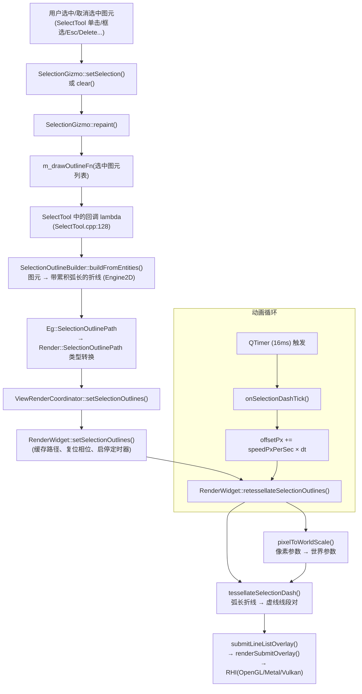

# 选中轮廓「流水虚线」渲染原理与配置

## 1. 概述

选中一个（或多个）图元后，渲染层会在图元轮廓上叠加一层**会流动的短虚线**（俗称“跑马灯”效果），用于直观标识被选中的几何。

设计要点：

- **短虚线**：哪怕是一条很长的直线，也会被切成很多段短虚线，而不是“整条边一段”。
- **连续流动**：虚线沿路径匀速流动，动画由相位偏移驱动。
- **可辨识**：虚线紧贴原图元轮廓，能清楚分辨出原图形的形状。
- **可配置**：实线长、间隔长、流动速度、颜色、开关等均可通过参数或配置文件调整。

---

## 2. 设计核心：弧长驱动，而非逐段

曲线/圆/椭圆在渲染前都会被离散成折线（多段线段）。离散后的单段长度可能**小于虚线的“实+空”周期**。如果按“每段”施加虚线，会出现两类问题：

1. 间隔（gap）把某条短段整个吞掉 → 看起来“缺一段边”；
2. 虚线在相邻段之间不连续 → 拐角处错乱、从原点拉出杂线。

正确做法是把整条轮廓看成一个**一维弧长坐标轴**（从 0 到总长 L），虚线模式作用在这个弧长轴上，而不是作用在离散段上。这样：

- 一条长直线 → 在弧长轴上被切成很多短虚线；
- 一段比周期还短的离散段 → 虚线可以**跨越多段**（一个实线区间覆盖多个短段），间隔也可以**吞掉整段**，视觉上始终连续；
- 闭合曲线 → 由于构建阶段追加了首点副本，弧长单调递增，虚线可平滑跨越起点/终点接缝。

```
弧长轴 s:  0 ────────────────────────────────────────────────► L

虚线模式:  [===   ===   ===   ===   ===   ===   ===   ===]   (=== 实线, 空格 间隔)
           ↑                                                 ↑
        phase(相位)                                      phase+period
            └────────── period = dashLength + gapLength ──────┘
```

---

## 3. 数据结构定义

相关类型定义在 `UI/Common/Include/Render/RenderTypes.h`：

```cpp
// 轮廓顶点：位置 + 沿路径累积弧长（单调递增）
struct SelectionOutlineVertex
{
    Vec2f position;        // 世界坐标
    float arcLength = 0;   // 从路径起点到该顶点的累积弧长
};

// 一条轮廓路径
struct SelectionOutlinePath
{
    std::vector<SelectionOutlineVertex> vertices;
    Color color{ 1, 0.55f, 0, 0.86f };
};

// 虚线样式（像素基准，渲染时按当前视图换算为世界坐标）
struct SelectionDashStyle
{
    bool  enabled{ true };         // 是否以虚线高亮（false 退化为连续实线）
    bool  animated{ true };        // 是否流动（跑马灯）动画
    float dashLengthPx{ 10.0f };   // 实线段长度（屏幕像素）
    float gapLengthPx{ 8.0f };     // 间隔长度（屏幕像素）
    float speedPxPerSec{ 48.0f };  // 流动速度（屏幕像素/秒）
    Color color{ 1, 0.55f, 0, 0.86f };
};
```

> 说明：所有长度参数都以**屏幕像素**为单位。这样无论视图如何缩放，虚线在屏幕上的密度和速度都保持恒定（符合选择高亮的常规习惯）。渲染时由 `pixelToWorldScale()` 换算为世界坐标。

---

## 4. 端到端渲染流程



文字版流程：

1. **选中变化**：`SelectTool` 内 `SelectionGizmo::setSelection()/clear()` 触发 `repaint()`。
2. **轮廓构建**：回调中调用 `SelectionOutlineBuilder::buildFromEntities()` 把图元离散为带累积弧长的折线（见第 5 节），再转换为渲染层的 `Render::SelectionOutlinePath`。
3. **提交路径**：经 `ViewRenderCoordinator::setSelectionOutlines()` 交给 `RenderWidget::setSelectionOutlines()`。
4. **缓存 + 动画**：`RenderWidget` 缓存路径、把动画相位清零、按需启动 16ms 的 `QTimer`，并立即重算一次虚线。
5. **虚线离散**：`retessellateSelectionOutlines()` 先把像素参数换算成世界参数，再调用 `tessellateSelectionDash()` 生成虚线线段，最后作为 `LineList` overlay 提交。
6. **动画驱动**：`QTimer` 每帧把相位 `offset` 增加 `speedPxPerSec × dt`，重复第 5 步，形成“流动”效果。

---

## 5. 带弧长折线的构建（SelectionOutlineBuilder）

文件：`Engine/2D/Src/Render/SelectionOutlineBuilder.cpp`，声明于 `Engine/2D/Include/Engine2D/Render/SelectionOutlineBuilder.h`。

入口：

- `buildFromEntity(entity, outPaths)` — 单个图元；
- `buildFromEntities(entities, outPaths)` — 多个图元（逐图元调用前者）。

构建过程（`buildFromEntity`）：

1. `collectEntityPolyline()`：按图元类型取原始折线顶点
   - `POLYGON` → 直接取顶点；
   - `SMARTLINE` → 拼接各子段并转为顶点；
   - `LINE` → 取两个端点；
   - 其它（圆/弧/椭圆/贝塞尔/NURBS…）→ `BezierAlgorithms::discretizeEntity()` 离散为折线。
2. `removeIsolatedOriginVertices()`：去掉折线中孤立的 (0,0) 顶点，避免 `LINE_STRIP` 从原点拉出杂线。
3. `dedupeConsecutive()`：去掉相邻重复点。
4. `appendPolyline()`：
   - 对曲线类图元执行 `refinePolylineForDash()`（按最大边长 + 尖角加密细分，保证虚线在曲率大的地方也平滑）；
   - 逐顶点累加边长，写入 `arcLength`；
   - **闭合图元**追加首点副本，使弧长跨越起点/终点连续递增。

关键点：**弧长是单调递增的**，它是后续虚线离散所依赖的核心不变量。

---

## 6. 虚线离散算法（tessellateSelectionDash）

文件：`UI/2D/Src/UI/ViewWidget/RenderWidget.cpp:188`（匿名命名空间内的自由函数）。

### 6.1 输入输出

| 输入 | 含义 |
|------|------|
| `paths` | 若干条带累积弧长的轮廓折线（`Render::SelectionOutlinePath`） |
| `dashLength` | 实线段长度（**世界单位**，已由像素换算） |
| `gapLength` | 间隔长度（世界单位） |
| `offset` | 动画相位（世界单位，随时间推进） |
| `outSegments` | 输出：平坦的线段端点序列 `[a0,b0, a1,b1, …]`，长度恒为偶数（即 `GL_LINES` 的顶点） |

### 6.2 算法步骤

```
对每条路径 path：
  总长 total = path.vertices.back().arcLength
  period = dashLength + gapLength
  phase  = offset mod period            （归一化到 [0, period)）

  对整数 k 枚举所有实线区间：
      a = phase + k*period             （区间起点，弧长）
      b = a + dashLength               （区间终点，弧长）
      若 b <= 0 则跳过（区间在路径起点之前）
      若 a >= total 则结束（区间在路径终点之后）
      ca = max(a, 0)
      cb = min(b, total)
      若 cb - ca > ε 则输出该段实线 [ca, cb]
```

### 6.3 输出单段实线 [ca, cb]

为了保证虚线**贴着折线形状**（尤其拐角处不能“抄近路”拉直线），一段实线要拆成多个子段：

```
采样点序列：
  sample(ca)                       ← 起点（按弧长二分查找 + 线性插值）
  path 中所有 arcLength ∈ (ca, cb) 的原始顶点  ← 保留折线拐点
  sample(cb)                       ← 终点

相邻点两两配对 → 生成 (p0,p1), (p1,p2), … 的 LineList 线段
```

`sample(s)` 的求值：对 `arcLength` 做二分查找定位所在段 `[v[lo], v[hi]]`，按比例线性插值：

```
t = (s - v[lo].arcLength) / (v[hi].arcLength - v[lo].arcLength)
pos = lerp(v[lo].position, v[hi].position, t)
```

### 6.4 为什么这样能解决原问题

| 场景 | 结果 |
|------|------|
| 一条长直线 | 弧长轴切成很多 `[phase+k*period, +dash]` 短虚线 |
| 离散曲线（单段 < 周期） | 一个实线区间可跨多段（`sample` 起点 + 中间顶点 + `sample` 终点），间隔可吞掉整段 |
| 拐角 | 中间顶点被保留，虚线沿拐角折过去，不会拉直线 |
| 闭合曲线 | 首点副本让弧长连续，虚线平滑跨接缝 |

### 6.5 安全上限

`kMaxSegmentsPerPath = 16384`：极端放大（视图缩放很大）时，像素长度换算成世界长度会非常小，理论上会生成海量虚线。该上限防止顶点数量爆炸；超出后本路径直接截断（超出部分通常是屏幕外区域，无视觉影响）。

---

## 7. 流动动画

文件：`UI/2D/Src/UI/ViewWidget/RenderWidget.cpp`。

- 定时器：`QTimer`，间隔 16ms（约 60fps），仅在 `enabled && animated && 有选中轮廓` 时启动（`updateSelectionDashTimer()`）。
- 相位推进（`onSelectionDashTick()`）：

```cpp
dtSec = m_selectionDashClock.restart() / 1000.0;   // 实际帧间隔（秒）
m_selectionDashOffsetPx += m_selectionDashStyle.speedPxPerSec * dtSec;
```

- 每次推进后调用 `retessellateSelectionOutlines()` 重新离散并提交。
- 相位在**像素空间**累积，渲染时统一乘 `pixelToWorldScale()` 换算；这样缩放过程中虚线在屏幕上的流动速度保持恒定。

> 若 `animated = false`：定时器不启动，虚线静态显示（相位固定为 0）。
> 若 `enabled = false`：不走离散，直接按轮廓折线画连续实线。

---

## 8. 像素 → 世界换算

文件：`UI/2D/Src/UI/ViewWidget/RenderWidget.cpp:1104`（`pixelToWorldScale()`）。

```cpp
double RenderWidget::pixelToWorldScale() const
{
    const float scaleX = std::abs(m_viewMatrix.at(0, 0));   // 世界→NDC 的 X 缩放
    const float vpW = width() * devicePixelRatioF();        // 物理像素宽
    return 2.0 / (scaleX * vpW);                            // 1 像素对应的世界长度
}
```

离散时：

```cpp
dashWorld = dashLengthPx * p2w;
gapWorld  = gapLengthPx  * p2w;
offsetWorld = offsetPx  * p2w;
```

---

## 9. 如何修改虚线参数

### 9.1 推荐方式：配置文件（SettingsService）

虚线参数已接入 2D 设置域，键定义在 `UI/2D/Include/UI2D/Settings/SettingsKeys2D.h`：

| 配置键 | 含义 | 默认值 |
|--------|------|--------|
| `selection/dash_enabled` | 是否启用虚线（false = 连续实线） | `true` |
| `selection/dash_animated` | 是否流动动画（false = 静态虚线） | `true` |
| `selection/dash_length_px` | 实线段长度（像素） | `10.0` |
| `selection/dash_gap_px` | 间隔长度（像素） | `8.0` |
| `selection/dash_speed_px` | 流动速度（像素/秒） | `48.0` |
| `selection/dash_color` | 虚线颜色（`#AARRGGBB` 十六进制字符串） | `#DBFF8C00`（橙） |

读取/写回位置：

- 读取并应用：`UI/2D/Src/Settings/SettingsUiCoordinator2D.cpp`（`applySettings`）。
- 从当前值写回配置：`UI/2D/Src/Settings/SettingsUiCoordinator2D.cpp`（`collectSettingsFromManagers`）。
- 恢复默认：`SettingsKeys2D::RESTORE_PREFIXES` 已包含 `"selection/"` 前缀，复位按钮会清掉这些键回到默认。

> 即：修改这些键（持久化到 `SettingsService` 的配置表 / 配置文件），应用重启或打开设置页应用后生效。

### 9.1.1 设置页 UI（设置对话框 → Selection 页签）

已新增 `SelectionSettingsTab`（`UI/2D/Src/UI/Dlg/SelectionSettingsTab.{h,cpp}`），并在 `SettingsDialog2D::initTabs()` 中注册为「Selection」页签。页签提供以下控件：

| 控件 | 绑定键 | 说明 |
|------|--------|------|
| 复选框 `Dashed Outline` | `selection/dash_enabled` | 启用/关闭虚线高亮 |
| 复选框 `Flowing Animation` | `selection/dash_animated` | 启用/关闭流动动画 |
| 数值框 `Dash Length`（px） | `selection/dash_length_px` | 实线段长度 |
| 数值框 `Gap Length`（px） | `selection/dash_gap_px` | 间隔长度 |
| 数值框 `Flow Speed`（px/s） | `selection/dash_speed_px` | 流动速度 |
| 颜色行 `Dash Color` | `selection/dash_color` | 颜色（`...` 按钮打开取色器） |

修改后点「确定」即可即时生效（`SettingsUiCoordinator2D::applySettings` 会把样式推给 `RenderWidget`）。

### 9.2 程序接口方式

样式结构体 `Render::SelectionDashStyle`（`UI/Common/Include/Render/RenderTypes.h:355`），通过以下接口注入：

```cpp
// 直接设置到渲染控件
renderWidget->setSelectionDashStyle(style);

// 或经渲染协调器转发
coordinator->setSelectionDashStyle(style);

// 读取当前样式
const auto& style = renderWidget->selectionDashStyle();
```

## 10. 常见调整示例（Recipe）

### 10.1 虚线更密集 / 更稀疏

- 密集：减小 `selection/dash_length_px` 和 `selection/dash_gap_px`（如 `6` / `4`）。
- 稀疏：增大两值（如 `20` / `12`）。

### 10.2 加快 / 放慢流动

- 加快：增大 `selection/dash_speed_px`（如 `120`）。
- 放慢：减小（如 `20`）。
- 停止流动（静态虚线）：`selection/dash_animated = false`。

### 10.3 关闭虚线（连续实线高亮）

- `selection/dash_enabled = false`。

### 10.4 修改颜色

- 设置页 UI：设置对话框 → Selection 页签 → `Dash Color`（`...` 按钮打开取色器），持久化到 `selection/dash_color`（`#AARRGGBB`）。
- 配置文件：直接写 `selection/dash_color`（`#AARRGGBB` 十六进制，如橙 `#DBFF8C00`、绿 `#DB00FF00`）。
- 程序方式：构造 `Render::SelectionDashStyle` 并调用 `setSelectionDashStyle`，修改 `color` 字段。

### 10.5 代码内一次性调整（临时调试）

直接改 `RenderTypes.h` 中 `SelectionDashStyle` 的默认值即可影响“无配置键”时的初始值。

---

## 11. 关键代码位置速查

| 职责 | 位置 |
|------|------|
| 虚线样式结构体 | `UI/Common/Include/Render/RenderTypes.h:355` |
| 轮廓/顶点结构体 | `UI/Common/Include/Render/RenderTypes.h:342,348` |
| 弧长折线构建 | `Engine/2D/Src/Render/SelectionOutlineBuilder.cpp:330` |
| 曲线细分（供虚线用） | `Engine/2D/Src/Render/SelectionOutlineBuilder.cpp:105` |
| 选中轮廓回调接线 | `UI/2D/Src/UI/DrawTools/SelectTool.cpp:128` |
| 选中 Gizmo hover 重绘（不重建轮廓） | `UI/2D/Src/UI/DrawTools/SelectionGizmo.cpp`（`repaintHandles`） |
| 虚线离散算法 | `UI/2D/Src/UI/ViewWidget/RenderWidget.cpp:188` |
| 接收/缓存轮廓 + 启停动画 | `UI/2D/Src/UI/ViewWidget/RenderWidget.cpp:1051` |
| 样式注入接口 | `UI/2D/Src/UI/ViewWidget/RenderWidget.cpp:1091` |
| 像素→世界换算 | `UI/2D/Src/UI/ViewWidget/RenderWidget.cpp:1104` |
| 动画定时器管理 | `UI/2D/Src/UI/ViewWidget/RenderWidget.cpp:1119` |
| 动画相位推进 | `UI/2D/Src/UI/ViewWidget/RenderWidget.cpp:1145` |
| 重算并提交虚线 | `UI/2D/Src/UI/ViewWidget/RenderWidget.cpp:1161` |
| 协调器转发 | `UI/2D/Src/UI/ViewWidget/ViewRenderCoordinator.cpp:92` |
| 配置键定义 | `UI/2D/Include/UI2D/Settings/SettingsKeys2D.h:53` |
| 配置读取/写回 | `UI/2D/Src/Settings/SettingsUiCoordinator2D.cpp` |
| 设置页 UI 页签 | `UI/2D/Src/UI/Dlg/SelectionSettingsTab.{h,cpp}` |
| 设置页注册页签 | `UI/2D/Src/UI/Dlg/SettingsDialog2D.cpp`（`initTabs`） |
| 全量 gather 跳过选中图元 | `Engine/2D/Src/Core/SceneManager.cpp`（`gatherGeometry`） |
| 选择变化触发全量刷新 | `Main/Src/UI/Render/SceneRefreshCoordinator.cpp`（`onSelectionChanged`） |
| 增量路径跳过选中图元 | `Main/Src/UI/Render/SceneRefreshCoordinator.cpp`（`applyLightRefresh`） |
| 全量账本排除选中图元 | `Main/Src/UI/Render/SceneRefreshCoordinator.cpp`（`applyFullRefresh`） |

---

## 12. 性能与边界

- **提交形态**：虚线最终以 `LineList`（`GL_LINES`）overlay 提交，复用既有 `submitLineListOverlay` 通道，无需新增 RHI 后端能力。
- **动画成本**：仅选中轮廓参与动画，且每次仅重新离散 + 提交少量顶点（通常 < 数千），对 60fps 开销可忽略。
- **顶点上限**：单条路径最多 16384 段（`kMaxSegmentsPerPath`），防止极端缩放下顶点爆炸。
- **清除时机**：清空选择、切换交互、`clearAll` 时都会停止定时器并清除缓存，避免后台空转。
- **缩放一致性**：像素基准参数在缩放过程中自动换算，虚线屏幕密度与速度恒定。

---

## 13. 选中后隐藏原始实线

选中图元后，为避免「原始实线 + 橙色虚线」重叠（视觉杂乱），**原始实线不再提交**，只保留虚线轮廓。

### 13.1 实现机制

- 选中状态由 `SyEntity::selected()` 提供（`m_bSelected` 标志），`SelectionManager` 在选择集变更时通过 `syncEntityFlags()` 保持该标志与选择集一致。
- **全量路径**：`SceneManager::gatherGeometry()` 遍历图元时跳过 `selected()` 为真的图元，不把其实体几何推给渲染 sink。
- **增量路径**：`SceneRefreshCoordinator::applyLightRefresh()` 对脏图元判断 `selected()`，选中的脏图元不提交（若此前已在 GPU 上则 `removeRenderEntity` 移除）。这保证拖动变换时实线不会被重新提交。
- **账本一致性**：`applyFullRefresh()` 构建 `m_renderedEntityIds` 账本时排除选中图元，使取消选中后增量路径能正确 `addRenderEntity` 恢复实线。

### 13.2 刷新触发

选择变化不再走「纯视觉重绘」，而是 `SceneRefreshCoordinator::onSelectionChanged()` 触发**全量刷新**：

```
选择变化（select / clear / toggle / invert）
    │  notifySelectionChanged()
    ▼
SceneRefreshCoordinator::onSelectionChanged()
    ├─→ emit selectionChanged()            // 供视口同步工具状态
    └─→ requestFullRefresh()               // 16ms 节流后全量重新 gather
              │
              ▼
SceneManager::gatherGeometry() 跳过选中图元 → 实线消失
(选中轮廓的虚线 overlay 由 SelectTool/gizmo 同步提交)
```

### 13.3 时序说明

一次点击选中的完整时序：

1. `SelectTool` 调 `SceneManager::selectEntityWithGroup()` → `notifySelectionChanged()`。
2. `SceneRefreshCoordinator::onSelectionChanged()` 调度全量刷新（16ms 节流）。
3. `SelectTool` 随后调 `SelectionGizmo::setSelection()` → `repaint()` → 立即提交虚线轮廓 overlay。
4. 约 1 帧后全量刷新执行，选中图元的原始实线从 GPU 移除（虚线轮廓已在第 3 步显示）。

> 因此存在约 1 帧的「实线 + 虚线」重叠窗口，视觉上不可感知；若需严格消除，可将 `onSelectionChanged()` 的全量刷新改为同步执行。

### 13.4 群组选择

`selectEntityWithGroup` / `selectEntitiesWithGroup` 会经 `GroupManager::resolveSelection()` 展开为成员图元，`selected()` 标志设置在成员图元上，`gatherGeometry` 据此跳过所有被选中的群组成员。

### 13.5 拓扑一致性（LineLoop vs LineStrip）

选择变化触发全量刷新后，闭合多边形会经全量路径重新提交。为避免“取消选择后多边形缺边/一段显示一段不显示”，全量路径与增量路径必须使用**一致的拓扑**：

- 增量路径（`EntityToVertices` → `IncrementalVertexSink`）：闭合折线 → `LineLoop`（顶点不重复）。
- 全量路径（`render_c_api_frame.cpp` → `tessellatePolyline` + `renderSubmitGeometryImpl`）：闭合折线 → `LineLoop`（不再追加首点副本，此前用 `LineStrip` + 首点副本，与增量路径不一致）。

由于 `RenderWorld::modifyEntity` 会保留图元原有拓扑类型，两路径拓扑不一致时，全量刷新后经增量修改会把闭合多边形变成 `LineStrip`（少最后一条边）。统一为 `LineLoop` 后消除该隐患。同时 `modifyEntity` 现已接收并更新 `PrimitiveType`，图元闭合性变化时拓扑也能正确更新。

### 13.6 曲线离散化缓存指纹（防止陈旧几何）

增量路径对曲线类（Circle/Arc/Ellipse/Bezier/NURBS）有离散化缓存（`EntityToVertices.cpp` 的 `s_vertexCache`）。缓存指纹 `computeGeometryHash` 原本只哈希 `eType + bClosed + 控制点`，而曲线类的 `getControlPoints()` 仅返回 `basePoint`（圆心/起点），导致**修改半径/角度/控制点后指纹不变、命中陈旧缓存、曲线仍按旧几何显示**。

修复：指纹追加 `getBbox()` 的四个角点（包围盒由实际几何计算，覆盖半径/角度/控制点变化），消除陈旧缓存。

### 13.7 鼠标移动干扰虚线动画（2026-08-15 修复）

#### 症状

选中图元显示流水虚线后，鼠标在图元（虚线轮廓）上移动时，虚线流动动画被干扰/加速：流动相位频繁跳变，看起来"变快"或"卡顿"。

#### 根因

`SelectionGizmo::onMouseMove()` 在未交互状态下，鼠标移动会执行 `hitTest()`；当 hover 状态变化（如鼠标在选中图元边缘进出，`hitTest` 在 `Body`/`None` 之间切换）时调用完整 `repaint()`。`repaint()` 会重新调用 `m_drawOutlineFn` → `SelectTool` 回调 → `SelectionOutlineBuilder::buildFromEntities()` → `ViewRenderCoordinator::setSelectionOutlines()` → `RenderWidget::setSelectionOutlines()`。

而 `RenderWidget::setSelectionOutlines()` 原本**每次调用都把动画相位 `m_selectionDashOffsetPx` 归零并重新离散**。于是鼠标每触发一次 hover 变化，虚线动画就被复位一次，看起来像"流动被反复打断/加速"。

关键点：**hover 状态与轮廓虚线内容无关**（虚线只依赖选中图元集合），hover 变化本不需要重新提交轮廓。

#### 修复（双层防御）

1. **Gizmo 层（主修复）**：`SelectionGizmo::onMouseMove()` hover 变化时改调新增的 `repaintHandles()`，仅重绘手柄（含旋转手柄），不再调用完整 `repaint()`，从而避免重建轮廓虚线、避免触发 `setSelectionOutlines()`。

2. **RenderWidget 层（防御）**：`RenderWidget::setSelectionOutlines()` 开头比较新旧路径内容（新增匿名命名空间辅助函数 `selectionOutlinesEqual()`，逐顶点比较 position/arcLength）；内容完全一致时**不复位动画相位、不重复离散**，仅确保定时器运行并重绘。

#### 涉及文件

- `UI/2D/Src/UI/DrawTools/SelectionGizmo.{h,cpp}`（新增 `repaintHandles()`）
- `UI/2D/Src/UI/ViewWidget/RenderWidget.cpp`（`setSelectionOutlines()` + `selectionOutlinesEqual()`）


