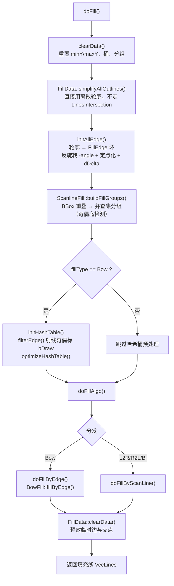

# 线填充算法（Fill2D）

> 本文档描述 CAD 系统中线填充（Hatch Fill）算法的调用链路、算法逻辑、参数配置与实现细节。
>
> 线填充是激光雕刻中最常用的填充方式：在闭合轮廓内按指定间距、角度生成平行扫描线，
> 激光沿这些扫描线运动完成区域填充。
>
> 与之并列的另一条路径是**色块填充**（`EntityColorFiller`，三角剖分实心区域），两者由
> `FillTaskParams::style` 分发，本文档只讲线填充。

---

## 1. 一句话概括

把**所有选中图元**的轮廓合成一个统一的边集合，按填充角度反向旋转使扫描线水平，逐行做
扫描线求交、按奇偶规则配对成填充段，再正向旋转回去，最后**一次性**作为一批 `SyLine`
写入场景。

两个容易踩坑的设计点，先说在前面：

- **必须整体处理**：`computeFill` 用的是 `EntityDiscretizer::doDiscretize` 的**向量重载**，
  所有选中图元的轮廓进同一个集合；随后 `buildFillGroups` 把空间上重叠的轮廓并入同一组，
  组内按奇偶规则判定内外。于是「外轮廓 + 孔洞」不填孔、「两个相交图形」相交部分挖空。
  逐个图元各填一遍则两者都会错（孔洞被填实、相交处重复出线）。
- **必须批量写回**：`writeHatchLinesToScene` 攒一个批次、循环外提交一次。逐条提交会让一次
  填充产生 N 个撤销命令、N 次场景刷新、N 条日志。

---

## 2. 调用链路

### 2.1 从菜单到算法

```
菜单/工具栏 (commandId)
  │
  ▼ CommandCatalog                       commandId → OperationId::Algo_Fill
  ▼ OperationRouting::dispatch            参数富化（enrichParams）
  ▼ OperationBus → CoreOperationRegistry
  ▼ AlgorithmRunner::runTask              构造 AlgorithmTaskContext
  ▼ AlgorithmApplicationService           runAsync（不支持后台则退化 runSync）
  ▼ FillTaskHandler                       UI/2D/Src/Algorithm/AlgorithmTaskRegistration2D.cpp
  │   ① 校验场景  ② 校验选中  ③ 收参  ④ 执行+落撤销栈  ⑤ 汇总
  │
  ├─ ③ AlgorithmTaskUiHost2D::collectFill → FillDialog（可 lockStyle 锁定样式）
  │
  └─ ④ style == LineFill
         Eg::EntityFiller filler(sm);
         filler.setEditService(ctx.sceneEdit2d);     // 不注入则填充结果不可撤销
         filler.fillEntities(entities, taskParams.lineParams);
```

### 2.2 算法内部（Engine 层）

```
EntityFiller::fillEntities(entities, params)
  │
  ├─ computeFill(entities, params, outHatchLines)
  │    ├─ EntityDiscretizer::doDiscretize(entities, vOutLinePts)   ← 向量重载，聚合全部选中图元
  │    ├─ EntityFill: setOutlines → setParameters → doFill → getFillLines
  │    └─ 若 bCrossFill：以 dAngle + 90° 再跑一遍 EntityFill，两次结果合并
  │
  └─ writeHatchLinesToScene(hatchLines, refEntity = entities.front())
       └─ SceneEditService::addEntities(batch, "Fill")             ← 一次提交
```

`refEntity` 只用来继承 `basePoint` 与 `layer()`：填充线跟随第一个选中图元所在图层。

### 2.3 EntityFill::doFill 的七步



对应源码 `EntityFill::doFill()`（`Fill/PolygonFill/EntityFill.cpp:657`）：

```cpp
clearData();
m_data->simplifyAllOutlines();          // hatch 直接用离散轮廓
initAllEdge();
ScanlineFill::buildFillGroups(*m_data, m_fillGroups);
if (ScanlineFill::usesBowHashPipeline(m_params.fillType)) {
    initHashTable(); filterEdge(); optimizeHashTable();
}
bool bRes = doFillAlgo();
m_data->clearData();
```

---

## 3. 算法逻辑详解

### 3.1 参数归一（setParameters）

```cpp
m_params.nPrecision = max(1, params.nPrecision);
m_nStep = max(1, lround(params.dSpacing * nPrecision));   // 间距 → 定点步长
m_params.dAngle = DEG_TO_RAD(params.dAngle);              // 度 → 弧度
```

**全流程在定点整数域上工作**：坐标乘 `nPrecision` 后 `lround`。这样扫描线的 Y 可以用 `int`
递增，避免浮点累加误差导致行距漂移。注意 `EntityFill::initData()` 内部默认 `nPrecision =
10000`，而 `FillParameters` 的默认值是 `1000`，实际取调用方传入值。

### 3.2 边构建（initAllEdge / addLines）

每个离散轮廓（`Ut::Vec2dVector`）按 `i → (i+1) % n` 首尾相接成一个**闭合有向边环**，逐边
调用 `addLines`，其中做四件事：

1. **退化过滤**：两端点距离 < `EPSILON` 直接丢弃；
2. **反向旋转** `rotatePoint(pt, -dAngle)`：把"按 angle 方向填充"转化为"水平扫描"，
   后续所有几何都在旋转后的坐标系里，最后输出前再 `+dAngle` 转回；
3. **定点化**：`x = lround(x * nPrecision)`，同理 y；
4. **斜率倒数** `dDelta = 1 / tan = dX/dY`，供 `getXPoint(y) = ptStart.x + dDelta * (y - ptStart.y)`
   直接求扫描线交点 X；垂直边与水平边的 `dDelta` 置 0，并打上 `Type::Vertical / Horizontal`。

同时累计全局 `m_dMinY / m_dMaxY`（扫描范围）。边环随后经 `sortEdge` 按"起点由高到低 +
多边形旋向"重排，并**同时**存入两处：

- `appendAllEdges` → 扁平全边表（哈希桶用）；
- `insertEntityEdge` → **按图元分组的边表**（`VVecEdges`），这是嵌套分组与内外判定的基础，
  必须保留分组结构，不能拍平。

### 3.3 填充分组（buildFillGroups）—— 相交/嵌套关系在这里解决

`ScanlineFill::buildFillGroups`（`ScanlineFill.cpp`）把 N 个轮廓聚成若干"填充组"，
**BBox 真实重叠的轮廓归入同一组**，组内由奇偶规则统一判定内外：

1. 对每个图元边集算 BBox（`computeEntityBBox`）；
2. `bboxesOverlap(a, b)` 判定真实重叠：两个方向的交集都要 > `kNestBBoxMargin(1.0)`
   定点余量 —— **仅边界相切不算重叠**。相切图形若被并入同一组，共享边界处的奇偶计数会
   多翻一次，导致边界附近整段丢失；
3. 用**并查集**求连通分量。重叠关系本身不满足传递性，但"属于同一填充区域"需要传递闭包：
   A 与 B 重叠、B 与 C 重叠 ⇒ 三者共享同一片区域的边界，必须同组判定。

于是三种情形都落到正确语义（对齐 CAD 的「普通/Normal」岛检测）：

- **外轮廓 + 孔洞**：BBox 包含 ⇒ 重叠 ⇒ 同组，孔洞位置奇偶为偶 → 不填充；
- **两个相交轮廓**：同组，相交部分奇偶为偶 → **挖空**，且只出一套线；
- **完全分离的轮廓**：不同组，互不干扰（纯性能切分，不影响语义）。

> 历史缺陷（已修）：旧实现只按"BBox 严格包含"分组，两个相交轮廓会落到两个组各自独立
> 填充。由于扫描线主循环对所有组共用同一批 `nY`（`m_dMinY/m_dMaxY` 是全局的），相交
> 区域会得到**两套同角度、同 Y 的共线重复线** —— 视觉上看不出来，但激光会在该区域
> 重复烧刻一遍，过烧且浪费工时。回归用例见
> `Engine/2D/Test/RegressionTests.cpp: RegressionTest.FillIntersectionAreaIsHole`。

> 现存局限：分组只用 BBox，不做真实几何包含判断。凹形轮廓（如 L 形）的 BBox 可能与
> 实际不相交的轮廓重叠，从而被误并入同一组；同组内的奇偶判定仍然基于真实边，所以
> 通常只是多算一些边（性能损失），不会填错。

### 3.4 扫描线主循环（doFillByScanLine）

```
computeScanRange(minY, maxY, nStep, direction)
  B2T: startY = minY, endY = maxY, stepDir = +nStep
  T2B: startY = maxY, endY = minY, stepDir = -nStep
  起点再对齐到 nStep 网格（保证任何方向下行距一致）

for (nY = startY; 方向内; nY += stepDir, ++nScanIdx)
    bCurL2R = Bi ? (nScanIdx % 2 == 0) : (fillType == L2R)   // Bi 逐行交替
    for (group : m_fillGroups)
        gatherGroupEdges(group)                              // 本组全部边
        computeFillSegmentsForEdges(nY, edges, group)
        for (seg : segments)
            x /= nPrecision                                  // 还原实数域
            若 !bCurL2R 交换起终点                            // 决定激光走向
            rotatePoint(pt, +dAngle)                         // 反旋转回原角度
            insertPts(ptS); insertPts(ptE); insertFillLine()
```

### 3.5 求交（collectIntersections）

采样 Y 取 `nY + kSampleOffset(0.5)`，**故意偏移半个定点单位**，避开顶点正好落在扫描线上
的退化情况。三类边分别处理：

- **普通/垂直边**：`edgeCrossesScanY` 用半开区间 `(yMin, yMax]` 判断跨越（保证共享顶点的
  两条边只贡献一个交点），交点 X 由 `dDelta` 线性求出；
- **水平边**：`Type::Horizontal` 的边如果本行 Y 与之重合，把**两个端点 X 都**加入交点表。
  水平边不能剔除——字形的水平转折处依赖它闭合区间（见 `optimizeHashTable` 的注释，该函数
  现在是空实现，就是为此保留的）；
- **端点贴行**：端点恰好落在整数行 `dRowY` 上的边额外补一个交点，避免漏配。

`sortAndDedupeIntersections`：按 X 升序排序，**只去重"同一条边 + 同一 X"**（`cur.second ==
prev.second`）。不同边的重合 X 必须保留，否则相切处会少一次奇偶翻转。

### 3.6 配对与内外判定（pairIntersections）

不是简单的"1-2、3-4 配对"，而是带校验的两级策略（`ScanlineFill.cpp:88`）：

1. **先试相邻配对** `(x[i], x[i+1])`，用 `isSegmentInsideGroup` 校验；通过则收下，`i += 2`；
2. **失败则回退搜索**：在 `j > i` 中找出**跨度最短且校验通过**的 `x[j]` 配对，`i = j + 1`；
3. 仍找不到则跳过，避免死循环。

`isSegmentInsideGroup(x0, x1, testY, group)`：在段内均匀取 `kSegmentSamples = 5` 个采样点
（不含端点），每点做 `isPointInsideGroup`；**全部为内**才认定该段在内部。

`isPointInsideGroup`：经典射线奇偶。遍历本组所有边，统一成 `y1 < y2` 的方向，用半开区间
`(y1, y2]` 过滤，算出 `xIntersect`，向右计数，奇数为内。

这套"配对 + 多点采样复核"比纯奇偶配对更抗退化：自交轮廓、相切边界、共线顶点处纯奇偶
容易错半个区间，采样复核会把这些错误段直接否掉。代价是每个候选段 5 次 O(E) 射线，
密集轮廓下这是主要耗时项。

### 3.7 弓形填充（Bow）—— 另一条流水线

`fillType == Bow` 时走 `BowFill::fillByEdge`，与扫描线路径**共享边构建但不共享求交**：

- 需要额外的 `initHashTable`：按 Y 把边分桶，桶高 `m_nHashStep = max(1, H / (edgeCount/10))`，
  一条边跨多桶就插入多桶；桶内按边的 X 范围有序插入（`insertEdge` 用 `lower_bound`），
  求交时只需扫当前桶；
- 需要 `filterEdge`：对每条非水平边取中点向右投射线，在**所在桶内**做带方向的奇偶计数，
  结果写入 `pEdge->bDraw`，只有内部边参与后续起笔；
- `BowFill::State` 记录 `bL2R`（当前行方向）、`nPrevY`、`pPrevEdgeCross`，用来把行末与
  下一行行首连成连续折返路径（不断笔），适合激光连续雕刻。

---

## 4. 填充类型与扫描方向

```cpp
enum class FillType   { L2R, Bow, R2L, Bi };
enum class FillDirection { T2B, B2T };
```

- **L2R**：每行独立，一律从左到右
  ```
  ─────────────→
  ─────────────→
  ```
- **R2L**：每行独立，一律从右到左
  ```
  ←─────────────
  ←─────────────
  ```
- **Bi**：每行独立成段，但方向逐行交替（`nScanIdx % 2`）
  ```
  ─────────────→
  ←─────────────
  ```
- **Bow**：行间用连接段串起来，整条路径不断笔
  ```
  ─────────────→
                │
  ←─────────────
  ```

`FillDirection` 决定扫描线推进方向：`B2T` 从 minY 往上，`T2B` 从 maxY 往下。

---

## 5. 参数结构体

```cpp
struct FillParameters {
    double dSpacing{ 1.0 };                             // 填充间距（mm）
    double dAngle{ 0.0 };                               // 填充角度（度）
    FillType fillType{ FillType::L2R };
    FillDirection fillDirection{ FillDirection::B2T };
    unsigned int nPrecision{ 1000 };                    // 定点精度（坐标放大倍数）
    double dMargin{ 0.0 };                              // 边距（mm）—— 见下方说明
    bool bCrossFill{ false };                           // 交叉填充

    bool isValid() const { return dSpacing > 0 && nPrecision > 0 && dMargin >= 0; }
};
```

> **`dMargin` 目前是惰性参数**：`FillDialog` 可以设置、`FillParameters::toString` 会打印、
> `EntityFiller::fillEntities` 会记日志，但 `EntityFill::setParameters` 并未读取它，算法里
> 没有任何一处消费 —— 即改了不会有效果。要实现"轮廓内缩边距"，应在 `computeFill` 里对
> 离散轮廓先做一次 `EntityOffset`（内偏 `dMargin`）再交给 `EntityFill`。

`nPrecision` 的取值需要和图纸尺度匹配：太小则定点化后丢精度（细小轮廓塌成一条线），
太大则 `lround(x * nPrecision)` 有溢出 `int` 的风险。

---

## 6. 结果写回场景

`EntityFiller::writeHatchLinesToScene`：

```cpp
std::vector<std::unique_ptr<SyEntity>> batch;
batch.reserve(hatchLines.size());
for (const auto& seg : hatchLines) {
    if (seg.size() < 2) continue;
    auto line = std::make_unique<SyLine>();
    line->basePoint = refEntity->basePoint;
    line->setPointVector({ seg.begin(), seg.end() });
    line->bClosed = false;
    line->setLayer(refEntity->layer());
    batch.push_back(std::move(line));
}
if (m_editService) m_editService->addEntities(std::move(batch), "Fill");  // 一次提交
else               m_sceneManager->addEntities(std::move(batch));         // 不可撤销
```

**为什么必须批量**（这是曾经的性能缺陷，已修）：

- 每次 `SceneEditService::addEntities` 会构造一个 `AddEntitiesCommand` 入撤销栈 —— 逐条提交
  时一次填充要按 N 次 Ctrl+Z 才清得干净；
- 每次提交都走一遍图层分配循环 + `notifySceneChanged` → 渲染重建与选择同步各跑 N 遍；
- 日志按 O(N) 刷屏。

密集填充的线数在几百到几千级，N 的代价是实打实的。色块填充（`EntityColorFiller`）一直
是批量写回的，两条路径现在一致。

---

## 7. 复杂度与性能要点

设轮廓边数 E、扫描行数 R = (maxY - minY) / nStep、填充组数 G：

- 边构建：O(E)
- 填充分组：O(N²)（N = 图元数，只比 BBox + 并查集，常数极小）
- 扫描线求交：O(R × E)（未使用哈希桶，扫描线路径每行遍历本组全部边）
- 配对复核：每候选段 5 次 O(E) 射线 → 最坏 O(R × S × E)，**通常是热点**

优化方向（尚未实现）：

- 扫描线路径也接入哈希桶（目前只有 Bow 建桶），把每行求交降到 O(桶内边数)；
- 用活性边表（AET）沿 Y 增量维护边集合，把 O(R × E) 降到 O(E log E + 交点数)；
- `isSegmentInsideGroup` 的采样复核可以先用一次奇偶快速判定，只在结果可疑时才做 5 点复核；
- 按扫描行并行（各行结果独立），经 `EngineParallel::parallelCollect` 保证输出顺序确定。
  注意并行前需按 `SyEntity::prewarmCaches()` 的并发规约预热图元缓存。

---

## 8. 日志约定

```
[EntityFiller] fillSelected: entities=%zu spacing=%.2f angle=%.1f cross=%d
[EntityFiller] fillEntities: entities=%zu spacing=%.2f angle=%.1f type=%d scanDir=%d margin=%.2f cross=%d
[EntityFiller] computeFill: discretize returned 0
[EntityFiller] computeFill - doFill() failed
[EntityFiller] computeFill - no fill lines generated
[EntityFiller] fillEntities completed: entities=%zu, hatchLines=%zu, written=%d, result=%d
[EntityFiller] no SceneEditService, hatch lines will be un-undoable
[SceneEditService] addEntities: count=%zu undoable=%d layer=%d desc=%s
```

最后一条是批量写回后的单条汇总日志（原来每次调用固定打 2~3 条 INFO，批量操作会刷屏）。

---

## 9. 已知限制

- `dMargin` 未接入算法（见 §5）。
- 填充分组只比 BBox：凹形轮廓的 BBox 误重叠会把无关轮廓并入同一组，通常只是多算边
  （性能损失），不会填错（见 §3.3）。
- 不支持自交轮廓：`pairIntersections` 的采样复核能否掉明显错误段，但无法正确划分自交产生
  的多重区域。
- 弓形填充在极端退化情况下可能产生断点。
- 交叉填充是完整跑两遍算法，线段数与耗时都翻倍。
- 扫描线路径未用哈希桶加速（见 §7）。

---

## 10. 相关文件索引

```
Engine/2D/Include/Engine2D/Algorithm/
├── EntityFiller.h                       # 服务层：离散化 → 填充 → 写回场景
└── Fill/
    ├── FillParameters.h                 # FillParameters / FillStyle / FillTaskParams
    ├── FillDataDefine.h                 # FillEdge / ScanLine / EdgePoint / FillType 等
    ├── FillData.h                       # 轮廓、边表、交点、结果的容器
    ├── EntityFill.h                     # 核心算法类（边构建 / 哈希桶 / 分发）
    ├── LinesIntersection.h              # 线段求交（hatch 路径已不使用）
    ├── LineIntersectionData.h
    └── PolygonFill/
        ├── BowFill.h                    # 弓形填充（哈希桶 + 连续折返）
        └── ScanlineFill.h               # 扫描线填充（分组 / 求交 / 配对 / 内外判定）

Engine/2D/Src/Algorithm/
├── EntityFiller.cpp
└── Fill/PolygonFill/
    ├── EntityFill.cpp
    ├── BowFill.cpp
    └── ScanlineFill.cpp

UI/2D/Src/
├── Algorithm/AlgorithmTaskRegistration2D.cpp   # FillTaskHandler（五段式）
├── Algorithm/AlgorithmTaskUiHost2D.cpp         # collectFill → FillDialog
└── UI/Dlg/FillDialog.cpp                       # 参数对话框（含 lockStyle）

Engine/2D/Test/
├── RegressionTests.cpp                  # 单线段不应被当作闭合轮廓填充等
└── ColorFillTests.cpp                   # 色块填充（对照路径）
```
